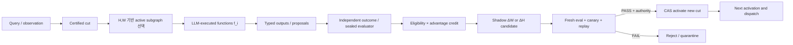

# HSWM LLM 함수망 — 정식 아키텍처와 구현 가능성 판정

> **date**: 2026-07-23
> **scope**: HSWM = Hypergraph Semantic Weight Map
> **authority**: §1의 정의는 `CANONICAL_USER_DIRECTION`; 타입·실행 루프·로드맵은
> `ENGINEERING_PROPOSAL`; 현재 상태와 가능성 판정은 체크인 코드·실험에 근거한
> `CURRENT_EVIDENCE_ASSESSMENT`다.
> **claim boundary**: 이 문서는 만들 수 있는 구조와 그것을 증명할 실험을 고정한다.
> 아직 구현되지 않은 학습·전이·스케일 효능을 현재 성과로 주장하지 않는다.

## 0. 결론부터

**구조는 구현 가능하다. 개념도 어렵지 않다.** 핵심은 세 줄이다.

1. 신경망적 함수 단위 \(f_i\)는 LLM으로 실행된다.
2. 하이퍼그래프 \(H\)가 함수와 시멘틱 상태를 n-ary 관계로 연결한다.
3. Semantic Weight Map \(W\)가 그 연결의 가중치·활성·routing을 정한다.

\[
f_i^t = \operatorname{LLM}(\rho_i, x_i^t, a_{\mathcal N(i)}^t),
\qquad
\mathrm{HSWM}_t=(H_t,W_t,A_t,\{f_i^t\})
\]

어려운 부분은 정의가 아니라 **학습의 인과성, 상태 일관성, 비용, 안정성**이다.
즉 “LLM 함수들을 그래프로 호출하는 시스템”은 바로 만들 수 있지만, 그것이 경험으로
더 나아지는 하나의 거대 신경망임을 증명하려면 다음 영수증이 필요하다.

\[
\text{outcome}
\rightarrow \text{credit}
\rightarrow \Delta W\text{ or }\Delta H
\rightarrow \text{next activation/dispatch changes}
\rightarrow \text{sealed unseen gain}
\]

현재 저장소는 이 사슬의 **안전한 상태·연결·읽기·검증 절반**은 상당 부분 구현했지만,
**credit부터 다음 행동 변화까지의 학습 절반**은 아직 닫히지 않았다.

## 1. 정전 — HSWM이 정확히 무엇인가

> **HSWM(Hypergraph Semantic Weight Map)은 신경망적 함수 단위가 LLM으로 동작하는,
> 하이퍼그래프 기반의 거대한 시멘틱 신경망이다.**

이 정의에서 각 단어의 소유권은 다음과 같다.

| 구성 | 정확한 의미 | 아닌 것 |
|---|---|---|
| LLM 함수 \(f_i\) | 역할, 국소 상태, 유입 활성을 받아 semantic transition을 계산하는 함수 | HSWM 바깥의 중앙 두뇌 |
| hypergraph \(H\) | 함수·시멘틱 상태·근거를 n-ary connector로 묶는 거시 회로 | 단순 문서 KG 또는 pairwise DAG만 |
| Semantic Weight Map \(W\) | 함수/상태 연결의 slow salience, query potential, 활성·routing 강도 | foundation LLM 내부 파라미터의 별명 |
| activation \(A\) | 현재 cut에서 발화한 함수, 경로, 기여도, 휘발 query state | 저장된 transcript 전체 |
| plasticity | 검증된 outcome이 \(W\) 또는 \(H\) 후보를 만들고 다음 cut을 바꾸는 과정 | prompt를 한 번 고치거나 메모리를 추가한 것 |
| safety/control plane | CAS, CRDT, replay, provenance, canary, capability separation | LLM 뉴런 또는 지능 성과 자체 |

같은 foundation model 하나가 여러 함수 역할을 실행해도 된다. 함수마다 별도 모델을
fine-tune할 필요는 없다. 중요한 구분은 다음이다.

- LLM parameter = 함수 내부의 **micro-weight**
- HSWM Semantic Weight = 함수·상태 사이의 **macro-weight**
- HSWM topology = 어떤 함수와 상태가 어떤 n-ary 관계로 함께 발화할 수 있는지 정하는
  **macro-circuit**

따라서 HSWM은 “LLM + 외부 메모리”가 아니다. **LLM으로 실행되는 함수들의
하이퍼그래프-가중 전체망**이 HSWM이다.

## 2. 한 함수의 최소 계약

현재 저장소에는 이를 하나로 묶은 `FunctionSpecV1`이 없다. 다음 타입은 구현해야 할
최소 계약이다. 필드명은 제안이며 아직 public API가 아니다.

```text
FunctionSpecV1
  function_id                 # stable semantic identity
  role                         # retrieve / compare / infer / revise / judge-candidate ...
  model_ref                    # provider + model + immutable version/receipt
  instruction_sha256           # role contract; free-form mutable prompt 금지
  input_ports[]                # semantic_type, relation_role, polarity
  output_ports[]               # typed output only
  readable_state_scope         # exact certified cut and allowed mounts
  writable_candidate_scope     # active state가 아니라 shadow candidate만
  tool_policy_sha256           # least privilege
  budget                       # calls, tokens, latency, cost
  stochasticity_contract       # temperature, seed where supported, replay policy
```

한 번의 실행도 별도 영수증을 남겨야 한다.

```text
FunctionInvocationReceiptV1
  invocation_id
  function_spec_sha256
  input_cut_id
  incoming_activation_sha256
  selected_connector_ids[]
  model_receipt                # provider/model/version/request/response hashes
  output_payload_sha256
  output_proposal_ids[]
  token_latency_cost
  started_at / finished_at
```

함수 출력은 직접 active HSWM을 수정하지 않는다. typed proposal 또는 observation으로만
나오고, 기존 `PROPOSE → OBSERVE → JUDGE → COMMIT → DISPATCH` 제어 평면을 통과한다.

## 3. 거대 함수망의 상태

권장 정규형은 기존 open kernel을 버리지 않고 확장하는 것이다.

```text
HSWMSnapshotV1
  open_hswm_manifest           # mounts, ports, n-ary connectors, interfaces
  function_registry[]          # FunctionSpecV1
  slow_semantic_weights[]      # durable W_slow; normalized log-salience
  active_policy               # routing/activation budget and thresholds
  revision_cut
  provenance_root
  model_registry_cut
  safety_policy_cut
```

### 3.1 무엇을 어디에 놓을 것인가

- `Mount`: 하나의 전문화된 HSWM 영역 또는 function/state subfield.
- `Port`: 함수나 상태가 외부에 노출하는 typed semantic interface.
- `Connector`: 둘 이상의 port를 relation-role과 evidence로 묶는 n-ary relation.
- `SemanticWeight(edge_id, log_salience)`: durable slow potential.
- `QueryBondWeight(edge_id, relative_logit)`: 현재 query에서만 쓰는 volatile fast potential.
- `FunctionSpecV1`: port 뒤에서 실제 semantic transition을 계산하는 LLM 함수.

함수는 반드시 vertex 하나와 동일할 필요가 없다. 현재 커널과 가장 자연스럽게 맞는 방식은
**function identity를 mount/port 뒤의 typed transition으로 두고, hypergraph vertex는
semantic state identity로 유지**하는 것이다. 그래야 함수 코드/모델이 바뀌어도 지식 vertex의
정체성이 깨지지 않는다. 함수 자체를 vertex로 표현해야 하는 관계에서는 `kind=function`인
reified vertex를 추가하되 실행 권한은 여전히 `FunctionSpecV1` registry가 소유한다.

## 4. 한 cycle의 실행 의미론



구체 순서는 다음과 같다.

1. query/observation을 정확한 `input_cut_id`에 붙인다.
2. base score + slow \(W\) + query potential로 candidate connector를 전수 커버해 rank한다.
3. call/token/latency budget 안에서 active subgraph를 고른다. 무제한 전파는 금지한다.
4. 선택된 typed port의 `FunctionSpecV1`에 따라 LLM 함수를 실행한다.
5. 어떤 connector와 상태가 출력에 얼마나 기여했는지 activation/eligibility receipt를 남긴다.
6. proposer와 분리된 evaluator가 outcome과 verdict를 발행한다.
7. \(M=r-\hat r\)와 eligibility로 \(\Delta W\) 또는 한 종류의 \(\Delta H\) 후보를 만든다.
8. active graph가 아닌 shadow snapshot에서 fresh/target/canary/replay gate를 실행한다.
9. exact candidate hash와 base epoch에 묶인 권한으로만 CAS activation한다.
10. 새 cut에서 같은 입력 또는 후속 입력의 함수 활성/dispatch가 실제 달라졌는지 기록한다.

9번에서 끝내면 단순 저장 성공이다. **10번까지 닫혀야 HSWM 학습 영수증**이다.

## 5. 현재 코드와의 정확한 대응

| 필요 부품 | 현재 코드 | 판정 |
|---|---|---|
| immutable evidence/world state | `world_ir.py`, `world_compiler.py`, `field_snapshot.py` | 구현됨 |
| certified read boundary | `certified_readout.py` | 구현됨; 로컬 certificate admission |
| hypergraph field algebra | `prom_search_hswm/hswm_field_algebra.py` | merge/split/reassemble 구현됨 |
| open self-similar HSWM | `prom_search_hswm/hswm_open_kernel.py` | mount/port/connector/interface 정규형 구현됨 |
| slow semantic weight | `SemanticWeight` in `hswm_open_composition.py` | 타입과 exact edge coverage 구현됨 |
| fast query potential | `QueryBondWeight` in `hswm_bond_readout.py` | 휘발 plane 구현됨 |
| weight-applied ranking | `rank_bonds(...)` | pure deterministic binding 구현됨 |
| durable event/replay | `feedback_runtime.py`, `feedback_store.py` | generic chain 구현됨 |
| role/capability separation | `feedback_ports.py` | proposer/executor/judge/committer/dispatcher 분리 구현됨 |
| plasticity workflow contract | `prom_search_hswm/fsm/hswm_plasticity_loop.v1.json` | 상세 spec; 실제 W/H engine과 미결합 |
| LLM function registry | 없음 | **미구현** |
| typed LLM invocation receipt | `cli_provider_transport.py` 등에 부분 receipt만 있음 | **통합 계약 미구현** |
| eligibility ledger | P1 prereg에만 있음 | **미구현** |
| outcome-dependent \(\Delta W\) commit | P1 prereg에만 있음 | **미구현** |
| learned topology proposal policy | shadow gate와 deterministic 후보만 있음 | **미구현** |
| homeostasis/collapse monitor | 문헌 흡수 제안만 있음 | **미구현** |
| Agent-A → frozen Agent-B transfer | 설계만 있음 | **미측정** |

중요한 사실은 부품이 “전혀 없는” 상태가 아니라는 점이다. 현재 결손은 주로 **연결
어댑터와 학습 신호**다. 반대로 generic runtime이 존재한다는 이유만으로 LLM 함수망이
이미 구현됐다고 말할 수도 없다. 현재 runtime은 함수 registry나 실제 \(W,H\) mutation을
소유하지 않는다.

## 6. 가능성 판정

| 질문 | 판정 | 이유 |
|---|---|---|
| 이 구조를 소프트웨어로 만들 수 있는가? | **가능, 높은 확신** | weighted actor/dataflow graph, LLM transition, immutable event state는 모두 구현 가능한 부품이며 저장소에 상당한 기반이 이미 있음 |
| HSWM weight가 다음 행동을 인과적으로 바꿀 수 있는가? | **가능하지만 미증명** | readout에 weight를 결합하는 pure path는 있으나 outcome→credit→commit이 아직 없음 |
| strong baseline보다 계속 좋아질 수 있는가? | **열린 문제** | 현재 learned router, traversal, cognitive-uplift, topology 후보 실험은 다수 음성 |
| Agent A의 학습이 Agent B로 전이될 수 있는가? | **이론상 자연스럽지만 미측정** | 공유 \(H,W\)가 transcript가 아닌 공통 상태라면 가능; causal ablation 필요 |
| 거대한 규모로 안정적으로 확장되는가? | **가장 큰 위험** | LLM call 비용, routing collapse, topology 폭증, stale state, credit dilution 문제가 아직 열림 |
| 지금 “새로운 신경망”이라고 강하게 주장 가능한가? | **아직 아님** | 함수망 정의가 아니라 causal plasticity와 equal-budget 전이 증명이 부족 |

### 종합 판정

**만드는 것은 가능하다. 성공적인 학습 시스템이 되는지는 P1/P2가 결정한다.** 현재 가장
정직한 표현은 다음이다.

> HSWM은 구현 가능한 macro-neural architecture이며, 그 안전한 substrate는 실재한다.
> 그러나 macro-weight/topology plasticity가 지능 향상과 공유 전이를 만든다는 중심 가설은
> 아직 실험 전이다.

## 7. 성공 가능성을 높이는 설계 선택

1. **같은 frozen LLM을 여러 역할 함수로 재사용한다.** 초기 실험에서 모델 차이를 제거해야
   \(H,W\)의 기여를 볼 수 있다.
2. **함수 출력은 typed proposal만 허용한다.** LLM의 active graph 직접 쓰기를 금지한다.
3. **희소하고 얕은 active subgraph를 쓴다.** 현재 깊은 traversal 음성 결과를 존중한다.
4. **fast activation과 slow learning을 분리한다.** query potential을 학습으로 세지 않는다.
5. **한 번에 mutation plane 하나만 바꾼다.** P1은 \(W\), P3 이후에 \(H\).
6. **environment/sealed evaluator를 먼저 쓴다.** LLM이 자기 출력을 스스로 채점하는
   free-label loop를 피한다.
7. **abstention과 no-change를 정상 행동으로 둔다.** 모든 경험을 흡수하면 망이 오염된다.
8. **모델·prompt·tool version을 cut에 묶는다.** 함수 의미가 조용히 바뀌면 weight의 의미도
   붕괴한다.
9. **활성 집중도, routing Gini, 유효 rank, hub share를 계측한다.** 성능보다 먼저 collapse를
   탐지한다.
10. **equal calls/tokens/latency 대조를 유지한다.** 연산을 더 쓰는 것과 망이 더 좋은 것을
    분리한다.

## 8. 실패하기 쉬운 경로

- 모든 vertex/edge마다 LLM을 호출해 비용과 지연이 폭발하는 구조.
- 함수 역할을 prompt 문자열만으로 식별해 prompt drift가 함수 정체성을 바꾸는 구조.
- Semantic Weight를 저장하지만 실제 candidate selection/dispatch에는 적용하지 않는 inert W.
- LLM이 proposal, judge, committer를 동시에 맡는 자기확증 루프.
- activation transcript를 통째로 저장하고 그것을 “신경망 학습”이라 부르는 구조.
- 성공한 query의 모든 edge에 같은 credit을 줘서 signal을 희석하는 구조.
- canary 없이 topology를 즉시 활성화해 기존 능력을 파괴하는 구조.
- 모델 버전 변경 뒤 옛 weight를 그대로 사용하면서 의미 보존을 가정하는 구조.
- graph 크기와 발화 수를 제한하지 않아 hub/routing collapse가 생기는 구조.

이 중 하나라도 중심 경로가 되면 HSWM은 “거대 신경망”보다 비싼 agent workflow 또는
graph memory로 수렴할 가능성이 높다.

## 9. 결정적 실험 순서

### Gate P1 — causal macro-weight loop

기존 [`PREREG_P1_CLOSED_LEARNING_LOOP_2026-07-23.json`](PREREG_P1_CLOSED_LEARNING_LOOP_2026-07-23.json)을
변경하지 않고 그대로 실행한다.

- A1 tagged commit
- A2 no commit
- A3 shuffled \(M\)
- A4 uniform credit
- 성공: A1−A2 recall@10 > 0.01, bootstrap lower > 0, canary 유지

P1은 HSWM macro-plasticity의 최소 인과 셀이다. 전체 LLM 함수망 효능을 한 번에 주장하지 않는다.

### Gate F1 — LLM 함수망 실행 증명

P1 뒤에 별도 preregistration한다.

- 같은 frozen LLM, 같은 총 calls/tokens, 최소 3개 typed function role
- HSWM weighted activation 대 fixed linear workflow 대 transcript/vector memory
- 중간 function output과 최종 answer를 sealed 평가
- `W=0`, shuffled W, topology-reduced pairwise ablation 포함

### Gate P2 — 공유망 전이

- Agent A의 transcript와 hidden state를 Agent B에 주지 않는다.
- 공유하는 것은 activated HSWM cut뿐이다.
- Agent B와 baseline은 같은 frozen LLM과 같은 compute budget을 쓴다.
- A가 쓴 \(W\) 제거 시 B의 이득만 사라져야 한다.

### Gate P3 — topology plasticity

- weight learning이 먼저 살아남은 뒤 한 종류의 ADD/SPLIT/MERGE/SUPERSEDE만 연다.
- 기존 shadow-gate 0/3 결과 때문에 gate를 완화하지 않는다.
- candidate generator가 target probe를 실제 움직이는지 먼저 확인한다.

### Gate P4 — scale and stability

- function 수, connector 수, active calls를 독립 sweep한다.
- quality뿐 아니라 calls, tokens, latency, cost, routing Gini, hub share, forgetting을 보고한다.
- dense all-active가 아니라 sparse coalition이 scale curve를 유지해야 한다.

## 10. 바로 구현할 최소 파일 경계

P1 결과를 보기 전 거대한 engine을 만들지 않는다. 다음 세 모듈이 먼저다.

```text
p1_eligibility_tag.py
  EligibilityTagV1
  record winning-trace contribution
  bind episode_id + input_cut_id + edge_id + function invocation receipts

p1_m_commit.py
  compute M = reward - expanding baseline
  build clipped Δell candidate
  never mutate active weights

p1_loop_harness.py
  four preregistered arms
  freeze module hashes before measurement
  fresh/canary evaluation
  CAS candidate activation and next-dispatch receipt
```

그 다음 함수 평면을 추가한다.

```text
hswm_function_spec.py
  FunctionSpecV1
  FunctionInvocationV1 / ReceiptV1
  registry digest and model/prompt/tool bindings

hswm_function_runtime.py
  certified input cut
  bounded activation scheduler
  LLM adapter invocation
  typed proposal output only
```

## 11. 최종 피드백

이 개념은 복잡한 척할 필요가 없다.

> **LLM이 함수다. Hypergraph가 함수들의 연결 구조다. Semantic Weight Map이 그 연결의
> 강도와 발화를 정한다. 검증된 결과가 그 map과 graph를 바꾸면 학습이다.**

가능성을 깎는 것은 개념이 아니라 현재 음성 실험들이다. 그것들은 HSWM 전체를 반증한 것이
아니라, fixed routing, 깊은 traversal, 단순 topology 후보, direct-LLM reranking 같은 쉬운
경로가 안 된다는 것을 보여준다. 오히려 다음 구현을 좁혀 준다.

- 얕고 희소한 함수 coalition
- 실제 readout/dispatch에 결합된 \(W\)
- delayed outcome에 묶인 eligibility
- independent evaluator
- shadow candidate + canary + CAS
- Agent A → B causal transfer

이 여섯 가지를 지키면 **아키텍처 구현은 충분히 가능**하다. 다만 P1에서 \(W\)가 다음 행동을
바꾸지 못하거나 P2에서 공유 전이가 0이면, “거대 시멘틱 신경망”은 목표 정전으로만 남고
현재 구현의 방어 가능한 명칭은 evidence-preserving hypergraph memory substrate가 된다.

## 12. 관련 정본

- [`README.md`](README.md) — 공개 claim boundary와 P0–P4 상태
- [`CANON_DIRECTION_NEURAL_COGNITIVE_ENTITY_2026-07-23.md`](CANON_DIRECTION_NEURAL_COGNITIVE_ENTITY_2026-07-23.md) — 사용자 방향 정전
- [`PREREG_P1_CLOSED_LEARNING_LOOP_2026-07-23.json`](PREREG_P1_CLOSED_LEARNING_LOOP_2026-07-23.json) — 다음 causal learning experiment
- [`prom_search_hswm/hswm_open_kernel.py`](prom_search_hswm/hswm_open_kernel.py) — open self-similar structural kernel
- [`prom_search_hswm/hswm_bond_readout.py`](prom_search_hswm/hswm_bond_readout.py) — slow/fast weight binding
- [`prom_search_hswm/fsm/hswm_plasticity_loop.v1.json`](prom_search_hswm/fsm/hswm_plasticity_loop.v1.json) — bounded plasticity workflow contract
- [`feedback_runtime.py`](feedback_runtime.py), [`feedback_ports.py`](feedback_ports.py), [`feedback_store.py`](feedback_store.py) — deterministic safety/control plane
