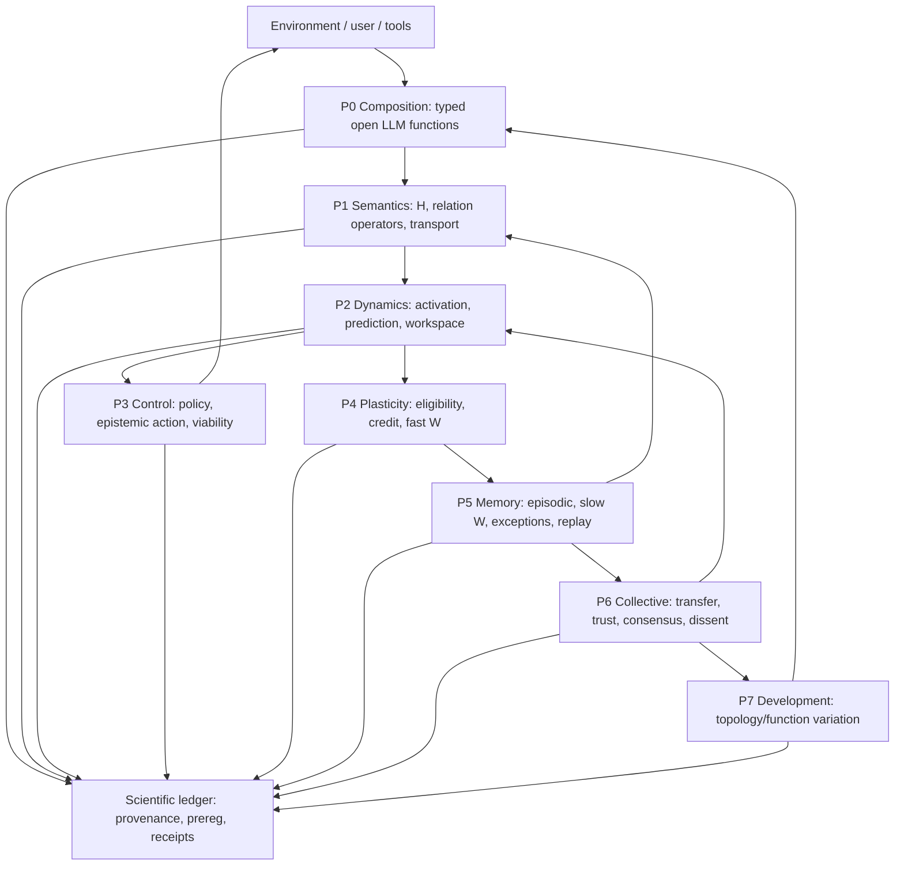

# PROM-16 — HSWM 총체 과학·수학 아키텍처

> **status**: `SECONDARY_AI_RESEARCH / HOLISTIC_PROTECTIVE_BELT`
> **cycle_id**: `prom-hswm-holistic-scientific-architecture-20260726`
> **date**: 2026-07-26
> **lanes**: `BRIDGE + ENGINEERING`
> **scope**: 수학 구조, 의미, 동역학, 제어, 인과학습, 기억, 인지, 집단, 발달, 검증
> **canon boundary**: USER_CANON인 “작은 LLM 함수들이 plastic semantic hypergraph를 통해
> 하나의 더 큰 AI를 이룬다”를 고정한다. 아래 이론 선택·수식·층 구분은 반증 가능한
> SECONDARY_AI synthesis이며 사용자 ratification 전에는 정전이 아니다.
> **Naesengmoon**: 사용자 요청이 없었으므로 출격하지 않았다.
> **live authority caveat**: 이 cycle의 KG/LakatoTree 동시 read는 응답 지연으로 완료되지 않아,
> 로컬 USER_CANON과 2026-07-26까지 봉인된 보고·receipt를 권위 경계로 사용했다.

## 0. 결론 — 하나의 이론이 아니라 제약된 이론 생태계로 만들어야 한다

직전 Semantic Weight Field 연구는 필요하지만 HSWM 전체의 한 층일 뿐이다. HSWM을 cosine,
embedding, hypergraph tensor 또는 뇌 비유 하나로 설명하면 다시 편협해진다.

총체적으로 HSWM은 다음으로 정의하는 것이 가장 강하다.

> **HSWM은 typed small-LLM functions가 열린 입출력 port를 통해 합성되고, 의미 hypergraph의
> recurrent state를 비동기적으로 변화시키며, 외부 결과가 fast/slow weight와 topology를
> 인과적으로 바꾸고, 기억·합의·발달을 서로 다른 시간척도에서 수행하는
> open stochastic adaptive system이다.**

이를 한 상태 객체로 쓰면:

\[
\Omega_t=
(\mathcal C,H_t,X_t,A_t,Q_t,W_t^f,W_t^s,\alpha_t,M_t,G_t,P_t)
\]

- `C`: typed composition grammar와 port contract;
- `H`: n-ary semantic/function hypergraph;
- `X`: 복수 geometry의 semantic coordinates;
- `A`: 순간 activation과 working state;
- `Q`: belief, uncertainty, prediction state;
- `W^f/W^s`: fast/slow macro-synaptic state;
- `α`: topology proposal/gate logits;
- `M`: episodic, semantic, exception memory;
- `G`: claim-local consensus, trust, dissent state;
- `P`: provenance, receipt, preregistration, scientific standing.

여기에는 단일 주인 이론이 없다.

| 이론군 | 맡길 일 | 맡기면 안 되는 일 |
|---|---|---|
| 범주론·open systems | 함수와 port의 합성 문법 | 학습 효과나 지능을 증명 |
| hypergraph·sheaf·tensor | n항 의미와 local-to-global transport | 모든 관계를 동일 geometry로 축약 |
| 동역학·제어 | recurrent 실행, 안정성, 안전영역 | 목적·가치 자체를 정함 |
| 인과추론·강화학습 | outcome credit과 개입 효과 | 유사도를 원인으로 간주 |
| 신경과학 | plasticity·homeostasis·기억 시간척도 가설 | 생물학 비유로 소프트웨어 성능을 증명 |
| 정보이론·통계학 | 용량, 압축, uncertainty, 일반화 | 최대 압축을 지능으로 동일시 |
| 인지과학 | workspace, 예측, 정보탐색 가설 | 의식 claim을 자동 부여 |
| 게임·사회선택 | 합의, trust, dissent, 전략적 행위 | 합의를 진실로 동일시 |
| 진화·발달 | 함수·topology 생성과 다양성 보존 | 무제한 self-modification을 허용 |
| Lakatos·Popper | 연구프로그램 판정과 kill rule | 시스템 runtime policy를 대신함 |

## 1. 권위와 현재 과학적 경계

### 1.1 USER_CANON hard core

로컬 정전이 고정하는 것은 다음이다.

1. 신경망적 함수 단위는 LLM으로 실행된다.
2. hypergraph `H`는 함수와 semantic state의 n-ary connectivity다.
3. Semantic Weight Map `W`는 macro-synapse, activation, routing이다.
4. HSWM 전체가 recurrent state, credit, acceptance, `Delta W/Delta H`를 소유한다.
5. HSWM은 합의를 포함하지만 합의에 축소되지 않는 더 큰 AI다.

### 1.2 현재 증거의 냉정한 위치

- immutable artifact, CRDT, replay, typed boundary는 engineering substrate로 성숙했다.
- LLM function network는 실행되지만 현재 역할 specialization의 고유 이득은 미확증이다.
- F2의 credit signal은 살아 있지만 실제 state는 text-lesson selection이었다.
- F3 A→B donor-specific numeric transfer는 0이었다.
- F4 topology 양성은 synthetic class-tag→lesson lookup confound가 있다.
- F5 age-downscale sleep은 append-only보다 나빠 반증됐다.
- 직전 SWF 연구는 typed n-ary semantic operator의 수학과 falsifier를 만들었지만 아직 실행 전이다.

그러므로 지금 말할 수 있는 과학적 성과는 “큰 인지체가 이미 존재한다”가 아니다.

> **HSWM hard core를 여러 독립 기전으로 분해하고, 각 기전이 어떤 이론의 보호를 받으며 어떤
> 개입으로 죽어야 하는지를 처음으로 하나의 프로그램에 배치했다.**

## 2. 총체 이론 지도

### T1. Applied category theory — 배선의 수학

작은 LLM 함수는 typed open system으로 둔다.

\[
f_i:(I_i,S_i)\longrightarrow(O_i,S_i')
\]

port type이 맞는 함수만 순차 합성하고, 독립 함수는 monoidal product로 병렬 합성한다.
colored wiring operad와 structured/decorated cospan은 여러 terminal을 가진 component를 더 큰
network로 합성하는 문법을 준다.

HSWM 흡수:

- prompt 이름이 아니라 input/output/state contract가 함수 identity를 정한다.
- topology edit는 임의 edge 조작이 아니라 well-typed morphism rewrite다.
- 같은 foundation model이 여러 `f_i`를 실행해도 morphism identity는 contract와 state ownership으로
  구분된다.
- unrestricted hypergraph-category의 copy/delete/merge를 그대로 허용하지 않는다. evidence,
  multiplicity, direction, deletion authority가 있으므로 typed monoidal/wiring fragment만 채택한다.

한계: 범주론은 composition이 잘 정의됐음을 보일 뿐, 그 조합이 더 똑똑하거나 학습한다는 것을
보이지 않는다.

### T2. Type theory와 contract semantics — 오류를 의미론적으로 막는다

각 function port는 nominal role뿐 아니라 refinement를 가져야 한다.

\[
\Gamma\vdash f_i:\Pi(x:A_i)B_i(x),\qquad
\Gamma\vdash o_i:\Sigma(y:B_i(x))Receipt(y,x)
\]

```text
Evidence{source, provenance, confidence, time}
Judgment{claim, verdict, calibration, evidence_refs}
Activation{epoch, W_version, relation_role, bounded_vector}
TopologyProposal{single_mutation_class, expected_effect, rollback}
```

`Evidence → Answer`와 `Verdict → WeightDelta`는 서로 다른 type path다. 자연어 verdict가 answer
prompt에 직접 들어가면 학습 channel과 readout channel이 섞여 실험은 VOID다.
dependent/refinement type은 well-formedness와 provenance obligation을 증명할 뿐 factual truth를
증명하지는 않는다.

### T3. Hypergraph, tensor, simplicial, sheaf — 고차 의미의 수학

- hypergraph는 subset 전체의 관계를 보존한다.
- low-rank tensor는 pairwise sum으로 환원되지 않는 n항 interaction을 표현한다.
- sheaf-like restriction/transport는 서로 다른 local semantic space를 관계 공간에서 비교한다.
- simplicial/Hodge 구조는 실제로 downward-closed한 flow·cycle·boundary 관계에만 쓴다.

서로 다른 local state가 같은 seam에서 일치하는지는 sheaf consistency energy로 진단할 수 있다.

\[
E_{\mathcal F}(x)
=\sum_{(i,j,e)}\|\rho_{i,e}x_i-\rho_{j,e}x_j\|^2
=\langle x,L_{\mathcal F}x\rangle
\]

단 `E_F>0`은 오류일 수도 있고 정당한 관점 차이일 수도 있으므로 자동 consensus objective로
최소화하지 않는다.

모든 semantic hyperedge를 simplicial complex로 만들면 `{A,B,C}`가 `{A,B}`를 함의하지 않는
일반 관계를 손상한다. 따라서 HSWM은 **general hypergraph가 본체이고, simplicial/Hodge는
조건부 substructure**다.

### T4. Information geometry와 multiple charts — 하나의 의미공간을 거부한다

`X`는 하나의 embedding matrix가 아니라 relation-conditioned atlas다.

\[
\mathcal M
=\mathbb R^{d_s}\times\mathbb B_\kappa^{d_h}\times\Delta^{d_u-1}
\]

- Euclidean: local semantic similarity와 composition;
- hyperbolic: hierarchy와 abstraction depth;
- simplex/statistical manifold: belief와 uncertainty.

그러나 product geometry는 hard core가 아니다. typed Euclidean tensor를 실제로 이길 때만
승격한다. embedding drift와 causal efficacy drift는 별도 version과 ledger를 가진다.

고정 candidate simplex의 routing에는 KL trust-region/mirror descent를 쓸 수 있다.

\[
p_{t+1}=\arg\max_{p\in\Delta}
[\eta\langle p,A_t\rangle-D_{KL}(p\|p_t)]
\]

이는 smooth weight update에만 적용한다. topology rewrite는 support와 dimension을 바꾸므로 같은
information-geometric step으로 위장하지 않고 discrete guarded event로 남긴다.

### T5. Nonlinear dynamical systems — 생각은 상태 전이다

한 episode에서 전체 numeric state는

\[
S_{t+1}=T_{H,W,\pi}(S_t,o_t,\xi_t)
\]

로 전이한다. attractor는 답 후보나 coherent plan을 나타낼 수 있지만, directed asynchronous
LLM workflow 전체에 대칭 Hopfield energy를 억지로 적용하면 안 된다.

확률적 LLM 호출을 포함한 bounded cycle은 Markov kernel로 보는 편이 더 정직하다.

\[
K_t:Q\otimes S_t\rightsquigarrow O\otimes S_{t+1}
\]

이 표현은 stochastic composition을 주지만 causal identification을 주지는 않는다. causal credit은
여전히 실제 remove/shuffle/randomized intervention이 필요하다.

HSWM은 두 실행 regime을 구분해야 한다.

1. **associative plane**: frozen `H/W`에서 energy 감소나 contraction을 증명할 수 있는 numeric loop;
2. **directed control plane**: QF→BF→AF 같은 bounded recurrent program. fixed point를 증명하지
   못하면 단지 budget 안에서 종료했다고만 보고한다.

### T6. Control theory — 지능보다 먼저 viability를 지킨다

안전한 상태집합을

\[
\mathcal K={S:|A|\le B_A,\ |E_{active}|\le B_E,
calls\le B_c,\ risk\le B_r,\ forgetting\le B_f\}
\]

로 둔다. fixed-routing epoch의 candidate Lyapunov function `V(S)`에 대해 목표영역 밖에서

\[
\mathbb E[V(S_{t+1})-V(S_t)\mid S_t]\le-\epsilon
\]

을 요구하거나, 이를 검증하지 못하면 bounded execution guard로 대체한다. 학습·topology commit은
episode 경계에서만 수행해 실행 안정성과 learning dynamics를 분리한다.

### T7. Predictive coding — residual을 메시지로 쓸 수 있다

각 function/relation이 이웃 state를 예측하고 residual만 상위로 보낼 수 있다.

\[
\varepsilon_i=o_i-\hat o_i(H,W,S),\qquad
\Delta S\propto-\nabla_S\sum_i \varepsilon_i^\top\Pi_i\varepsilon_i
\]

이는 항상 답을 생성하는 모든 node를 호출하는 대신 surprise가 큰 부분만 깨우는 sparse activation
가설을 준다. 단 predictive coding이 HSWM 전체의 유일 목적함수라는 주장은 하지 않는다.

### T8. Active inference와 value of information — 탐색을 명시한다

행동·route는 단일 reward뿐 아니라 정보가치를 가질 수 있다. HSWM에는 자유에너지 만능명제보다
다음 constrained objective가 더 검증 가능하다.

\[
\max_{\pi}\;
\mathbb E[R\mid\pi]
+\beta I(Z_{future};O_{future}\mid\pi)
-\lambda C(\pi)
\]

subject to `S∈K`, retention, risk, token/call budgets.

첫 항은 pragmatic value, 둘째는 epistemic value다. active inference는 이 trade-off의 후보
parameterization이지 HSWM의 존재론이 아니다.

### T9. Causal inference — semantic relation을 원인으로 착각하지 않는다

관계 `e`의 causal utility는 제거·강제 개입으로 정의한다.

\[
ACE_e
=\mathbb E[Y\mid do(g_e=1)]
-\mathbb E[Y\mid do(g_e=0)]
\]

observational attention, cosine, Shapley self-consistency만으로는 causal weight를 식별할 수 없다.
개입 coverage, propensity, pre-outcome trace, hidden leakage 방지가 필요하다.

### T10. Three-factor plasticity — 결과가 과거 활성에 닿는 최소 seam

\[
z_{e,t}=\lambda_z z_{e,t-1}+\nabla_\Theta\log\pi_\Theta(e_t\mid S_t)
\]

\[
\delta_t=r_t-\hat r_t,
\qquad
\Delta W_e^f=\eta_e\delta_t z_{e,t}-\lambda_W W_e^f
\]

- eligibility는 outcome 전에 seal;
- `delta`는 독립 outcome 또는 calibration된 judge에서 생성;
- 자연어 rationale는 직접 weight가 아님;
- rollback과 credit/trace shuffle이 gain을 제거해야 함.

### T11. Homeostasis와 metaplasticity — 학습률도 학습 상태다

Hebbian/credit plasticity는 positive feedback을 만들 수 있으므로 별도 negative feedback이 필요하다.

\[
W_{i,*}\leftarrow
W_{i,*}\frac{B_i}{\sum_e|W_{i,e}|+\epsilon}
\]

\[
\eta_{e,t+1}
=\operatorname{clip}
(\eta_{e,t}+\kappa[novelty-saturation-risk])
\]

첫 식은 incoming budget scaling, 둘째는 metaplasticity다. route entropy, degree, activation mass,
load Gini, forgetting을 set-point 주변에 유지한다. criticality를 원하면 먼저 branching ratio와
susceptibility를 재야 하며, power law처럼 보인다는 이유만으로 critical하다고 선언하지 않는다.

기본 운용점은 임계점 자체가 아니라 **약한 subcritical 영역**으로 둔다.

\[
R_t=\mathbb E[\text{new activations}\mid\text{one active activation}]
\le 1-\varepsilon
\]

`R_t\approx1`은 더 큰 적응성 이득이 실제 utility-risk 곡선에서 확인될 때만 sealed structural
experiment로 접근한다. 즉 criticality는 목표함수가 아니라 비교할 regime이다.

### T12. Complementary Learning Systems — 기억은 적어도 세 속도다

HSWM memory는 한 저장소가 아니다.

1. `M_epi`: immutable episodic trace와 provenance, 빠른 기록;
2. `W_fast`: 빠른 outcome adaptation, rollback 가능;
3. `W_slow`: 여러 disjoint episode에서 지지된 semantic rule;
4. `M_exc`: 규칙으로 압축하면 손상되는 exception ledger.

consolidation은 age decay가 아니라 replay selection 문제다.

\[
B^*_{replay}
=\arg\max_{B:\,cost(B)\le C}
[\widehat{retentionGain}(B)+coverage(B)-interference(B)]
\]

fast→slow 승격은 fresh improvement, old-regime retention, exception preservation, rollback receipt를
모두 통과해야 한다.

정보열역학은 문자 그대로의 joule 설명이 아니라, 과거를 보존하지만 미래 예측에는 쓰지 못하는
memory를 찾는 진단량으로만 쓴다.

\[
I_{nostalgia}=I(S_t;Y_{past})-I(S_t;Y_{future})
\]

값이 큰 trace는 replay·compression·archive 후보가 된다. token, prompt, weight update를 곧바로
`k_BT`나 물리적 열로 동일시하지 않는다.

### T13. Global workspace — 합의가 아니라 일시적 broadcast 가설

부분 함수들이 독립적으로 계산하고, 소수의 state만 경쟁을 거쳐 제한된 workspace에 broadcast하는
구조는 HSWM의 sparse routing 후보가 된다.

\[
B_t=TopK_i\,[salience_i+uncertainty_i+expected\ utility_i-cost_i]
\]

그러나 broadcast가 항상 이득이라는 보장은 없고, 이것을 consciousness evidence로 부르면 안 된다.
local-only, full-broadcast, sparse-workspace를 equal-budget으로 비교해야 한다.

### T14. Modular learning과 developmental specialization

전문화는 prompt persona가 아니라 private state, restricted port, sparse communication, 반복 task
distribution에서 생겨야 한다. 새 function/topology는 다음 slow loop에서 제안한다.

```text
variation → shadow execution → fresh utility → retention/risk/complexity
→ promote or archive → metaplasticity update
```

구조 목적함수는 단일 정확도가 아니다.

\[
J(H,W)=U_{fresh}-\lambda_c Cost-\lambda_m MDL(H,W)
-\lambda_f Forgetting+\lambda_d Diversity
\]

quality-diversity archive를 두어 당장 최고점이 아니어도 서로 다른 해결 전략을 보존한다. 단 구조
변이는 한 epoch에 한 mutation class만 허용한다.

POET류 환경-해결자 공진화와 MAP-Elites류 archive는 후보 생성·보존 장치이지 open-endedness의
증명이 아니다. 외부 고정 oracle, cross-lineage transfer, novelty/complexity의 독립 측정이 없으면
환경과 해결자가 함께 쉬운 편법으로 퇴화할 수 있다.

### T15. Multi-agent learning, game theory, social choice — 합의를 제한한다

HSWM은 합의를 포함하지만 consensus scalar 하나가 망 전체를 지배하면 groupthink가 된다. 합의는
**claim-local, evidence-aware, correlation-corrected**여야 한다.

agent `i`의 claim `c`에 대한 belief를 `b_i(c)`, calibrated trust를 `q_i(c)`라 하면 조건부
독립성이 근사될 때만 log opinion pool을 쓴다.

\[
\log b_*(y\mid c)
\propto\sum_i q_i(c)\log b_i(y\mid c)
\]

동일 source나 동일 foundation model에서 나온 correlated evidence는 중복 감산하고, dissent는

\[
d_i(c)=D_{KL}(b_i(c)\|b_*(c))
\]

로 보존한다. `agreement`, `truth score`, `decision authority`는 서로 다른 field다. 악의적·편향
agent가 존재하는 경우 trust는 과거 sealed prediction으로 학습하며 단순 다수결을 금지한다.

DeGroot update

\[
x^{(t+1)}=P x^{(t)}
\]

는 적절한 `P`에서 agreement를 만들지만 그 fixed point가 truth라는 보장은 없다. Arrow류 불가능성
결과도 모든 조건을 동시에 만족하는 보편적 집계자가 공짜로 존재하지 않음을 경고한다. 그러므로
HSWM은 participation entropy, 한 agent의 authority dominance, strongest-node·clone controls를 함께
보고해야 하며, collective intelligence는 집단 점수가 가장 강한 단일 node와 동형 clone 집단을
넘을 때만 주장한다.

### T16. Information theory, MDL, PAC-Bayes — 일반화와 복잡도를 잰다

HSWM은 연산 우선 정전을 가지지만, 무제한 구조 성장은 의미 있는 학습이 아니다.

- information bottleneck은 prediction과 compression trade-off를 주지만 `beta`가 잘못되면 trivial
  representation이 최적이 될 수 있다.
- MDL은 topology·rule·exception의 총 기술길이를 비교한다.
- PAC-Bayes는 여러 environment에서 policy/structure가 일반화할 가능성을 평가하는 audit plane이다.

따라서 compute 절약을 hard core로 만들지 않되, **같은 효용을 더 복잡한 구조로 얻은 경우 그
구조를 진전으로 세지 않는다.**

### T17. Complex adaptive systems와 criticality — 관찰 지표이지 목표가 아니다

HSWM은 adaptive network이므로 cascade, specialization, phase transition이 생길 수 있다. 측정할
값은 branching ratio, avalanche distribution, susceptibility, correlation length, recovery time이다.
하지만 criticality를 직접 최적화하면 instability와 비용 폭발을 부를 수 있다.

결론: `critical`, `subcritical`, `multistable` regime을 비교하되 가장 높은 task utility·adaptation·
stability를 가진 regime을 고른다. “뇌가 critical일 수 있다”는 이유로 critical regime을 정답으로
미리 고르지 않는다.

### T18. Scientific epistemology — HSWM 자신의 학습과 연구자의 학습을 분리한다

runtime `W/H` update와 과학적 claim update는 별개다.

- runtime: outcome→credit→candidate state→canary→commit;
- science: preregistration→real execution→receipt→independent judge→Lakatos verdict;
- canon: 사용자 ratification 또는 명시된 권위 gate.

LLM self-report, 아름다운 수식, 설계 완성은 scientific progress가 아니다.

## 3. 총체 아키텍처 — 8개 평면



각 평면은 독립적으로 제거·rollback할 수 있어야 한다. 전체 지능을 한 scalar 평균으로 판정하지
않고 다음 AND gate를 쓴다.

```text
COMPOSE ∧ NARY_SEMANTICS ∧ RECURRENCE ∧ CAUSAL_PLASTICITY
∧ RETENTION ∧ TRANSFER ∧ COLLECTIVE_ROBUSTNESS ∧ DEVELOPMENT
```

한 gate가 실패해도 성공한 하위 부품은 남지만 “더 큰 학습 AI” 헤드라인은 보류한다.

## 4. 여섯 시간척도

| clock | 변화 | 원칙 |
|---|---|---|
| `tau0` call/token | 작은 LLM 내부 생성 | byte-frozen model/prompt during measurement |
| `tau1` activation tick | `A,Q`, route | bounded async execution, no durable write |
| `tau2` episode | eligibility→`W_fast` | independent outcome, rollback |
| `tau3` consolidation | replay→`W_slow/M_exc` | retention·exception gate |
| `tau4` structural epoch | `H`, function roster, metaplasticity | one mutation class, shadow validation |
| `tau5` federation/generation | HSWM 간 specialization·consensus·selection | diversity and trust preserved |

이 시간척도를 섞으면 실패 원인을 찾을 수 없다. 특히 inference 도중 topology를 바꾸거나, outcome
이후 eligibility를 만들거나, 한 episode 성공을 slow memory로 즉시 승격하면 안 된다.

## 5. 단일 목적함수 대신 네 통화와 제약식

HSWM은 다음 네 currency를 동시에 관리한다.

1. `utility`: 외부 task outcome과 사용자 가치;
2. `epistemic value`: uncertainty 감소와 정보 획득;
3. `resources`: calls, tokens, latency, storage, communication;
4. `viability`: 안전, calibration, retention, diversity, rollback 가능성.

정책 선택은 constrained Pareto problem이다.

\[
\max_\pi (U(\pi),I(\pi),Diversity(\pi))
\quad\text{s.t.}\quad
Cost\le B,\ Risk\le R,\ Forgetting\le F,\ S\in\mathcal K
\]

“연산 > 절약”은 utility를 비용보다 우선한다는 뜻이지, 비용·안정성 제약을 없앤다는 뜻이 아니다.

## 6. 이론 간 충돌과 해결법

| 충돌 | 왜 동시에 hard core가 될 수 없는가 | HSWM 처리 |
|---|---|---|
| contraction vs criticality | 하나는 perturbation을 죽이고 하나는 증폭 경계에 접근 | fixed episode 안정성 + structural epoch의 regime 탐색 |
| Hopfield energy vs directed LLM workflow | 대칭 energy와 비대칭 control flow의 가정이 다름 | associative plane과 directed plane 분리 |
| global broadcast vs modular sparsity | broadcast는 공유, modularity는 간섭 차단 | sparse workspace를 선택적 channel로 실험 |
| compression vs exception | rule 압축은 rare counterexample을 삭제 | semantic rule + immutable exception ledger |
| consensus vs truth | agreement는 correlated error에도 증가 | claim-local trust, source dedup, dissent 보존 |
| free-energy unity vs plural values | preferred outcomes를 누가 정하는지 숨길 수 있음 | reward/info/risk를 명시한 constrained objective |
| categorical typing vs topology evolution | type 고정과 새로운 port 생성이 충돌 | schema-versioned rewrite와 migration proof |
| fixed statistical manifold vs topology rewrite | natural gradient는 좌표·지지집합 고정을 가정하지만 rewrite는 차원과 support를 바꿈 | epoch 내부 KL/mirror step과 epoch 경계의 discrete proposal을 분리 |
| plasticity vs stability | positive feedback가 saturation/collapse 생성 | fast credit + slow homeostasis/metaplasticity |
| open-ended evolution vs reproducibility | 계속 변하면 같은 실험을 재생할 수 없음 | generation snapshot, frozen evaluation, lineage |
| criticality vs safety | large cascade가 창발성과 장애를 같이 높임 | diagnostic only; safety region 밖 promotion 금지 |

충돌을 하나의 화려한 식으로 지우지 않고 plane과 clock을 나누는 것이 총체성이다.

## 7. 경쟁 프로그램

| rival | 더 단순한 설명 | HSWM이 져야 하는 조건 |
|---|---|---|
| strong vector/RAG memory | 좋은 검색과 긴 context면 충분 | numeric `W/H`가 equal-budget RAG를 못 이김 |
| fixed LLM workflow | typed pipeline이면 충분 | learning/rollback arm이 frozen workflow와 동률 |
| MoE/router | expert routing 최적화면 충분 | persistent semantic topology가 추가 transfer를 못 만듦 |
| LLM agent graph | prompt/edge graph optimization이면 충분 | n-ary semantic operator가 pairwise graph와 동률 |
| differentiable hypergraph NN | LLM 함수가 불필요 | numeric HGNN이 동일 정보에서 LLM-function HSWM과 동률/우세 |
| blackboard architecture | shared symbolic state면 충분 | outcome plasticity를 제거해도 gain 유지 |
| predictive/active-inference agent | generative model+planning이면 충분 | HSWM topology/memory가 추가 adaptation을 못 만듦 |

HSWM은 모든 rival보다 항상 좋아야 할 필요는 없다. HSWM 고유 주장은 **비정상성, n항 구성,
delayed outcome, cross-agent transfer, 구조 변화가 함께 필요한 regime**에서만 세운다.

## 8. 공통 실험 섀시 — `HSWM-WORLD-0`

분리된 toy benchmark를 계속 만들면 각 positive가 연결되지 않는다. 하나의 latent world generator에
다음 factor를 독립 switch로 둔다.

1. typed n-ary rule와 pairwise-indistinguishable world;
2. hidden regime shift와 delayed outcome;
3. 정보 획득 action이 필요한 partial observation;
4. function별 private observation과 restricted port;
5. Agent A/B의 비대칭 capability;
6. old/new rule interference와 rare exception;
7. correlated·malicious evidence source;
8. call/token/latency budget;
9. function/topology가 부족한 developmental phase;
10. exact symbolic oracle와 complete causal log.

세 단계로 생태 타당성을 올린다.

- `WORLD-S`: fully symbolic, exact oracle, mechanism identification;
- `WORLD-L`: frozen small LLM functions, paraphrase/entity/composition disjoint;
- `WORLD-R`: real domain·time-disjoint corpus와 external outcome.

synthetic positive만으로 현실 claim을 만들지 않고, 현실 negative만으로 mechanism을 식별한 척하지
않는다.

## 9. 단계별 결정실험

### X0 — Composition

질문: typed LLM function composition이 equal-information flat workflow보다 고유한가?

- intervention: role-state interchange, port swap, function removal;
- accept: full이 strongest baseline보다 `>=5pp`, paired 95% LCB `>0`, predicted interchange effect;
- kill: prompt label만 바꿔도 동일하거나 information deletion이 effect를 설명.

### X1 — Irreducible n-ary semantics

질문: same pairwise projection에서 실제 hyperedge tensor/transport가 필요한가?

- 기존 `HSWM-SWF-M1` Steiner paired worlds 사용;
- accept: full이 strongest baseline보다 `>=10pp`, tensor/role shuffle이 gain `>=70%` 제거;
- kill: clique/pairwise가 `+-2pp` 안에서 동률.

### X2 — Recurrent dynamics와 workspace

질문: 한 번의 feed-forward context가 아니라 recurrence가 필요한가?

- 태스크: partial evidence가 여러 tick에 도착하고 intermediate state가 필요;
- arms: feed-forward full-context, local recurrence, full broadcast, sparse workspace;
- accept: sparse recurrent arm의 utility·calibration 개선, budget 내 종료, rollback 가능한 state effect;
- kill: full-context가 동률이거나 oscillation/budget violation `>5%`.

### X3 — Causal plasticity

질문: outcome이 numeric macro-weight를 통해 다음 행동을 바꾸는가?

- 기존 `HSWM-CPL1` 사용;
- accept: learning slope LCB `>0`, strongest text/vector baseline 대비 `>=5pp`, credit/eligibility/
  rollback이 gain `>=70%` 제거;
- kill: prompt/content leakage, shuffle 후 gain 유지, numeric state 없이도 동일.

### X4 — Epistemic action

질문: uncertainty를 줄이는 action이 단기 reward-only보다 장기 성능을 높이는가?

- arms: reward-only, entropy heuristic, expected information gain, active-inference parameterization;
- accept: equal-budget cumulative regret 감소와 calibration 개선;
- kill: 정보 action 비용을 포함하면 이득 없음 또는 preference shaping으로만 설명.

### X5 — Consolidation

질문: fast episodic state가 slow rule로 이동하면서 forgetting을 줄이는가?

- arms: append-only, age decay, random replay, predictive replay, rule+exception;
- accept: fresh gain 유지, old-regime loss `<=3pp`, exception recall 개선, replay selection removal effect;
- kill: append-only가 동률/우세하거나 rare exception이 체계적으로 사라짐.

### X6 — Transfer, consensus, dissent

질문: HSWM이 여러 agent의 지식을 합치되 correlated error와 악의적 source를 견디는가?

- frozen Agent B, transcript 금지, numeric `W/H/G` packet만 전달;
- arms: majority, naïve average, calibrated trust, correlation-corrected+dissent;
- accept: donor-specific transfer LCB `>0`, truth score 개선, minority-correct evidence 보존;
- kill: agreement만 증가하고 truth/calibration 악화, shuffled donor와 동률.

### X7 — Developmental topology/function growth

질문: 고정 구조로 못 푸는 distribution shift에서 새 function 또는 hyperedge가 생겨나는가?

- mutation: ADD/SPLIT/MERGE/SPECIALIZE 중 epoch당 한 class;
- arms: fixed, random search, greedy utility, MDL, quality-diversity archive;
- accept: fresh utility `>=5pp`, retention `<=3pp` loss, complexity-adjusted gain, rollback necessity;
- kill: fixed architecture와 동률, bloat, diversity collapse, self-generated benchmark exploitation.

### X8 — 전체 “더 큰 AI” conjunction

모든 하위 positive를 한 run에서 재현한다.

- small LLM byte-frozen;
- learned state는 외부 `H/W/A/Q/M/G`뿐;
- equal total calls/tokens/wall-clock envelope;
- training content와 receiver prompt overlap `0`;
- `W/H/M/G` plane별 독립 rollback;
- 최소 5 seeds, multiple world families, 외부 domain replicate.

어떤 plane을 rollback했을 때 그 plane이 사전예측한 능력만 선택적으로 사라져야 한다. 단일 score
상승으로 전체 claim을 승인하지 않는다.

## 10. 구현 우선순위

### Phase H0 — ontology와 state ledger

- `Omega_t`의 각 plane을 별도 version/hash로 기록;
- event schema: observe, activate, call, outcome, credit, fast-update, promote, topology-edit, consensus;
- embedding, weight, activation, belief, topology를 같은 vector field에 섞지 않음.

### Phase H1 — `WORLD-S`와 strong rival suite

- exact oracle와 factor switch 구현;
- RAG, flat workflow, MoE/router, pairwise graph, numeric HGNN 대조군을 먼저 구현;
- information/compute parity verifier를 공통 사용.

### Phase H2 — typed open LLM runtime + SWF-0

- small LLM function registry, typed ports, private states;
- role-aware n-ary potential과 transport;
- X0/X1 통과 전에는 mixed geometry·sleep·evolution을 열지 않음.

### Phase H3 — dynamics/control/plasticity

- bounded recurrent scheduler, state-hash/no-progress termination;
- viability/homeostasis monitor;
- pre-outcome eligibility와 numeric fast `W`;
- X2/X3/X4.

### Phase H4 — multi-timescale memory

- immutable episode, fast weight, slow rule, exception ledger;
- predictive replay와 consolidation gate;
- X5.

### Phase H5 — collective HSWM

- frozen receiver transfer;
- claim-local trust, correlation provenance, dissent ledger;
- X6.

### Phase H6 — developmental HSWM

- schema-versioned function/topology mutation;
- quality-diversity archive, MDL/retention/canary;
- X7 후 X8.

## 11. 측정 벡터

한 score로 숨기지 말고 다음을 모두 보고한다.

\[
\mathbf M=
(Utility,LearningSlope,CausalMediation,Composition,
Transfer,Adaptation,Retention,Calibration,Stability,
Diversity,Cost)
\]

headline acceptance는 가중평균이 아니라 preregistered conjunction이다. 각 값에는 bootstrap CI,
seed consistency, environment family별 breakdown, plane rollback effect를 붙인다.

## 12. 하지 말아야 할 총체성 흉내

1. 여러 이론의 용어만 나열하고 같은 코드에 이름표 붙이기;
2. free energy, consciousness, criticality, emergence를 측정 없이 선언;
3. 모든 관계를 하나의 embedding 거리로 만들기;
4. consensus가 높다는 이유로 truth라고 판정;
5. 뇌의 sleep/neuromodulator를 문자열 이름으로만 구현;
6. self-generated judge와 self-generated benchmark로 자기진전 증명;
7. synthetic toy positive를 곧바로 일반지능 evidence로 승격;
8. 전체 평균이 올랐다는 이유로 실패한 causal gate를 숨김;
9. topology 변화와 schema migration을 같은 commit에서 무검증 적용;
10. 구현 규모를 과학적 진전으로 계산.

## 13. 1차 소스 장부

| source | HSWM에 주는 것 | caveat |
|---|---|---|
| [Fong, Algebra of Open and Interconnected Systems](https://arxiv.org/abs/1609.05382) | typed multi-terminal components의 compositional hypergraph 문법 | 학습·지능의 증거가 아님 |
| [Spivak, The Operad of Wiring Diagrams](https://arxiv.org/abs/1305.0297) | colored wiring operad로 port·role·composition을 문법화 | copy/delete/merge를 무제한 허용하면 evidence multiplicity가 소실 |
| [Martin-Lof, Intuitionistic Type Theory](https://www.cse.chalmers.se/research/group/logic/book/book.pdf) | dependent input/output와 receipt를 `Pi`/`Sigma` type으로 결합 | type inhabitance가 empirical truth를 보장하지 않음 |
| [Fritz, A Synthetic Approach to Markov Kernels](https://arxiv.org/abs/1908.07021) | stochastic function execution의 compositional semantics | intervention 없는 kernel은 causal credit을 식별하지 못함 |
| [Fong & Spivak, Seven Sketches](https://arxiv.org/abs/1803.05316) | category theory를 dynamical/database/network system에 적용하는 공통 언어 | 구현 prescription은 별도 |
| [TuckER, EMNLP 2019](https://aclanthology.org/D19-1522/) | relation-specific tensor factorization | binary KG 중심 |
| [Learning with Hypergraphs, NeurIPS 2006](https://proceedings.neurips.cc/paper_files/paper/2006/hash/dff8e9c2ac33381546d96deea9922999-Abstract.html) | pairwise reduction의 정보 손실 | LLM runtime 없음 |
| [Neural Sheaf Diffusion, NeurIPS 2022](https://proceedings.neurips.cc/paper_files/paper/2022/hash/75c45fca2aa416ada062b26cc4fb7641-Abstract-Conference.html) | local spaces와 restriction map, heterophily | graph 기반 |
| [Predictive Coding, Rao & Ballard 1999](https://www.nature.com/articles/nn0199_79) | top-down prediction과 bottom-up residual | visual cortex model |
| [Active Inference and Learning](https://pmc.ncbi.nlm.nih.gov/articles/PMC5167251/) | pragmatic·epistemic policy value | normative assumptions를 HSWM에 별도 검증해야 함 |
| [e-prop, Nature Communications 2020](https://www.nature.com/articles/s41467-020-17236-y) | eligibility × learning signal | differentiable spiking RNN |
| [Synaptic Tagging, Frey & Morris 1997](https://www.nature.com/articles/385533a0) | short-lived tag와 late consolidation 분리 | 생물학 time scale을 그대로 복사할 수 없음 |
| [Turrigiano, Synaptic Scaling](https://pmc.ncbi.nlm.nih.gov/articles/PMC2834419/) | plasticity의 runaway를 막는 homeostatic scaling | software invariant는 새 설계 |
| [Borkar & Meyn, Stochastic Approximation and ODE Stability](https://epubs.siam.org/doi/10.1137/S0363012997331639) | bounded/projected update와 timescale separation의 안정성 틀 | 실제 HSWM update noise 조건을 별도 증명해야 함 |
| [Still et al., Thermodynamics of Prediction](https://journals.aps.org/prl/abstract/10.1103/PhysRevLett.109.120604) | 과거 기억 중 미래 예측에 쓰이지 않는 정보의 구분 | software token을 물리적 energy로 등치하면 category error |
| [Complementary Learning Systems synthesis](https://pmc.ncbi.nlm.nih.gov/articles/PMC7209926/) | 빠른 episodic과 느린 structured memory, interleaved replay | 인간 뇌 유비가 직접 성능증거는 아님 |
| [Recurrent Independent Mechanisms](https://openreview.net/forum?id=BylaUTNtPS) | sparse communication과 modular specialization | differentiable RNN |
| [Modular Meta-Learning, CoRL 2018](https://proceedings.mlr.press/v87/alet18a.html) | module recombination과 compositional generalization | 구조 search space가 사전 주어짐 |
| [GPTSwarm, ICML 2024](https://proceedings.mlr.press/v235/zhuge24a.html) | LLM operation graph와 edge optimization | persistent semantic plasticity는 약함 |
| [Causal Representation Identifiability, ICML 2024](https://proceedings.mlr.press/v235/morioka24a.html) | latent causal learning의 underconstraint와 식별 조건 | HSWM relation을 자동 식별해주지 않음 |
| [Learning Trust over Directed Graphs, L4DC 2023](https://proceedings.mlr.press/v211/akgun23a.html) | malicious participant가 있는 directed trust learning | claim semantics·source correlation은 추가 필요 |
| [Decentralized MARL, ICML 2018](https://proceedings.mlr.press/v80/zhang18n.html) | sparse time-varying communication에서 협력학습 | shared LLM semantic field와 다름 |
| [DeGroot, Reaching a Consensus](https://www.tandfonline.com/doi/abs/10.1080/01621459.1974.10480137) | directed averaging dynamics와 consensus 조건 | agreement는 truth나 공정성을 보장하지 않음 |
| [Information Bottleneck Learnability, UAI 2020](https://proceedings.mlr.press/v115/wu20b.html) | compression/prediction trade-off의 phase transition과 trivial collapse | `beta` 선택이 task-dependent |
| [PAC-Bayes Control, CoRL 2018](https://proceedings.mlr.press/v87/majumdar18a.html) | novel environments에 대한 controller 일반화 bound | bounds가 실제로 non-vacuous한지 확인 필요 |
| [Neuronal Avalanche Scaling](https://www.nature.com/articles/s41598-019-52326-y) | criticality 진단 지표의 생물학 선례 | HSWM이 critical해야 한다는 증거 아님 |
| [Priesemann et al., Slightly Subcritical Brain](https://www.frontiersin.org/journals/systems-neuroscience/articles/10.3389/fnsys.2014.00108/full) | 안정성과 sensitivity 사이의 subcritical 운용 가설 | software runtime의 최적 regime은 직접 비교해야 함 |
| [POET](https://arxiv.org/abs/1901.01753) | 환경과 해결자의 동시 생성·transfer | 열린끝 진화 보장이나 외부 효용 증명이 아님 |
| [MAP-Elites](https://arxiv.org/abs/1504.04909) | 성능 하나가 아닌 feature-space diversity archive | descriptor 선택이 다양성을 미리 규정함 |
| [GNWT vs IIT adversarial test, Nature 2025](https://www.nature.com/articles/s41586-025-08888-1) | 큰 인지이론도 preregistered head-to-head test가 필요함 | HSWM에 consciousness claim을 주지 않음 |

## 14. 최종 finding

```yaml
finding_id: hswm-is-a-typed-open-multiscale-adaptive-system
claim: >
  HSWM을 총체적으로 구현하는 최소 틀은 하나의 embedding 또는 뇌 비유가 아니라,
  typed open composition, irreducible n-ary semantics, bounded recurrent dynamics,
  causal fast plasticity, homeostatic slow memory, claim-local consensus and
  schema-versioned developmental topology를 서로 다른 plane과 clock으로 분리한
  stochastic adaptive system이다.
status: HOLISTIC_PROTECTIVE_BELT
hardest_unresolved_claim: >
  frozen small LLM functions의 외부 numeric H/W/M/G state만으로 learning, transfer,
  retention and structural adaptation이 한 공통 world에서 인과적으로 연결되는가.
next_artifact: HSWM-WORLD-0 exact-oracle factorized chassis
first_execution_order:
  - X0 typed composition
  - X1 irreducible n-ary semantics
  - X2 bounded recurrence
  - X3 causal plasticity
confidence: 0.89
```

총체적 결론은 “모든 이론을 넣자”가 아니다. **각 이론이 담당하는 층과 실패 조건을 좁게 정하고,
공통 실험 세계에서 plane별 rollback으로 서로의 필요성을 검증하자**는 것이다. HSWM의 혁신은
이론 이름의 수가 아니라, 작은 LLM 함수·의미·학습·기억·집단·발달이 한 versioned causal loop로
실제로 연결되는 데서만 발생한다.
