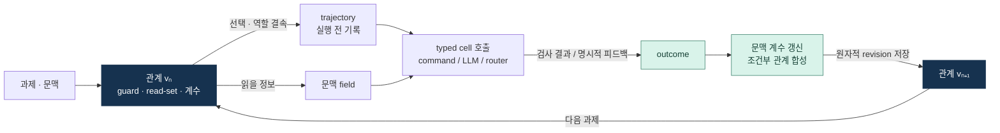
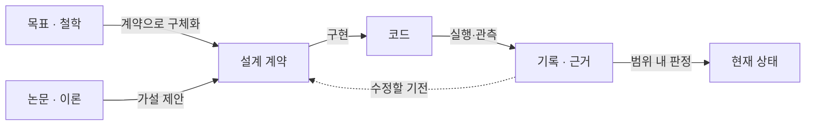

# HSWM

**Hypergraph Semantic Weight Map**<br>
관계를 실행하고, 결과로 관계를 바꾸는 토큰 기반 하이퍼그래프 신경망을 연구합니다.

[그래프 구조](#graph-model) · [빠른 실행](#quick-start) · [개발 실사용](#development) · [근거와 판정](#evidence) · [전체 문서](INDEX.md)

> **2026-09-07 · 실사용 가능한 로컬 적응 프로토타입**<br>
> 실행 → 결과 기록 → 문맥 가중치·조건부 관계 갱신 → 다음 선택이 연결되어 있습니다.
> HSWM 전체의 실현과 새로운 과제에서의 성능 우위는 아직 **UNJUDGED**입니다.

## 하나의 HSWM, 현재의 구현

HSWM의 목표는 LLM이 수행하는 국소 전이들이 하나의 지속되는 하이퍼그래프를 이루는 것입니다.
이 그래프는 실행을 조정하는 **living harness**, 경험을 보존하는 **world model**,
결과에 따라 변하는 **continuous learner**의 역할을 함께 합니다.
하나의 HSWM이 다시 상위 HSWM의 cell로 참여하는 프랙탈 합성까지가 장기 목표입니다.

현재는 그 목표의 일부를 Python 실행기로 구현했습니다. 명시적으로 허용한 command·typed LLM
cell을 호출하고, 관계별 문맥 계수와 읽는 정보, 조건부 관계를 지속 상태로 갱신합니다.
TypeScript + Effect 런타임과 기존 실험 코드는 각각의 [구현 범위](docs/research/HSWM_TYPESCRIPT_EFFECT_RUNTIME_2026-08-21.md)를 유지합니다.

| 영역 | 현재 가능한 일 | 아직 남은 일 |
| --- | --- | --- |
| 실행 | 허용된 cell 선택, 순서 있는 호출, router의 재귀 합성 | 통합된 깊은 LLM macro-training |
| 학습 | 관측 결과로 관계별 logistic 문맥 계수·평균 비용 갱신 | 인과적 credit 식별, 일반화·장기 유지 검증 |
| 관계 변화 | 유한 조건식 합성, guard·read-set의 국소 분화 | 자유로운 구조 재조직과 무제한 지속 학습 |
| 지속 상태 | SQLite revision, CAS 갱신, replay, 관계 복원 | 분산 상태·전역 admission·상위 인지 합성 검증 |
| 개발 적용 | 메이플리니지·버엑시·수풀림 검사 실행과 피드백 기록. 버엑시 독립 레포는 AGENTS·Skill로 에이전트가 CLI를 쓰도록 연결 | 메이플리니지·수풀림 에이전트 지침, MCP 자동 연결, 사용자 피드백 축적 |

목표 정체성과 현재 증거는 [헌법](docs/canon/HSWM_CONSTITUTION_2026-08-20.md),
[프랙탈 합성 계약](docs/research/HSWM_FRACTAL_SCIENTIFIC_CONNECTIONS_2026-08-28.md),
[적응 연구 전략](docs/canon/HSWM_ADAPTIVE_RESEARCH_STRATEGY_2026-08-30.md)에 각각 연결합니다.

<a id="graph-model"></a>

## 그래프가 실행을 바꾸는 방식

관계는 **source·복수 member·읽을 문맥·적용 조건·학습 상태**를 함께 갖는 실행 단위입니다.
같은 cell도 다른 관계와 역할로 참여할 수 있고, member가 다시 router일 수도 있습니다.



이 그림은 현재 로컬 적응 실행기의 흐름입니다. 울프람의 **국소 하이퍼그래프 갱신과 사건 의존성**을
공학적 관점으로 가져왔으며, 학습 규칙과 과제 성공의 정의는 별도의 HSWM 가설입니다.
[설계·구현 설명](docs/research/HSWM_ADAPTIVE_HYPERGRAPH_RUNTIME_2026-09-07.md)에 출처와 범위를 기록합니다.

| 그래프의 책임 | 실제 표현·동작 | 구현 |
| --- | --- | --- |
| cell·역할·관계 | `cell`, `relation`, source/member/input 참조, typed port 합성 | [adaptive_runtime.py](src/hswm/cells/adaptive_runtime.py) |
| 문맥·조건 | 선언한 field의 유한 domain, guard AST의 검증·평가 | [conditional.py](src/hswm/cells/conditional.py) |
| 관계의 학습 상태 | 문맥 feature·pair interaction, logistic 계수, 관측 비용 | [adaptive_learning.py](src/hswm/cells/adaptive_learning.py) |
| 사건·변경 계보 | immutable atom revision, digest, consumed/produced 기록, CAS | [adaptive_store.py](src/hswm/cells/adaptive_store.py) |
| 외부 실행 | literal argv 또는 typed model port, 제한된 출력·시간 | [adaptive_executor.py](src/hswm/cells/adaptive_executor.py) |
| `owner_{σ,t}` | schema가 정한 atom별 책임 주소 하나; 다른 역할은 typed reference로 표현 | [single-owner 기준](docs/canon/USER_PRIMARY_HSWM_SCHEMA_RELATIVE_SINGLE_OWNER_2026-08-26.md) |

The canonical state is **not partitioned a priori into `H/W/A/F/Π`**;
each admitted atom has exactly one **schema-relative responsibility owner**.
위 표는 로컬 prototype schema의 atom과 revision을 설명하며, canonical admission을 뜻하지 않습니다.

<a id="what-counts-as-learning"></a>

## 결과가 학습으로 들어오는 지점

`hswm-live`는 선언한 검사 결과 또는 명시적 피드백으로 모델을 갱신합니다.
LLM의 정상 응답 자체에는 보상을 주지 않습니다. 서로 다른 문맥의 혼합 결과가 충분하면
조건부 관계를 만들고, 이후 실행에서 읽을 정보와 선택에 사용할 수 있습니다.

`hswm-dev`의 프로젝트 profile은 **검사 결과와 개발 유용성 피드백**을 함께 기록합니다.
검사 직후에는 피드백 대기 상태로 두고, 사용자가 제공한 판단을 선택된 관계의 계수에 반영합니다.
현재 문맥 계수는 국소 선택 모델이며, 목표인 역할별 set-to-set 의미 연산자 전체를 구현한 것은 아닙니다.

같은 episode의 반복 호출은 저장된 결과를 돌려주며 재실행·중복 학습하지 않습니다.
`--frozen`은 실행 기록을 남기면서 학습을 멈추고, `restore`는 지정한 관계의 과거 내용을 새 revision으로
복원합니다. timeout·중단으로 결과가 불명확하면 자동 재시도하지 않습니다.

<a id="quick-start"></a>

## 빠른 실행

Python 3.11+와 `uv`가 준비된 일반 Linux checkout 기준입니다.
기본 예제는 로컬 개발 명령을 실행합니다. LLM cell은 endpoint를 별도로 설정해 사용합니다.

```bash
git clone https://github.com/gj3447/HSWM.git
cd HSWM
uv sync --locked --extra dev

hswm_program=_research/causal_composition/examples/adaptive_developer.v1.json
uv run --locked hswm-live --program "$hswm_program" run \
  --context '{"area":"cells","stage":"development"}' \
  --task '적응 런타임의 문법과 핵심 회귀 검사'
uv run --locked hswm-live --program "$hswm_program" status
```

이 예제는 `developer → [syntax, checks]`와 하위 검사 관계를 실행합니다.
선택·결과·계수는 `.hswm-local/runtime.sqlite3`에 저장되고 다음 호출에서 이어집니다.
로컬 상태와 출력은 Git에서 제외합니다. 서버나 별도 그래프 DB 설치는 기본 실행에 필요하지 않습니다.

| CLI | 용도 |
| --- | --- |
| `hswm-task` | 조건 해석·후보 생성·관측 제안 preview |
| `hswm-live` | manifest 기반 실행, 학습, 상태 조회, 피드백, 관계 복원 |
| `hswm-dev` | 메이플리니지·버엑시·수풀림 개발 profile과 피드백 이력 |
| `hswm-usl` | USL의 역할 있는 참조·관측을 HSWM 조건 preview로 연결 |

USL 연결의 구현 범위와 부족한 점은
[어댑터·적대적 검토](docs/research/HSWM_USL_ADAPTER_ADVERSARIAL_REVIEW_2026-09-08.md)에 정리했습니다.

<a id="development"></a>

## 메이플리니지 · 버엑시 · 수풀림에서 사용하기

활발히 개발 중인 두 게임을 GAME 쪽 우선 대상으로 둡니다.
각 GAME checkout 루트에서 실행하며, 프로젝트별 상태와 피드백은 별도로 보존합니다.

```bash
# GAME 루트
uv run --locked --project ../HSWM hswm-dev maplelineage run \
  --focus combat --task '메이플리니지 전투 변경사항 확인'

# 버엑시 독립 레포 루트 (~/CD/virtual-excel-simulator)
uv run --locked --project ../HSWM hswm-dev 버엑시 run \
  --focus career --task '버엑시 Studio/장면 변경사항 확인'

# SUPULLIM 루트
uv run --locked --project ../HSWM hswm-dev supullim run \
  --focus soop --task '수풀림 SOOP 연동 변경사항 확인'
```

| 실사용 대상 | 첫 로컬 실행에서 확인한 것 | 다음 입력 |
| --- | --- | --- |
| 메이플리니지 | 전투 규칙 검사 **19개 통과** | 전투·encounter 개발 피드백 |
| 버엑시 / `the-excel-tycoon` | 방송 세션 검사 **40개 통과**; 2026-09-08 독립 레포에서 profile v2로 `career`·`graph`·`check` focus 추가 | 세션·커리어·그래프·수풀림 bridge 개발 피드백 |
| 수풀림 / `SUPULLIM` | SOOP 연동 검사 **23개 통과** | SOOP·공유 조사 자료 개발 피드백 |

위 숫자는 2026-09-07의 구현 검사 결과입니다. 게임 재미나 HSWM의 성능 우위 측정은 아닙니다.
작업 ID, `status`, `feedback` 명령, worktree 지정과 기존 `game` 이름의 호환 범위는
[실사용 안내](docs/operations/HSWM_GAME_SUPULLIM_DOGFOOD_2026-09-07.md)에 있습니다.

**도구 연결 상태도 실제 범위로 표시합니다.**

| 표면 | 현재 연결 상태 |
| --- | --- |
| CLI | 세 프로젝트에서 HSWM을 통한 실행·저장 확인 |
| MCP | HSWM의 온톨로지·Phoenix 조회용 설정이 있음. 개발 실행·피드백 CLI의 MCP 연결은 미완료 |
| Skills | HSWM 연구 판독용 Skill이 있음. 버엑시 독립 레포에 `hswm-dev` Skill 배치(2026-09-08); 메이플리니지·수풀림은 미배치 |
| 에이전트 지침 | 버엑시 독립 레포 `AGENTS.md`에 `hswm-dev` 사용·피드백 지침 있음(2026-09-08). 다른 대상 레포는 아직 없음 |

현재 데이터 수집 범위는 **HSWM CLI로 실행한 작업과 명시적으로 제공한 피드백**입니다.
피드백 `source`는 사용자 판정과 `agent(<도구>):`로 표시한 에이전트 판정을 구분합니다.

<a id="evidence"></a>

## 근거를 따라가는 그래프

목표, 이론, 구현, 실행 결과를 서로 다른 역할의 기록으로 연결합니다.
표의 링크는 설명에서 실제 계약·코드·결과로 내려가는 탐색 경로입니다.
최근 구현·실사용 보고·README 개편의 출처와 남은 작업은
[개발 작업 KG](docs/operations/HSWM_ADAPTIVE_DEVELOPMENT_WORK_KG_2026-09-08.md)에서 함께 조회합니다.



| 따라갈 관계 | 읽을 출처 |
| --- | --- |
| 목표 → 정체성·철학 | [헌법](docs/canon/HSWM_CONSTITUTION_2026-08-20.md), [THE_WORLD_REMEMBERS.md](docs/canon/THE_WORLD_REMEMBERS.md) |
| 합성 목표 → FCL-1..8 | [프랙탈 연결](docs/research/HSWM_FRACTAL_SCIENTIFIC_CONNECTIONS_2026-08-28.md), [기계 온톨로지](ontology/identity/human_universal_body/HSWM_FRACTAL_SCIENTIFIC_CONNECTIONS_ONTOLOGY.v1.json) |
| 설계 → 조건·관계 계약 | [조건부 능력 계약](docs/research/HSWM_CONDITIONAL_CAPABILITY_CONTRACT_2026-09-07.md), [현재 적응 런타임](docs/research/HSWM_ADAPTIVE_HYPERGRAPH_RUNTIME_2026-09-07.md) |
| 문헌 → 채택 후보·반증 조건 | [학습 이론 KG](docs/research/HSWM_FRONTIER_LEARNING_THEORY_KG_2026-09-07.md), [고정된 문헌 번들](ontology/identity/hswm_core/HSWM_FRONTIER_LEARNING_THEORY_ONTOLOGY.v1.json), [적대적 검토](docs/research/HSWM_ADVERSARIAL_REVIEW_AND_THEORY_ADOPTION_2026-09-07.md) |
| 그래프 설계 → 출처·투영 계약 | [graph·loop engineering](docs/research/HSWM_GRAPH_AND_LOOP_ENGINEERING_SYNTHESIS_2026-09-01.md), [2026-09-02 게시 스냅샷 v6](ontology/identity/hswm_core/HSWM_GRAPH_AND_LOOP_ENGINEERING_ONTOLOGY.v6.json) |
| 실험 → 측정·판정 | [직접 결과 로그](F1_R8_RESULTS_LOG.md), [opaque v5 결과](results/HSWM_G1_OPAQUE_IDENTIFIABILITY_V5_RESULTS_2026-09-06.md), [기존 효능 기록](EFFICACY.md) |
| 실패 → 후속 기전 | [적응 연구 전략](docs/canon/HSWM_ADAPTIVE_RESEARCH_STRATEGY_2026-08-30.md), [causal-composition 연구 순서](_research/causal_composition/README.md) |

문헌 KG와 게시 온톨로지는 출처가 고정된 **참고·탐색 투영**입니다.
현재 실행 상태는 로컬 runtime DB에 있으며, 기존 게시 스냅샷이 최신 코드의 모든 변경을 포함하지는 않습니다.

**현재 판정:** 제한된 opaque 과제에서는 ACTIVE·RESTORE 각각 96/96, 반대 상태 0/96이라는
관측이 있습니다. 이는 해당 과제의 상태 매개에 관한 근거입니다. 새 과제의 성능 개선을 뜻하지 않으며,
**G0 미통과 · G1 미평가 · D-4 미완료** 상태를 유지합니다. P1의 기존 RED도 그대로 보존합니다.
수치의 과제·대조군·시점은 위 직접 결과와 효능 기록을 기준으로 읽습니다.

## 저장소 안내와 작업 방식

| 경로 | 역할 |
| --- | --- |
| [src/hswm/](src/hswm/) | 실행기·저장·학습·어댑터 구현 |
| [docs/canon/](docs/canon/) | USER_PRIMARY 원문과 명시적 철학·정체성 기준 |
| [docs/research/](docs/research/) · [docs/operations/](docs/operations/) | 연구 계약·해석과 실행 방법 |
| [ontology/](ontology/) | 개념·관계·출처를 탐색하는 기계 투영 |
| [_research/](_research/) · [tests/](tests/) | 실행 profile, 연구 프로그램, 구현 검사 |
| [results/](results/) · [evidence/](evidence/) · [receipts/](receipts/) | 측정과 검증 기록 |

작업은 **작은 구현 → 필요한 검사 → 실사용 → 결과·피드백 → 수정**으로 진행합니다.
실패한 기전은 그 근거를 남기고 교체하며, 중요한 연구 결과에만 별도의 content-addressed receipt를 둡니다.
전체 문서와 과거 경로는 [INDEX.md](INDEX.md),
이전 README의 상세 수식·연구 설명은 [3ac0026 시점의 원문](https://github.com/gj3447/HSWM/blob/3ac002655b5c93ed0a7e768d9cac79e216f2a154/README.md)에서 볼 수 있습니다.

[기여 안내](CONTRIBUTING.md) · [기여자 계약](CLA.md) · [라이선스 안내](LICENSING.md)

**AGPL-3.0-or-later 또는 별도 상용 라이선스.** [LICENSE](LICENSE)
