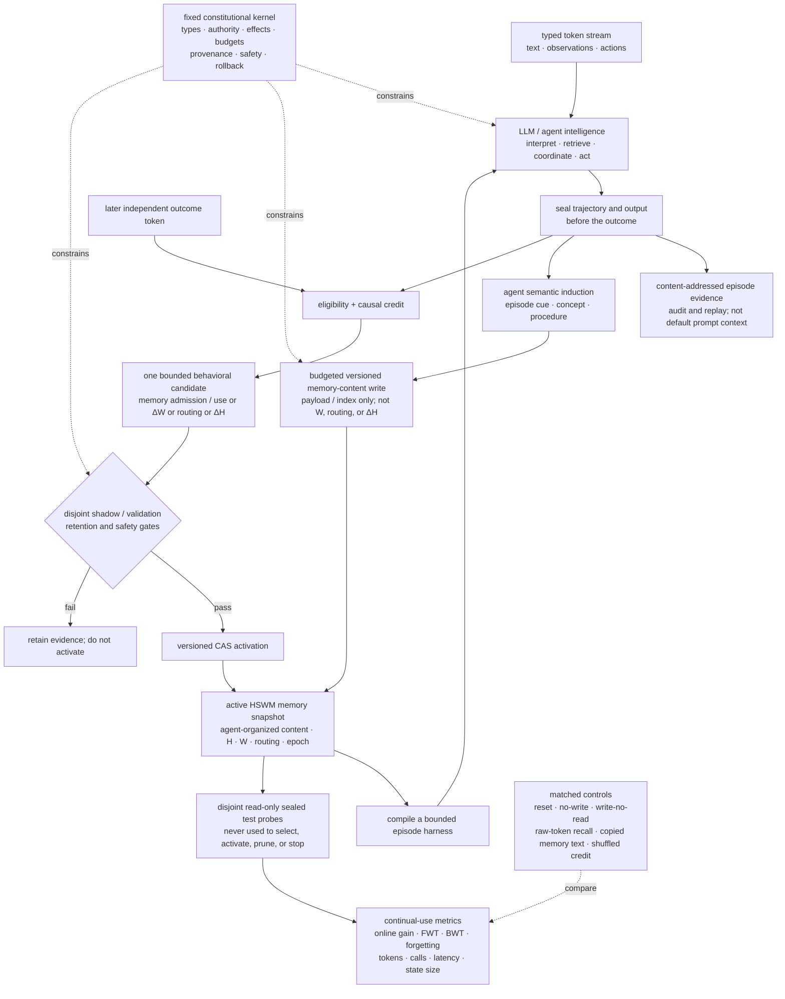

# HSWM — Hypergraph Semantic Weight Map

**A research program for turning the fixed harness around LLMs into a persistent,
learnable macro-network.** A tokenized experience stream is the learning input;
the pretrained agent supplies the intelligence that interprets it. HSWM is the
internal memory and plastic coordination substrate that persists what those
LLM-executed functions induce, then uses it to select context, tools, memory,
communication, verification, recovery, and stopping. Its target is to learn
durable semantic weights, routing, and eventually topology while it is used,
instead of importing a legacy rulebook or accumulating more hand-written
workflow rules.

> **Research status:** HSWM is not yet that complete system. This repository
> contains a tested world/evidence substrate, deterministic field and runtime
> components, narrow measured results, and several failed or unfinished
> plasticity experiments. It does not yet include an integrated, scaled
> macro-training runtime. No checked-in run has yet produced a
> `CAUSALLY_VALIDATED` outcome → credit → durable `ΔW/ΔH` → changed-behavior
> result.

<p align="center">
  
</p>

<p align="center"><em>Conceptual illustration of a living semantic-weight field—not an architecture diagram or experimental result.</em></p>

> **Target intuition:** an input activates a trajectory through the field. An
> independently measured outcome may validate a bounded durable update. Only an
> activated update conditions later behavior.

## Why HSWM

Modern agent systems commonly coordinate models, tools, memories, and roles with
prompt rules, routers, workflow graphs, and exception handling. As their number
of combinations grows, the coordination layer can consume more effort and model
context than the task itself.

### The transformer-training analogy

HSWM starts from an analogy, not an equivalence. Rule-heavy AI systems shifted
toward transformer networks whose behavior is shaped by data instead of an
enumerated rulebook. HSWM applies that move one level above the foundation
model: it is intended to turn AI token, action, tool-use, and outcome
trajectories into the implicit coordination of a larger multi-agent neural
system. “Macro-training” therefore means training the persistent coordination
state among LLM-executed functions; it does not require changing the foundation
model's internal parameters.

| transformer training | HSWM macro-training |
|---|---|
| training stream | typed tokens: text, tool observations, actions, and later outcomes |
| learned parameters | agent-organized memory content, durable `W`, routing policy, and `H` topology |
| objective and optimizer | external outcome, eligibility, causal credit, and bounded update |
| forward pass | recurrent activation across LLM function cells |
| held-out validation | fresh/equal-budget evaluation and removal ablation |

The distinction matters: placing tokens in a transformer's context window does
not train it. Likewise, pouring tokens into HSWM supplies candidate training
observations, not learned rules by itself. Use and learning must close one loop:
LLM functions use the current field during execution, while their sealed
decision trajectories, independently measured outcomes, eligibility, and
causal credit drive bounded update proposals to its macro-state. A credible
integrated macro-training claim therefore requires a learning curve over
diverse held-out episodes—not isolated post-hoc edits. The needed data, compute,
and stability regime remains an open empirical question. A learning claim
becomes valid only when an outcome-bound update survives fresh tests and its
effect disappears when the update is removed.

This repository calls that hypothesized failure mode **LX3 Ragnarok**: stronger
models spend an increasing share of their reasoning budget interpreting and
obeying a growing static harness. HSWM's research bet is that successful and
failed trajectories can instead supply evidence for bounded semantic-weight,
routing, and connectivity candidates; only independently validated candidates
become persistent. This is a direction under test, not a demonstrated
uniqueness or production claim.

### HSWM as a learning harness

A conventional harness fixes which model function, tool, memory, or verifier
runs; what context it receives; in what order or coalition it runs; and how
handoff, failure, retry, and stopping work. HSWM treats that cognitive
coordination as learnable macro-state. The harness used for one episode is a
bounded policy projected from current memory content, `H`, `W`, and routing
state. HSWM is the larger persistent runtime and learner that executes that projection,
observes outcomes, assigns credit, and validates changes to later projections.

The external learning payload is a stream of typed tokens. The pretrained
agent supplies the semantic intelligence that interprets those tokens and
induces episodic memories, concepts, relations, procedures, and coordination
candidates inside HSWM. No legacy rulebook, historical repository document, or
pre-built memory graph is imported as hidden learned state. In particular,
[`_research/root_compat/`](_research/root_compat/) exists only to replay old
software paths; it is never an HSWM memory corpus. Raw tokens may be retained as
content-addressed evidence, but they are not the default future prompt. Useful
internal memory is the agent-generated organization that changes what later
episodes can retrieve or do.

| learned cognitive wiring | fixed constitutional boundary |
|---|---|
| function, tool, memory, and verifier admission | port schemas and capability authority |
| typed context and read-set selection | external-effect approval and transactions |
| ordering, parallelism, handoff, retry, recovery, and stop | idempotency, retry ceilings, and budgets |
| contextual trust, cost, inhibition, routing, and coalition | provenance, safety gates, and rollback |
| eventually, validated relation and topology changes | independent outcome ownership |

The system may learn **which** verifier or recovery path to invoke, but not
rewrite the validity criterion or grant itself authority. If hand-written rules
continue to decide the cognitive path while HSWM only logs or retrieves tokens,
the result is still a static harness with memory.

The preserved user direction and its evidence boundary are recorded in
[`USER_PRIMARY_HSWM_TOKEN_LEARNING_RAGNAROK_2026-08-14.md`](docs/canon/USER_PRIMARY_HSWM_TOKEN_LEARNING_RAGNAROK_2026-08-14.md).

## One field, four coupled views

The target state is:

```math
\mathrm{HSWM}_t = (H_t, W_t, A_t, \{f_i^t\}),
\qquad
f_i^t = \mathrm{LLM}(\rho_i, x_i^t, a_{\mathcal N(i)}^t)
```

| view | role |
|---|---|
| `H` | mutable hypergraph topology: the n-ary relations that determine what can interact |
| `W` | durable slow semantic coupling plus run-local fast/query potential; fast activation alone is not learning |
| `A` | volatile current activation; persistence belongs to durable `H/W` and certified snapshots |
| `f_i` | a local semantic function executed by an LLM under a typed port/role contract |

`A`: recurrent run-local activation and working state. It is deliberately
volatile; durable `H/W` and certified snapshots carry persistence across runs.

These are coupled views, not four rigid floors. An HSWM may contain and compose
smaller HSWMs through the same ports and connectors; the architecture is meant
to remain open and self-similar rather than acquire a new fixed layer for every
new capability. See the
[`open self-similar kernel`](docs/canon/SPEC_OPEN_SELF_SIMILAR_HSWM_2026-07-22.md).

Foundation-model parameters are the **micro-weights inside** each `f_i`. HSWM's
`W` and `H` are **macro-weights and connectivity between** those functions. The
target is therefore not “an LLM plus an external memory” or a conventional
multi-agent wrapper: the whole persistent function field is the neural system.

One foundation model may execute many logical cells. Cell identity comes from
role, ports, local state, position, and authority—not from requiring a separate
model checkpoint per cell.

The hero image compresses the idea into one continuous field disturbed by a
single activation trajectory. It is deliberately a mental image, not a
one-to-one rendering of discrete hypergraph incidence or a learning claim.

## Target token-to-memory architecture

This is the target architecture, not a diagram of a completed implementation.
Everything learnable enters as tokenized experience; the foundation agent is
the induction engine, and HSWM is the persistent memory and coordination
substrate. Observation memory can be recorded from a sealed token trajectory,
while a claim that memory improved behavior still requires independent later
measurement. “Memory content” below is operational payload inside a versioned
HSWM snapshot, not a new canonical state coordinate and not the mount-set `M`
of the open self-similar kernel.



The two write paths are deliberately different. Typed tokens alone can become
agent-organized episodic, semantic, or procedural memory content under fixed
provenance, size, and safety limits. An outcome is not required for memory to
form. Such a write may add payload records and non-coordination indexes, but it
cannot alter `W`, routing, or the incidence/coordination topology denoted by
`ΔH`; content-store indexes are not coordination hyperedges. Outcome-bound
changes to semantic weight, routing, or topology use a separate
causal-credit and validation path. Neither path imports a hand-authored answer.
Raw episode evidence stays available for audit and exact replay, but replaying
that text into the LLM is a separate baseline, not the default HSWM
mechanism. Final test probes are never exposed to candidate generation,
selection, activation, pruning, or early stopping. The fixed kernel can reject
unsafe effects but does not prescribe the cognitive route.

## What counts as learning

Putting more tokens in a database is storage. Reinjecting them is retrieval. A
sealed observation can become agent-organized episodic memory without an
external reward, but that alone does not show useful learning. Editing a prompt
rule is a useful baseline. HSWM counts a behavioral change as learned only when
it closes a causal loop:

```text
token / action / tool trajectory
  → sealed run-local activation
  → external outcome
  → eligibility and causal credit
  → bounded memory-use / ΔW / routing / ΔH candidate
  → fresh, retention, and canary evaluation
  → atomic activation in a new durable snapshot
  → changed future behavior
  → removal ablation that removes the effect
```

The executable receipt contract
[`token_learning_contract.py`](src/hswm/learning/token_learning_contract.py)
distinguishes `OBSERVED_ONLY`, `DURABLE_UPDATE`, and `CAUSALLY_VALIDATED`, and
hash-binds a claimed causal-test receipt. The replay, equal-budget, and removal
tests named by that receipt remain a separate evidence boundary; the current
contract does not inspect their scientific contents.

## Continual use is the primary test

One causally valid point update and continual learning are different claims.
The main HSWM question is not whether an agent can look intelligent once. It is:

> With the foundation model, tools, information, and budgets fixed, does the
> same persistent HSWM become more useful across an ordered stream of unseen
> episodes because its agent-induced internal memory accumulates—and does it do
> so without unacceptable forgetting, interference, or state and inference
> growth?

At checkpoint `t`, let `R(t, j)` be the utility of active snapshot `S_t` on a
sealed, read-only probe from task family `j`, measured before the next learning
update. The primary endpoint should be preregistered over a finite horizon as
the sum or area under paired per-instance gain plus a final-window gain. Raw
within-arm slope is descriptive, neither necessary nor sufficient: heterogeneous
difficulty, early plateaus, path dependence, a growing prompt, or curriculum
drift can all distort it. Task-family utilities are either reported separately
or combined only with a normalization fixed before the run.

Following the paired logic of Continual Learning Bench, per-episode learning
gain is `g_t = reward_stateful(t) - reward_stateless(t)` for the same agent on
the same item. This controls for item-level base capability of the same model
and system under reset state. That is the primary continual-use comparison.
HSWM-specific attribution additionally preregisters one stateful alternative,
normally agent-generated textual workflow/memory-copy, as a co-primary control;
the remaining controls are multiplicity-adjusted diagnostics. Otherwise
persistence helped, but the HSWM organization was not shown to be the reason.

| mechanism | what a later episode receives | interpretation |
|---|---|---|
| raw token replay | selected old transcript or RAG chunks in the prompt | strong in-context memory baseline |
| agent-generated textual memory | self-written lesson, workflow, playbook, or skill text in the prompt | continual context adaptation baseline |
| HSWM internal-state mediation | the same external task prompt; only active internal memory content, `H/W`, and routing differ, and any memory packet is selected by HSWM under the same budget | primary HSWM hypothesis |

The first two mechanisms can be useful products and valid continual-use effects,
but they do not by themselves demonstrate HSWM's internal macro-state claim.

| claim | minimum falsification-oriented measurement |
|---|---|
| experience improves later behavior | test-then-update stream; sealed-unseen prequential curve, final-window gain, adaptation speed, and peak-to-final regression |
| the effect is HSWM memory, not base-agent ability | matched reset/static, no-write, write-no-read, raw-token recall, full-context/RAG, memory-copy, and agent-generated textual lesson/workflow arms |
| credit or selection is meaningful | correct-credit/selective-use arm beats equal-size shuffled-credit, random-update, and append-everything controls |
| old capabilities survive | repeated probe matrix with average performance, backward transfer (`BWT`), worst-family forgetting, and safety canaries |
| useful structure transfers | forward transfer (`FWT`) to held-out related families; unrelated families serve as negative controls |
| durable HSWM state mediates the gain | process restart preserves its hash and effect; targeted removal erases the gain and exact restoration returns it |
| improvement scales economically | report active-state bytes, retrieved tokens, model/tool calls, latency, commit/replay cost, and failure rate beside utility |

Every arm starts with empty HSWM memory and the same fixed kernel and foundation
agent; no seed workflow, legacy document, or historical repository corpus is
loaded into the learner. Task-family order must be counterbalanced with both
helpful and interfering histories. Final read-only test probes never update
memory and never participate in candidate selection, activation, pruning, or
stopping. The statistical unit is an independent stream/order seed, not each
episode inside one correlated stream. The no-write arm still pays the cost of
proposing and checking an update before discarding it, and curves are plotted
against both episodes and cumulative token/tool cost. Success means a
preregistered finite-horizon gain over controls with acceptable retention and
bounded resources; plateaus and negative results are valid.

Improvement only after feedback on the same item is within-episode correction,
not continual learning, and retries of that item stay outside the primary
endpoint. Improvement that vanishes under order counterbalancing is curriculum
or drift confounding. If raw recall ties HSWM, the result is a memory-context
effect; if removal does not erase the gain, active HSWM state is not the
demonstrated cause.

### Primary research anchors

These papers make agent-induced memory and continual-use improvement plausible,
but none is evidence that HSWM works. They define strong baselines and failure
modes that an HSWM experiment must beat.

<details>
<summary>Primary papers reviewed through 2026-08-16</summary>

| primary source | result relevant to HSWM | consequence for the test |
|---|---|---|
| [Gradient Episodic Memory (NIPS 2017)](https://proceedings.neurips.cc/paper/2017/hash/f87522788a2be2d171666752f97ddebb-Abstract.html) | formalizes repeated task-by-time evaluation, average accuracy, `BWT`, and `FWT` | measure a probe matrix and forgetting, not only final success |
| [StreamBench (NeurIPS 2024)](https://proceedings.neurips.cc/paper_files/paper/2024/hash/c189915371c4474fe9789be3728113fc-Abstract-Datasets_and_Benchmarks_Track.html) | reports online cumulative gains from retrieving correct prior trajectories | use it as a raw-replay baseline and add separate sealed probes |
| [Voyager (TMLR 2024)](https://arxiv.org/abs/2305.16291) | an agent without foundation-model parameter updates self-generates a persistent skill library from environment feedback and transfers it to a new world | compare self-generated skill memory and test removal/transfer while matching its strong runtime scaffold and cost |
| [ExpeL (AAAI 2024)](https://ojs.aaai.org/index.php/AAAI/article/view/29936) | an agent without foundation-model parameter updates extracts natural-language insights from accumulated experience | direct token-to-agent-induced-memory baseline |
| [CLIN (COLM 2024)](https://openreview.net/forum?id=xS6zx1aBI9) | repeatedly refines persistent causal abstractions without parameter updates | positive task-bounded example for continual memory without foundation-model parameter updates, not for HSWM |
| [Agent Workflow Memory (ICML 2025)](https://proceedings.mlr.press/v267/wang25bx.html) | induces reusable workflows online and offline from trajectories | a direct online learned-harness baseline; match induction/evaluator cost and rerun counterbalanced orders |
| [ReasoningBank (ICLR 2026)](https://openreview.net/forum?id=jL7fwchScm) | self-curates reusable strategies from both success and failure | compare HSWM with agent-generated strategy memory, not only raw logs |
| [Agentic Context Engineering (ICLR 2026)](https://arxiv.org/abs/2510.04618) | incrementally curates a self-written external playbook instead of repeatedly rewriting all context | compare against evolving text memory and monitor context/consolidation collapse |
| [MemoryBench (ICML 2026)](https://openreview.net/forum?id=If4X4W2HWx) | repeatedly updates memory from interaction blocks and reevaluates a held-out set; advanced systems do not consistently beat simple RAG | reuse checkpointed held-out evaluation and keep RAG as a serious baseline |
| [LifelongAgentBench (2025 preprint)](https://arxiv.org/abs/2505.11942) | uses strict sequential, skill-dependent interactive tasks and finds ordinary replay can be limited by irrelevant context | preserve task order and include raw-replay controls |
| [Continual Learning Bench (2026 preprint)](https://arxiv.org/abs/2606.05661) | isolates gain over base capability in stateful real-world streams; dedicated memory systems can underperform naive in-context learning | memory machinery must beat a strong simple-context baseline |
| [When Continual Learning Moves to Memory (2026 preprint)](https://arxiv.org/abs/2604.27003) | shows stability-plasticity reappears as retrieval interference; abstract procedures can transfer better than detailed trajectories | test representation, retrieval pollution, hard-case negative transfer, and forgetting |
| [Useful Memories Become Faulty When Continuously Updated (2026 preprint)](https://arxiv.org/abs/2605.12978) | finds that repeated textual consolidation can reverse early gains and fall below no-memory performance | preserve raw evidence, validate immutable candidates, and report peak-to-final regression and rollback |
| [PATH-Bench (2026 preprint)](https://arxiv.org/abs/2608.01149) | controlled helpful/interfering histories show transfer does not guarantee retention | counterbalance experience paths and repeatedly revisit probes |
| [Scaling Teams or Scaling Time? (2026 preprint)](https://arxiv.org/abs/2604.03295) | performance is non-monotonic in team size, while the proposed memory design improves long-horizon results and reduces cost | sweep experience time, coordination size, and cost jointly |

</details>

## Current implementation gap and first slices

The current tree has reusable but disconnected pieces: a one-cell event runtime
and focused durable call replay, a fixed typed `QF → BF → AF` workflow,
content-addressed typed receipt contracts, one bounded scalar P1
outcome/eligibility/update loop, immutable snapshots and epoch CAS, structural
composition, and separate evaluation mechanisms. It has no general live
token/cell trainer that joins an episode-wide recurrent scheduler, a replayable
decision dataset, live outcome adapters, general causal credit, and one atomic
active bundle for memory content, `W`, routing, and later `H`. P1 ran its
engineering path end to end, but activated no candidate and produced zero
measured top-10 order or membership changes across 456 diagnostic cells; it
remains scientific RED.

The committed next component experiment remains the parity-controlled typed
text-lesson baseline. It is a precursor and comparison arm, not a substitute
for the empty-memory continual-use protocol above. Separately, one candidate
engineering track for the integrated harness is to freeze the LLM, tools, cell
registry, and topology and learn only a small routing policy in a task with
genuine coordination headroom. It must not reuse the
[rejected B2.1 `A/B/MERGED` action space](prom_search_hswm/docs/B21_LEARNED_ROUTER_RESULTS_2026-07-23.md).
Each decision record would seal the available actions, chosen action and
probability, state/context references, used edges, and cost before the outcome.
An independent outcome adapter and credit learner would propose one bounded
routing update; shadow/fresh/retention/canary tests would precede a versioned
CAS commit, and post-activation removal/restore would test causal mediation.
This is a secondary engineering proposal, not a measured result or a
replacement for the existing commitment.

The target integrated design separates four explicit clocks:

| clock | durable-state rule | permitted durable result |
|---|---|---|
| activation | memory content, `H/W`, and routing frozen for the episode | sealed decision trajectory only |
| memory induction | `W`, routing, and coordination topology unchanged after the seal | one bounded versioned memory-content write |
| plasticity | coordination topology frozen while outcome credit is evaluated | one validated memory-use, fast-routing, or `W` candidate |
| consolidation / morphogenesis | changed only at a later episode boundary | repeated effects promoted to slow `W`, then one bounded `H` mutation class |

Within that candidate track, scalar `W` actuation and then topology would be
separate later experiments. Jointly changing weights, routing, and topology
would make both credit assignment and failure diagnosis underdetermined.

For scale, raw tokens can remain content-addressed episode evidence while the
agent organizes bounded active spans, decisions, relations, and procedures.
Making every token a permanent graph node is not sufficient: without selective
induction and later-use measurement it is only a large log. A scalable loop also
needs bounded active state, deduplication, trajectory sampling/replay,
homeostasis or pruning, versioned snapshots, and deterministic commit order.

## Topology and sheaf: core versus research lens

Topology is central in the concrete sense of mutable hypergraph connectivity:
HSWM must eventually learn not only bond strength but also which relations and
coalitions should exist. This does not require importing all of topological
geometry into the runtime.

Sheaf theory is an optional research lens for heterogeneous local states. A
stalk can model a cell's local state space, a restriction map can model transport
through a typed port, and seam residuals can expose where local outputs fail to
fit together. In HSWM, that residual should begin as an **observation feature**,
not a hard-coded truth test, forced consensus rule, or efficacy claim:

```text
local states → port transports → seam residuals
             → observation tokens → outcome-bound H/W/routing learning
```

The definitions, sources, caveats, and machine-readable ontology are in
[`ontology/field/sheaf/README.md`](ontology/field/sheaf/README.md)
and [`ontology/field/sheaf/HSWM_SHEAF_ONTOLOGY.v1.json`](ontology/field/sheaf/HSWM_SHEAF_ONTOLOGY.v1.json).

## Current evidence boundary

Repository state as of 2026-08-16:

| area | honest status |
|---|---|
| evidence-preserving world compiler, stable IDs, immutable cuts, and fail-closed readout | implemented and locally tested |
| static additive semantic field | narrow positive checked-in retrieval measurement with an asymmetric budget: 100 offline LLM judgments for HSWM and zero for cosine/BM25/PPR/RRF; not continual learning |
| scalar slow-weight P1 | **scientific RED**: 12 staged candidates, 0 fresh-gate passes/activations, and 0/456 measured top-10 rank changes |
| typed-policy P1v3/P1v4 | narrow local `n=6` L0 observation; not durable `ΔW`, transfer, or topology learning |
| token-driven durable macro-learning | trajectory/eligibility/activation receipt binding implemented; no integrated causal optimizer or causally validated macro-update demonstrated |
| agent-induced token-to-memory architecture | target only; no integrated runtime yet turns an initially empty HSWM into validated internal memory through continued use |
| continual-use macro-learning and scale | no preregistered sequential learning curve, retention/forgetting result, or controlled scaling result demonstrated |
| cross-agent transfer, learned topology, and consolidation | incomplete or unmeasured |

Tests establish implementation and invariant closure, not intelligence or
production readiness. Numerical claims, negative results, budgets, and exact
reproduction boundaries live in [`EFFICACY.md`](EFFICACY.md).

## Quick start

Requirements: Python 3.11+ and [`uv`](https://docs.astral.sh/uv/).

```bash
git clone https://github.com/gj3447/HSWM.git
cd HSWM
uv sync --locked --extra dev
uv run --locked --extra dev pytest -q
uv run --locked hswm-verify-efficacy --pretty
```

The default suite uses checked-in fixtures and does not require a live model,
Neo4j, or an external benchmark corpus. GPU/LLM experiments and real-KG runs are
a separate, explicitly configured boundary; source-tree tests do not substitute
for their runtime receipts. `hswm-verify-efficacy` validates checkout-bound
evidence; when invoked from an installed wheel outside that checkout, pass
`--root /path/to/HSWM` explicitly.

## Read next

| question | document |
|---|---|
| How do the fragmented identity, mathematics, runtime, learning, and evidence meanings fit together? | [`HSWM unified meaning map`](docs/research/HSWM_UNIFIED_MEANING_MAP_2026-08-16.md) |
| Why replace static agent glue, and what is token learning? | [`USER_PRIMARY_HSWM_TOKEN_LEARNING_RAGNAROK_2026-08-14.md`](docs/canon/USER_PRIMARY_HSWM_TOKEN_LEARNING_RAGNAROK_2026-08-14.md) |
| What exactly are `H`, `W`, `A`, and the LLM functions? | [`HSWM_LLM_FUNCTION_NETWORK_ARCHITECTURE_AND_FEASIBILITY_2026-07-23.md`](docs/canon/HSWM_LLM_FUNCTION_NETWORK_ARCHITECTURE_AND_FEASIBILITY_2026-07-23.md) |
| What should the harness learn, and what must remain deterministic? | [`DEFINITION_HSWM_PLASTIC_COGNITIVE_WIRING_2026-07-29.md`](docs/canon/DEFINITION_HSWM_PLASTIC_COGNITIVE_WIRING_2026-07-29.md) |
| What is implemented, rejected, or still open? | [`EFFICACY.md`](EFFICACY.md) |
| What is the broader world-memory purpose? | [`THE_WORLD_REMEMBERS.md`](docs/canon/THE_WORLD_REMEMBERS.md) |
| Where is the full research chronology? | [`INDEX.md`](INDEX.md) |
| How is the whole repository organized by meaning? | [`ontology/`](ontology/) |
| Where did the root-era compatibility sources move? | [`_research/ROOT_COMPATIBILITY.md`](_research/ROOT_COMPATIBILITY.md) |
| How might sheaf theory help without becoming another static harness? | [`ontology/field/sheaf/`](ontology/field/sheaf/) |

## Repository map

| path | purpose |
|---|---|
| `ontology/` | canonical semantic navigation, concept relations, and path-bound history |
| `src/hswm/` | canonical package surface, organized by semantic responsibility |
| `src/hswm/cells/` | cellular kernel, durable store, model ports, and bounded live probe |
| `src/hswm/prototypes/` | bounded early learning and synthetic-world prototypes |
| `src/hswm/substrate/` | canonical hypergraph, document/world construction, immutable field cuts, certified readout, and convergence substrate |
| `src/hswm/learning/` | token-learning contracts and learning diagnostics |
| `src/hswm/evaluation/`, `_research/` | falsification code and source-only experiment programs |
| `_research/root_compat/` | source-pinned root-era compatibility cluster; closed to new work |
| `_research/root_compat/world_ir.py`, `_research/root_compat/world_compiler.py` | flat compatibility modules for the immutable evidence model and deterministic world compilation |
| `src/hswm/substrate/doc_builder.py`, `src/hswm/substrate/world_builder.py` | deterministic document and corpus hypergraph construction |
| `src/hswm/substrate/field_snapshot.py`, `src/hswm/substrate/certified_readout.py` | certified field cuts and exact-scope admission |
| `_research/root_compat/hswm_weight_store.py`, `src/hswm/learning/token_learning_contract.py` | flat durable-weight compatibility source and the canonical causal-learning evidence boundary |
| `prom_search_hswm/` | open composition, field algebra, retrieval, routing, and plasticity experiments |
| `tests/`, `_research/shared_field_hypothesis/` | core regression and fail-closed research contracts |
| `research/`, `schemas/`, `scripts/` | machine-readable contracts, schemas, and validators |
| `evidence/`, `prereg/`, `manifests/`, `results/`, `receipts/` | typed research artifacts and direct measurements |
| `docs/research/`, `docs/assets/` | narrative research material and public visual assets |

The repository root now contains only public entry files. The 93 files in the
final root-era compatibility set moved together to
[`_research/root_compat/`](_research/root_compat/) so their flat imports and
same-directory references remain intact without occupying the public root. The
set is closed to new work; its reasons are frozen in
[`ROOT_COMPATIBILITY_BASELINE.v1.json`](ontology/history/ROOT_COMPATIBILITY_BASELINE.v1.json),
and its canonical destinations are source-pinned by the final
[`Python`](ontology/history/PYTHON_ROOT_MIGRATIONS.FINAL.v2.json) and
[`asset`](ontology/history/ROOT_ASSET_MIGRATIONS.FINAL.v1.json) migration
manifests. New code belongs under `src/hswm/`; documents and artifacts follow
the typed directories in
[`ARTIFACT_LAYOUT.md`](docs/research/ARTIFACT_LAYOUT.md).

Published historical paths that genuinely require exact replay remain covered
by the additive migration manifests described in
[`ontology/history/`](ontology/history/README.md). Ordinary files absent from the
baseline's `paths` array move through standard Git history. The compatibility
cluster preserves current sibling-dependent imports and references; exact
root-era commands still run only through detached replay. The repository
ontology remains a semantic map, not a checked-in inventory of every path.

Old commands are reproduced in their original root layout without restoring
those files into the active checkout:

```bash
uv run hswm-legacy-replay verify f3_agent_ab_transfer_r3.py
uv run hswm-legacy-replay materialize \
  f3_agent_ab_transfer_r3.py /tmp/hswm-f3-r3-replay
cd /tmp/hswm-f3-r3-replay
uv run python f3_agent_ab_transfer_r3.py --smoke
```

The materializer creates a clean detached standalone clone at the manifest's
exact source commit, verifies every bound source SHA-256, and writes its receipt
inside `.git/`; it never writes an old path into this working tree. Git-tracked
code and paths are reproduced exactly. External datasets, model services, and
ignored caches remain separate evidence dependencies and are not invented by
the materializer.

## Method and contribution boundary

The maintainer research workflow is intentionally short:

```text
implement or run → measure directly → emit one receipt for a material result
                 → commit and push
```

Current claims rely only on checked-in direct measurements and reproducible
tests. The active bounded policy is
[`research/HSWM_MINIMAL_GOVERNANCE.v1.json`](research/HSWM_MINIMAL_GOVERNANCE.v1.json).

Contributions are welcome through [`CONTRIBUTING.md`](CONTRIBUTING.md) and require
the contributor agreement in [`CLA.md`](CLA.md).

## License

Dual-licensed under AGPL-3.0-or-later or a separate commercial license. See
[`LICENSING.md`](LICENSING.md) and [`LICENSE`](LICENSE).
