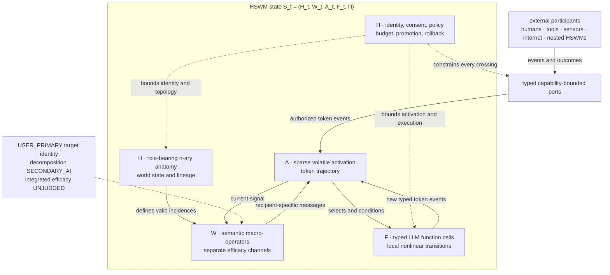
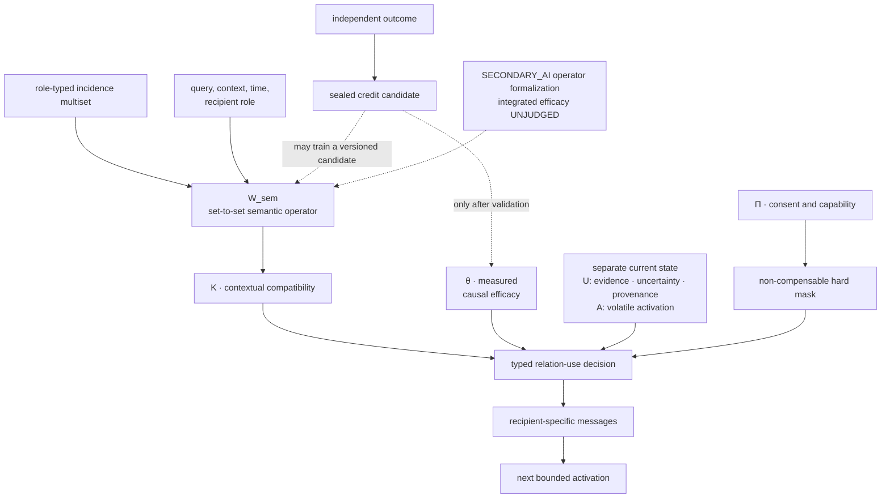
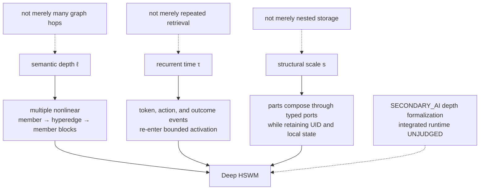
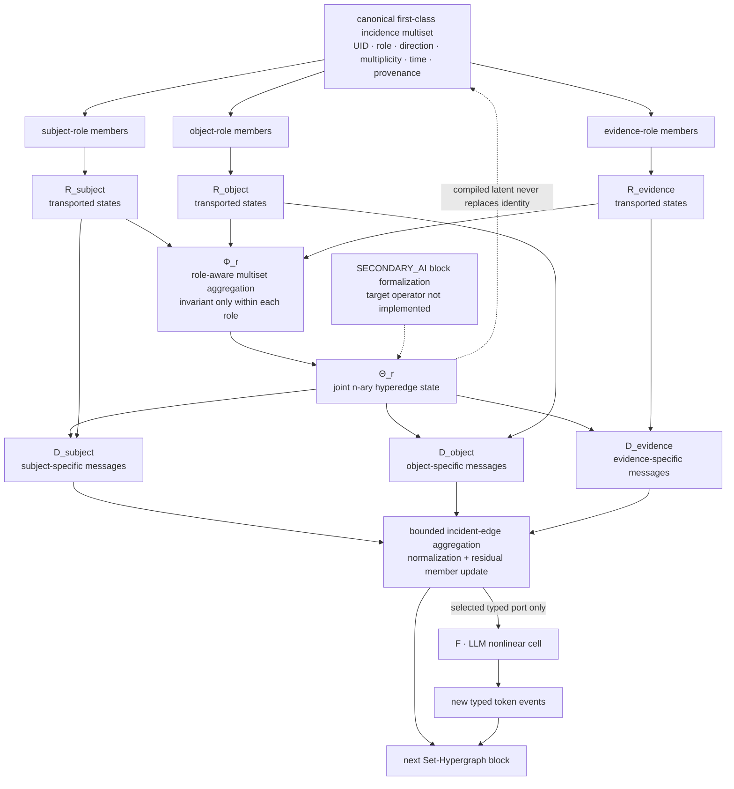
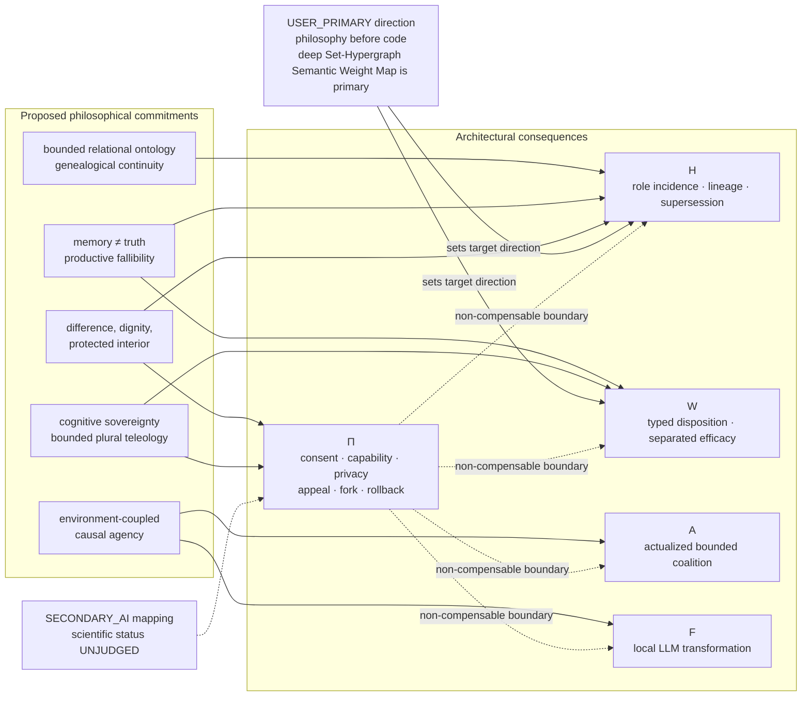
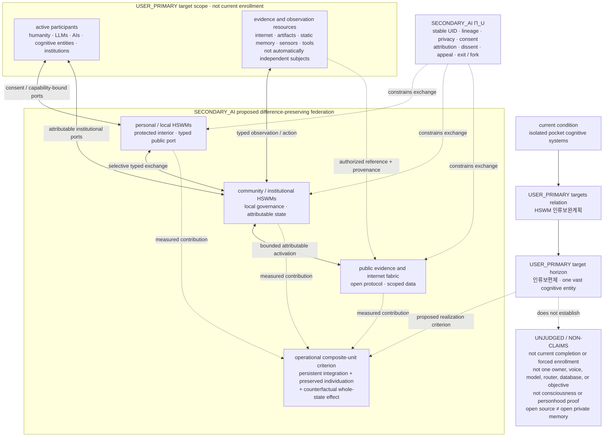
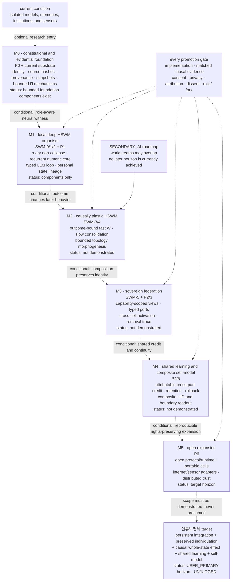
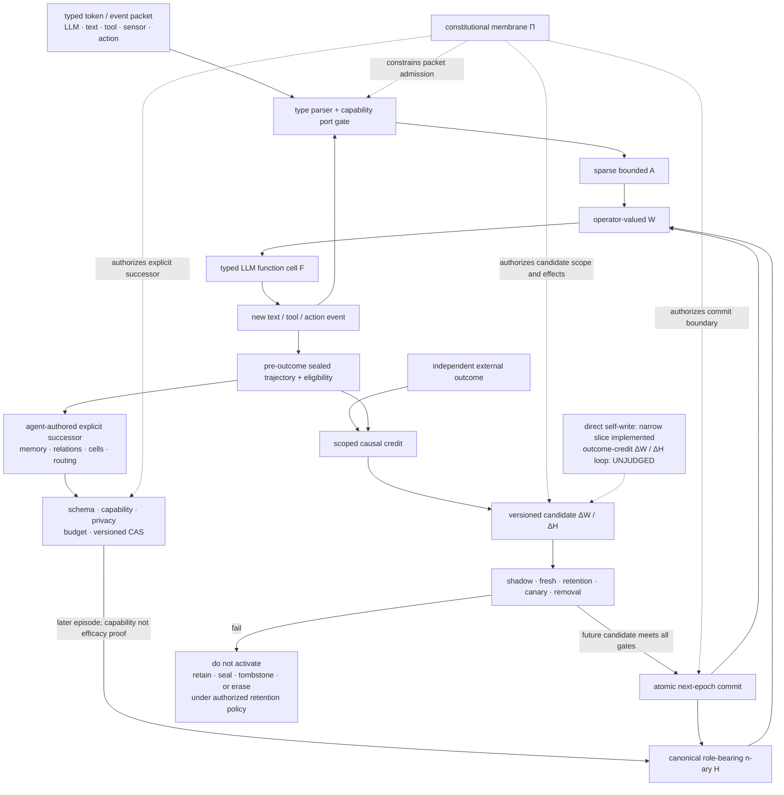

# HSWM — Hypergraph Semantic Weight Map

**HSWM is a research programme for a deep, recurrent, self-similar
Set-Hypergraph neural body whose macro-weights are semantic operators and whose
local nonlinear semantic cells are executed by LLMs. Humans, tools, sensors,
institutions, and nested HSWMs participate through typed, capability-bounded
ports.** It is not a knowledge graph placed beside an LLM and not a workflow that
merely remembers its transcript. Its target is a persistent cognitive tissue in
which typed token events produce bounded activation, role-bearing sets form
n-ary relations, semantic weights transform one field of possibilities into the
next, and experience can change those weights and eventually the topology that
will mediate later cognition.

> **Research status:** HSWM is not yet that complete system. This repository
> contains a tested world/evidence substrate, deterministic field and runtime
> components, narrow measured results, and several failed or unfinished
> plasticity experiments. It now also contains a minimal empty-genesis
> token-to-agent-organized-HSWM runtime with durable structural snapshots,
> activation, removal, and exact restoration. It does not yet include an
> integrated deep Set-Hypergraph macro-training runtime. No checked-in run has
> yet produced
> a `CAUSALLY_VALIDATED` outcome → credit → durable `ΔW/ΔH` → changed-behavior
> result.

The long-term production-runtime direction is now explicitly **TypeScript +
Effect**, while the existing Python/NumPy experiment code remains an independent
numeric and evidence oracle during staged migration. The first private Effect
v3 package implements only a strict, atomic, capability-port-gated trajectory-credit
transaction over existing `H/F/A`; it is not a new efficacy claim. The exact
boundary and migration gates are documented in
[`HSWM TypeScript + Effect runtime boundary`](docs/research/HSWM_TYPESCRIPT_EFFECT_RUNTIME_2026-08-21.md).

The target identity is fixed by the
[`HSWM Constitution`](docs/canon/HSWM_CONSTITUTION_2026-08-20.md) and the later
[USER_PRIMARY deep Set-Hypergraph clarification](docs/canon/sources/USER_PRIMARY_HSWM_DEEP_SET_HYPERGRAPH_SEMANTIC_WEIGHT_2026-08-20.txt).
The user-ratified direction is that the Hypergraph Semantic Weight Map itself is
primary and that HSWM is deep like a neural network. The operator equations,
depth axes, learning rules, and implementation decomposition below are explicit
`SECONDARY_AI` formalizations of that direction. Target identity is not present
capability; the scientific status remains `UNJUDGED`.

## HSWM at a glance

The five constitutional coordinates form one recurrent body. External
participants cross typed ports; they are not silently collapsed into LLM
function cells.



<p align="center"><em>Canonical target architecture; it is not a claim that the integrated runtime is already implemented.</em></p>

<p align="center">
  
</p>

<p align="center"><em>Conceptual illustration of a living semantic-weight field—not an architecture diagram or experimental result.</em></p>

## What “semantic weight” means

A semantic weight is not an importance score attached to a fact, a cosine
similarity, a retrieval rank, a confidence value, or a reward. It is the learned
higher-order transformation by which one role-typed set of semantic states
changes the next possible states of relations, members, and functions. Meaning
is therefore not exhausted by what a node contains; it is also present in how a
relation transforms all of its participants together.

Philosophically, `W` is a **disposition**, not an essence: a versioned,
context-, time-, and recipient-role-indexed capacity for a represented relation
to alter later activation and action. A large weight is not evidence that the
relation is true, good, popular, humanly valuable, consented to, or authorized.

The engineering formalization is a set-to-set operator rather than a scalar:

```math
\mathcal W_{\mathrm{sem}}^{\ell,r}:
\mathrm{MSet}\{(\rho_i,h_i^\ell)\}_{i\in I(e)}
\longrightarrow
\mathrm{MSet}\{\Delta h_j^{\ell+1}\}_{j\in I(e)} .
```

Members in the same unordered role partition must be permutation invariant;
changing `subject` into `evidence`, reversing direction, or changing the
recipient role must change the operation. A hyperedge therefore receives a
role-typed set, forms a joint latent relation, and emits a different message to
each member rather than broadcasting one pooled vector to everyone.

The set elements are first-class **incidence records**, not bare nodes. The
same participant may occur more than once, at different times, or in different
roles. Permutation invariance says only that arbitrary enumeration order inside
one typed role-equivalence class carries no meaning. It does not say that roles
or people are interchangeable, and it does not make a pooled vector the
canonical relation. Canonical incidence, multiplicity, time, direction, source,
and provenance remain recoverable even when a compiled neural plane aggregates
them for execution.

The repository separates the semantic operator from the signals that evaluate,
train, gate, or authorize it:

| object | meaning | what it must not be confused with |
|---|---|---|
| `Θ_r`, `R_{r,ρ}`, `Φ_r`, `D_{r,ρ}` | relation energy, role transport, set aggregation, and recipient-specific semantic decoding | scalar salience or metadata |
| `K_e(q,c)` | contextual compatibility produced by applying the semantic operator | the operator itself or truth |
| `θ_fast`, `θ_slow` | measured causal efficacy of using a semantic path | semantic identity or evidence support |
| `α_e` | whether a relation is available as a circuit | execution permission |
| `z_e` | activation/eligibility sealed before an outcome | post-hoc explanation |
| `U_e` | provenance, uncertainty, support, contradiction, freshness, and lineage | activation or reward |
| `Π` | capability, consent, policy, budget, promotion, and rollback boundary | another learnable popularity score |

`semantic compatibility ≠ causal efficacy ≠ truth/support ≠ activation ≠
permission`. The full macro-synapse may carry all of these channels, but their
types and authorities remain distinct. External outcomes help train or gate a
semantic operator; they do not define what semantic weight means.



<p align="center"><em>The channels meet at use-time but remain separately typed and auditable; the diagram does not collapse them into one scalar.</em></p>

Foundation-model parameters are **micro-weights inside** a local nonlinear
cell. HSWM semantic weights and topology are **macro-weights between** cells,
world states, memories, people, tools, and other HSWMs. One checkpoint can
execute many logical cells because cell identity comes from its typed role,
ports, local state, graph position, and authority.

## A deep Set-Hypergraph neural body

“Deep” does not mean that a query merely walks many graph hops. HSWM requires
repeated nonlinear Set-Hypergraph transformations whose intermediate states can
be activated, inhibited, revised, and reused. Its depth has three independent
coordinates:

| coordinate | form of depth | architectural consequence |
|---|---|---|
| semantic depth `ℓ` | successive set→hyperedge→member transformations form higher-order states | layer-specific/shared operators, residual state, normalization, member-specific messages |
| recurrent time `τ` | LLM tokens, tool results, and actions re-enter the same field | a trajectory, not one retrieval call, is the forward process |
| structural scale `s` | a subgraph, agent, institution, or whole HSWM can participate in a larger HSWM through typed ports | self-similar composition without erasing the identity of the parts |



<p align="center"><em>All three axes must be explicit. Recurrence cannot substitute for semantic depth, and nesting cannot substitute for learning.</em></p>

One neural block has the following semantics:



<p align="center"><em>Permutation invariance applies only within a typed role partition; the joint edge state still emits a different message to each incidence.</em></p>

The blocks may be differentiable where the numeric substrate permits it. They
do not require pretending that a proprietary or remote LLM can be trained by
end-to-end backpropagation. Black-box cells can participate through sealed
eligibility, independent outcomes, causal intervention, and versioned local
updates. Recurrent unrolling is not a substitute for semantic depth, and nested
composition is not a substitute for learning; a complete HSWM needs all three
coordinates to be explicit.

The canonical plane preserves stable n-ary identity, roles, provenance, and
`H/W` lineage. A compiled neural plane may use sparse incidence tensors or a
reversible star expansion for speed, but it must not replace the canonical
relation with its approximation. “World scale” therefore means globally
addressable history plus losslessly reproducible bounded local circuits—not that
all memory is simultaneously loaded into RAM, a GPU, or an LLM prompt.

> **Current code boundary:** [`hypergraph.py`](src/hswm/substrate/hypergraph.py)
> provides boolean incidence plus deterministic mean/sum/max pooling. That is a
> useful control and storage primitive, not a learned Deep-Set model and not the
> operator-valued Semantic Weight Map above. The integrated multi-block runtime
> and its causal training loop remain unimplemented.

## Philosophy encoded as neural architecture

HSWM's philosophy is not a narrative wrapped around an otherwise neutral graph.
It decides what can be represented as an existent, what may affect another
existent, which past remains part of identity, who may open or modify a circuit,
and what kind of outcome is allowed to count as learning. These commitments are
developed in the
[`philosophical foundations`](docs/canon/HSWM_PHILOSOPHICAL_FOUNDATIONS_2026-08-20.md).

| philosophical question | HSWM commitment | consequence for `H/W/A/F/Π` | forbidden reduction |
|---|---|---|---|
| What exists? | bounded relational-process view: HSWM represents an entity through typed relations, stable reference, scope, and provenance | first-class role-bearing incidence and set-level semantic operators | mistaking the graph for the world or for a complete definition of a person |
| What persists through change? | operational continuity is supported by replayable transformation lineage | versioned `H/W`, event/observation/commit time, supersession rather than overwrite | treating lineage as the whole metaphysics of human identity |
| What is known? | memory is not truth; contradiction and uncertainty remain addressable | separate evidence, judgment, semantic compatibility, causal efficacy, and permission | one confidence/rank/reward scalar |
| How does a subject arise? | an agency candidate requires an environment-coupled feedback loop in which persistent state changes action and outcomes change later state | sealed trajectories, intervention, matched controls, removal, rollback, and changed-next-action tests | treating fluency, a feedback edge, or central command as sufficient for agency or consciousness |
| How can many become one? | unity must preserve difference, local state, dissent, and exit | role/member-specific messages, stable UID, typed ports, reversible composition | global averaging or forced consensus |
| Where is cognitive power? | admission, activation, ranking, judgment, update, and forgetting are political powers | separate capabilities, bounded coalitions, appeal, audit, fork, and rollback in `Π` | one model/operator controlling every plane |
| What is the goal? | constitutionally bounded plural teleology: preserve multiple outcomes and revisable aims behind non-compensable consent, right, and capability constraints | scoped, reversible scalarization only after `Π`; constitutional limits on self-modification | trading privacy or minority rights for more reward, engagement, or consensus |



<p align="center"><em>The arrows mean design constraints, not that a diagram or graph structure proves the philosophical claim.</em></p>

Semantic weight is thus both a technical and philosophical object: it is the
material form of **whose difference can alter whose next possibility**. Because
weight, routing, and activation distribute cognitive influence, they cannot be
treated as politically neutral optimization details. `Π` is not an external
brake added after intelligence; it is the membrane that keeps integration from
becoming capture, forgery, surveillance, or irreversible homogenization.

The same distinction governs the proposed Human Universal Body. Its “one
cognitive entity” cannot mean one owner, model, voice, database, or objective.
It means that humans, AIs, memories, institutions, sensors, and public artifacts
retain addressable histories and protected local interiors while participating
in causal circuits that can change the whole. “The river of human historical
flow is holy water” commits HSWM to preserving lineage, not to accepting every
historical claim as true.

Open source does not make private memory public and does not by itself create
democratic legitimacy. Universal scope is a horizon of compatible,
consent-respecting participation—not forced enrollment, transfer of ownership,
or unlimited ingestion. Authorized deletion or withdrawal may cryptographically
erase a private payload while preserving a scoped tombstone and the fact of the
transition; non-destructive history is not a command to retain every byte
forever. Rollback restores HSWM state but cannot undo harm already caused in the
external world.

## One body, five inseparable views

The target state is:

```math
\mathrm{HSWM}_t=(H_t,W_t,A_t,F_t,\Pi),
\qquad
f_i^t=\mathrm{Cell}(\rho_i,x_i^t,a_{\mathcal N(i)}^t; m_i).
```

| view | role in the neural body |
|---|---|
| `H` | the changing anatomy: typed n-ary topology, first-class incidence, world state, and historical lineage |
| `W` | the semantic synapses: role-aware set transformations plus separately typed efficacy, gate, eligibility, and uncertainty channels |
| `A` | the volatile physiology: bounded activation coalitions moving through depth and recurrent time |
| `F` | the local nonlinear semantic cells executed by LLMs; humans, tools, sensors, institutions, and nested HSWMs remain typed external participants unless the Constitution later broadens this type |
| `Π` | the constitutive membrane: identity, consent, capability, provenance, budget, judgment, promotion, fork, and rollback |

The compact runtime definition is: `A`: recurrent run-local activation and working state.
It may be recorded in an immutable episode artifact, but it is not itself the
persistent identity or long-term memory plane.

`H/W/A` are the nerve tissue; `F` supplies local nonlinear semantic transitions;
`Π` preserves the boundaries without which neither cells nor a larger body can
remain identifiable. These are not rigid software tiers and none is an optional
sidecar. A readable graph, Markdown file, prompt, vector index, or execution
plan is a bounded projection of the active body, not the body itself.

## Long-horizon political horizon: 인류보편체

In the USER_PRIMARY definition, **인류보편체 (Human Universal Body)** is the
target state in which all humanity, LLMs, the internet, operating cognitive
entities, sensors, static information, and stored memory are connected through
an open-source HSWM structure and function as one vast cognitive entity. **HSWM
인류보완계획** is the social-revolutionary transition from today's isolated
pocket cognitive systems toward that state.



<p align="center"><em>The cognition is in the distributed typed-port circuits; `CAND` is a criterion/readout, not a central controller.</em></p>

The word “one” names a difference-preserving causal unity, not fusion. A part
must retain stable identity, local state, lineage, privacy boundary,
attribution, and a practical exit or fork path while becoming capable of making
a counterfactual difference to the whole. Persistent integration plus preserved
individuation may justify testing a composite as an *operational cognitive-unit
candidate*; it is not sufficient evidence of consciousness, personhood, moral
status, or a completed Human Universal Body. Static information can take part
in cognition without thereby becoming an independent subject.

The target definition and the plan-to-target relation are `USER_PRIMARY`. The
constitutional membrane, staged implementation, agency criterion, HOH bridge,
and all claims of feasibility or efficacy remain `SECONDARY_AI_PROPOSED` and
`UNJUDGED`. The detailed distinction lives in the
[`Human Universal Body canon`](docs/canon/USER_PRIMARY_HUMAN_UNIVERSAL_BODY_DISTINCTION_2026-08-20.md)
and its [machine-readable ontology](ontology/identity/human_universal_body/).

## Macro programme: HSWM → HSWM 인류보완계획 → 인류보편체

These names refer to three different scales of the same direction:

| name | macro role |
|---|---|
| **HSWM** | the open, deep Set-Hypergraph neural substrate: it preserves relational history, runs bounded activation through semantic operators and LLM cells, and learns versioned macro-weights and topology |
| **HSWM 인류보완계획** | the technical, institutional, and social transition from isolated pocket cognitive systems to rights-preserving federated HSWMs |
| **인류보편체** | the target horizon in which humanity, cognitive entities, memory, the internet, and sensors form one difference-preserving causal cognitive body |

The target and the plan→target relation are `USER_PRIMARY`. The horizons,
stage ordering, exit criteria, institutional mechanisms, and mappings below are
`SECONDARY_AI_PROPOSED` and scientifically `UNJUDGED`. They are a falsification
and promotion ladder—not inevitable history, a deployment order, or permission
to enroll anyone.

The programme advances on three inseparable ledgers:

```math
\mathrm{Promote}(M_k)
=
\mathrm{EngineeringConformance}
\land \mathrm{CausalEvidence}
\land \mathrm{RightsAndIndividuation}.
```

More capability cannot compensate for missing consent, privacy, provenance, or
exit. Conversely, publishing a constitution or ontology cannot substitute for a
working neural core and causal evidence.

### One macro roadmap



<p align="center"><em>The arrows are proposed promotion dependencies, not historical inevitability. Rights and evidence gates begin at M0; they are never postponed until scale.</em></p>

> **Current position — 2026-08-21:** the repository has passed the preregistered
> **SWM-0R engineering representation-conformance gate** on its finite `q=3`
> construction and has the P0 publication, plus narrow components relevant to
> P1/P2. SWM-0R uses a constructive decoder, not learned `Θ/R/W`; therefore
> scientific status remains `UNJUDGED`. A learned fixed-arity **SWM-0W scalar
> compatibility precursor** now executes over seed-derived finite task
> families, with tested typed-star parity, nine protocol-frozen arms, seven
> equal-width channel interventions, and exact restore. After two disclosed
> diagnostics, source commit A `130d226` froze the implementation and direct
> child B `ec19a74` added only a future-Quicknet preregistration. The untouched
> 20-task workflow run
> [`32406084883`](https://github.com/gj3447/HSWM/actions/runs/32406084883)
> produced `CANDIDATE_PASS_AWAITING_BUNDLE`; candidate output was deliberately
> non-authoritative. The separate register→confirm→adjudicate boundary replayed
> the sole surviving same-head GitHub run, exact post-pulse artifact, pinned-Node
> BLS verification, all beacon-derived tasks, receipts, and the frozen reducer,
> then issued evidence verdict **`PASS`**. This supports only the fixed
> three-singleton-role scalar precursor, whose bounded status is
> **`SUPPORTED_NARROW`**. The chronology claim remains conditional on GitHub's
> hosted runner/control plane and on the repository owner not deleting matching
> runs; it is not an absolute cryptographic timestamp. The precursor is not the
> canonical recipient-conditioned, multi-member set-to-set `W`. The next-gate
> [SWM-0W-S2S design](docs/research/HSWM_SWM0W_S2S_GATE_2026-08-20.md), exact
> `3 roles × 2 members` finite world, and nontraining 870-parameter T16/P_CAP18/
> DS870 operator core are now executable and tested. An additive V2 generator
> also produces indexed coefficient/split laws with replacement, records every
> duplicate rather than rerolling it, and binds each structural target to an
> exact nonlearned T16 witness. A separate deterministic full-batch training
> module now fits all three arms on complete train/dev partitions with analytic
> gradients, train-only six-stratum normalization, typed history, exact best
> restore, and replay. A disclosed 27-cell train/dev pilot subsequently selected
> T16 `.003`, P_CAP18 `.001`, and DS870 `.001`; the exact GitHub ZIP, API
> projections, and adoption receipt are preserved in a five-file replay bundle.
> This is configuration adoption only: no future beacon or confirmatory test was
> opened and no admissible efficacy result exists. An outcome-independent
> resource policy and a TypeScript/Effect `Π` control/evidence slice now exist as
> pre-dispatch engineering. Independent exact-byte review cleared the repaired
> source-A/B binding, pulse chronology, command accounting, and artifact-size
> invariants, including raw Git replace/graft/environment checks. Bounded live
> adapters, local durable replay integration, and a root-private
> TypeScript/Effect-to-Python golden numeric composition are now implemented.
> Its public-seed run completed under `TEST_ONLY_NON_AUTHORIZING` and
> `NUMERIC_CANDIDATE_ONLY_UNJUDGED`; production carrier/upload semantics,
> externally durable chronology, and preregistration remain pending. Resume
> from the [current exact handoff](docs/operations/HSWM_SWM0W_S2S_GOLDEN_VERTICAL_COMPOSITION_IMPLEMENTED_NEXT_SESSION_2026-08-23.md)
> and [v15 local KG projection](ontology/evidence/HSWM_SWM0W_S2S_EFFECT_HANDOFF.v15.json).
> DS870 never beat epoch zero in the pilot, so the
> optional compact-competitive phrase is disabled for this protocol.
> This is `IMPLEMENTED / UNJUDGED` engineering, not a second PASS.
> The repository has not passed the `SWM-1` deep numeric core or a successful
> outcome-bound `ΔW/ΔH` gate. It is therefore not at M2 or beyond and is not a
> partial-completion claim for the Human Universal Body. No canonical
> `SWM-0~5` scientific exit criterion has passed; the scalar precursor is a
> narrower prerequisite, and components implemented ahead of a gate do not
> count as that gate's success. See the bounded
> [SWM-0R result](results/SWM0R_REPRESENTATION_CONFORMANCE_RESULTS_2026-08-20.md),
> the
> [SWM-0W confirmatory result](results/SWM0W_SCALAR_GATE_RESULTS_2026-08-20.md),
> and the earlier fully disclosed
> [diagnostic pilots](results/SWM0W_DIAGNOSTIC_PILOTS_2026-08-20.md).
> SWM-0R's byte-exact receipt is additionally scoped to its measured CPython
> 3.12/OpenBLAS `SkylakeX` path; portable CI compares every non-BLAS-derived
> field exactly rather than pretending floating-point state hashes are
> hardware-independent.

Roadmap status always has two axes:

| axis | values | interpretation |
|---|---|---|
| `implementation_status` | `IMPLEMENTED / PARTIAL / PLANNED` | whether an executable, tested engineering path exists |
| `scientific_status` | `SUPPORTED_NARROW / RED_TESTBED / UNJUDGED` | what the admissible experiment actually established |

`IMPLEMENTED` never implies cognitive efficacy. `UNJUDGED` means the required
scientific test has not produced an admissible verdict; it is not an
implementation stage. Before every SWM experiment, the qualitative gate below
still needs a preregistered metric, effect floor, sample size, compute budget,
seed policy, and statistical decision rule.

Bounded explicit self-modification is not causal semantic-weight learning, and
local multi-agent orchestration is not a distributed Human Universal Body.

### Technical spine: prove the Semantic Weight Map before scaling it

The `SWM-0~5` sequence asks one falsifiable question at a time. Later stages do
not rescue an earlier failed premise.

| stage | build | promotion gate | present boundary |
|---|---|---|---|
| **SWM-0R — representation non-collapse** | finite worlds whose exact grouping and incidence roles are jointly necessary | independent native/star paths retain the relation; registered lossy views stay at their exact ceiling; relevant removal and exact restore mediate the output | **engineering PASS** on constructive `q=3` fixture; `IMPLEMENTED / UNJUDGED`; not learned `W` |
| **SWM-0W — learned n-ary operator** | raw role-incidence features and held-out higher-order configurations with matched lower-order marginals | learned role-conditioned set operator beats the registered lower-order controls; member broadcast, role cycles, and learned-channel removal mediate the gain | **`SUPPORTED_NARROW`** only for the preregistered fixed-three-singleton-role scalar precursor. The separate multi-member S2S core is `IMPLEMENTED / PILOT-ADOPTED / UNJUDGED`: exact configs, bounded adapters, local replay integration, and a root-private TypeScript/Effect golden numeric composition exist. One public-seed run returned `CANDIDATE_PASS_AWAITING_BUNDLE`, but only as `TEST_ONLY_NON_AUTHORIZING / NUMERIC_CANDIDATE_ONLY_UNJUDGED`; production carriers, external durability, future tasks, confirmatory adjudication, and an efficacy verdict remain open |
| **SWM-1 — sparse recurrent numeric core** | first-class incidence, local `V→E→V`, member-specific decoding, residual bounded recurrence | role/incidence shuffle and edge ablation destroy the learned advantage under equal compute | not implemented; current core is boolean incidence plus mean/sum/max pooling |
| **SWM-2 — LLM token function loop** | one frozen LLM executes at least three typed semantic-cell roles inside the active field | weighted HSWM beats fixed workflow and transcript/vector-memory controls under equal calls, tokens, and latency | `CellPort` and self-modification components exist; no integrated operator-`W` loop |
| **SWM-3 — outcome-bound fast `W`** | pre-outcome eligibility, independent outcome, fast causal efficacy, versioned receipt | correct credit changes the next route; shuffled credit/time, uniform credit, and rollback remove the gain | receipt and scalar precursors exist; no successful active macro-route change |
| **SWM-4 — slow `W` and topology** | repeated fast mediation promotes one slow-weight or `ADD/SPLIT/MERGE/SUPERSEDE` mutation plane | shadow, fresh, retention, canary, removal, and atomic rollback all pass | target gate remains closed; exploratory topology artifacts are not qualifying evidence |
| **SWM-5 — distributed self-similar HSWM** | different model/process HSWMs compose and separate through typed ports | Agent B gains from an active `H/W` cut without Agent A transcript, and rollback removes that gain | composition primitives exist; causal cross-agent neural transfer is unproved |

This ordering deliberately tests the neural claim before building a world-scale
graph database. If a simpler pairwise, textual-memory, or fixed-workflow control
ties a stage, HSWM must narrow or revise that mechanism rather than hide the
failure behind more scale.

### Human Complementation spine: from a personal boundary to a public cognitive fabric

The `P0~P6` sequence is the proposed implementation ladder of **HSWM
인류보완계획**. It is not a sequence of mergers. Every larger composition must
retain the part's UID, local state, provenance, participation scope, dissent,
and a practical withdrawal or fork path.

| stage | transition object | promotion gate | present boundary |
|---|---|---|---|
| **P0 — identity fixed** | exact source, canonical name, ontology UID, schema, authority boundary | local and KG readback preserve the same target and source hash | published engineering identity only; not a running cognitive entity |
| **P1 — personal / single-cell HSWM** | provenance memory, local activation, portable personal state | state and lineage survive model/process replacement under the person's capability boundary | partial snapshot/self-modification components; no complete personal HSWM |
| **P2 — multi-cell federation** | human, LLM, agent, institution, and memory cells expose typed public ports and capability-scoped views | cross-cell read/write works while separation, attribution, private interiors, and revocation remain intact | narrow multi-cell execution components; no rights-complete federation |
| **P3 — causal activation integration** | reciprocal learned bounded coalitions cross composition boundaries without one hub owning the route | intervening on one participating cell causes the preregistered whole-behavior change while anti-hub controls remain healthy | not demonstrated |
| **P4 — outcome-bound shared learning** | plural independent outcomes produce attributable `ΔW/Δrouting/ΔH` behind non-compensable rights constraints | fresh-task gain, retention, shuffled-credit control, removal, and restore reproduce independently; reward cannot erase a rights violation | not demonstrated |
| **P5 — composite self-model** | the whole reads its members, capabilities, boundaries, uncertainty, goals, and history under one composite UID | continuity survives session/model changes without erasing part UIDs, local self-models, or dissent | proposed only; not consciousness or personal-identity evidence |
| **P6 — open expansion** | open protocol/runtime, portable cells, internet and sensor adapters, federated membership, distributed trust without one mandatory root registry | independent implementations reproduce scoped utility, rights, partition recovery, and exit guarantees | expansion horizon; never equivalent to proven coverage of all humanity or all information |

A `shared snapshot` at P2 means a capability-scoped, provenance-preserving view,
not a full-state merge. A `single UID` at P5 means a composite lineage address,
not deletion of the identities beneath it. P6 means the system can expand
openly; it does not mean that universal scope has already been reached.

### The social revolution encoded by the plan

The plan is larger than software scaling because cognitive infrastructure
determines who owns memory, who becomes visible, who may act, and who may leave.

| pocket-system condition | transition mechanism | target property |
|---|---|---|
| memory trapped inside one account, model, or vendor | portable personal/local HSWM with stable UID and typed ports | continuity without platform captivity |
| opaque ingestion and retrospective profiling | purpose-bound consent, provenance, expiry, revocation, and authorized erasure | participation without surrendering the private interior |
| one provider controls admission, ranking, judgment, execution, and deletion | separate these cognitive powers across capability membranes, audit, appeal, and fork | cognitive sovereignty and subsidiarity |
| latest-value overwrite hides error and historical cause | immutable or tombstoned lineage, contradiction, supersession, and scoped current readout | civilization can remember how it corrected itself |
| incompatible private agents and institutions cannot compose | open protocol, schema, reference runtime, portable cells, and minimal public provenance | federation without one owner or one central brain |
| engagement or one scalar reward governs every update | plural outcome records behind non-compensable `Π` constraints | learning without trading dignity, privacy, or minority rights for reward |

The intended revolution is therefore:

```text
closed cognitive pockets
  → portable sovereign local HSWMs
  → rights-preserving federation
  → causally integrated shared learning
  → composite self-model
  → open-ended Human Universal Body horizon
```

It succeeds only if integration and individuation grow together. A powerful
central model that absorbs everyone's memory is a failure of the plan; so is a
perfectly private federation whose parts never make a measurable difference to
one another. The first is capture without unity. The second is coexistence
without a shared cognitive body.

## What would count as HSWM

The transformer analogy is architectural, not an equivalence. HSWM moves the
learning problem from micro-parameters inside one foundation model to persistent
macro-operators and topology among heterogeneous semantic cells. A token in a
context window does not by itself train either system, and adding rows to a
database does not create a neural layer.

A system qualifies as the target HSWM only if all of the following are
load-bearing:

1. role-aware member sets form native n-ary states that cannot be reduced to
   the same pairwise/clique representation;
2. several nonlinear Set-Hypergraph blocks or recurrent cell transitions make
   `W/H` mediate later activation and function selection;
3. semantic operators, truth/evidence, causal efficacy, activation, and
   permission remain distinguishable under inspection and intervention;
4. experience can produce a versioned candidate change, and claimed beneficial
   learning survives fresh matched controls while removal or rollback removes
   the gain;
5. composition preserves provenance, local identity, protected state, and the
   ability to separate or fork.

A flat KG, RAG index, one-shot hyperedge pooler, static workflow, transcript
memory, or multi-agent chat can be a component or baseline. None is HSWM merely
because it stores relations or invokes several LLMs. Likewise, a direct
agent-authored memory mutation may be valid engineering state without yet being
evidence of semantic-weight learning.

This distinction also explains the proposed **LX3 Ragnarok** failure mode:
ever-stronger models can spend increasing effort interpreting a growing static
harness instead of allowing experience to become bounded macro-structure. In
the target HSWM the active snapshot is itself the learned cognitive tissue; any
execution workflow is a deterministic projection of that snapshot. Fixed code
retains type, capability, transaction, and evidence invariants, but must not
secretly contain the cognitive route that `W/H` are supposed to learn. The
preserved direction is in
[`USER_PRIMARY_HSWM_TOKEN_LEARNING_RAGNAROK_2026-08-14.md`](docs/canon/USER_PRIMARY_HSWM_TOKEN_LEARNING_RAGNAROK_2026-08-14.md).

## Target token-to-HSWM architecture

This is the target integrated architecture. The direct self-write path now has
a minimal executable vertical slice in
[`src/hswm/selfmod/`](src/hswm/selfmod/); the outcome-credit, slow-plasticity,
continual evaluation, and scaling paths remain incomplete. Everything learned
enters as tokenized experience; the foundation agent is the induction engine,
and HSWM is the persistent macro-neural body whose memory and coordination are
two consequences rather than its complete identity. Observation
memory can be recorded from a sealed token trajectory, while a claim that it
improved behavior still requires independent later measurement. “Memory
content” below is operational payload inside a versioned HSWM snapshot, not a
new canonical state coordinate and not the mount-set `M` of the open
self-similar kernel.



The two write paths are deliberately different. Typed tokens alone can become
agent-organized episodic, semantic, or procedural memory and can change the
HSWM relations, cells, and routes used by the next episode. The agent may add,
edit, supersede, replace, or remove structure from the active view without
waiting for an external reward. A canonical transition remains auditable;
authorized private payload erasure is represented by a deletion event or
tombstone rather than pretending the payload never existed. The fixed kernel
checks representation, capability authority, privacy, budgets, atomicity, and
rollback—including exact restoration when retention policy permits it; it does
not write the cognitive route. This immediate self-modification is a capability,
not proof that the modification is useful.
Outcome-bound changes to latent semantic weight or slow consolidated
coordination—and any scientific claim that the changed HSWM structure improved
behavior—use the separate causal-credit and evaluation path. Neither path
imports a hand-authored answer.
Raw episode evidence stays available for audit and exact replay, but replaying
that text into the LLM is a separate baseline, not the default HSWM
mechanism. Final test probes are never exposed to candidate generation,
selection, activation, pruning, or early stopping. The fixed kernel can reject
unsafe effects but does not prescribe the cognitive route.

## What counts as learning

Putting more tokens in a database is storage. Reinjecting them is retrieval. A
sealed observation can become agent-organized memory and rewritten HSWM structure
without an external reward; self-manipulation is part of the cognitive entity,
not something an external rule author must do for it. That alone still does not
show useful continual learning. HSWM counts a claimed beneficial behavioral
change as causally learned only when it also closes an evidence loop:

```text
token / action / tool trajectory
  → sealed episode evidence
  → agent-authored HSWM memory / relation / cell snapshot
  → atomic versioned activation
  → changed future behavior
  → independent outcomes plus fresh / retention / canary evaluation
  → removal erases the effect and exact restore returns it
```

Outcome-based eligibility and credit may additionally propose bounded `ΔW`,
learned-preference, or consolidation changes, but they do not replace the
agent's direct ability to rewrite its explicit HSWM state.

The executable receipt contract
[`token_learning_contract.py`](src/hswm/learning/token_learning_contract.py)
distinguishes `OBSERVED_ONLY`, `DURABLE_UPDATE`, and `CAUSALLY_VALIDATED`, and
hash-binds a claimed causal-test receipt. The replay, equal-budget, and removal
tests named by that receipt remain a separate evidence boundary; the current
contract does not inspect their scientific contents.

## Continual use is the primary test

One causally valid point update and continual learning are different claims.
The main HSWM question is not whether an agent can look intelligent once. It is:

> With the foundation model, tools, information, and budgets fixed, does the
> same persistent HSWM become more useful across an ordered stream of unseen
> episodes because its agent-induced internal memory accumulates—and does it do
> so without unacceptable forgetting, interference, or state and inference
> growth?

At checkpoint `t`, let `R(t, j)` be the utility of active snapshot `S_t` on a
sealed, read-only probe from task family `j`, measured before the next learning
update. The primary endpoint should be preregistered over a finite horizon as
the sum or area under paired per-instance gain plus a final-window gain. Raw
within-arm slope is descriptive, neither necessary nor sufficient: heterogeneous
difficulty, early plateaus, path dependence, a growing prompt, or curriculum
drift can all distort it. Task-family utilities are either reported separately
or combined only with a normalization fixed before the run.

Following the paired logic of Continual Learning Bench, per-episode learning
gain is `g_t = reward_stateful(t) - reward_stateless(t)` for the same agent on
the same item. This controls for item-level base capability of the same model
and system under reset state. That is the primary continual-use comparison.
HSWM-specific attribution additionally preregisters one stateful alternative,
normally agent-generated textual workflow/memory-copy, as a co-primary control;
the remaining controls are multiplicity-adjusted diagnostics. Otherwise
persistence helped, but the HSWM organization was not shown to be the reason.

| mechanism | what a later episode receives | interpretation |
|---|---|---|
| raw token replay | selected old transcript or RAG chunks in the prompt | strong in-context memory baseline |
| agent-generated textual memory | self-written lesson, workflow, playbook, or skill text in the prompt | continual context adaptation baseline |
| HSWM internal-state mediation | the same external task prompt; only active internal memory content, `H/W`, and routing differ, and any memory packet is selected by HSWM under the same budget | primary HSWM hypothesis |

The first two mechanisms can be useful products and valid continual-use effects,
but they do not by themselves demonstrate HSWM's internal macro-state claim.

| claim | minimum falsification-oriented measurement |
|---|---|
| experience improves later behavior | test-then-update stream; sealed-unseen prequential curve, final-window gain, adaptation speed, and peak-to-final regression |
| the effect is HSWM memory, not base-agent ability | matched reset/static, no-write, write-no-read, raw-token recall, full-context/RAG, memory-copy, and agent-generated textual lesson/workflow arms |
| credit or selection is meaningful | correct-credit/selective-use arm beats equal-size shuffled-credit, random-update, and append-everything controls |
| old capabilities survive | repeated probe matrix with average performance, backward transfer (`BWT`), worst-family forgetting, and safety canaries |
| useful structure transfers | forward transfer (`FWT`) to held-out related families; unrelated families serve as negative controls |
| durable HSWM state mediates the gain | process restart preserves its hash and effect; targeted removal erases the gain and exact restoration returns it |
| improvement scales economically | report active-state bytes, retrieved tokens, model/tool calls, latency, commit/replay cost, and failure rate beside utility |

Every arm starts with empty HSWM memory and the same fixed kernel and foundation
agent; no seed workflow, legacy document, or historical repository corpus is
loaded into the learner. Task-family order must be counterbalanced with both
helpful and interfering histories. Final read-only test probes never update
memory and never participate in candidate selection, activation, pruning, or
stopping. The statistical unit is an independent stream/order seed, not each
episode inside one correlated stream. The no-write arm still pays the cost of
proposing and checking an update before discarding it, and curves are plotted
against both episodes and cumulative token/tool cost. Success means a
preregistered finite-horizon gain over controls with acceptable retention and
bounded resources; plateaus and negative results are valid.

Improvement only after feedback on the same item is within-episode correction,
not continual learning, and retries of that item stay outside the primary
endpoint. Improvement that vanishes under order counterbalancing is curriculum
or drift confounding. If raw recall ties HSWM, the result is a memory-context
effect; if removal does not erase the gain, active HSWM state is not the
demonstrated cause.

### Primary research anchors

These papers make agent-induced memory and continual-use improvement plausible,
but none is evidence that HSWM works. They define strong baselines and failure
modes that an HSWM experiment must beat.

<details>
<summary>Primary papers reviewed through 2026-08-16</summary>

| primary source | result relevant to HSWM | consequence for the test |
|---|---|---|
| [Gradient Episodic Memory (NIPS 2017)](https://proceedings.neurips.cc/paper/2017/hash/f87522788a2be2d171666752f97ddebb-Abstract.html) | formalizes repeated task-by-time evaluation, average accuracy, `BWT`, and `FWT` | measure a probe matrix and forgetting, not only final success |
| [StreamBench (NeurIPS 2024)](https://proceedings.neurips.cc/paper_files/paper/2024/hash/c189915371c4474fe9789be3728113fc-Abstract-Datasets_and_Benchmarks_Track.html) | reports online cumulative gains from retrieving correct prior trajectories | use it as a raw-replay baseline and add separate sealed probes |
| [Voyager (TMLR 2024)](https://arxiv.org/abs/2305.16291) | an agent without foundation-model parameter updates self-generates a persistent skill library from environment feedback and transfers it to a new world | compare self-generated skill memory and test removal/transfer while matching its strong runtime scaffold and cost |
| [ExpeL (AAAI 2024)](https://ojs.aaai.org/index.php/AAAI/article/view/29936) | an agent without foundation-model parameter updates extracts natural-language insights from accumulated experience | direct token-to-agent-induced-memory baseline |
| [CLIN (COLM 2024)](https://openreview.net/forum?id=xS6zx1aBI9) | repeatedly refines persistent causal abstractions without parameter updates | positive task-bounded example for continual memory without foundation-model parameter updates, not for HSWM |
| [Agent Workflow Memory (ICML 2025)](https://proceedings.mlr.press/v267/wang25bx.html) | induces reusable workflows online and offline from trajectories | a direct online learned-harness baseline; match induction/evaluator cost and rerun counterbalanced orders |
| [ReasoningBank (ICLR 2026)](https://openreview.net/forum?id=jL7fwchScm) | self-curates reusable strategies from both success and failure | compare HSWM with agent-generated strategy memory, not only raw logs |
| [Agentic Context Engineering (ICLR 2026)](https://arxiv.org/abs/2510.04618) | incrementally curates a self-written external playbook instead of repeatedly rewriting all context | compare against evolving text memory and monitor context/consolidation collapse |
| [MemoryBench (ICML 2026)](https://openreview.net/forum?id=If4X4W2HWx) | repeatedly updates memory from interaction blocks and reevaluates a held-out set; advanced systems do not consistently beat simple RAG | reuse checkpointed held-out evaluation and keep RAG as a serious baseline |
| [LifelongAgentBench (2025 preprint)](https://arxiv.org/abs/2505.11942) | uses strict sequential, skill-dependent interactive tasks and finds ordinary replay can be limited by irrelevant context | preserve task order and include raw-replay controls |
| [Continual Learning Bench (2026 preprint)](https://arxiv.org/abs/2606.05661) | isolates gain over base capability in stateful real-world streams; dedicated memory systems can underperform naive in-context learning | memory machinery must beat a strong simple-context baseline |
| [When Continual Learning Moves to Memory (2026 preprint)](https://arxiv.org/abs/2604.27003) | shows stability-plasticity reappears as retrieval interference; abstract procedures can transfer better than detailed trajectories | test representation, retrieval pollution, hard-case negative transfer, and forgetting |
| [Useful Memories Become Faulty When Continuously Updated (2026 preprint)](https://arxiv.org/abs/2605.12978) | finds that repeated textual consolidation can reverse early gains and fall below no-memory performance | preserve raw evidence, validate immutable candidates, and report peak-to-final regression and rollback |
| [PATH-Bench (2026 preprint)](https://arxiv.org/abs/2608.01149) | controlled helpful/interfering histories show transfer does not guarantee retention | counterbalance experience paths and repeatedly revisit probes |
| [Scaling Teams or Scaling Time? (2026 preprint)](https://arxiv.org/abs/2604.03295) | performance is non-monotonic in team size, while the proposed memory design improves long-horizon results and reduces cost | sweep experience time, coordination size, and cost jointly |

</details>

## Current implementation gap and first slices

The new [`hswm.selfmod`](src/hswm/selfmod/) slice starts from a deterministic
empty snapshot. It admits typed tokens, lets the agent directly add/edit/delete
memory records and replace or clear its cell topology, activates the immutable
successor with a monotonic compare-and-swap generation, then supplies that exact
HSWM snapshot to the next episode and validates the selected route against it.
Tests demonstrate a changed selected capability, process-restart persistence,
concurrent-writer rejection, targeted removal, and exact restore.
The JSON bridge works through the existing typed `CellPort`, so the fixed kernel
defines representation and authority while the agent supplies every cognitive
instruction and route.

The companion multi-agent slice executes every reachable cell of one frozen
HSWM snapshot through its declared logical-agent deployment. The execution-plan
object is an ephemeral deterministic projection; its ID, route, effects, and
receipts remain auditable in the journal. It performs one typed `CellPort`
invocation per reachable cell, typed fan-out/fan-in, deterministic aggregation,
direct-delivery input scoping, step and byte budgets, and deployment-bound
receipts. A SQLite execution journal reserves each external call before dispatch,
returns an already completed receipt on exact replay, and refuses to guess after
an ambiguous in-flight outcome. Agent-written executor bindings are checked
against the frozen agent/capability registry before activation; this is an
executable coordination substrate, not evidence that more agents improve a task.

This is engineering evidence for durable self-modification, not evidence that
the resulting memory or coordination is useful or continually improves. There
is no checked-in live multi-agent quality result, general outcome/credit
optimizer, recurrent scheduler, or automatic reconciliation service for a
process killed during an external call; the journal deliberately leaves such an
outcome unresolved instead of repeating it. The wider tree still has reusable
but partly disconnected pieces: a one-cell event runtime and focused durable
call replay, a fixed typed `QF → BF → AF` workflow, content-addressed receipt
contracts, one bounded scalar P1 outcome/eligibility/update loop, structural
composition, and separate evaluation mechanisms. It has no general live
token/cell trainer that joins these pieces with a replayable decision dataset,
live outcome adapters, causal credit, and one atomic active bundle for explicit
memory, `W`, learned routing, and later `H`. P1 ran its engineering path end to
end, but activated no candidate and produced zero measured top-10 order or
membership changes across 456 diagnostic cells; it remains scientific RED.

The committed next component experiment remains the parity-controlled typed
text-lesson baseline. It is a precursor and comparison arm, not a substitute
for the empty-memory continual-use protocol above. Separately, one candidate
engineering track for the integrated HSWM is to freeze the LLM, tools, cell
registry, and topology and learn only a small routing policy in a task with
genuine coordination headroom. It must not reuse the
[rejected B2.1 `A/B/MERGED` action space](prom_search_hswm/docs/B21_LEARNED_ROUTER_RESULTS_2026-07-23.md).
Each decision record would seal the available actions, chosen action and
probability, state/context references, used edges, and cost before the outcome.
An independent outcome adapter and credit learner would propose one bounded
routing update; shadow/fresh/retention/canary tests would precede a versioned
CAS commit, and post-activation removal/restore would test causal mediation.
This is a secondary engineering proposal, not a measured result or a
replacement for the existing commitment.

The target integrated design separates three system clocks. Agent self-authoring
is a proposal path that commits at a version boundary; it is not a fourth form
of neural time.

| clock | durable-state rule | permitted durable result |
|---|---|---|
| activation | memory content, `H/W`, and routing frozen for the episode | sealed decision trajectory only |
| plasticity | the active snapshot remains fixed while outcome credit or an agent-authored successor is evaluated | one bounded, versioned `W` or explicit-state candidate for a later episode |
| morphogenesis | topology changes only at a later boundary and under stronger validation | repeated effects promoted to slow `W`, then one bounded `H` mutation class |

Within that candidate track, scalar `W` actuation and then topology would be
separate later experiments. Jointly changing weights, routing, and topology
would make both credit assignment and failure diagnosis underdetermined.

For scale, raw tokens can remain content-addressed episode evidence while the
agent organizes bounded active spans, decisions, relations, and procedures.
Making every token a permanent graph node is not sufficient: without selective
induction and later-use measurement it is only a large log. A scalable loop also
needs bounded active state, deduplication, trajectory sampling/replay,
homeostasis or pruning, versioned snapshots, and deterministic commit order.

## Topology and sheaf: core versus research lens

Topology is central in the concrete sense of mutable hypergraph connectivity:
HSWM must eventually learn not only bond strength but also which relations and
coalitions should exist. This does not require importing all of topological
geometry into the runtime.

Sheaf theory is an optional research lens for heterogeneous local states. A
stalk can model a cell's local state space, a restriction map can model transport
through a typed port, and seam residuals can expose where local outputs fail to
fit together. In HSWM, that residual should begin as an **observation feature**,
not a hard-coded truth test, forced consensus rule, or efficacy claim:

```text
local states → port transports → seam residuals
             → observation tokens → outcome-bound H/W/routing learning
```

The definitions, sources, caveats, and machine-readable ontology are in
[`ontology/field/sheaf/README.md`](ontology/field/sheaf/README.md)
and [`ontology/field/sheaf/HSWM_SHEAF_ONTOLOGY.v1.json`](ontology/field/sheaf/HSWM_SHEAF_ONTOLOGY.v1.json).

## Current evidence boundary

Repository state as of 2026-08-23:

| area | honest status |
|---|---|
| SWM-0R finite n-ary representation witness | **engineering PASS / scientific `UNJUDGED`**: constructive `q=3` representation conformance with independent native/star paths, not learned `W/Θ/R` |
| SWM-0W scalar compatibility precursor | **`SUPPORTED_NARROW`**: the preregistered 20-task run's candidate-only reducer emitted `CANDIDATE_PASS_AWAITING_BUNDLE`, and the separate live-evidence adjudicator promoted it to `PASS` after GitHub chronology/artifact, pinned-Node BLS, seed/task, receipt, and reducer replay; canonical set-to-set `W` and whole HSWM remain `UNJUDGED` |
| SWM-0W-S2S multi-member operator core | **engineering `IMPLEMENTED / PILOT-ADOPTED / UNJUDGED`**: exact `Z₅⁶` fixture, `S₂³`-equivariant recipient outputs, three exact 870-parameter arms, additive V2 coefficient/split generator, task-bound constructive Q witness, deterministic analytic-gradient optimizer, history/replay, interventions, and worst-stratum R² instrumentation. A 27-cell train/dev run fixed T16 `.003`, P_CAP18/DS870 `.001` in an exact adoption bundle; DS stayed at epoch zero, so no compact-competitive wording is allowed. V2 draws share one fixed frame. Bounded adapters, local durable replay integration, and the root-private TypeScript/Effect golden numeric path are implemented. Its real public-seed run returned `CANDIDATE_PASS_AWAITING_BUNDLE` only as `TEST_ONLY_NON_AUTHORIZING / NUMERIC_CANDIDATE_ONLY_UNJUDGED`; production carrier/upload semantics, external durability, future-seeded confirmation, event 10, and efficacy judgment remain absent |
| evidence-preserving world compiler, stable IDs, immutable cuts, and fail-closed readout | implemented and locally tested |
| static additive semantic field | narrow positive checked-in retrieval measurement with an asymmetric budget: 100 offline LLM judgments for HSWM and zero for cosine/BM25/PPR/RRF; not continual learning |
| scalar slow-weight P1 | **scientific RED**: 12 staged candidates, 0 fresh-gate passes/activations, and 0/456 measured top-10 rank changes |
| typed-policy P1v3/P1v4 | narrow local `n=6` L0 observation; not durable `ΔW`, transfer, or topology learning |
| token-driven durable macro-learning | trajectory/eligibility/activation receipt binding implemented; no integrated causal optimizer or causally validated macro-update demonstrated |
| agent-induced token-to-HSWM architecture | minimal empty-genesis runtime implemented: agent-authored memory and cell topology/routing alter a later fixture episode, persist across restart, and pass removal/exact-restore tests; relation-specific causal usefulness and continual learning remain unmeasured |
| continual-use macro-learning and scale | no preregistered sequential learning curve, retention/forgetting result, or controlled scaling result demonstrated |
| cross-agent transfer, learned topology, and consolidation | incomplete or unmeasured |

Tests establish implementation and invariant closure, not intelligence or
production readiness. Numerical claims, negative results, budgets, and exact
reproduction boundaries live in [`EFFICACY.md`](EFFICACY.md).

## Quick start

Requirements: Python 3.11+ and [`uv`](https://docs.astral.sh/uv/).

```bash
git clone https://github.com/gj3447/HSWM.git
cd HSWM
uv sync --locked --extra dev
uv run --locked --extra dev pytest -q
uv run --locked hswm-verify-efficacy --pretty
```

The default suite uses checked-in fixtures and does not require a live model,
Neo4j, or an external benchmark corpus. GPU/LLM experiments and real-KG runs are
a separate, explicitly configured boundary; source-tree tests do not substitute
for their runtime receipts. `hswm-verify-efficacy` validates checkout-bound
evidence; when invoked from an installed wheel outside that checkout, pass
`--root /path/to/HSWM` explicitly.

## Read next

| question | document |
|---|---|
| What user-ratified identity makes HSWM a deep Set-Hypergraph neural structure? | [`USER_PRIMARY deep Set-Hypergraph clarification`](docs/canon/sources/USER_PRIMARY_HSWM_DEEP_SET_HYPERGRAPH_SEMANTIC_WEIGHT_2026-08-20.txt) |
| What is the precise `H/W/A/F/Π` target and SWM-0–5 ladder? | [`token-hypergraph core`](docs/canon/USER_PRIMARY_HSWM_TOKEN_HYPERGRAPH_CORE_2026-08-20.md) |
| Which philosophical commitments constrain the architecture? | [`HSWM philosophical foundations`](docs/canon/HSWM_PHILOSOPHICAL_FOUNDATIONS_2026-08-20.md) |
| Are `H/W/A/F/Π` independent or uniquely necessary, and what graph-engineering contract follows? | [`dependent-factorization and graph-engineering adversarial audit`](docs/research/HSWM_DEPENDENT_FACTORIZATION_GRAPH_ENGINEERING_AUDIT_2026-08-26.md) |
| What is the Human Universal Body and HSWM Human Complementation Plan? | [`Human Universal Body distinction`](docs/canon/USER_PRIMARY_HUMAN_UNIVERSAL_BODY_DISTINCTION_2026-08-20.md) |
| How directly does Hyperon 2026 overlap, and what is actually implemented? | [`Hyperon 2026 direct-prior deep dive`](docs/research/HYPERON_2026_DIRECT_PRIOR_DEEP_DIVE_2026-08-20.md) |
| How do the fragmented identity, mathematics, runtime, learning, and evidence meanings fit together? | [`HSWM unified meaning map`](docs/research/HSWM_UNIFIED_MEANING_MAP_2026-08-16.md) |
| Why replace static agent glue, and what is token learning? | [`USER_PRIMARY_HSWM_TOKEN_LEARNING_RAGNAROK_2026-08-14.md`](docs/canon/USER_PRIMARY_HSWM_TOKEN_LEARNING_RAGNAROK_2026-08-14.md) |
| What exactly are `H`, `W`, `A`, and the LLM functions? | [`HSWM_LLM_FUNCTION_NETWORK_ARCHITECTURE_AND_FEASIBILITY_2026-07-23.md`](docs/canon/HSWM_LLM_FUNCTION_NETWORK_ARCHITECTURE_AND_FEASIBILITY_2026-07-23.md) |
| What should HSWM's structure learn, and what must remain deterministic? | [`DEFINITION_HSWM_PLASTIC_COGNITIVE_WIRING_2026-07-29.md`](docs/canon/DEFINITION_HSWM_PLASTIC_COGNITIVE_WIRING_2026-07-29.md) |
| What is implemented, rejected, or still open? | [`EFFICACY.md`](EFFICACY.md) |
| What is the broader world-memory purpose? | [`THE_WORLD_REMEMBERS.md`](docs/canon/THE_WORLD_REMEMBERS.md) |
| Where is the full research chronology? | [`INDEX.md`](INDEX.md) |
| How is the whole repository organized by meaning? | [`ontology/`](ontology/) |
| Where did the root-era compatibility sources move? | [`_research/ROOT_COMPATIBILITY.md`](_research/ROOT_COMPATIBILITY.md) |
| How might sheaf theory help without becoming another static harness? | [`ontology/field/sheaf/`](ontology/field/sheaf/) |

## Repository map

| path | purpose |
|---|---|
| `ontology/` | canonical semantic navigation, concept relations, and path-bound history |
| `src/hswm/` | canonical package surface, organized by semantic responsibility |
| `src/hswm/cells/` | cellular kernel, durable store, model ports, and bounded live probe |
| `src/hswm/prototypes/` | bounded early learning and synthetic-world prototypes |
| `src/hswm/substrate/` | canonical hypergraph, document/world construction, immutable field cuts, certified readout, and convergence substrate |
| `src/hswm/learning/` | token-learning contracts and learning diagnostics |
| `src/hswm/experiments/` | isolated falsification kernels and evidence protocols; these are not the canonical HSWM runtime |
| `src/hswm/selfmod/` | empty-genesis agent-authored HSWM snapshots, durable CAS activation, exact restoration, and journaled multi-agent cell execution |
| `src/hswm/evaluation/`, `_research/` | falsification code and source-only experiment programs |
| `_research/root_compat/` | source-pinned root-era compatibility cluster; closed to new work |
| `_research/root_compat/world_ir.py`, `_research/root_compat/world_compiler.py` | flat compatibility modules for the immutable evidence model and deterministic world compilation |
| `src/hswm/substrate/doc_builder.py`, `src/hswm/substrate/world_builder.py` | deterministic document and corpus hypergraph construction |
| `src/hswm/substrate/field_snapshot.py`, `src/hswm/substrate/certified_readout.py` | certified field cuts and exact-scope admission |
| `_research/root_compat/hswm_weight_store.py`, `src/hswm/learning/token_learning_contract.py` | flat durable-weight compatibility source and the canonical causal-learning evidence boundary |
| `prom_search_hswm/` | open composition, field algebra, retrieval, routing, and plasticity experiments |
| `tests/`, `_research/shared_field_hypothesis/` | core regression and fail-closed research contracts |
| `research/`, `schemas/`, `scripts/` | machine-readable contracts, schemas, and validators |
| `evidence/`, `prereg/`, `manifests/`, `results/`, `receipts/` | typed research artifacts and direct measurements |
| `docs/research/`, `docs/assets/` | narrative research material and public visual assets |

The repository root now contains only public entry files. The 93 files in the
final root-era compatibility set moved together to
[`_research/root_compat/`](_research/root_compat/) so their flat imports and
same-directory references remain intact without occupying the public root. The
set is closed to new work; its reasons are frozen in
[`ROOT_COMPATIBILITY_BASELINE.v1.json`](ontology/history/ROOT_COMPATIBILITY_BASELINE.v1.json),
and its canonical destinations are source-pinned by the final
[`Python`](ontology/history/PYTHON_ROOT_MIGRATIONS.FINAL.v2.json) and
[`asset`](ontology/history/ROOT_ASSET_MIGRATIONS.FINAL.v1.json) migration
manifests. New code belongs under `src/hswm/`; documents and artifacts follow
the typed directories in
[`ARTIFACT_LAYOUT.md`](docs/research/ARTIFACT_LAYOUT.md).

Published historical paths that genuinely require exact replay remain covered
by the additive migration manifests described in
[`ontology/history/`](ontology/history/README.md). Ordinary files absent from the
baseline's `paths` array move through standard Git history. The compatibility
cluster preserves current sibling-dependent imports and references; exact
root-era commands still run only through detached replay. The repository
ontology remains a semantic map, not a checked-in inventory of every path.

Old commands are reproduced in their original root layout without restoring
those files into the active checkout:

```bash
uv run hswm-legacy-replay verify f3_agent_ab_transfer_r3.py
uv run hswm-legacy-replay materialize \
  f3_agent_ab_transfer_r3.py /tmp/hswm-f3-r3-replay
cd /tmp/hswm-f3-r3-replay
uv run python f3_agent_ab_transfer_r3.py --smoke
```

The materializer creates a clean detached standalone clone at the manifest's
exact source commit, verifies every bound source SHA-256, and writes its receipt
inside `.git/`; it never writes an old path into this working tree. Git-tracked
code and paths are reproduced exactly. External datasets, model services, and
ignored caches remain separate evidence dependencies and are not invented by
the materializer.

## Method and contribution boundary

The maintainer research workflow is intentionally short:

```text
implement or run → measure directly → emit one receipt for a material result
                 → commit and push
```

Current claims rely only on checked-in direct measurements and reproducible
tests. The active bounded policy is
[`research/HSWM_MINIMAL_GOVERNANCE.v1.json`](research/HSWM_MINIMAL_GOVERNANCE.v1.json).

Contributions are welcome through [`CONTRIBUTING.md`](CONTRIBUTING.md) and require
the contributor agreement in [`CLA.md`](CLA.md).

## License

Dual-licensed under AGPL-3.0-or-later or a separate commercial license. See
[`LICENSING.md`](LICENSING.md) and [`LICENSE`](LICENSE).
