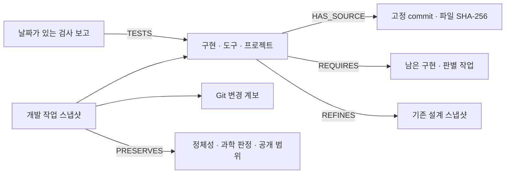

# HSWM 적응 개발 작업의 KG 기록

2026-09-08에 최근 구현·실사용·README 개편을 **출처가 있는 작업 그래프**로 정리한다.
기준 소스는 `c59aa4584c4729caf98b0d5bb899602c3718e3c4`의 Git 파일이다.
새 bundle은 `SECONDARY_AI` 공학 참조이며 기존 철학·설계·과학 판정을 변경하지 않는다.

라이브 KG에 **82개 노드·229개 관계**를 게시하고 전체 속성·개수를 재대조했다.
35개 Git 소스 파일과 기존 설계·계획·문헌 bundle 3개의 revision을 결속했다.

## 기록한 내용

| 기록 | 포함한 내용 | 읽는 경계 |
| --- | --- | --- |
| 구현 | 실제 cell·재귀 실행, 문맥 logistic 계수, 조건부 관계·read-set 분화, SQLite revision·CAS, outcome, replay·frozen·restore, 조건 preview | 제한된 로컬 적응 prototype |
| 개발 적용 | 메이플리니지, 버엑시, SUPULLIM의 profile·focus·CLI·별칭·상태 분리 | 명시적 CLI 사용; 자동 개발 에이전트 통합은 미완료 |
| 실행 보고 | 첫 실행의 메이플리니지 19개·버엑시 40개·SUPULLIM 23개 검사 통과 | 2026-09-07 체크인 문서의 보고; 현재 DB나 제품 성능 통계가 아님 |
| 구현 검사 | 적응 회귀 28개·기존 conditional 회귀 45개, wrapper 확장 시점별 회귀 보고 | 서로 다른 검사 범위를 중복 합산하지 않음 |
| 도구 연결 | CLI, MCP 조회 설정, 연구 Skill, 미배치 개발 feedback Skill·AGENTS 경로 | 설정·실행·미연결 항목을 구분 |
| 변경 계보 | `3913c9e` → `dccc945` → `2ccdd0f` → `3ac0026` → `c59aa45` | Git 변경 이력; commit 자체가 효능 증거는 아님 |
| 이론 연결 | Wolfram의 국소 rewrite·사건 의존성, 제한된 판별 관찰, 기존 최신 연구 참조 KG | 논문 수록·아이디어 연결·실제 구현을 구분 |
| 남은 작업 | 명시 feedback, MCP·Skill 연결, held-out baseline 비교, causal credit, 장기 유지·인지 합성, 독립 판정 | 이번 게시로 완료 처리하지 않음 |



`REFINES`는 후속 구현과 이전 설계를 찾는 참조 관계다. 이전 계약의
`PROPOSED_DESIGN_NOT_IMPLEMENTED` 기록은 당시 바이트·상태로 남긴다.
새 코드가 계약 전체나 canonical admission을 충족했다는 판정은 아니다.
`TESTS`도 여기서는 문서에 보고된 검사가 겨냥한 구현을 뜻하며 독립 결과 인증은 아니다.

실행 DB, 실제 task·출력·feedback 원문, 인증정보는 이 bundle의 입력이 아니다.
문서에 적힌 최초 feedback 대기는 당시 상태로만 보존한다.
G0 미통과·G1 미평가·D-4 미완료·P1 RED와 FCL-1..8은 유지한다.

## 조회

Bundle UID: `sym:AbstractNode:hswm-adaptive-development-work-2026-09-08-v1`.

온톨로지 MCP에서 아래 순서로 찾는다. AI 참조 기록이므로 `include_preliminary`가 필요하다.

```json
{"query":"HSWM 적응 개발 작업","include_preliminary":true,"limit":5}
```

찾은 UID로 `ontology_get`, `ontology_neighbors`를 호출한다. bundle의 이웃은 섹션과 기존
설계 참조이고 각 섹션에서 구현·프로젝트·보고·미완료 항목으로 이동한다.
예를 들어 `메이플리니지`, `HSWM 문맥 가중치`, `HSWM 남은 작업`으로 직접 검색할 수 있다.
검색 결과는 당시 스냅샷의 설명이며 라이브 runtime 상태 조회가 아니다.

- [기계 bundle](../../ontology/identity/hswm_core/HSWM_ADAPTIVE_DEVELOPMENT_WORK_ONTOLOGY.v1.json)
- [Cypher 질의 4개](../../ontology/queries/HSWM_ADAPTIVE_DEVELOPMENT_WORK_2026-09-08.cypher): 구현→출처, 세 프로젝트 보고, 남은 작업, 이전 설계
- [SPARQL 질의 4개](../../ontology/queries/HSWM_ADAPTIVE_DEVELOPMENT_WORK_2026-09-08.sparql): 같은 로컬 RDF projection을 조회
- [N-Quads·SHACL·PROV-O 산출물](../../ontology/projections/hswm_adaptive_development_work_2026-09-08/)

Cypher와 SPARQL 파일의 Q 블록은 각각 따로 실행한다. SPARQL은 로컬 bundle에만 있는
속성을 조회하며 외부 anchor의 현재 상태를 대신하지 않는다.

## 재현과 게시 경로

기존 RDF/SHACL 컴파일러와 고정 bundle 게시기를 재사용한다. 새 SDK나 MCP 쓰기 도구를
추가하지 않는다. source binding은 현재 README 파일이 아니라 고정 commit의 Git blob과
SHA-256을 대조하므로 이후 일반 문서 편집이 이 스냅샷의 출처를 바꾸지 않는다.
재현할 checkout에는 해당 Git commit의 객체가 있어야 한다.

```bash
uv run --locked python -m hswm.infrastructure.development_work_catalog --check
uv run --locked --project _research/graph_standards/runtime --extra graph \
  python -m hswm.infrastructure.development_work_projection \
  --export-dir ontology/projections/hswm_adaptive_development_work_2026-09-08
```

게시기는 검토된 bundle의 정확한 SHA가 일치할 때만 기존 bounded gateway를 호출한다.
gateway는 한 transaction에서 registry·UID 제약·기존 anchor revision·중복 충돌을 검사하고
노드·관계를 생성한 뒤 모든 속성과 개수를 다시 대조한다. 기존 bundle은 덮어쓰지 않는다.
게시 결과·MCP 조회 결과는 같은 projection 디렉터리에 별도로 보존한다.

2026-09-08 확인 결과:

| 확인 | 결과·기록 |
| --- | --- |
| 라이브 게시·전체 재대조 | 새 노드 82개·관계 229개, 재조회 82개·229개; [게시 기록](../../ontology/projections/hswm_adaptive_development_work_2026-09-08/live_publication.json) |
| 기존 anchor | 고정 revision 3개 모두 일치, 미결속 anchor 0개; 과거 상태 보존 |
| 표준 projection | SHACL 적합; N-Quads·PROV-O·manifest 저장 |
| SPARQL·라이브 Cypher | Q1~Q4 각각 22·3·7·3행; [로컬 확인](../../ontology/projections/hswm_adaptive_development_work_2026-09-08/verification.json), [라이브 조회](../../ontology/projections/hswm_adaptive_development_work_2026-09-08/cypher_readback.json) |
| MCP | bundle·profile·가중치 검색, 미완료 7개 검색, UID 고유성·이웃 조회; [MCP 기록](../../ontology/projections/hswm_adaptive_development_work_2026-09-08/mcp_readback.json) |
| 집중 회귀 | 새 projection 3개·문서 정합성 6개 통과, portable Markdown 컴파일 통과 |

게시 bundle SHA-256:
`737324f0a9b64d061d7155c207a62877a122c1818b2a56460b54fe6e7050ca64`.

이 작업의 검사는 KG 내용·출처·조회·게시의 정합성을 확인한다.
HSWM의 새로운 성능 측정이나 연구 gate 통과 기록으로 계산하지 않는다.
