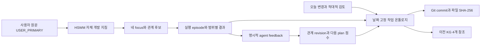

# 2026-09-08 작업과 HSWM 자체 개발의 KG 기록

오늘 작업을 **113개 노드·283개 관계**의 별도 온톨로지로 정리했다. 출처는
`d4fed000369f1b6545c505dd9505e7c9b3c41cf7`의 Git 파일 44개다. 이전 개발 작업 KG
82개 노드·229개 관계와 설계·문헌 스냅샷 3개를 고정 anchor로 연결하고 기존 기록을 보존한다.

사용자 지침 **1개는 USER_PRIMARY**, 구현·검토·산출물 설명 **112개는 SECONDARY_AI**다.
사용자 원문을 정확한 파일 바이트와 결속하고, 구현 선택이나 자체 검사 결과를 사용자 판정으로
승격하지 않는다. 새 지침은 HSWM 자체도 HSWM으로 개발하고 오늘 작업을 KG에 기록하라는 것이다.

## 기록한 작업

| 범위 | 온톨로지에 남긴 내용 | 현재 판정 범위 |
| --- | --- | --- |
| 이전 KG 게시 | `54550a3`의 82/229 게시·검사 보고와 기존 source snapshot | 과거 날짜 고정 기록 |
| USL v1 | `723fb2b`의 어댑터·preview·60개 검사 보고 | 제한된 외부 관측 인터페이스 |
| USL v2 초기 검토 | `d095418`의 sourceText 혼합·JSON 내부 검증 누락과 당시 HSWM v2 공백 | 후속 수정·재검증과 연결한 과거 finding |
| HSWM USL v2 | `b0afd4f`의 strict validation·선택 범위·source/plan pin·75개 검사 보고 | supplied observation의 제한된 검증·투영 |
| 최신 USL 검토 | `04e4511`의 105개 USL 검사·타입 검사·compact/resolver 검사 | 기존 두 결함의 수정 유지; 직접 projection API의 plan/source P2는 open |
| 버엑시 | `eab4556`의 profile v2, career/graph/check focus | 개발 CLI 확대, 제품 효능 미측정 |
| Reluvator | `79fd58e`의 delltower 연결, 17개 구성원 역할, 45개 계약의 날짜 고정 관측, 전송기 보완 | 중앙 계약 통과; mesh 189 OK·25 WARN·0 RED·42 UNMEASURED |
| HSWM 자체 개발 | `3c8ed05`의 사용자 원문·AGENTS·자체 profile·실행·agent feedback | 실제 검사 경로 사용과 로컬 관계 갱신 |
| 게시 전 보완 | `d4fed00`의 일반 산출물 경로 분류와 로컬 owner preflight | 최초 게시의 노드 생성 전 실패를 기록하고 보완 |

60·75·105·27 같은 검사 수는 시점과 대상이 다르며 합산하지 않는다. Reluvator의 45는
계약 수이고 17은 구성원 수다. RED 0도 UNMEASURED 42를 지우거나 전체 현장 검증을 뜻하지 않는다.
현재 open USL P2는 `toSemanticBundle(plan A, source B)`에서 설명과 출처 hash가 섞이는 직접
API 경계다. 예전 두 P2는 `REMEDIATED_AND_RETESTED_NOT_CURRENT_OPEN`으로 구분했다.



KG는 출처가 있는 관측·설명 projection이다. 로컬 실행 그래프의 cognition, learning state,
canonical admission이나 실행 권한을 대신하지 않는다. G0 미통과·G1 미평가·D-4 미완료·P1 RED와
FCL-1..8은 이번 개발·게시로 바뀌지 않는다.

## HSWM 자체 개발에 실제 적용한 범위

`hswm-dev hswm`으로 `runtime`, `ontology`, `docs`, `usl` 검사를 실행하고 각각 20·9·325·19개
통과를 기록했다. 네 결과는 명시 feedback 전 모두 `success=null`이었다. ontology 검사가 이번
게시기 개발에 유용했다는 **에이전트 판단 1건**을 입력한 뒤 관계 관측 수 0→1, revision 1→2와
다음 프로세스의 점수 변화 약 0.267→0.727을 확인했다. 선택 관계는 동일하며 사용자 feedback은
받지 않았다. snapshot 당시 피드백 대기는 3건이다.

[자체 개발 사용법](HSWM_SELF_DEVELOPMENT_2026-09-08.md) ·
[실행 요약과 전후 plan](artifacts/development_day_2026-09-08/self_development_run.json).
자동 코딩 전체 경로나 더 나은 개발 결과의 입증은 후속 범위다.

## 조회와 재현

Bundle UID: `sym:AbstractNode:hswm-development-day-2026-09-08-v1`.

온톨로지 MCP에서 `HSWM 오늘 작업`, `HSWM 자체 개발`, `Reluvator 표본`, `plan source mismatch`를
`include_preliminary: true`로 검색한다. `ontology_get`과 `ontology_neighbors`로 source·검토·실행
기록을 따라간다. `USER_PRIMARY` 요청을 검색해도 구현의 효능이 승인됐다고 해석하지 않는다.

- [온톨로지 bundle](../../ontology/identity/hswm_core/HSWM_DEVELOPMENT_DAY_2026-09-08_ONTOLOGY.v1.json)
- [작성한 작업 목록](artifacts/development_day_2026-09-08/records.json)
- [Cypher 6개](../../ontology/queries/HSWM_DEVELOPMENT_DAY_2026-09-08.cypher)
- [SPARQL 6개](../../ontology/queries/HSWM_DEVELOPMENT_DAY_2026-09-08.sparql)
- [RDF·SHACL·PROV-O·게시 및 조회 결과](../../ontology/projections/hswm_development_day_2026-09-08/)

각 Q 블록은 독립적으로 실행한다. Q1 출처 44개, Q2 사용자 원문 1개, Q3 P2 상태 3개,
Q4 Reluvator 구성원 17개, Q5 자체 실행 보고 4개, Q6 에이전트 피드백 변화 1개를 조회한다.

```bash
uv run --locked python -m hswm.infrastructure.development_day_catalog --check
uv run --locked --project _research/graph_standards/runtime --extra graph \
  python -m hswm.infrastructure.development_day_projection \
  --export-dir ontology/projections/hswm_development_day_2026-09-08
```

기존 bounded publisher를 재사용하며 게시에는 검토한 정확한 SHA가 필요하다. 현재 파일로
과거 출처를 바꾸지 않고 고정 Git blob을 대조한다. 과거 bundle을 덮어쓰거나 generic KG 쓰기,
학습 admission, 새 MCP 권한을 추가하지 않는다. 일반 작업 목록·실행 보고는
`docs/operations/artifacts/`에 두고 실제 ontology JSON만 `ontology/`의 bundle 후보로 취급한다.

Bundle SHA-256:
`931f6a7bfe9fa60fc8c543c08d6b293d8e0d3c313f0820dc6effea66481acfd7`.

## 게시·조회 검증 결과

라이브 KG에 게시했고 동일 transaction에서 전체 노드·관계 속성과 개수를 재대조했다.

| 확인 | 결과 |
| --- | --- |
| 새 게시·전체 재대조 | 노드 113/113, 관계 283/283, 부분 생성·중복 없음 |
| 기존 anchor | 고정 revision 4개 일치, 미결속 anchor 0개 |
| RDF·SHACL·PROV-O | N-Quads·manifest·PROV-O 저장, SHACL 적합 |
| 로컬 SPARQL·라이브 Cypher | Q1~Q6 각각 44·1·3·17·4·1행, 값까지 일치 |
| 온톨로지 MCP | bundle·원문 UID 유일성, 자체 profile·open P2 검색, 원문의 source·지침 이웃 조회 |
| 자체 개발 검증 | 최종 출처 분류 보완도 `hswm-dev hswm run --focus ontology` 경로로 9개 검사 통과 |

[게시·전체 대조](../../ontology/projections/hswm_development_day_2026-09-08/live_publication.json) ·
[Cypher](../../ontology/projections/hswm_development_day_2026-09-08/cypher_readback.json) ·
[SPARQL](../../ontology/projections/hswm_development_day_2026-09-08/sparql_readback.json) ·
[MCP](../../ontology/projections/hswm_development_day_2026-09-08/mcp_readback.json).

[첫 시도 기록](../../ontology/projections/hswm_development_day_2026-09-08/publication_attempt_1.json)은
일반 JSON 경로 분류 때문에 노드 생성 전에 중단된 결과다. 이 실패를 성공 기록으로 덮지 않았다.
마지막 온톨로지 회귀는 source snapshot 이후의 추가 episode이며, snapshot 당시의 피드백 대기
3건을 현재 DB 상태로 소급해 바꾸지 않는다. 이번 게시·검사는 작업 내용과 출처의 정합성을
확인한 것이며 새로운 HSWM 성능 측정이나 연구 gate 통과 기록이 아니다.
