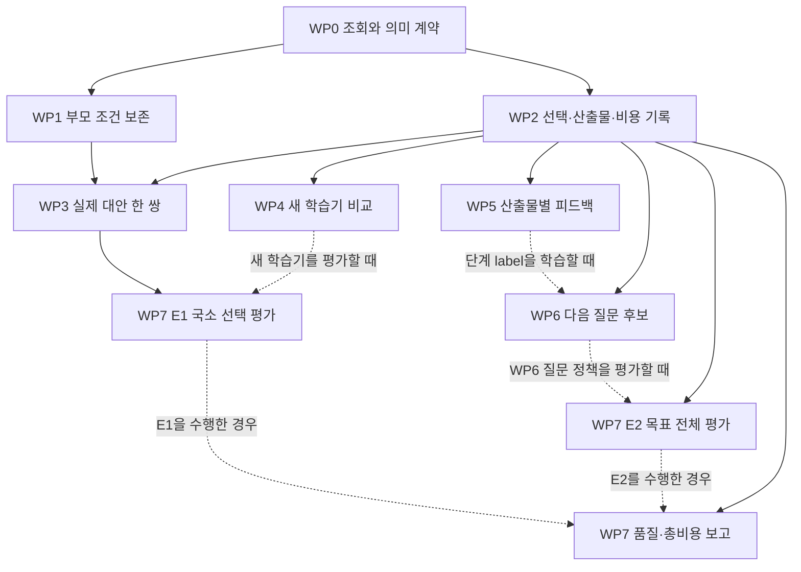

# ICE 학습 개선 — 표준 그래프 엔지니어링 작업 계획

2026-09-08 · `SECONDARY_AI / IMPLEMENTATION_PLAN / NOT_YET_IMPLEMENTED`.
검토 기준: HSWM `6ea584c`, [개선 설계](../research/HSWM_ICE_LEARNING_REMEDIATION_2026-09-08.md),
[교정 KG v2](../../ontology/evidence/HSWM_ICE_LEARNING_REMEDIATION_2026-09-08.v2.json).
이 문서는 다음 구현을 위한 작업 계획이다. 아래 작업의 완료나 효능을 보고하지 않는다.

**첫 구현 묶음은 부모 조건 보존, 선택·산출물·비용 기록, 실제 대안 한 쌍이다.**
그 위에서 갱신 규칙과 단계별 피드백을 각각 비교하고, 경험으로 다음 질문을 바꾸는 경로를 잇는다.
종료한 실사용 사례 일부에서 품질과 총비용을 평가한다. 문서·검사·KG의 양은 성공 기준이 아니다.

## 기준과 이번 계획의 범위

[Constitution](../canon/HSWM_CONSTITUTION_2026-08-20.md)의 하나의 token-native LLM-function
macro-neural HSWM과 evolving hypergraph의 역할을 유지한다. [적응 연구 전략](../canon/HSWM_ADAPTIVE_RESEARCH_STRATEGY_2026-08-30.md)에
따라 방법은 바꿀 수 있지만 목표·기존 FCL 계약·실패 기록·증거 기준은 축소하지 않는다.
개념적 변화는 다섯 해결 후보를 **입출력·책임·수정 범위·선행 작업·판별 방법이 명시된
변경 묶음**으로 바꾸는 것이다. 작업 의존 그래프는 개발 계획이며 HSWM 인지 그래프가 아니다.

활성 구현은 `src/hswm/effect-runtime/src/`의 TS/Effect다. 순수 도메인 함수가 후보·상태 변화를
계산하고, Effect 서비스가 실행·저장·조회·취소를 담당한다. SQLite의 local adaptive 상태와
외부 KG/RDF 투영은 구분한다. local atom을 canonical admission을 통과한 atom으로 승격하지 않는다.

계획 시작 시 다른 작업의 미추적 `relation-program-research.ts`, `usl-native-snapshot.ts`와
관련 테스트가 있었다. 이들을 이 계획의 구현 완료 근거로 삼지 않으며, 실제 착수 때 최신 상태와
인터페이스를 확인한다. 공유 파일의 편집은 담당 변경 묶음 하나씩 통합한다.

## 사용할 표준과 기존 도구

[표준 우선 정책](HSWM_STANDARD_TOOLCHAIN_POLICY_2026-09-02.md),
[기존 그래프 구현 경계](HSWM_FULL_STACK_GRAPH_ENGINEERING_2026-09-02.md),
[정확한 버전·출처 잠금](../../_research/graph_standards/HSWM_GRAPH_STANDARDS_ACCEPTANCE.v1.json)을
재사용한다. 공식 자료의 상태는 2026-09-08에 확인했다.

| 표준 | 이 작업에서의 사용 | 완료 판정의 한계 |
| --- | --- | --- |
| [RDF 1.1](https://www.w3.org/TR/rdf11-concepts/)·[N-Quads 1.1](https://www.w3.org/TR/n-quads/) | 버전별 named graph와 읽기 전용 교환 형식 | native 상태·학습 의미를 정의하지 않음 |
| [SHACL 1.0](https://www.w3.org/TR/shacl/) | 필수 속성, 타입, 개수, 참조 형태 검사 | 선언하지 않은 업무 의미나 출처의 참을 보장하지 않음 |
| [PROV-O](https://www.w3.org/TR/prov-o/) | 원본 entity → 변환 activity → 파생 view의 계보 | 현재 제한된 매핑을 유지. 검토자 평가를 인과 credit으로 바꾸지 않음 |
| [SPARQL 1.1](https://www.w3.org/TR/sparql11-query/) | 기존 허용 범위의 로컬 SELECT/ASK로 조회 계약 확인 | 사용 중인 제한된 구현 범위만 주장 |
| [RDFC-1.0](https://www.w3.org/TR/rdf-canon/) | 필요할 때 자격 확인된 processor로 RDF dataset의 canonical form 비교 | RDF digest와 native JSON·atom·산출물 digest를 구분 |
| [JSON-LD 1.1](https://www.w3.org/TR/json-ld11/) | 필요한 API/문서 교환에 기존 local-context view 사용 | JSON 표기 자체를 canonical bytes로 보지 않음 |

RDF·SHACL·SPARQL 1.2의 초안은 별도 실험 범위다. 이 계획의 수용 기준을 자동 변경하지 않는다.
실제 사용하는 profile만 실행하며 새 그래프 DB나 SDK 설치는 첫 작업 묶음의 의존성이 아니다.
기존 패키지의 정확한 버전·integrity·license·lock과 공식 suite의 적용/제외 범위는 유지한다.
표준 또는 adapter를 바꿀 때에만 해당 profile을 다시 자격 확인한다.

MCP는 기존 범위 제한 조회·실행 인터페이스, Skill은 반복 작업 지침으로 사용한다.
둘 중 어느 것도 학습 상태의 정본 쓰기나 인과 판정을 대신하지 않는다.
기존 외부 KG의 Cypher 조회를 ISO GQL 준수 구현이라고 부르지 않는다.

## 먼저 답해야 할 그래프 조회

그래프 형식을 늘리기 전에 다음 질문의 답을 같은 고정 입력에서 재현할 수 있게 한다.

| 조회 계약 | 반드시 찾을 정보 |
| --- | --- |
| Q1: 왜 이 행동을 골랐나? | 선택 occurrence, 실행 당시 eligible 후보·탈락 사유·tie, 선택 관계 revision, 읽은 문맥과 실제 근거 참조 |
| Q2: 어느 평가가 무엇을 바꿨나? | review/outcome → 산출물 digest → occurrence → 선택 당시 관계 → 갱신된 revision. 미평가 관계와 중복 평가 구분 |
| Q3: 어떤 조건이 보존됐나? | 부모 revision·필수 guard, 학습 selector, 유효 guard와 member/type/권한 참조 |
| Q4: 왜 다음 질문이 달라졌나? | 과거 실패 근거 → 수정 후보 → outcome 전 질문/예측 → 실제 resolver 조회·다음 행동 |
| Q5: 사용해 이득이 있었나? | 평가 protocol·arm·모델 버전·최종 품질, 초기/반복 비용, 누락·미측정 값 |
| Q6: 지금 읽을 설계는 어느 버전인가? | 현재 지정 bundle, 정정 대상·이유·계보, source SHA. 구형 정정을 거치지 않은 추천 제외 |

작업 계획의 연결은 `작업 REQUIRES 선행작업`, `문제 REQUIRES 해결후보`,
`검증 TESTS 해결후보`, `판단 HAS_SOURCE 근거`로 역할과 방향을 구별한다.
이는 HSWM의 local application profile이며 W3C가 그 업무 의미를 정의했다는 뜻이 아니다.

실행 기록에서는 다자 관계를 이름 없는 이항 edge들로 평탄화하지 않는다. 관계/발생 지점의
UID를 유지하고 participant의 source·target·role·ordinal과 정확한 revision을 참조한다.
각 native atom의 책임 owner는 하나이고 평가자·실행자·보관자는 별도 역할 참조다.
새 기록은 현 local `relation`, `condition`, `trajectory`, `outcome`, `episode`의 의미와
명시적으로 매핑한다. 새 payload·kind가 필요하면 schema/version 변경으로 선언한다.

## 작업 묶음과 완료 조건

작업 식별자는 `ICE-WP0`부터 `ICE-WP7`까지다. 각 항목을 독립적으로 검증 가능한 변경 묶음으로
두고, 기존 과학적 gate의 통과 상태와 구분한다.

| ID / 우선순위 | 작업·주요 산출물 | 담당 코드/계약 | 선행 조건과 완료 기준 |
| --- | --- | --- | --- |
| ICE-WP0 / P0 | Q1~Q6, 필드 의미·관계 방향·owner·schema/version·source pin 확정 | 위 조회 계약, 기존 bundle semantics·projection, 신규 작은 fixture | 선행 없음. I2→M1, I3→M2, I4→M3, F→M, M4→E2를 명시적으로 대조. 누락 참조·역방향·구형 추천을 검출하는 예시 확보 |
| ICE-WP1 / P0 | 부모의 필수 조건을 보존하는 specialization | `adaptive-domain.ts`, `adaptive-runtime.ts` | WP0. 부모 FALSE/child selector TRUE일 때 child가 탈락. 자동 outcome·사후 feedback 양 경로, parent revision·members·타입 보존 확인 |
| ICE-WP2 / P0 | 선택·산출물·버전·기본 비용의 공통 기록 | `adaptive-runtime.ts`, `adaptive-executor.ts`, 필요한 CLI 출력. store는 실제 새 원시 연산이 필요할 때만 변경 | WP0. Q1/Q3/Q5에 필요한 실행 전후 참조가 남고, 비용 미측정을 0으로 쓰지 않음. 기록 기능이 reward나 학습 횟수를 만들지 않음 |
| ICE-WP3 / P1 | 동일 전제의 실제 대안 한 쌍과 국소 선택 비교 | `_research/causal_composition/`의 HSWM 소유 manifest·종료 사례, 관련 adaptive 테스트 | WP1+WP2. 두 후보 모두 eligible이며 동일 도구·예산 아래 실행 가능. 독립 상태에서 frozen/학습 선택을 비교할 수 있음. 실행 가능성 확인과 선택 개선을 분리 |
| ICE-WP4 / P1 | 특징 수에 따른 갱신 완화 후보 하나와 v1 비교 | `adaptive-domain.ts`, version-aware route model 읽기, 고정 replay 사례 | WP0+WP2. 새 learner identity, v1 원문·digest 보존, 무관 필드 증가와 필요한 교호작용 양쪽의 결과 기록. 수치 완화와 held-out 품질을 따로 판단 |
| ICE-WP5 / P1 | 산출물·발생 지점·관계 버전에 묶인 피드백 | `adaptive-domain.ts`의 순수 검증, `adaptive-runtime.ts`, 이후 `adaptive-cli.ts` | WP0+WP2. 정확한 대상만 갱신, 같은 review 재전달은 재학습하지 않음. 위조 digest·다른 episode·의미가 바뀐 revision을 검출. 미평가 단계 유지 |
| ICE-WP6 / P2 | 실패 근거로 다음 질문·조회·행동 수정 후보 생성 | 얇은 typed proposal 계약과 실제 resolver/LLM·command 경계 | WP0+WP2와 유효한 과거 실패 근거. 질문·예측을 결과 전에 고정하고 실제 조회·행동 변화를 연결. 단계 label을 학습에 쓸 경우에만 WP5 추가 |
| ICE-WP7 / P2 | 실사용 일부의 품질·총비용 비교와 범위별 판정 | `_research/causal_composition/`의 평가 protocol·보고서, source-bound KG 결과 투영 | 공통 WP2. E1에는 WP3와 고정 learner가 필요. E2에는 실제로 평가할 WP6 또는 다른 질문 정책이 필요. WP4/WP5는 해당 기전을 평가·사용할 때만 의존 |

문서와 테스트 설계는 병렬 진행할 수 있다. `adaptive-domain.ts`나 `adaptive-runtime.ts`를
공유하는 구현은 하나씩 통합하고, 독립 fixture·평가 rubric·projection 검토는 병렬 진행한다.
각 변경 묶음은 목적에 맞는 작은 검사를 마친 뒤 현재 Git 작업 흐름으로 commit한다.

실선은 선행 작업, 점선은 선택한 평가 범위에 따라 필요한 연결이다. E1과 E2는 독립적으로
수행할 수 있으며 비용 기록은 첫 실행부터 시작한다.

## 작은 구현 단위의 구체적 계약

**WP1 — 조건 보존.** 부모 guard와 learned selector를 명시적으로 합성하거나, bounded domain에서
child TRUE가 parent TRUE를 함의하는지 검사한다. `PROPOSED_NOT_ADMITTED`라는 문자열을
local active 상태의 억제 장치로 간주하지 않는다. 이미 생성된 child를 새 의미로 조용히 읽지 않고,
관계 버전·부모 pin·기존 상태의 비활성화/승계 정책을 명시한다. 진리표 검사는 전체 곱이 작은
fixture부터 시작하고, 큰 domain에는 선언된 한도·WITHHOLD를 둔다.

**WP2 — 기록.** 선택 전 context/allowed/budget, 후보·탈락 이유·선택 확률 또는 결정적 규칙,
선택한 관계 revision·learner/model/tool 버전, 산출물 digest를 결속한다. 실제 조회 범위와
원문 digest는 가능한 resolver 경계에서 얻는다. provider가 주는 usage만 관측값으로 기록한다.
token 사용량이 없는 명령에 추정값을 실제 usage로 채우지 않는다. 초기 연결비, 반복 호출·지연·
재시도·검토·수정 비용을 별도로 둔다. 같은 비용을 root와 child에 중복 합산하지 않는다.

**WP3 — 대안.** 첫 예시는 전제를 확보한 ICE 조사 구간의 `기존 반례 적합성 확인 먼저`와
`새 반례 구성 먼저`다. 이는 후보 예시이며 실행 전 양쪽의 유효성을 확인한다. 필수 검사를
덜 하는 경로에 유리한 보상을 주지 않는다. 미선택 대안의 결과는 미관측으로 두며,
무작위 배정을 실제로 수행한 경우에만 그 확률로 평가한다. 현 CLI의 강제 route는 실행
가능성 확인에 쓸 수 있지만 학습 선택 우위의 근거가 아니다.

**WP4 — 갱신.** 첫 후보는 현재 이진 feature 표현의 활성 수로 per-feature 갱신량을 나누는
버전이다. 첫 비교에서는 다른 정규화·규제·탐색 변경을 한꺼번에 섞지 않는다. 독립 학습 상태와
동일 이력으로 비교하고, 특징/context 저장 한도에 걸린 사례를 누락하지 않는다. 과거 sigmoid
출력을 보정된 성공 확률로 표시하지 않는다. 이력 재사용에는 명시적 replay/migration 비용을 붙인다.

**WP5 — 피드백.** 요청에는 review ID, episode, trajectory occurrence, 선택 관계 revision,
출력 digest, 평가 계약 버전, reviewer source를 묶는다. 같은 출력의 재평가와 다른 ID를 쓴
중복 제출도 독립 경험으로 세지 않는다. 완결된 틀린 산출물은 부정 label이 될 수 있고,
잘림·전송 실패·산출물 부재는 내용 정확성의 부정 label과 구분한다. 늦은 평가는 원래 revision의
관측으로 보존하며 새 의미의 관계에 자동 적용하지 않는다. leaf가 관계를 선택하지 않았으면
그 관측을 보존하고 존재하지 않는 leaf 선택을 만들어 갱신하지 않는다.

**WP6 — 질문.** 실패 주장/조건과 반박 근거를 입력으로 받아 작은 수정 후보를 제안한다.
LLM의 설명은 후보이며 독립 정답이 아니다. 조건·질문·read-set·행동 중 무엇을 바꿀지와
예상 효과를 명시한다. 외부 KG에 문장을 추가하는 것과 다음 resolver 조회가 바뀌는 것을
구분한다. 기존 agent의 유능한 작업 단위를 유지하며 근거 없이 호출을 세분화하지 않는다.

## 실사용 평가와 종료 기준

첫 적용은 재현·평가 가능한 종료 사례 일부다. ICE를 첫 후보로 두고, 이후 게임·수풀림·Reluvator의
읽기 또는 격리 replay 가능한 사례로 범위를 넓힌다. 프로젝트 연결 수를 효능 지표로 삼지 않는다.

- **E1:** 질문·후보 정책·사용 가능한 자료·모델·예산을 고정한다. 학습 상태가 실제 후보 선택을
  개선하는지 평가한다. 후보가 하나이면 해당 선택 효과는 미식별이다.
- **E2:** 상위 목표·사용 가능한 자료·모델·예산·독립 최종 평가를 고정한다. 질문·read-set·행동은
  바뀔 수 있다. 전체 효과의 판별은 단계별 피드백 구현 없이도 가능하다. 단계의 기여도나
  routing 단독의 효과로 해석하려면 별도 비교가 필요하다.
- **순효용:** 같은 품질에서 반복 token/시간·사람의 설명/검토/수정 부담을 비교한다. 초기 비용은
  따로 보고, 반복 절감이 양수일 때만 회수 기간/과제 수를 계산한다. 돈과 시간을 합치려면
  환산 기준을 사전에 명시한다. 모델 교체 대안도 동일 산출물 기준으로 비교한다.

고정 native agent+같은 이력, frozen HSWM, 학습 HSWM의 상태·workspace·평가 label을 분리한다.
frozen은 선택에 영향을 주는 비용 통계·탐색·조건 분화까지 고정했는지 확인한다. 시작 시
과제 가족 분할, 최소 실질 효과, 품질 손실 허용 범위, 비용 한도와 중단 규칙을 정한다.
처음 5~10 사례는 실행/평가 가능성을 확인하는 pilot 후보다. 충분한 표본 수나 성공 기준이 아니다.

계약 위반은 그 구현을 수정한다. 효과의 불확실성이 크면 `UNDERDETERMINED`로 남긴다.
민감하고 유효한 평가가 사전 선언한 실질 효과를 배제하면 그 기전과 범위만 종료·교체한다.
기존 실패를 보존하며 규모 확대나 새 이름으로 구제하지 않는다.

## 각 변경 묶음의 검사와 게시 순서

1. 바뀐 입력·출력·의미·수정 대상과 source commit/path/SHA를 확정한다.
2. 도메인/저장/실행 중 실제 바뀐 계약의 작은 검사를 실행한다. 기존 배포·문서 기록을
   최신 코드에 맞추기 위해 소급 수정하지 않는다.
3. KG에는 구현 전 후보, 구현 검사 결과, 실사용 관측, 효과 판정을 다른 상태로 기록한다.
   graph 참조·owner·revision·kind·shape와 source digest를 검사한다.
4. Q1~Q6의 expected-answer 예시와 **명시적 문제→해결안→평가/반박 연결표**를 대조한다.
   SHACL 통과만으로 의미 검토를 생략하지 않는다. 소스 변경은 기존 projection을 무효화한다.
5. 의미 검토까지 끝난 동일 bytes를 고정해 기존 bounded publisher로 게시하고, 실제 node·relation·
   digest를 대조한다. MCP는 별도로 UID·상태·정정 연결을 확인한다. 의도한 graph 이름만
   조회된 것을 전체 readback으로 보고하지 않는다.
6. 게시 오류가 있으면 source-bound successor와 정정 이유를 남기고 기본 조회를 바꾼다.
   과거 receipt를 지워 처음부터 맞았던 것처럼 만들지 않는다.

실행 경로는 `hswm-dev hswm plan/run/status/feedback`으로 작업·선택·검사·명시적 유용성을
남긴다. passing check가 자동 성공 reward가 되지 않으며 agent 평가는 `agent(codex):...`로
사용자 평가와 구분한다. 선택된 profile 밖의 필수 검사는 별도로 실행한다.

TS 변경에는 해당 adaptive 검사와 타입/Effect 경계, projection 변경에는 기존
`kg_bundle_semantics`·`kg_bundle_graph_view` 및 해당 shape/조회 검사를 적용한다.
문서는 Markdown 계약·링크·portable math를 확인한다. 공식 suite 전체의 네트워크 재실행은
기존 표준 도구를 재사용하는 매 변경의 선행 조건이 아니다.

## 첫 착수에서 전달할 결과

첫 변경 묶음의 전달물은 **WP0의 작은 계약/예시, WP1의 부모 조건 보존 수정,
WP2의 최소 선택·산출물·비용 기록, WP3의 유효한 대안 한 쌍**이다.
이 묶음에서 확인할 것은 범위 보존·선택 가능성·추적 가능성이며, 효능 승격은 아니다.
WP4·WP5·WP6의 독립 설계는 병렬 진행하되 실제 공유 runtime 변경은 작은 단위로 통합한다.
실제 착수·완료·관측 결과는 이후 별도 versioned 기록으로 연결한다.
