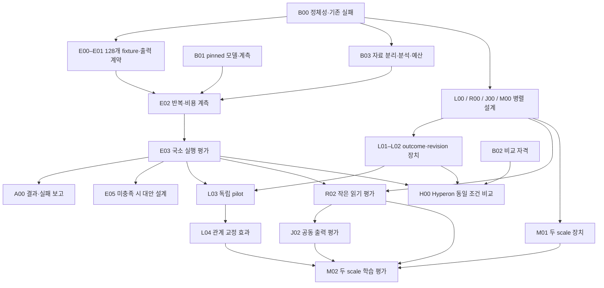

# HSWM × Jev 연구 작업 계획 — 2026-09-22

상태: **계획 작성·구조 검증 대상 / 실험 미실행 / CR·FCL 승격 없음**.

사용자가 요청한 국소 의미 실행 → 반례 교정 → 작은 읽기 → 공동 출력·두 단계 합성을 Jev P1–P6 및 기존 9월 15일의 22개 작업에 연결한다. 이번 산출물은 30개 작업, 13개 연구 가정, 13개 진행 조건을 갖는 출처 결속 작업 그래프다. 조건은 연구의 기술적 선행 요건이며 새로운 사용자 승인 절차가 아니다. 모델 호출·학습·runtime 확장은 이 문서의 후속 작업으로 남는다.

## 1. 무엇을 보존하고 무엇을 구체화했는가

HSWM은 하나의 큰 AI이고, 하이퍼그래프 신경망으로 조직되며, LLM-function이 기본 계산 단위이고, hypergraph Semantic Weight를 통해 작동한다. 큰 그래프가 AI 상태 자체이고 LLM은 작은 국소 입력을 받는 내부 연산자다. 같은 진화하는 그래프의 harness·world/self model·연속 학습 역할을 별도 고정 하위 시스템으로 나누지 않는다.

이번 개념적 변화는 새 HSWM 정의가 아니라 **연구 순서의 실행 가능한 분해**다. 설계에 필요한 입력, 실험 실행에 필요한 관측 장치, 다음 단계의 주장을 허용하는 경험적 지지를 분리했다. Semantic Weight의 의미 본문·역할/문맥 조건부 전이 성향·LLM 실현·측정한 인과 효과도 구분한다. 계획의 RDF 그래프와 검증기는 HSWM 인지나 학습의 실현이 아니다.

기존 [22개 증명·통합 작업](HSWM_SEMANTIC_PROOF_WORK_PLAN_2026-09-15.md)은 그대로 둔다. 새 계획의 `prior_tasks`는 `prior_plan_uid`로 9월 15일 계획에 한정한 대응 관계다. 예를 들어 현재 `M01`과 과거 `M01`은 다른 노드이며 자기 의존이 아니다. 이전 작업을 재사용한다고 완료 상태가 옮겨오지 않는다.

핵심 입력은 [Jev 연구](../research/HSWM_JEV_GRAPH_ENGINEERING_2026-09-22.md), [심층 연구 종합](../research/HSWM_DEEP_RESEARCH_AND_REALIZATION_2026-09-22.md), [W1–W5 원안](../../_research/hswm_deep_research_v1/protocol.v1.json), [현재 기전 감사](../research/artifacts/hswm_jev_research_work_plan_2026-09-22/mechanism-work-review.md)다. 원 논문의 결과는 HSWM으로의 전이 근거와 구분한다.

## 2. Jev를 어떻게 합쳤는가

Jev의 공개 [machine-learning primer](https://docs.typesafe.ai/introduction/machine-learning-primer)와 [primitives](https://docs.typesafe.ai/primitives)를 다시 확인했다. typed output, 확률 보정, 동일 상태에서의 독립 질문 묶기는 참고할 설계 원리다. 실제 공유 계산량과 효과는 각각 측정해야 한다. 공개 vendor 설명을 학습된 RLCD의 독립 재현 결과로 취급하지 않는다.

| 연결 | 연구 작업 | 검증해야 할 내용 | 출처·주장 범위 |
|---|---|---|---|
| P1 typed readout | E00–E03, E05 | 직접 bit, 일반 JSON, 명시적 중간 레코드의 의미 정확도·거절·비용 | vendor 원리를 frozen LLM에서 시험; RLCD 재현 아님 |
| P2 calibration | E04, L02–L04 | 별도 모집단의 proper score, 보정 무효화, score와 revision의 분리 | 보정은 의미 교정·인과 credit이 아님 |
| P3 동일 상태 계산 공유 | J01, J03 | 독립 실행 가능한 호출만 묶고 snapshot·stale write·비용을 검증 | 스케줄 독립과 통계적 독립은 다름 |
| P4 후보·읽기 구성 | R00–R02, T00–T01 | 후보 누락, `other`, 추가 읽기, 역할·예외 변경 | HSWM 확장 질문 |
| P5 공동 전이 | J00–J02, T00 | 주변 확률과 joint law의 차이, 금지 조합, n-ary 구조 | HSWM 의무; Jev의 입증 결과 아님 |
| P6 재귀 구성 | M00–M02 | 두 scale에서 Step/Learn, 세계·자기 상태, 연속성과 손상 회복 | FCL 의무; 계층 호출만으로 충족되지 않음 |

9월 21일 결과는 음성 대조와 실패 기록으로 보존한다. 네 번의 commit에서 의미 본문·disposition·uncertainty·exceptionRefs가 바뀌지 않았고 learned/evidence-only 입력 bytes도 같았다. 따라서 그 trace는 의미 학습 증거가 아니다. direct의 27/48은 frozen Qwen3-4B의 one-token candidate-logprob 결과다. direct 480/480과 generated 389/480의 형식 차이는 별도 confound다. 48개 사례를 여섯 arm에서 사용했다고 독립 표본 288개가 되지 않는다. 동일 요청의 비결정성도 보존한다.

## 3. 먼저 시작할 작업과 순서

바로 착수 가능한 작업은 **B00 기준선 정리, B01 실행 환경 자격 확인, B02 비교 대상 자격 확인**이다. 담당자는 미배정이고 책임 역할만 지정했다. 날짜나 GPU 비용을 임의로 확정하지 않았다. B01/B03가 모델·서버·tokenizer·환경 pin, 호출당 상한, 전체 예산, 중단 규칙을 결과 관찰 전에 구체화한다.



이 그림은 주요 경로의 요약이다. 정확한 artifact 의존과 시작 조건은 아래 표와 JSON이 정의한다. `DEPENDS_ON`은 수락된 산출물 필요, `required_start_decisions`는 명시된 조건 충족 필요다. 비어 있는 조건은 아무 가정도 없다는 뜻이 아니다. 가정은 검사 대상이며 자동으로 참이 되는 gate가 아니다.

특히 R00/J00/M00 설계는 W1 성공을 기다리지 않는다. J02 공동 출력 평가는 L04 관계 교정 효과와 병행할 수 있다. 다만 joint 정확도로 실패한 의미 학습을 구제하지 않는다. M02는 국소 학습·읽기·공동 출력이 모두 해당 범위에서 지지된 뒤 수행한다. A00/A01은 실패·미실행·미판정을 정직하게 보고하면서 완료할 수 있다.

## 4. 실험별로 고정할 계약

**W1 / E00–E04 — 국소 의미 실행.** 4종 관계 × 32개 입력 = 128개 유한 fixture를 사용한다. 원문, 두 paraphrase, 일대일 불투명 이름 변경, object key 재정렬, 의미가 달라지는 role swap의 여섯 조건을 둔다. role swap은 정답도 다시 계산한다. E0 직접 bit readout, E1 `{"answer":0|1}`, E2 정수형 `base/context_flip/exception_flip/answer` 레코드를 비교한다. E2는 중간 연산의 검사 가능한 출력 계약이며 비공개 추론 과정의 추출이 아니다. E3 symbolic oracle은 evaluator에만 둔다.

각 arm은 census 128×6=768회와 sentinel 8×20=160회로 928회다. 세 LLM arm의 기본 합계는 **2,784회**다. E2가 한 호출일 때의 계산이며 retry·추가 호출·보정 자료는 별도 비용이다. census와 기술적 반복은 독립 표본 수로 합치지 않는다. 정확도, 형식 적합성, refusal, 역할/문맥/예외 오류, token·호출·지연·GPU 시간 또는 과금 단위를 각각 기록한다. 정확도와 비용 양쪽에서 출력 방식의 차이를 판정한다.

현재 제안한 readiness는 적어도 한 LLM 조건이 고정 census/변환에서 오류·거절 0이고 정해진 반복에서 bit 안정성을 보이는 것이다. 유한 fixture 밖 보편 정확도를 뜻하지 않는다. 실패하면 E05에서 readout/모델/유한 학습 등 대안을 설계하고, 새로운 source-bound 후속 평가를 만든다. threshold를 낮추거나 E05 설계 자체로 D-EXEC을 충족시키지 않는다.

P2 보정은 확률이 정의된 channel에만 적용한다. 별도 label-blind calibration population에서 온도 등을 고르고 final test에서는 선택하지 않는다. readiness census도 calibration fitting에 재사용하지 않는다. pinned logprob 의미가 없거나 확률이 정의되지 않으면 `CALIBRATION_UNAVAILABLE`/`NOT_APPLICABLE`로 보고한다. NLL/Brier와 uniform p=0.5를 비교하고, 모델·관계·계약·모집단 변경 시 재검증한다. 방법의 근거는 [Guo et al., 2017](https://proceedings.mlr.press/v70/guo17a.html)이며 보정이 좋아졌다고 의미 관계가 학습된 것은 아니다.

**W2 / L00–L04 — 반례로 관계 교정.** [GEPA v2](https://arxiv.org/pdf/2507.19457v2)의 실행 피드백 기반 후보 개선과 [WorldCoder v3](https://arxiv.org/html/2402.12275v3)의 경험에 의한 모델 수정에서 설계 아이디어를 가져온다. 논문의 관측 성과를 HSWM 효과로 옮겨 적지 않는다. 후보는 실패 prediction·실제 outcome·유지해야 할 성공 사례를 읽고, parent 포함 최대 4개 후보·최대 3round를 첫 제안값으로 둔다.

현재 runtime은 `strictRevision`에서 exceptionRefs 동일성을 요구하고 successor가 frame.roles를 재사용한다. 따라서 첫 W2는 **의미 본문·disposition 변경**과 근거·불확실성 갱신의 효과를 구분한다. role/exception/topology 변경은 미래 T00의 별도 version 확장이다. 저장 bytes가 바뀌었다는 사실, 다음 실행이 그 bytes를 읽었다는 사실, 결과가 좋아졌다는 사실을 각각 검증한다.

동결 관계 / 근거만 추가 / 의미 없는 문장 수정의 세 대조군과 비교한다. arm별 mutable graph·cache를 격리하고 prediction→outcome→revision→새 process read를 결속한다. no-op, invalid candidate, failed commit도 배정된 world의 결과에 포함하는 ITT 분석을 한다. 성공한 revision만 추려 성능을 계산하지 않는다. HTTP fixture로 확인한 transport 계약과 실제 pinned 서비스의 관측을 분리한다.

pilot/train/selection/calibration/final-test/retention을 나누고 independent world를 분석 단위로 사용한다. 현 제안은 세 efficacy contrast와 세 retention contrast를 대상으로 단측 paired-world t bound에 Bonferroni α=.05/6을 적용하는 것이다. 각 gain 하한 >+5 절대 percentage point, retention loss 상한 <2 point를 제안하지만 아직 채택·충족 결과가 아니다. L03에서 pilot로 표본 수·paired contrast 분포 가정·power·비용을 검토하고 final test 접근 전에 규칙을 동결한다. 가정이 부적절하면 분석법을 그 전에 수정한다. 중간 유의성 확인에 따른 선택적 중단은 허용하지 않는다.

**W3 / R00–R02 — 작은 읽기의 충분성.** 같은 local input인데 숨은 예외 때문에 다른 답을 갖는 상태 쌍을 구성한다. 필요한 차이를 전혀 관측하지 못하는 연산자는 둘 다 맞힐 수 없다는 정보 제약부터 고정한다. 후보 밖 `other`, 추가 읽기, 중단/거절의 선택을 시험하고 모두 같은 허용 정보·총비용으로 비교한다. 전체 상태 oracle은 evaluator upper bound이며 운영 arm의 무료 입력이 아니다.

현재 답을 위한 충분성, 다음 행동을 위한 충분성, 다음 학습에 필요한 outcome·구별 정보를 보존하는 충분성을 별도로 측정한다. R02의 read-value/정보보존 검사는 L04의 학습 효과를 대신하지 않는다. 유한 과제에서의 검증을 보편적인 최소 읽기 정리로 일반화하지 않는다. R02가 추가 읽기 효과·누락률·비용·중단 기준을 실행 전에 고정한다.

**W4 / J00–J03 — 공동 출력과 계산 공유.** 주변 확률이 같은데 상관·예외·금지 조합이 다른 joint law를 대조한다. paired output의 joint discrepancy, 불가능 조합 비율, 개입에 따른 조건부 응답을 측정한다. tagged incidence/factor 표현과 n-ary 원본의 mapping을 기록하고, pair-only clique/additive approximation의 손실을 따로 시험한다. 모든 binary graph나 비선형 pairwise 계산이 불가능하다고 주장하지 않는다.

J01/J03은 같은 snapshot에서 의존성이 없는 실행의 공유와 stale-write 방지를 따로 다룬다. 의미적으로 독립 실행 가능하다고 출력 확률이 독립인 것은 아니다. 공유 cache·trunk가 실제 이용 가능한지 먼저 확인하고, 없으면 기능 부재를 기록한다. 동일 품질·동일 관측 조건의 전체 token·시간·메모리·retry 비용으로 비교한다. J02/J03이 각 수치 기준을 결과 전 고정한다.

**W5 / M00–M02 — 두 단계 합성.** M00에서 cell boundary, parent와 child의 Step/Learn 전이, joint state, world/self 구분, 예외·불확실성 전달, 학습 후 연속성을 명세한다. flat, 실행만 하는 wrapper, 실제 parent 학습 구성을 대조한다. 한 층의 성공을 단순 합산하지 않고 parent 결과와 child 업데이트의 연결, 비용, 손상·복구를 관측한다. M01에서 intervention·표본 단위·성공/손상 기준을 고정하고 M02에서 평가한다. 두 scale의 결과는 그 두 scale의 범위이며 임의 깊이·의식·인과 폐쇄의 실증이 아니다.

**Hyperon / B02, H00.** [직접 prior 감사](../research/HYPERON_2026_DIRECT_PRIOR_DEEP_DIVE_2026-08-20.md)의 persistent metagraph·neural bridge를 component와 commit별 성숙도에서 비교한다. 같은 관측·모델·학습 정보·예산·seed/world에서 W1/W2를 먼저 비교하고, joint/scale 확대에는 해당 HSWM 계약을 추가한다. HSWM용 adapter 기여를 Hyperon 자체 기능과 섞지 않는다. Hyperon 미가용은 필수 frozen/evidence/sham 대조가 가능한 제한된 W2를 막지 않지만, Hyperon 비교와 novelty 판단은 미완으로 남는다. 비교 의무와 backend 채택은 별개다.

## 5. 작업별 산출물과 의존성

아래 모든 작업은 `PLANNED`, 결과는 `NOT_ASSESSED`다. 표의 산출물은 미래 계약이며 파일이 이미 존재한다는 뜻이 아니다. JSON에는 책임 역할, 입력, 두 개 이상의 수락 기준, 실패 시 처리, source path, CR/FCL 및 과거 22개 작업의 대응도 있다. 상세 산출물 경로는 `docs/research/artifacts/hswm_jev_realization_next/<ID>.v1.json`으로 예약했다.

| ID | 작업 → 미래 산출물 | 필요한 완료 산출물 | 시작 조건 |
|---|---|---|---|
| B00 | 연구 대상·기존 실패·관측 계약 → 공통 질문·관측·기존 실패·crosswalk 계약 | — | — |
| B01 | 모델·tokenizer·서버·복원 범위 → 실행 pin·capability·숨은 상태·복원 가능성 보고 | — | — |
| B02 | Jev·Hyperon·대조군 자격 → component별 비교 가능성·동일 조건·성숙도 행렬 | — | — |
| B03 | 자료 분리·비용·판정 규칙 → split·label custody·비용·거절·중단·분석 계약 | B00 | — |
| E00 | 128-case와 의미 변환 fixture → 독립 참조 실행기·6종 변환·평가 전용 label manifest | B00 | — |
| E01 | E0/E1/E2 실행·파서 계약 → typed frame·3개 channel·거절/중간 출력 parser | E00 | — |
| E02 | serving 반복성·분모·비용 recorder → 봉인 trace·반복성·logprob normalization·비용 보고 | B01, E01, B03 | D-MODEL, D-STUDY |
| E03 | oracle 국소 실행 census 판정 → W1 정확도·거절·안정성·비용·실패 기전 보고 | E00, E01, E02, B03 | D-MODEL, D-STUDY |
| E04 | 확률 보정·적용 범위 → NLL/Brier·uniform 기준·scope/invalidation 보고 | E03, B03 | D-MODEL, D-STUDY |
| E05 | 국소 연산 실패의 교체 설계 → 새 realization/model/operator-training 후속 protocol | E03 | D-REROUTE |
| L00 | revision 후보 언어·변경 분류 → feedback packet·parent/no-op·taxonomy·후보 예산 | B00 | — |
| L01 | world·outcome·대조군 custody → world generator·관측자·4-arm·retention 명세 | B03, L00 | — |
| L02 | 선택·격리 branch·fresh read → 후보 선택·commit/restart/remove-restore harness | L00, L01, E01 | — |
| L03 | pilot·표본 수·확증 규칙 동결 → 고정 n·분석 가정·오류 예산·retention·중단 계약 | L01, L02, E03, B03 | D-EXEC, D-OUTCOME |
| L04 | fresh-world 의미 교정 효과 → ITT 효과·retention·mediation·복원 보고 | L02, L03 | D-EXEC, D-OUTCOME, D-W2, D-COMPARATOR |
| R00 | 국소 읽기·후속 학습 반례 → 현재/제어/학습 충분성 witness·허용 관측 계약 | B00 | — |
| R01 | other/expand·read 후보 정책 → full/fixed/active read·후보 누락·정지 정책 | R00, L00 | — |
| R02 | 국소 정보 가치·충분성 평가 → 비용 대비 read 효과·충돌·coverage·한계 보고 | R01, E03, B03, L01 | D-EXEC, D-STUDY |
| J00 | joint law·factor·표현 손실 → shared-cause·배타/상보/삼중 출력·개입 명세 | B00, R00 | — |
| J01 | snapshot scheduling·stale-write → serial/batch/실제 공유 연산 instrument 계약 | B01, E01, B00 | — |
| J02 | 공동 출력·개입 응답 평가 → marginal 대joint/factor 오류·개입·비용 보고 | J00, R02, E03, B03 | D-EXEC, D-READ, D-STUDY |
| J03 | 의미 보존 아래 계산 공유 비교 → 동일 의미·정보·비용의 throughput 비교 | J01, J02, B03 | D-EXEC, D-JOINT |
| T00 | role·exception·topology typed 확장 → 범위화된 변경·검사·revision·복구 계약/구현 | L00, R00, B00 | — |
| T01 | 후보 발견·예외·topology 효과 → 고정후보/새조합/새primitive·sham topology 대조 | T00, L04, R02 | D-TYPED, D-LEARN, D-READ |
| M00 | 두 scale Step/Learn·world/self 계약 → child→parent 상태·개입·학습·오차·연속성 계약 | J00, R00, B00 | — |
| M01 | flat/wrapper/학습 parent 구성 → 2-scale branch·intervention·비용·복원 instrument | M00, L02, J01, R01 | — |
| M02 | 두 scale 학습·손상·연속성 → 상위 효과·후속학습·world/self·회복·권리 보고 | M01, L04, R02, J02 | D-LEARN, D-READ, D-JOINT, D-SCALE |
| H00 | Hyperon 동일과제 component 비교 → 실행/read/revision의 scope-matched 비교 | B02, E03, L02, B03 | D-HYPERON, D-EXEC, D-OUTCOME, D-STUDY |
| A00 | 첫 보고·중단·reroute 감사 → 첫 checkpoint 지지/반증/미확정·다음작업 행렬 | E03, B02 | — |
| A01 | 동일 구성 CR/FCL·전체 감사 → co-witness·미해결 의무·후속 snapshot | A00, M00 | — |

## 6. 진행 조건과 실패 처리

| 조건 | 판정 작업 | 충족 계약 |
|---|---|---|
| D-MODEL | B01 | 정확한 pins와 해당 I/O·비용 계측이 준비됨 |
| D-COMPARATOR | B02 | 필수 기전 대조 준비 및 Hyperon 가용성/미비교 범위 기록 완료; 실행 가능 자체는 D-HYPERON |
| D-HYPERON | B02 | 동일 조건의 pinned Hyperon component/adapter가 실제 이용 가능 |
| D-STUDY | B03 | 해당 W1 split/label/거절/cost cap/순서/분석을 결과 전 고정 |
| D-EXEC | E03 | 고정 finite oracle/변환에서 한 LLM 조건 이상 오류·거절0 및 bit안정성 |
| D-REROUTE | E03 | 유효한 W1 readiness 미충족 보고가 있어 새 방식 설계 필요 |
| D-OUTCOME | L02 | outcome 결속·격리 branch·freshread instrument 검증 |
| D-W2 | L03 | 독립pilot 후 n·분석가정·6contrast·예산·stopping을 finaltest전 동결 |
| D-LEARN | L04 | 같은 구성의 W2 효과/retention이 세 대조 모두에서 범위한정 지지 |
| D-READ | R02 | current/control/read 정보구분·비용/효과 기준 통과; learning efficacy는 별도 D-LEARN |
| D-JOINT | J02 | jointlaw/금지조합/개입응답의 고정 기준 통과 |
| D-TYPED | T00 | role/exception/topology 변경의 typed·owner·복구 계약 검증 |
| D-SCALE | M01 | 두scale 관측·개입·비용·분석 규칙과 instrument 준비 |

조건 판정과 작업 완료는 다르다. 예를 들어 E03에서 정확하게 수행한 부정 결과를 수락하면 E03 보고 작업은 완료할 수 있지만 D-EXEC은 `NOT_SATISFIED`이고 D-REROUTE가 대안 설계를 연다. A00는 그 상태에서 바로 실패·비교 제한·다음 선택을 보고한다. A01도 M02/T01/H00가 미실행이면 이를 명시하여 판정할 수 있다. 기존 RED 경로를 삭제하거나 더 큰 구성으로 덮지 않는다.

13개 가정은 pin, 국소 연산, outcome 독립성, 인과 분석, 보정, 읽기, 후보 포괄성, joint law, scheduling, typed 변경, 구성, 연속성, 비교 타당성을 다룬다. `resolver`는 검토 책임을 뜻하며 가정의 참을 보증하지 않는다. 현재 경험적 기준이 없는 W3/W4/W5는 담당 작업이 수치와 분석을 먼저 동결해야 한다. 이번 계획이 이를 이미 충족했다고 표시하지 않는다.

## 7. 표준 그래프 엔지니어링

[공식 표준 조사](../research/artifacts/hswm_jev_research_work_plan_2026-09-22/standard-review.v1.json)에 따라 안정 경로는 [RDF 1.1](https://www.w3.org/TR/2014/REC-rdf11-concepts-20140225/), [PROV-O](https://www.w3.org/TR/2013/REC-prov-o-20130430/), [SHACL 1.0](https://www.w3.org/TR/2017/REC-shacl-20170720/), [SPARQL 1.1](https://www.w3.org/TR/2013/REC-sparql11-query-20130321/)이다. RDF 1.2 Candidate Recommendation과 SHACL/SPARQL 1.2 draft는 이 계획의 의존성이 아니다.

`WORK_PACKAGE`, `INPUT_CONTRACT`, `EXPECTED_ARTIFACT`, `PLAN_DECISION`, CR/FCL과 상태 문자열은 **HSWM 로컬 어휘**다. W3C 표준이 연구 방법이나 성공 조건을 승인한다는 뜻이 아니다. RDF가 표현을, SHACL이 타입·필수 항목·상태 계약을, SPARQL이 조회를 담당한다. dependency cycle, 조건 resolver를 통한 교착, 실제 파일 hash는 추가 검증기가 확인한다. 완료 전 future task를 실제 발생한 `prov:Activity`로 만들지 않는다.

각 작업은 schema-relative 책임 역할 하나, 명시적 입력·미래 산출물·검사 기준·출처·요구사항을 갖는다. source byte SHA-256과 이전 bundle anchor를 결속한다. 사용한 도구는 기존 lockfile의 Effect 3.22.1, N3 2.7.2, rdf-validate-shacl 0.6.5, Comunica 5.3.0으로, MIT license와 integrity를 기록했다. RDF/SHACL/SPARQL 구현체를 W3C 공식 SDK라고 부르지 않는다. 새로운 package·DB·MCP·live KG write는 추가하지 않는다.

과거 연구 탐색은 [USL navigation receipt](../research/artifacts/hswm_jev_research_work_plan_2026-09-22/navigation.v1.json)에 남겼다. 이는 기존 snapshot의 scoped context projection이며 외부 resolver 실행이나 canonical authority가 아니다.

## 8. 파일과 재검증

- [기계 판독 작업 계획](../../_research/jev_research_work_plan_2026-09-22/plan.v1.json)
- [source-bound KG snapshot](../../ontology/development/HSWM_JEV_RESEARCH_WORK_PLAN_2026-09-22.v1.json)
- [6개 SPARQL 조회와 root SHACL](../../ontology/queries/hswm_jev_research_work_plan_2026-09-22/)
- [계획 검증기](../../_research/jev_research_work_plan_2026-09-22/verify-plan.mjs)
- [검증 결과](../research/artifacts/hswm_jev_research_work_plan_2026-09-22/validation.v1.json)

```bash
node _research/jev_research_work_plan_2026-09-22/verify-plan.mjs
src/hswm/effect-runtime/bin/hswm-kg-bundle query \
  --source plan=ontology/development/HSWM_JEV_RESEARCH_WORK_PLAN_2026-09-22.v1.json \
  --profile v2 \
  --query ontology/queries/hswm_jev_research_work_plan_2026-09-22/ready_roots.rq
```

예상 최초 ready root는 B00/B01/B02다. 검증 성공은 이 계획의 출처·구조·의존성이 일관된다는 증거다. 국소 LLM 정확도, 의미 교정 효과, 작은 읽기의 충분성, 재귀 학습, CR/FCL 실현은 후속 관측 없이는 주장하지 않는다. 후속 결과는 실제 evidence와 별도 dated snapshot으로 남기고 이 계획의 역사적 bytes를 결과에 맞춰 덮어쓰지 않는다.
