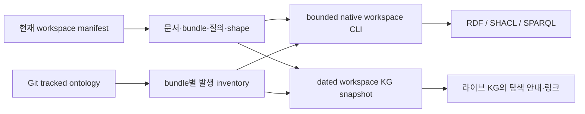

# HSWM KG와 작업환경 — 2026-09-22

이 문서는 **현재 자료를 찾고, 출처를 확인하고, 다음 작업을 실행하는 진입점**이다. 9월 13일의 고정 지식 지도를 보존하면서 9월 14–22일의 의미 이론·구현·Jev·심층 연구·작업 계획을 연결한다. 새로운 과학적 성과나 HSWM 상태 자체를 정의하는 문서가 아니다.

현재 공개 인터페이스는 [workspace manifest](../../ontology/workspace/HSWM_WORKSPACE.v1.json), `hswm-workspace` checkout 명령, [dated KG snapshot](../../ontology/development/HSWM_KG_WORKSPACE_2026-09-22.v1.json)이다. manifest에는 **읽기 진입점 21개, 기존 SPARQL 질의 별칭 45개, 명시적 개발 절차 12개**가 있다. 이는 전체 자료의 개수를 대신하는 수치가 아니다. 전체 tracked ontology는 별도 inventory로 관측한다.

## 무엇을 정리했는가

- 현재 읽을 자료와 과거 재현 자료를 한 manifest에서 구별한다. 문서·bundle·질의·shape 경로가 한 항목에서 연결된다.
- bundle 사이에서 같은 UID를 써도 원본 노드를 병합하지 않는다. `(bundle path, bundle SHA-256, node UID)`별 발생 위치를 찾는다.
- 출처가 현재 파일과 같은지, 달라졌는지, tracked 범위 밖인지 따로 표시한다. 오래된 hash를 새 파일 hash로 덮지 않는다.
- 실제 CLI로 목록·자료 상세·UID 위치·출처 비교·저장된 질의·구조 검증을 실행한다. 단순한 작업 목록 작성에서 사용할 수 있는 탐색 환경으로 확장했다.
- VS Code 작업 목록에 native build, workspace 확인, inventory, doctor, Jev ready 조회를 연결했다.
- node-level SHACL 오류의 `resultPath: null`을 처리하지 못하던 formatter를 고쳤다. 이제 정상적인 비적합 보고가 예외로 중단되지 않는다.

HSWM은 하나의 큰 AI, 하이퍼그래프 신경망 조직, LLM-function 기본 계산, hypergraph Semantic Weight 작동이라는 네 정체성을 유지한다. 큰 그래프가 AI 상태이고 작은 local input을 받은 LLM이 내부 연산자다. **이 작업환경의 KG는 그 목표를 연구하는 자료의 bounded projection**이다. 디렉터리, RDF node, MCP note, 검사 결과를 HSWM 인지·학습으로 승격하지 않는다.

## 바로 사용하는 명령

저장소 루트에서 실행한다. 다른 작업 디렉터리에서는 모든 명령에 `--checkout /path/to/HSWM`을 붙일 수 있다. build는 generated dist를 쓴다. workspace 명령은 stdout으로 관측 결과를 내보내며 model·server·package 설치·DB write·개발 workflow를 자동 실행하지 않는다.

```bash
npm --prefix src/hswm/effect-runtime run build

src/hswm/effect-runtime/bin/hswm-workspace status
src/hswm/effect-runtime/bin/hswm-workspace doctor
src/hswm/effect-runtime/bin/hswm-workspace show jev-plan
src/hswm/effect-runtime/bin/hswm-workspace query jev-plan ready
src/hswm/effect-runtime/bin/hswm-workspace bindings jev-plan
src/hswm/effect-runtime/bin/hswm-workspace validate jev-plan
```

| 명령 | 답하는 질문 | 범위와 결과 |
|---|---|---|
| `status` | 현재 무엇을 어디서 읽고 어떤 절차를 쓰나 | curated entry·query·workflow 목록; 작업을 실행하지 않음 |
| `doctor` | 진입 경로와 checkout 실행 환경이 준비됐나 | 선언/관측 Node 버전, 자료 가용성, package/check-out launcher, dist 존재 |
| `inventory` | tracked ontology에 어떤 bundle 발생이 있나 | `nodes`와 `relations` 배열을 가진 JSON의 개수·UID 발생·문제 보고 |
| `inventory --details` | 각 bundle의 원본과 참조는 무엇인가 | 실제 bytes SHA, node/anchor/relation 수, 명시적 binding·구조 이슈 |
| `inventory --uid UID` | 이 UID가 어느 snapshot에 등장하나 | path·bundle UID·현재 byte SHA; 합치거나 대표 owner를 고르지 않음 |
| `show ID` | 문서·질의·검증은 어디에 연결됐나 | 단일 manifest 항목과 bundle 요약 |
| `bindings ID` | snapshot에 기록된 출처와 현재 bytes가 같은가 | 각 expected/actual SHA와 비교 상태; 과거 무결성 판정과 구별 |
| `query ID ALIAS` | 등록된 질문의 답은 무엇인가 | 단일 bundle의 native RDF 1.1 projection·SPARQL 1.1 결과 |
| `validate ID` | 명시한 구조 계약이 성립하나 | inventory 이슈와 등록한 SHACL 결과; binding 비교는 별도 필드 |

Jev 계획의 `ready`는 최초 상태에서 B00/B01/B02를 돌려준다. 이들은 기준선·모델 환경·비교 대상 확인 작업이다. CLI가 이 결과를 보고 모델 실험을 시작하지 않는다. 계획 수행과 실제 evidence를 기록하는 일은 별도의 outcome-bound 작업이다.

## 자료를 읽는 순서

| ID | 자료와 읽는 목적 | lane | 조회 수 |
|---|---|---|---|
| `identity` | [HSWM 네 가지 사용자 정체성](../../docs/canon/USER_PRIMARY_HSWM_HYPERGRAPH_NEURAL_AI_2026-09-14.md) | IDENTITY | 1 |
| `state-operator` | [큰 그래프 상태·국소 LLM·Hyperon](../../docs/canon/USER_PRIMARY_HSWM_STATE_LOCAL_OPERATOR_HYPERON_2026-09-14.md) | IDENTITY | 2 |
| `fractal` | [FCL-1..8와 과학적 연결](../../docs/research/HSWM_FRACTAL_SCIENTIFIC_CONNECTIONS_2026-08-28.md) | IDENTITY | 0 |
| `strategy` | [목표 유지·기전 교체·실패 보존](../../docs/canon/HSWM_ADAPTIVE_RESEARCH_STRATEGY_2026-08-30.md) | IDENTITY | 0 |
| `semantic-theory` | [Semantic Weight 이론·CR 의무](../../docs/research/HSWM_SEMANTIC_WEIGHT_THEORETICAL_FOUNDATIONS_2026-09-14.md) | THEORY | 3 |
| `semantic-definition` | [정의·hypergraph 표현·반례](../../docs/research/HSWM_SEMANTIC_WEIGHT_DEFINITION_AND_HYPERGRAPH_2026-09-14.md) | THEORY | 1 |
| `constructive-proof` | [유한 learner/refinement와 남은 전제](../../docs/research/HSWM_SEMANTIC_WEIGHT_CONSTRUCTIVE_PROOF_2026-09-14.md) | THEORY | 1 |
| `performance-proof` | [문헌 결과와 HSWM 전이 의무](../../docs/research/HSWM_LITERATURE_TO_PERFORMANCE_PROOF_2026-09-14.md) | THEORY | 2 |
| `frontier-proof` | [상관 오류·관계 생성·재귀 학습](../../docs/research/HSWM_SEMANTIC_FRONTIER_PROOFS_2026-09-14.md) | THEORY | 2 |
| `semantic-engine` | [LLM 의미 실행 연구](../../docs/research/HSWM_LLM_SEMANTIC_ENGINE_RESEARCH_2026-09-14.md) | RESEARCH | 1 |
| `semantic-runtime` | [LLM 의미 그래프 구현](../../docs/research/HSWM_LLM_SEMANTIC_GRAPH_IMPLEMENTATION_2026-09-14.md) | ENGINEERING | 1 |
| `proof-frontier` | [다음 증명 연구의 미해결 의무](../../docs/research/HSWM_NEXT_PROOF_RESEARCH_2026-09-15.md) | RESEARCH | 1 |
| `proof-plan` | [기존 22개 증명·통합 작업](../../docs/operations/HSWM_SEMANTIC_PROOF_WORK_PLAN_2026-09-15.md) | PLAN | 1 |
| `research-integration` | [9/20 Jev·DGX·연구 연결](../../docs/research/HSWM_RESEARCH_INTEGRATION_2026-09-20.md) | RESEARCH | 4 |
| `jev-observations` | [Jev 원리·9/21 관측과 실패](../../docs/research/HSWM_JEV_PRINCIPLES_2026-09-21.md) | RESEARCH | 4 |
| `jev-graph` | [Jev 표준 그래프 연결](../../docs/research/HSWM_JEV_GRAPH_ENGINEERING_2026-09-22.md) | RESEARCH | 5 |
| `deep-research` | [W1–W5 심층 연구와 protocol](../../docs/research/HSWM_DEEP_RESEARCH_AND_REALIZATION_2026-09-22.md) | RESEARCH | 4 |
| `jev-plan` | [Jev 통합 30개 작업과 조건](../../docs/operations/HSWM_JEV_RESEARCH_WORK_PLAN_2026-09-22.md) | PLAN | 6 |
| `knowledge-map-0913` | [9/13 고정 지식 지도](../../docs/operations/HSWM_KNOWLEDGE_MAP_2026-09-13.md) | HISTORY | 6 |
| `engineering-0913` | [9/13 native engineering snapshot](../../docs/operations/HSWM_NATIVE_ENGINEERING_CHECKPOINT_2026-09-13.md) | HISTORY | 0 |
| `graph-contracts` | [기존 그래프·loop engineering v6](../../docs/operations/HSWM_STANDARD_TOOLCHAIN_POLICY_2026-09-02.md) | ENGINEERING | 0 |

`fractal`은 과거 `created_at` metadata가 strict native v2 format 밖에 있어 **SOURCE_ONLY**로 명시했다. `show`, `bindings`, inventory로 원본을 읽으며 `validate`는 사유와 exit 2를 반환한다. 나머지 20개 진입점의 v2 구조 검사와 등록된 45개 질의는 실제 실행으로 확인했다. 원본을 현재 schema에 맞춰 소급 수정하지 않았다.

`HISTORY`는 명시적으로 고정된 재현 경로다. 나머지 lane은 주제 분류이며 과학적 검증 수준이나 실험 성공 상태가 아니다. 날짜가 최신이라는 이유만으로 이전 근거를 무효화하거나 USER_PRIMARY 권위를 부여하지 않는다.

### Jev 연구를 이어갈 때

1. `identity`, `state-operator`, `strategy`로 사용자 목표·상태/연산자·실패 처리 방향을 읽는다.
2. `semantic-theory`와 `semantic-definition`에서 Semantic Weight, scores, causal estimands, evidence의 구분을 확인한다.
3. `jev-observations`에서 의미 변경 부재·형식 confound·비결정성 등 기존 관측을 확인한다.
4. `jev-graph`, `deep-research`로 P1–P6와 W1–W5의 연결 및 transfer obligation을 읽는다.
5. `jev-plan`의 입력·산출물·조건·실패 경로를 조회하고 한 작업을 선택한다. `proof-plan`의 22개 과거 task와 현재 task는 서로 다른 plan namespace다.

공동 출력 실험 설계와 관계 교정 설계는 병행할 수 있다. 두 scale의 학습 평가는 해당 구성에서의 국소 학습·읽기·joint law 근거가 필요하다. 계획 그래프 검증이 그 경험적 근거를 대신하지 않는다.

## 출처 상태를 해석하는 법

| binding 상태 | 실제 관측 | 해야 할 일 |
|---|---|---|
| `MATCH` | expected SHA와 현재 tracked 파일 bytes 일치 | 해당 byte binding만 확인된 것; 문장의 참·효능은 별도 |
| `WORKTREE_DIFFERS` | 파일은 있지만 현재 SHA가 다름 | source cut·기록된 Git 원문·후속 snapshot을 확인; 과거 기록 보존 |
| `NOT_TRACKED_NOT_READ` | 선언된 경로가 이번 Git tracked allowlist에 없음 | 읽지 않음. private·ignored·옛 경로·미추적 파일 가능성을 구분해 후속 확인 |
| `NO_EXPECTED_DIGEST` | 비교할 digest가 명시되지 않음 | 일치로 세지 않음; 원본 format과 provenance를 읽음 |
| `UNAVAILABLE` | tracked 경로의 bounded regular-file read가 실패 | 삭제·symlink·권한·크기 한계 등을 조사; 무조건 손상으로 부르지 않음 |

SHA 일치는 현재 bytes 비교다. `WORKTREE_DIFFERS`는 역사적 snapshot의 실패와 동의어가 아니다. 역사적 출처의 무결성을 말하려면 그 snapshot이 지정한 Git cut·고정 원문에서 별도 재현해야 한다. `sourceCut`은 원본이 명시한 commit/base 값이며 모든 binding을 복원하는 완전한 recipe라는 보장은 없다.

`validate`의 exit 0은 등록한 **구조 검사** 통과를 뜻한다. `worktreeBindingsMatch`와 `bindingSummary`도 함께 확인한다. 현행 provenance의 엄격한 승격·게시를 자동 판단하는 명령은 아니다. 현재 변경을 연구 근거에 반영할 때는 새 dated snapshot을 만들고 기존 source pin을 소급 변경하지 않는다.

예를 들어 이번 SHACL formatter 수정으로 과거 native-engineering snapshot이 결속한 runtime SHA와 현재 SHA가 달라진다. 과거 검사 결과를 수정하지 않고 이번 새 출처·수정·회귀 검증을 별도 기록한다.

## 전체 inventory와 중복 UID

초기 조사에서 Git-tracked ontology JSON 212개 중 `nodes`/`relations` 배열 계약에 해당하는 101개를 관측했다. node occurrence는 6,216개이고 여러 발생을 가진 UID는 48개였다. 이것은 101개의 새 연구나 6,216개의 인지 능력을 뜻하지 않는다. 보다 넓은 파일명/필드 기반 조사와는 format 분모가 다르다.

v23–v25 handoff 같은 일부 과거 파일은 현재 inventory가 기대하는 node UID 계약과 다른 구조를 가진다. v2 handoff의 외부 endpoint처럼 단일 파일 안에서 해결되지 않는 참조도 있다. 이들은 source별 이슈로 표시한다. 모든 historical bundle이 현재 v2 profile을 통과한다고 주장하지 않으며, 원본의 재현 가능성을 보존한다.

```bash
src/hswm/effect-runtime/bin/hswm-workspace inventory --details
src/hswm/effect-runtime/bin/hswm-workspace inventory \
  --uid sym:Concept:hswm-fractal-law-local-causal-learning
```

inventory는 Git이 추적하는 `ontology/**/*.json`만 조사한다. ignored model, private SQLite, raw trace, credentials, `.hswm-local` 내부를 재귀 수집하지 않는다. 각 읽기는 크기 제한과 regular-file 검사, checkout realpath 범위를 적용한다. 동일 UID를 다른 snapshot에서 찾는 것과 single bundle 내부의 잘못된 중복을 구별한다. 모든 bundle의 노드를 하나로 union해 상태나 책임 owner를 선택하지 않는다.

새 [workspace inventory snapshot](artifacts/hswm_workspace_2026-09-22/inventory.v1.json)은 그 시점에 관측한 source bytes와 발생을 기록한다. 동적 CLI inventory는 후속 commit 이후 달라질 수 있다. 명시한 source cut과 source hash를 비교하여 두 관측의 범위를 구분한다.

## 개발 작업환경

활성 runtime은 TypeScript/Effect다. 순수 inventory·manifest 해석은 domain 함수에, 파일/Git I/O는 기존 typed Effect POSIX service에 두었다. 직접 Neo4j·일반 SQL·임의 shell command를 workspace 인터페이스에 추가하지 않았다. package.json의 진행 중인 사용자 수정과 별개로 사용할 수 있도록 이번 명령은 **checkout launcher**로 제공한다.

개발할 때는 기존 `hswm-dev` 흐름을 사용한다.

```bash
src/hswm/effect-runtime/bin/hswm-dev hswm plan --focus ontology --task '<task>'
src/hswm/effect-runtime/bin/hswm-dev hswm run --focus ontology --task '<task>'
src/hswm/effect-runtime/bin/hswm-dev hswm status
src/hswm/effect-runtime/bin/hswm-dev hswm feedback \
  --episode '<id>' --success true --source 'agent(codex):<구체적 유용성 판단>'
```

현재 native v4 경로는 runtime/usl/ontology/docs 검사에 각각 npm의 `test:adaptive`, `test:usl`, `test:ontology`, `test:docs`를 사용한다. 과거 문서의 Python routing 설명을 현행 동작으로 읽지 않는다. Python 비교 실험과 legacy replay 경로는 여전히 별도로 존재한다.

`doctor`가 보고한 실제 환경은 Node 24.20.0이고 package의 선언은 24.13.0이었다. 해당 checkout에서 build와 관련 검사를 수행하되, 정확한 버전 일치를 주장하지 않는다. 환경을 자동 교체하지 않는다. bootstrap 설치가 필요한 다른 checkout은 기존 lockfile 기반 설치 후 build해야 한다. 관측된 package launcher 중 5개는 package 설치 표면이며 checkout wrapper가 없다. 이를 모두 깨진 명령으로 간주하거나 위험한 action launcher를 새로 활성화하지 않는다.

VS Code의 [tasks.json](../../.vscode/tasks.json)에서 다음 작업을 바로 선택할 수 있다.

- `HSWM: build native runtime`
- `HSWM: workspace status`
- `HSWM: workspace inventory`
- `HSWM: workspace doctor`
- `HSWM: Jev plan ready work`

기존 Python 환경 준비, TypeScript/Effect 검사, changed/watch test 작업도 유지한다. Python 환경 준비는 설치 작업이고 build는 generated output을 쓰며, 검사 도구는 cache를 갱신할 수 있다.

## 표준·로컬 KG·라이브 KG의 관계

[RDF 1.1](https://www.w3.org/TR/rdf11-concepts/)의 그래프 모델, [SHACL 1.0](https://www.w3.org/TR/shacl/)의 구조 계약, [SPARQL 1.1](https://www.w3.org/TR/sparql11-query/)의 질의, [PROV-O](https://www.w3.org/TR/prov-o/)의 출처 관계를 기존 도구로 재사용한다. workspace role·상태·entry ID는 HSWM 로컬 어휘다. 이 어휘를 W3C가 정한 연구 절차나 성공 기준으로 부르지 않는다. draft 표준으로의 migration이나 새 package 설치는 하지 않았다.



라이브 KG 검색에서는 9월 13일 지식 지도와 기존 Jev 자료를 확인했다. 9월 22일 work-plan 이름에 대한 검색 결과가 없었던 것은 해당 검색 범위의 관측이며 DB 전체 부재 증명이 아니다. 이번 정리의 라이브 반영은 새 workspace의 source-pinned 탐색 안내와 기존 HSWM·저장소·지도·Jev 기록으로의 링크로 제한한다. 사용자 정전이나 기존 canonical record를 덮어쓰지 않는다. 전체 로컬 bundle을 라이브 KG에 동일하게 복제했다고 주장하지 않는다.

라이브 탐색 안내는 `SECONDARY_AI / PENDING_OR_PRELIMINARY`다. bounded MCP로 조회할 수 있는 공개 안내와 실제 실행 중인 HSWM canonical state는 다르다. [publication receipt](artifacts/hswm_workspace_2026-09-22/publication.v1.json)에 실제 수행 여부·UID·source revision·readback을 남긴다.

## 검증과 변경 후 유지

- [workspace KG와 다섯 조회](../../ontology/queries/hswm_workspace_2026-09-22/): 진입점, bundle/binding, UID 발생, 명령 표면, 미해결 관측.
- [검증 기록](artifacts/hswm_workspace_2026-09-22/validation.v1.json): build·타입/경계·실제 임시 checkout 통합 검사·기존 ontology 검사·projection 범위.
- [graph 검증](artifacts/hswm_workspace_2026-09-22/graph-validation.v1.json): exact source bytes, nonvacuous root SHACL, 질의 결과. 구조 검증을 원본 과학적 주장 검증으로 확대하지 않는다.

새 연구 진입점을 추가할 때는 manifest 항목에 ID·lane·문서·bundle·query 별칭·shape를 명시하고 `doctor`, 해당 `show/query/validate`, 필요한 회귀검사를 수행한다. dynamic inventory는 tracked source 추가를 자동 발견하지만 과학적 상태·권위를 자동 분류하지 않는다. 공개 결과가 필요한 변경은 새 source-bound snapshot으로 기록한다. raw private runtime 결과와 사용자가 작업 중인 파일을 정리라는 이유로 이동·삭제·게시하지 않는다.
