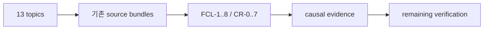

# HSWM 지식 맵 — 2026-09-13

> **상태:** `SECONDARY_AI / SOURCE-BOUND NAVIGATION`
>
> **source cut:** `5cb22703cf42128dd204966087594ad8561a554d`
>
> **root UID:** `sym:AbstractNode:hswm-knowledge-map-2026-09-13`
>
> **범위:** inventory 246개(ontology 76, docs 161, explicit 9)의 source entrypoint를
> 연결한 탐색용 지도다. root projection은 287 nodes, 73 anchors, 510 relations를
> 선언한다. 새 HSWM 기전, 새 scientific result, 새 canonical admission을 만들지 않는다.

## 이 문서의 역할

HSWM에는 이미 정체성, FCL, 실험 gate, closure plan, proof obligation, relation
research, Effect runtime, ICE, standards projection이 여러 source-bound bundle에 있다.
이 문서는 그것들을 새로 설계한 것처럼 다시 말하지 않고, 어느 자료가 현재 target인지,
어느 것이 구현인지, 어느 것이 조건부 형식화인지, 어느 것이 실험 결과 또는 미측정인지
한 곳에서 읽을 수 있게 한다.

현재 topic source는
[`HSWM_KNOWLEDGE_MAP_TOPICS_2026-09-13.v1.json`](../../ontology/knowledge_map/HSWM_KNOWLEDGE_MAP_TOPICS_2026-09-13.v1.json)이다.
그 JSON의 `authority`는 `SECONDARY_AI`다. USER_PRIMARY는 Constitution과 adaptive
strategy가 결속한 target commitment에 한정하며, 이 지도 자체가 그 권위를 늘리거나
과학적 상태를 승격하지 않는다.

HSWM의 target은 하나의 token-native LLM-function macro-neural network다. evolving
canonical hypergraph가 living harness, world model, continuous learner 역할을 함께 한다.
현재 구현의 성공 주장과 이 target identity를 혼동하지 않는다.



## 현재 토픽 지도

| 토픽 | 설계 상태 | 구현 상태 | 형식 상태 | 효능 상태 |
|---|---|---|---|---|
| Target identity·authority | USER_PRIMARY target, 방법은 교체 가능 | 단일 구현이 target 실현을 주장하지 않음 | atom/owner/lineage 계약은 candidate | UNJUDGED |
| Fractal composition·philosophy | FCL-1..8 target-side test | two-scale realization 없음 | bridge hypothesis 존재, 통합 closure 없음 | SCIENTIFICALLY_CONNECTED / INTEGRATED_CLAIM_UNJUDGED |
| Conceptual C1-C3·conditional capability | draft/proposed | 해당 bundle은 구현 주장 없음 | 관계·제약 vocabulary | UNJUDGED |
| Causal-composition spine | G0-G6·CF-01..14 proposed tests | 일부 local instrument만 존재 | claim ceiling/control contract 명시 | G0 NOT_PASSED, G1 NOT_EVALUATED |
| Closure plan·adversarial audit | D-1/D-3/D-4 ratified, S-5/S-6 open | S-2/S-3/S-4 complete record | source-bound planning/audit graph | v1 done state 미도달 |
| Opaque identifiability·negative results | frozen occurrence와 rule revision 보존 | local Permit/remove/restore/receipt 경로 실행 | canonical admission·external adjudication 아님 | NO_EFFICACY_INFERENCE |
| Constructive realizability·proof | CR-0..CR-7 prospective | proof artifacts가 runtime 구현을 뜻하지 않음 | bounded conditional models checked | UNJUDGED, prior RED preserved |
| Relation RU-1·LLM calibration | RU-1 draft, calibration protocol ready | TS/Effect runner·finite DSL local result | no canonical credit/admission | local qualification only; live LLM 0 calls |
| Native Effect runtime·ICE | work package/remediation scope | ICE WP0-WP3 implemented | contracts do not identify causal effect | local engineering, efficacy unjudged |
| Graph engineering·standards | local engineering path | v6 projection documents local implementation | standards/invariants engineering checks | scientifically unjudged |
| Research coordination·USL | bounded coordinator/adapter design | research graph verified; USL bridge unexecuted | SHACL/exchange validate records | local engineering only |
| Learning literature·frontier baselines | comparator/mechanism framing | no promoted frontier result | literature bridges untested | UNJUDGED |
| Historical evidence·RED·projects | retained historical lineage | heterogeneous historical closure | mixed conditional artifacts | P1 RED within scope; others non-efficacy |

## 이미 있는 16개 핵심 계약

새 FCL 또는 proof program을 만들 필요가 없다. 다음 16개는 기존 bundle을 재사용해야 한다.

1. **FCL-1..FCL-8** — local causal learning, composition preservation, emergent
   coalition, multiscale credit, topology morphogenesis, world-self co-model,
   diachronic continuity, HSWM-of-HSWMs. Root는
   `sym:AbstractNode:hswm-fractal-scientific-connections-ontology-2026-08-28`이며
   각 law UID는 `sym:Concept:hswm-fractal-law-*`다.
2. **CR-0..CR-7** — concrete Step/Learn safety, constructive improvement, causal
   identification, multiscale credit, coalition/topology, world-self continuity,
   composition/effect preservation, simultaneous witness/external validity.
   Root는 `sym:AbstractNode:hswm-constructive-realizability-program-2026-09-10`다.

FCL은 최종 target-side operational obligation이고, CR은 그것을 구성·증명 가능한
형태로 좁히는 proof-program obligation이다. 둘 다 passing test 수, KG node 수, 문서
증가, local workflow verification으로 통과하지 않는다.

## 무엇이 실제로 있는가

- Constitution과 adaptive strategy가 target과 replaceable mechanism boundary를 제공한다.
- causal-composition ontology가 G0-G6, CF-01..CF-14, confound axis, claim ceiling을
  제공한다.
- v5 closure bundle이 D-1/D-3/D-4, S-2/S-3/S-4, S-5/S-6, open gaps와 historical
  audit finding을 현재 status reading으로 제공한다.
- opaque v5는 declared opaque task에서 local state-readout candidate를 관측했다.
  G0-external, held-out behavior, HSWM canonical revision, G1은 통과하지 않았다.
- USL relation instrument는 authored finite DSL/transport qualification을 수행했지만
  information-matched native learner와 동률이고 strong live-LLM comparator는 아직 없다.
- constructive round 1은 CR-1/CR-2/CR-6의 conditional finite model만 다뤘다.
- ICE WP0-WP3와 native research coordination은 local engineering 구현이다.

## 진짜 남은 간극

1. D-4의 한 run: independently attributable outcome → credit → real Permit 경유
   durable canonical revision → changed **held-out** behavior를 exact remove/restore와
   sham 대조로 함께 보여야 한다.
2. 강한 native-history, text, program, frozen-policy 대조를 같은 prior experience와
   총 resource bound에서 비교해야 한다. RU-1은 아직 cohort, model, evaluator custody,
   primary metric, sample size가 없다.
3. G0-external의 named second party와 independent replay가 남아 있다. OS-user
   separation만으로 external custody가 되지 않는다.
4. CR-2..CR-7의 구성적 premise, 특히 multiscale credit, useful topology,
   world-self continuity, FCL-2/FCL-8 effect-preserving composition이 열려 있다.
5. 두 scale에서 wrapper, pairwise, fixed-router, shuffled-credit, topology-fixed,
   lineage-copy null을 넘는 bounded macro effect가 아직 없다.

P1 scalar slow-weight RED는 그 exact mechanism family의 실패로 보존한다. opaque
instrument saturation, USL authored-task tie, B0/B2 floor 또는 measurement failure는
각각 그 범위에서의 `UNDERDETERMINED`/no-efficacy evidence이며, scale 확대나 graph
크기로 upstream failure를 구제하지 않는다.

## 개발 순서

1. **현재 state를 읽는다.** Target은 adaptive strategy와 Constitution, active closure는
   v5, evidence status는 F1/R8와 result source에서 읽는다.
2. **하나의 mechanism을 고른다.** existing MF family 또는 RU-1 같은 explicit
   successor를 predecessor evidence와 conceptual delta에 연결한다.
3. **실험 계약을 먼저 닫는다.** source cutoff, evaluator custody, held-out cohort,
   arm, budget, stop rule, outcome, remove/restore/sham/null을 outcome 전 고정한다.
4. **G0/G1/D-4를 실행한다.** local engineering success, test pass, projection publish를
   efficacy result로 대체하지 않는다.
5. **범위 한정 판정 뒤에만 다음 scale로 간다.** valid RED는 mechanism을 retire/reroute하고,
   bounded support도 FCL-8이나 integrated claim을 자동 승인하지 않는다.
6. **FCL/CR composition을 시험한다.** two-scale composition은 same-type contract,
   macro intervention, outcome-bound revision, lineage/rights preservation을 함께
   측정해야 한다.

## 주요 entrypoint와 기존 UID

| 읽기 시작점 | 용도 | 대표 UID |
|---|---|---|
| [`HSWM_ADAPTIVE_RESEARCH_STRATEGY_ONTOLOGY.v1.json`](../../ontology/identity/hswm_core/HSWM_ADAPTIVE_RESEARCH_STRATEGY_ONTOLOGY.v1.json) | target·MF·reroute | `sym:AbstractNode:hswm-adaptive-research-strategy-ontology-2026-08-30` |
| [`HSWM_FRACTAL_SCIENTIFIC_CONNECTIONS_ONTOLOGY.v1.json`](../../ontology/identity/human_universal_body/HSWM_FRACTAL_SCIENTIFIC_CONNECTIONS_ONTOLOGY.v1.json) | FCL/source/null | `sym:AbstractNode:hswm-fractal-scientific-connections-ontology-2026-08-28` |
| [`HSWM_CAUSAL_COMPOSITION_RESEARCH_ONTOLOGY.v1.json`](../../ontology/identity/hswm_core/HSWM_CAUSAL_COMPOSITION_RESEARCH_ONTOLOGY.v1.json) | G0-G6/CF | `sym:ResearchProgram:hswm-causal-composition-research-2026-08-29` |
| [`HSWM_CLOSURE_PLAN_ONTOLOGY.v5.json`](../../ontology/identity/hswm_core/HSWM_CLOSURE_PLAN_ONTOLOGY.v5.json) | current closure | `sym:AbstractNode:hswm-closure-plan-ontology-2026-09-05-v5` |
| [`HSWM_CONSTRUCTIVE_REALIZABILITY_PROGRAM_2026-09-10.v1.json`](../../ontology/evidence/HSWM_CONSTRUCTIVE_REALIZABILITY_PROGRAM_2026-09-10.v1.json) | CR obligation | `sym:AbstractNode:hswm-constructive-realizability-program-2026-09-10` |
| [`HSWM_RELATION_RESEARCH_ROUND_1_2026-09-10.v1.json`](../../ontology/evidence/HSWM_RELATION_RESEARCH_ROUND_1_2026-09-10.v1.json) | relation reroute | `sym:AbstractNode:hswm-relation-research-round-1-2026-09-10` |
| [`HSWM_ICE_GRAPH_IMPLEMENTATION_WP0_3_2026-09-08.v1.json`](../../ontology/evidence/HSWM_ICE_GRAPH_IMPLEMENTATION_WP0_3_2026-09-08.v1.json) | local runtime/ICE | `sym:AbstractNode:hswm-ice-graph-implementation-wp0-3-2026-09-08-v1` |
| [`HSWM_RESEARCH_COORDINATION_2026-09-09.v1.json`](../../ontology/infrastructure/HSWM_RESEARCH_COORDINATION_2026-09-09.v1.json) | standard graph workflow | `sym:AbstractNode:hswm-research-coordination-2026-09-09` |

전체 원문은 [246개 문서·자료 목록](artifacts/hswm_knowledge_map_2026-09-13/source-index.md)에서 읽는다.
경로·SHA-256·원문 상태는 [source-catalog.json](artifacts/hswm_knowledge_map_2026-09-13/source-catalog.json)에,
6개 주제 질의의 SPARQL/Cypher 쌍은
[`ontology/queries/hswm_knowledge_map_2026-09-13/`](../../ontology/queries/hswm_knowledge_map_2026-09-13/)에 둔다.

## 표준 graph와 USL의 경계

graph-local projection은 [RDF 1.1 Concepts](https://www.w3.org/TR/rdf11-concepts/),
[N-Quads 1.1](https://www.w3.org/TR/n-quads/), [SHACL](https://www.w3.org/TR/shacl/),
[PROV-O](https://www.w3.org/TR/prov-o/)의 표준 교환/검증 어휘를 사용한다. JSON-LD는 현재
provenance envelope에만 쓰며, full graph JSON-LD export가 아니다.

| 표면 | 현재 상태 | 경계 |
|---|---|---|
| USL semantic bridge | `SECONDARY_AI_CONCEPTUAL_PROPOSAL_NOT_EXECUTED` | `sym:AbstractNode:hswm-usl-bridge-2026-09-07-v1`은 concept이며 HSWM canonical state나 cognition이 아님 |
| Native USL adapter v2 | 실제 local adapter/instrument 경로 | [USL latest adversarial review](../research/HSWM_USL_LATEST_ADVERSARIAL_REVIEW_2026-09-08.md)가 기록한 adapter boundary이며, source-authenticated external meaning이나 efficacy를 자동 보장하지 않음 |

## 생성·검증 방법

재생성은 다음 명령으로 수행한다.

```bash
src/hswm/development/bin/hswm-python graph python -m hswm.infrastructure.knowledge_map_projection
src/hswm/development/bin/hswm-python graph python -m hswm.infrastructure.knowledge_map_projection --check
```

builder는 topic source와 inventory 246개(ontology 76, docs 161, explicit 9)를 읽어
다음 graph-local 산출물을 생성·검증한다.

- ontology bundle: `ontology/knowledge_map/HSWM_KNOWLEDGE_MAP_2026-09-13.v1.json`
- artifact directory: `docs/operations/artifacts/hswm_knowledge_map_2026-09-13/`
- root UID `sym:AbstractNode:hswm-knowledge-map-2026-09-13`의 287 nodes, 73 anchors,
  523 relations와 source catalog의 declared-scope count를 source-bound descriptor로 검증한다.
- source cut `5cb22703cf42128dd204966087594ad8561a554d`와 entrypoint path/digest를
  source-bound descriptor로 보존한다.
- historical source bytes는 rewrite하지 않고, closure v1-v4, graph-and-loop v1-v5,
  ICE remediation v1, session-ledger v1의 successor relation만 기록한다.
- projection validation은 schema, exact UID/path binding, status vocabulary,
  historical override, duplicate topic/entrypoint handling을 검사한다.

원본 bundle의 node를 합쳐 재소유하지 않고, 이 지도의 source descriptor와 기존 UID를 연결한다.
73개 anchor는 실제 조회한 identity reference이며 원문 revision과 현재 KG revision이 같다는 보장이 아니다.
source catalog가 고정 Git 원문과 curation input·질의의 SHA-256을 결속한다.

[검증 결과](artifacts/hswm_knowledge_map_2026-09-13/validation.json)에서 SHACL 통과와
Q1 13개 주제, Q3 16개 의무, Q4 1개 원문/탐색 상태 불일치를 확인할 수 있다.
Q4의 불일치는 과거 `CANONICAL_TARGET_*` 표기의 fixed-role 원문을 현재 retired로
분류한 것으로, 원문을 조용히 고치지 않고 보존한 결과다. Q6의 미해결 참조 40개는
원문 부재를 의미하지 않는다. 게시 전의 고유 UID 조회 115개 중 73개는 존재했고 42개는
조회되지 않았으며, Q6는 그중 source bundle UID만 대상으로 한다.

재생성 검사는 별도 프로세스에서도 동일한 산출물 bytes를 확인한다. Q3의 집합 집계 값은
SPARQL이 순서를 보장하지 않으므로 결과 파일에서 사전순으로 정렬한다.
검증·게시·질의 성공은 HSWM cognition, causal credit, learning efficacy, FCL pass가 아니다.

## 라이브 KG에서 사용하기

[게시 기록](artifacts/hswm_knowledge_map_2026-09-13/publication.json)은 287개 node와
523개 relation의 생성 및 같은 transaction 안의 exact readback을 기록한다.
[라이브 Cypher 결과](artifacts/hswm_knowledge_map_2026-09-13/live-query-results.json)의 6개
질의는 로컬 SPARQL과 각각 13/40/16/1/16/40행으로 일치한다. Q2의 40행은 38개
현재 진입점 중 여러 주제에 연결되는 경로를 포함한 주제–원문 쌍이다.

MCP에서는 `HSWM 전체 지식 지도`를 `include_preliminary=true`로 검색한다.
공개 분류를 명시한 진입점 UID는 `sym:AbstractNode:hswm-knowledge-map-discovery-2026-09-13`이다.
이 [discovery bundle](../../ontology/knowledge_map/HSWM_KNOWLEDGE_MAP_DISCOVERY_2026-09-13.v1.json)은
원 지도 digest를 결속한 별도 1-node 참조다. 전체 metadata node는 자동으로 MCP 공개
분류를 얻지 않으며, 전체 탐색은 위 원문 목록·RDF·SPARQL·Cypher 표면을 사용한다.
[엔지니어링 검증 기록](artifacts/hswm_knowledge_map_2026-09-13/engineering-verification.json)은
회귀검사, 자체 개발 workflow의 agent feedback, 독립 검토에서 보완한 항목을 구분한다.
