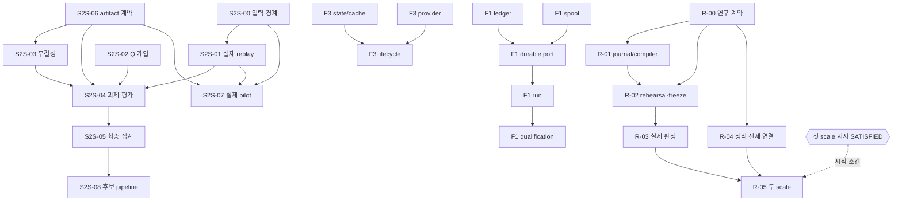

# HSWM 다음 개발: 소스에 결속된 표준 그래프 계획

상태: **계획 작성, 구현·실험 미실행**. 기준 소스는
`f0d1e2c3c0f33a0ceeb5852d6a67f3d420a62e5e`이다. 사용자 요청은 계획의
USER_PRIMARY 출처이며, 아래 분해·순서·완료 판정은 SECONDARY_AI 제안이다.

다음 개발을 **27개 작업, 4개 미해결 결정, 기존 감사의 12개 항목**으로 연결했다.
먼저 `S2S-00`의 재현된 입력 경계 결함을 고치고, 독립적인 `F1-LEDGER`와
`R-00`의 연구 계약 선택을 병행한다. 전체 TS/Effect 이식과 D-4 연구에는 각각의
완료 조건이 있다. 이식 전체 완료를 연구 시작의 선행 조건으로 두지 않는다.

- [기계 판독 계획과 원본 소스 해시](../../_research/native_development_plan_2026-09-13/development-plan.v1.json)
- [27개 작업별 입력·출력·책임·선행·반례·실패 처리](artifacts/hswm_next_development_plan_2026-09-13/work-packages.md)
- [KG 번들](../../ontology/development/HSWM_NEXT_DEVELOPMENT_GRAPH_PLAN_2026-09-13.v1.json), [RDF·PROV 파생 투영](../../ontology/projections/hswm_next_development_plan_2026-09-13/)
- [구조 제약](../../schemas/HSWM_NEXT_DEVELOPMENT_PLAN_SHACL_1_0.v1.ttl), [계획 조회·위반 탐지 질의](../../ontology/queries/hswm_next_development_plan_2026-09-13/)
- [실제 검증 결과](../../_research/native_development_plan_2026-09-13/validation.v1.json)

## 목표와 이번 계획의 변화

[헌장](../canon/HSWM_CONSTITUTION_2026-08-20.md)의 HSWM은 token-native
LLM-function macro-neural network 하나이며, 진화하는 hypergraph가 living harness,
world model, continuous learner 역할을 함께 수행한다. 고정된 옛 H/W/A/F/Π 분해로
개발 범위를 다시 나누지 않는다. schema에 맞는 atom, atom별 정확히 한 책임 소유자,
typed reference, 출처가 있는 전이, outcome→credit→revision→후속 행동의 연결을 따른다.

[FCL-1..8](../research/HSWM_FRACTAL_SCIENTIFIC_CONNECTIONS_2026-08-28.md)과
[적응적 연구 전략](../canon/HSWM_ADAPTIVE_RESEARCH_STRATEGY_2026-08-30.md)은 유지한다.
현재 증거의 상한은 `SCIENTIFICALLY_CONNECTED / INTEGRATED_CLAIM_UNJUDGED`이다.
재귀 합성·의식·자아·규모 불변의 인과적 폐쇄를 이미 구현했다고 주장하지 않는다.

이번 변화는 새 인지 아키텍처의 도입이 아니다. 감사에서 발견한 빈칸마다
**근거 → 작업 → 책임 역할 → 입력/예상 출력 → 필수 의존성 → 완료 기준 → 검증 근거**를
명시한다. 계획상의 책임 역할은 구현 책임의 제안 주소이며 실제 담당자 배정이나
canonical atom 소유권 부여가 아니다. KG, MCP, 검사 통과는 인지·학습·인과적 기여의 증거가 아니다.

## 현재 상태에서 닫아야 할 경계

근거는 [전체 범위 감사](HSWM_OVERALL_SCOPE_AUDIT_2026-09-13.md)와 그 해시 결속 소스다.
기존에 구현된 기능을 새 작업의 산출물로 중복 계산하지 않는다.

| 분야 | 재사용하는 현재 상태 | 이번 계획에서의 완료 조건 |
| --- | --- | --- |
| S2S | native fit·모델 archive·CLI 검증 | 실제 재학습 replay, Q 제거/복원, 무결성, 과제 점수, bootstrap, pilot와 최종 후보 실행을 각각 닫는다. Python과 다른 gradient 경로를 원본 replay와 동일하다고 부르지 않는다. |
| F1 | offline judge와 호출·meter 구성요소 | 원본 SQLite 호출/item audit, durable spool, 3단계 호출, 실제 tokenizer 자격, `run`, 중단 후 복구까지 연결한다. `judge` 통과나 HTTP 한 번 성공으로 대체하지 않는다. |
| F3 | cache/chat 경계와 주입 가능한 구성요소 | 상태·budget 소유, provider 계약, world→lesson→retrieval→evaluation 실행 수명을 연결한다. |
| 운영 | native 개발 CLI와 그래프 도구 | confirmatory의 register/confirm/adjudicate, graph/math/bootstrap/CI, 설치된 8개 console의 실제 호출 경계를 개별 확인한다. |
| D-4 | 일부 국소 적응·측정과 D-4 초안 | 같은 실행에서 귀속 가능한 outcome, credit, 단일 canonical journal의 revision, 진짜 held-out 행동 변화 및 개입 대조군을 검증한다. |
| 형식·프랙탈 | 범위가 제한된 Lean 성과 | 같은 구성의 정리 전제와 실행 관측을 연결하고 CR0–7/FCL1–8의 미해결 항목을 남긴다. 첫 scale의 지지가 있어야 다음 scale 효과 실험을 시작한다. |

S5 첫 결과는 이미 완료된 기록을 재사용한다. B0/B2의 0/4 관측은 matched/paired
효능 비교가 아니다. 새로 S5 정리 작업을 만들어 성과를 중복 계산하지 않는다.
248개 `UNKNOWN`은 어휘 기반 목록에서 아직 판단하지 못한 진입점이다. 비활성이나
이식 완료라는 뜻이 아니며, 파일 개수는 개발 완료율의 분모가 아니다.

## 실제 선행 관계와 실행 순서

권장 집중 순서는 S2S → F1 → F3 → 운영 통합이다. 이는 작업 배치 선호이고
`DEPENDS_ON` 간선이 아니다. 실제 선행 관계는 필요한 산출물만 연결한다.
같은 CLI/package/workflow 파일을 수정할 때에는 통합 담당 작업 하나가 순서대로 반영한다.



그림은 작업 분야별 주요 연결이다. 운영 통합을 포함한 완전한 간선 집합은 JSON/KG가
기준이다. `S2S-07` pilot는 `S2S-05/08` 전체 후보 집계 완료를 기다리지 않는다.
`OPS-01`의 활성 호출자 조사를 먼저 이용하되, 다른 작업을 248개 전체 분류 뒤로 막지 않는다.

## 아직 정하지 않은 네 가지

| 결정 | 해결 작업 | 필요한 근거 | 영향을 받는 경계 |
| --- | --- | --- | --- |
| D-NUMERIC | S2S-01 | 실제 반복 fit, backend/version/환경, 원본 대비 수치·receipt 호환성 판정 | S2S-01/07/08 완료 |
| D-TOKENIZER | F1-RUN-CLI | 참조된 qualification receipt의 실제 바이트와 tokenizer/source/profile 결속 | F1 run와 cutover 완료 |
| D-STUDY | R-00 | 과제·held-out 분할·outcome 관리·평가기·모델 revision·표본·metric·총자원·중단 규칙 | R-00 완료, R-01/02/03 시작 |
| D-FIRST-SCALE | R-03 | 미리 선언한 첫 scale 기준의 범위 한정 지지 | R-05 시작 |

모두 현재 `OPEN`, 값은 JSON에서 `null`, 해결 근거는 비어 있다. 선언만으로 해결하지
않는다. 수치·표본·완료 날짜·모델 비용을 임의로 채우지 않는다. D-4 기준은 기존
계약의 primary estimand와 성공 기준을 보존하며, 필요한 선택은 결과를 보기 전에 고정한다.

시작 조건과 완료 조건은 다르다. S2S-01은 수치 자격을 알아내기 위해 시작할 수 있고,
그 근거가 있어야 완료한다. R-03은 유효한 `RED`/`UNDERDETERMINED` 보고로 작업을
완료할 수 있지만 D-FIRST-SCALE은 `NOT_SATISFIED`이다. 실패가 규모 확장의 지지로
바뀌지 않는다. 이 조건들은 계획의 의미 제약이며 새 사용자 승인 절차나 Permit 발급 기능이 아니다.

해결 작업이 `ACTIVE`인 동안 근거를 기록해 결정을 충족시키고, 그 뒤 작업을 완료한다.
결정 해결에 그 작업의 선행 `COMPLETE`를 요구하지 않으므로 자기 완료를 기다리는 순환은 없다.

## 그래프 계약과 조회

| 노드/관계 | 의미와 제약 |
| --- | --- |
| WORK_PACKAGE → HAS_RESPONSIBILITY_ROLE | 작업당 제안 책임 역할 정확히 하나 |
| USES_INPUT / EXPECTS_OUTPUT | typed 입력 계약과 아직 생산하지 않은 예상 산출물 |
| HAS_CRITERION / HAS_SOURCE | 하나 이상의 수용·반례 기준과 정확한 경로·SHA-256의 원본 근거 |
| ADDRESSES → AUDIT_REQUIREMENT | 감사 항목의 누락 방지. 이미 완료된 S5 해석은 REUSES_EVIDENCE로 연결 |
| DEPENDS_ON → WORK_PACKAGE | 필수 산출물 의존성. 순환 금지 |
| REQUIRES_START_DECISION / REQUIRES_COMPLETION_DECISION | 시작과 완료 시 각각 필요한 해결 상태 |
| RESOLVES / RESOLVED_BY | 결정을 해결할 작업. 미래에 실제 해결됐다는 기록이 아님 |

구조는 SHACL Core로, 순환·누락·준비된 작업·성급한 완료 표시는 별도 SPARQL SELECT로
검사한다. 정상 구조 통과와 의미 위반 질의의 0행을 함께 확인해야 한다.
이 도구는 결정의 과학적 진실이나 산출물 내용의 효능을 판정하지 않는다.

이번 반례 검사에서 native SHACL 결과 직렬화의 결함도 관측했다. node-level 위반의
`path=null`을 처리하지 못해 `TypeError`가 발생한다. `OPS-03`에 실제 CLI의 정상·위반
보고 모두를 복구하는 조건을 추가했다. 두 조건부 반례는 잠긴 원본 검증 엔진의
`conforms=false`를 별도로 확인하며, native 보고 경계의 통과로 계산하지 않는다.
[관측과 범위](../../_research/native_development_plan_2026-09-13/tooling-observation.v1.json)에
원인을 남긴다. 다음 구현에서 작은 도구 경계 수정으로 먼저 처리할 수 있다.

또한 현재 Comunica 5.3.0의 특정 반복 변수 property-path 질의가 주입한 순환을
놓치는 현상을 재현했다. Q6은 양 끝 변수를 분리하고 동등성 FILTER를 쓰는 동등한
질의로 한정한다. 정상 DAG는 0행, 주입한 F1 순환은 4개 작업을 반환하는지 확인한다.
이는 이번 질의의 로컬 자격 확인이며 엔진 전체의 표준 적합성 판정이 아니다.

현재 모든 작업은 `PLANNED`, 예상 출력은 `NOT_PRODUCED`, 기준은 `NOT_RUN`이다.
`COMPLETE`에는 실제 수용된 출력, 기준별 검증 근거, 완료된 필수 선행, 충족된 완료
결정이 필요하다. 상태 문자열만 바꾸는 것은 완료가 아니다. 다음 기록은 이 스냅샷을
수정해 과거를 지우지 않고, task ID·구현 commit·결과·해시·실패 처리와 함께 후속판으로 남긴다.

SHACL/SPARQL은 이 로컬 프로필의 구조 검사다. 원본 파일의 해시 재확인과 JSON↔KG
내용 일치는 별도 재현 스크립트가 검사한다. 미래 산출물의 내용 검증은 각 작업의
검증기와 검토 근거가 담당한다. 기존 research graph 실행기의 단순 종료 이벤트를
이 계획의 `COMPLETE`나 연구 지지 판정에 직접 연결하지 않는다.

## 표준과 기존 도구 선택

2026-09-13 공식 원문을 확인했다. 이 작업에는 새 DB, MCP 서버, SDK 설치가 필요하지
않다. 저장소의 native TypeScript/Effect KG compiler와 이미 잠긴 라이브러리로 충분하다.

| 적용 | 공식 근거와 상태 | 이 계획의 사용 범위 |
| --- | --- | --- |
| RDF 1.1 | [W3C Recommendation, 2014-02-25](https://www.w3.org/TR/2014/REC-rdf11-concepts-20140225/) | 노드·관계·dataset |
| N-Quads 1.1 | [W3C Recommendation, 2014-02-25](https://www.w3.org/TR/2014/REC-n-quads-20140225/) | 기존 blank-node-free 결정적 직렬화 |
| SHACL 1.0 | [W3C Recommendation, 2017-07-20](https://www.w3.org/TR/2017/REC-shacl-20170720/) | 로컬 Core 제약, 확장/import 없음 |
| PROV-O | [W3C Recommendation, 2013-04-30](https://www.w3.org/TR/2013/REC-prov-o-20130430/) | 실제 KG 투영의 파생 출처 |
| SPARQL 1.1 | [W3C Recommendation, 2013-03-21](https://www.w3.org/TR/2013/REC-sparql11-query-20130321/) | 네트워크 없는 SELECT/ASK·경로 질의 |
| RDF 1.2 | [Candidate Recommendation Snapshot, 2026-04-07](https://www.w3.org/TR/2026/CR-rdf12-concepts-20260407/) | 실험 후보, 이번 프로필에 채택하지 않음 |
| SHACL 1.2 Core | [Working Draft, 2026-08-28](https://www.w3.org/TR/2026/WD-shacl12-core-20260828/) | 실험 후보, 이번 프로필에 채택하지 않음 |

`effect@3.22.1`, `n3@2.7.2`, `rdf-validate-shacl@0.6.5`,
`@comunica/query-sparql-rdfjs@5.3.0`의 lock integrity와 MIT license를 계획에 기록했다.
RDF/SHACL/SPARQL 라이브러리는 독립 구현이며 W3C 공식 SDK가 아니다. 이번 계획의
로컬 통과를 공식 전체 적합성 시험 통과로 확대하지 않는다. 나중에 profile을 바꾸면
공식 suite의 버전과 해당 구현의 자격을 별도로 묶는다.

예상 작업은 실행된 `prov:Activity`가 아니다. 예상 파일에 `prov:wasGeneratedBy`를
붙여 실적을 만들지 않는다. 현재 compiler의 PROV는 **KG 투영 생성**에 관한 것이다.
작업 DAG 자체는 HSWM 로컬 어휘이며 `prov:Plan`의 완전한 실행 의미론으로 매핑됐다고
주장하지 않는다. N-Quads의 named graph는 보존하지만 로컬 조회는 union view이므로
출처 판단에는 함께 출력된 source/binding 노드를 사용한다.

기존 compiler의 artifact 경로 프로필은 선두 점을 허용하지 않는다. 따라서 `.github/`
소스는 직접 artifact-binding 목록에 넣지 않고, 해시가 결속된 source catalog와
ENGINEERING_SOURCE 노드에 원래 경로·해시를 보존한다. 재현 스크립트가 그 실제 파일도
검사한다. 경로를 가짜로 바꾸거나 compiler의 경계를 이번 계획에서 넓히지 않는다.

## 실행·검증·후속 기록

다음 구현은 순수 immutable domain 함수와 typed Effect I/O 서비스로 진행한다.
외부 Lean·공식 suite·vendor 도구까지 TS로 재작성할 필요는 없다. HSWM이 소유한 활성
Python 동작이 남으면 해당 경계는 `PARTIAL`로 남기며 공개 wheel/sdist 호환성·역사적
증거·사용자의 진행 중 파일을 보존한다. 미수용 F1 ledger 초안을 되살리지 않는다.

아래는 저장소 루트에서 사용하는 검증 경로다. 현재 배포판이 다른 Node를 기본으로
선택할 수 있으므로 이 체크아웃의 자격 있는 Node 경로를 명시한다.

```bash
export PATH="$HOME/.local/opt/node-v24.13.0-linux-x64/bin:$PATH"
npm --prefix src/hswm/effect-runtime run build
node _research/native_development_plan_2026-09-13/verify-plan.mjs
src/hswm/effect-runtime/bin/hswm-kg-bundle validate --source plan=ontology/development/HSWM_NEXT_DEVELOPMENT_GRAPH_PLAN_2026-09-13.v1.json --profile v2 --shapes schemas/HSWM_NEXT_DEVELOPMENT_PLAN_SHACL_1_0.v1.ttl
src/hswm/effect-runtime/bin/hswm-kg-bundle query --source plan=ontology/development/HSWM_NEXT_DEVELOPMENT_GRAPH_PLAN_2026-09-13.v1.json --profile v2 --query ontology/queries/hswm_next_development_plan_2026-09-13/Q1_ready_roots.sparql
```

재현 스크립트는 공개 snapshot의 source pins, 투영 바이트, 질의 결과와 의도적으로
깨뜨린 사본의 거부를 검사하고 stdout에 결과를 쓴다. 새 live KG 쓰기나 연구 실행은 없다.
개발 check 선택과 결과는 `hswm-dev hswm plan/run/status/feedback`에 기록하며,
`agent(codex):...` 판단을 사용자 피드백과 분리한다. 이번 ontology profile 결과는
계획 검증 도구의 회귀 확인이고 HSWM 연구 효능 판정이 아니다.

첫 후속 구현은 `S2S-00`의 정확한 결함 재현과 수정, 원래 유효 입력의 회귀 확인으로
끝나는 작은 단위다. 그 다음 실제 repeated-fit 근거를 만드는 `S2S-01`을 연결한다.
각 작업은 원본 계약, 실제 emitted CLI, 독립 검증, 실패·복구까지 필요한 범위를 확인한
후에만 기존 호출자를 전환한다. 연구는 R-00에서 결정되지 않은 조건부터 구체화한다.
