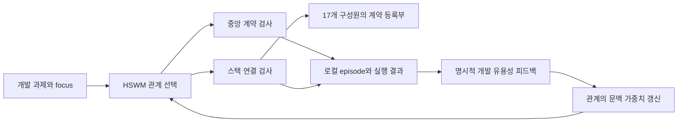

# Reluvator 3D 추론 풀스택 — HSWM 개발 실사용 표본

2026-09-08 사용자 지정에 따라 delltower에 접속해 회사 Reluvator 스택을 확인했다.
중심 checkout은 `delltower:/data/kjra/PROJECT/RELUVATOR`다. 이 checkout의
`tools/contract-mesh/projects.json`에 등록된 **17개 구성원**과 `registry.json`의
생산·소비·채택 관계를 표본 범위로 삼는다. HSWM CLI에 원격 계약·스택 연결 검사와
로컬 episode 보존 경로를 연결했다.

## 실제 소유 관계

목표 정체성은 [Constitution](../canon/HSWM_CONSTITUTION_2026-08-20.md)을 따른다.
이번 변경은 기존 적응 런타임에 개발 과제 표본을 더하는 것이다. 제품별 판정 소유권을
유지하며 SSH와 계약 등록부는 실행·관측 인터페이스로 사용한다. 인지나 3D 추론 학습
기전 자체를 새로 구현한 것으로 해석하지 않는다.

| 등록 구성원 | 등록부가 선언한 역할 |
| --- | --- |
| `RELUVATOR` | 봉인 패키지, 현장 판단 규칙, 중앙 전달 계약, KG 투영 |
| `RELUVATOR_CLIENT` | 현장 PC 런타임, 운영자 UI, 지속 outbox |
| `PRISMV4` | 추론, 측정 근거, LX3/BPC 품질 판정 |
| `EXTENSIONS` | `DISPLAY_ONLY` 프레임 기록과 결과 표시 |
| `CAMERA_ADAPTER` | 캡처와 캡처 출처 |
| `CONFIGMATTER` | 설정 revision, 배정, 수신 기록 |
| `SQCEDITV2` | PLC 주소·시퀀스 정본 |
| `SIM3D` | Isaac 시뮬레이션 근거와 동작 |
| `ROBOT_ADAPTER` | 로봇 티칭 계획, 도달 가능성 근거, 궤적 산출물 |
| `TEACHER_TEACHER` | 티칭 기준·현재 관측 비교와 교정 안내. `staging` |
| `LX3PROJECT` | 소유권 전환 중인 기존 LX3 통합. `transition` |
| `CONTRACTS` | 향후 공유 계약 패키지. `staging` |
| `3DLAB/DATUM` | datum-thread·QIF 연구 |
| `3DLAB/LX3_ICP_SPEC` | LX3 pose·ICP 근거 |
| `3DLAB/LUCID_ICP_SPEC` | Lucid front 3D 알고리즘·진단 연구 |
| `3DLAB/MX5A_ICP_SPEC` | MX5A 오프라인 알고리즘·선택점 입력 연구 |
| `SIM3D/MX5A_SIM3D_SPEC` | MX5A 합성 캡처·가시성 근거 연구 |

여러 worktree나 과거 `3d_vision_jg_bpc` 로컬 미러를 별도 제품으로 중복 등록하지 않는다.



## 실행 프로필

[프로필 JSON](../../_research/causal_composition/examples/adaptive_reluvator_development.v1.json)은
`hswm-dev reluvator`에 연결된다. 원격 host·디렉터리·명령은 고정 값이다.
`--task` 문장을 원격 shell 명령으로 만들지 않는다.

| focus | RELUVATOR에서 실행하는 기존 스크립트 | 범위 |
| --- | --- | --- |
| `contracts` | `node packages/app/src/entrypoints/asyncapi-emit.ts --check` | 커널 계약과 AsyncAPI 생성물의 일치 |
| `mesh` | `node tools/contract-mesh/mesh-check.mjs --deep --json` | 구성원·계약의 정적 연결, 복사본·참조·봉인 핀·근거 상태 |

각 focus에 단일 검사와 다른 검사를 이어 실행하는 두 관계 후보가 있다. 기본 예산 60초에서는
비용 힌트 40의 단일 검사만 대상이며 확장 관계의 비용 힌트는 80이다. 확장 실행은 앞 검사가
실패하면 중단한다. SSH 연결 제한 8초, 원격 검사 제한 40초와 종료 유예 5초를 명시했다.

처음 `./init.sh`와 `pnpm contracts:check`는 pnpm 11.9.0의 검사 전 의존성 재설치 시도가
`ERR_PNPM_ABORTED_REMOVE_MODULES_DIR_NO_TTY`로 중단되며 실패했다. 계약 드리프트로
단정하지 않는다. 프로필은 `package.json`에 선언된 스크립트를 설치된 Node `v24.18.0`으로
직접 호출한다. `--check`와 `--deep --json`을 고정하고 패키지 관리자 실행을 제외했다.
의존성이 없거나 맞지 않으면 검사 실패를 그대로 기록한다.

첫 mesh 직접 호출에서는 원격 스크립트가 JSON을 출력한 직후 종료하면서 pipe 출력이
8,192바이트에서 끊겼다. [얇은 전송기](../../src/hswm/infrastructure/reluvator_remote_cli.py)는
정확히 두 검사만 허용하고, 고정 Python 코드를 SSH stdin으로 전달한다. 원격에서는 익명 임시
파일에 Node 출력을 받은 뒤 끝까지 전송·flush하고 원래 종료코드를 보존한다. 원격 checkout에
전송기나 서버를 설치하지 않는다. 개발 task·문맥은 원격 명령이나 Python 소스에 삽입하지 않는다.
임시 파일 쓰기에는 프로세스별 크기 제한을 적용한다. 출력 64,000바이트를 넘으면
`REMOTE_OUTPUT_LIMIT`와 exit 65로 실패하며 잘린 보고서를 성공으로 반환하지 않는다.

`mesh`는 외부 프로젝트 quick check나 semantic witness를 실행하지 않는다. 실제 추론,
카메라 캡처, PLC·로봇 동작, 서비스 배포, KG 쓰기, 프로젝트별 전체 테스트는 이번 실행
범위 밖이다. `WARN`·`UNMEASURED`를 유지하며 mesh exit 0도 제품 전체의 `GREEN`이나
현장 검증 통과를 뜻하지 않는다.

HSWM checkout에서 실행한다. `delltower` SSH 별칭과 기존 인증·known_hosts가 필요하다.

```bash
uv run --locked hswm-dev reluvator plan --focus mesh
uv run --locked hswm-dev reluvator run --focus contracts \
  --task '중앙 전달 계약 변경사항 확인'
uv run --locked hswm-dev reluvator run --focus mesh \
  --task 'Reluvator 스택 계약 연결 확인'
uv run --locked hswm-dev reluvator status
```

`--workspace`는 **로컬 실행 위치와 상태 분리 키**다. 바꿔도 원격 대상은 고정 RELUVATOR
checkout이다. 상태는 기본적으로 HSWM의 `.hswm-local/projects/reluvator-<workspace 해시>.sqlite3`에
보존된다. 출력은 cell당 최대 64,000바이트다. `output_truncated`가 참이면 전체 JSON 보고서로
취급하지 않는다. mesh는 요약 뒤에 상세 finding을 출력한다.

실제 유용성을 판단한 뒤 `feedback --episode <ID> --success true|false --source <출처>`로
입력한다. 검사 exit code를 유용성 보상으로 자동 변환하지 않는다. 에이전트 판단은
`agent(<도구>):...` 출처로 구분하며 아직 받지 않은 사용자 의견을 만들지 않는다.

## 실제 실행 결과

2026-09-08 03:57 UTC, 출력 보존 전송기로 두 focus를 각각 한 번 실행했다.

| 실행 | 관측 결과 |
| --- | --- |
| `contracts`, episode `reluvator-delltower-20260908-contracts-02` | exit 0, 커널 레지스트리와 AsyncAPI 일치, 약 0.52초 |
| `mesh`, episode `reluvator-delltower-20260908-mesh-02` | exit 0, 보고서 판정 **UNMEASURED**, 약 1.65초 |
| mesh finding | **OK 189 / WARN 25 / RED 0 / UNMEASURED 42**, 전체 256개 |
| 출력 보존 | mesh 49,560바이트 전체를 JSON으로 decode, `output_truncated=false` |
| HSWM 상태 | 완료 episode 2개·event 12개, 명시적 feedback 대기 2개, 관계 학습 관측 수 전부 0 |

WARN은 미발행 상태 지적 23개, handbook 1개, byte-copy 1개다. 미발행은 검사기의 마지막
fetch 기준 하한이며 현재 원격 GitHub 상태를 확인한 것이 아니다. UNMEASURED는 프로젝트
검사 14개, live E2E 11개, shape-adopter gate 11개, semantic provenance 1개, gate 5개다.
따라서 RED 0을 전체 풀스택 검증 완료로 해석하지 않는다.

최종 mesh 출력 SHA-256은
`357c9414f59891bebc35bbb810db457aff4bd29e5a609e9b42e0d22209bf50e6`이다.
원문과 실행 상태는 ignored `.hswm-local/reluvator/` 및 프로젝트 DB에 보존한다.
초기 직접 호출 2건은 `pre-buffer-transport/`에 별도 보존했으며 최종 프로필의 학습 상태로
재사용하지 않는다. 원격 동시 개발 중 최초 보고의 WARN 23개가 최종 25개로 바뀌었으며,
이를 HSWM이 개선하거나 악화시킨 결과로 해석하지 않는다.

CLI·전송기·적응 런타임·실행기·상태 저장의 관련 검사 **27개 통과**, portable Markdown
컴파일 통과. 전송기의 출력 초과 실패·실패 종료코드 보존을 포함한다. 출력 상한 추가 후에도
원격 mesh 보고서를 온전한 JSON으로 수신하는지 다시 확인했다.

## 관측 출처와 한계

2026-09-08 03:50 UTC에 구성원 17개·계약 45개를 관측했다. 당시 중앙 HEAD는
`4b50922db2feed07216bb021a8e8dba328d9f4ea`이며 추적 파일 변경이 15개 있었다.
동시 개발 중인 작업 트리의 관측이며 전체 스택의 원자적 snapshot이나 깨끗한 commit 검증이
아니다. quick check 선언과 실행 결과도 구분한다.

| 중앙 checkout에서 읽은 파일 | SHA-256 |
| --- | --- |
| `tools/contract-mesh/projects.json` | `313f04928c618d961d059cecce7872a3bcda12c54d0386f1de2ecdee84a3bf11` |
| `tools/contract-mesh/registry.json` | `1bd43713df5ff6532892c4959e6f8e2b4606f0c69ce276ac460ded85a8b82ced` |
| `package.json` | `a34b298748ffd98393216f5074a7a3c7d6dc64d8786d654b8a47515e78804cb1` |
| `packages/app/src/entrypoints/asyncapi-emit.ts` | `f5f0e881e77557eaf5ebc777cfeaa60a0514e702097316f27c95e4367c356f35` |
| `tools/contract-mesh/mesh-check.mjs` | `d9fcef86a5fd85c8a63fc9ae9ae5083e5d9f5c69fb4861e40b3d9100cd08ec6b` |

이 해시는 관측 출처이며 실행 시 소스 고정을 강제하는 장치가 아니다. 원격 스크립트가
변경되면 다시 읽고 범위를 확인해야 한다. 실행 결과와 개발자 유용성 판정, 추론 정확도,
현장 효능, HSWM 학습 효능을 각각 구분한다.

기존 연결 방식: [GAME·SUPULLIM 개발 프로필](HSWM_GAME_SUPULLIM_DOGFOOD_2026-09-07.md).
