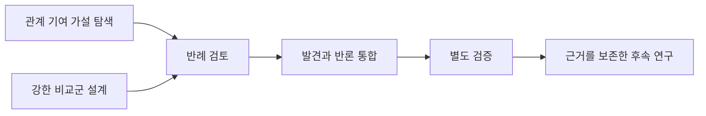

# HSWM 표준 연구 조정 그래프

2026-09-09 · `SECONDARY_AI / LOCAL_ENGINEERING_GUIDE`.

이 도구는 연구 가설, 작업 의존 관계, 근거, 반례, 실행 결과를 연결하고 다음 작업에 전달할
맥락을 만든다. [헌법](../canon/HSWM_CONSTITUTION_2026-08-20.md)의 HSWM은 하나의
token-native LLM-function macro-neural network다. 이번 개념적 변경은 **그 목표를
연구하는 작업 관계를 명시적으로 기록하고 표준 형식으로 교환하는 것**이다. 이 조정 그래프는
HSWM의 cognition, canonical admission, outcome judgment, causal credit 또는 학습의 구현을
자처하지 않는다. 목표와 FCL-1..8, 실패 경로, 성공 기준을 유지한다.

## 가져온 연구 방식과 적용 범위

[OpenAI의 연구 보고](https://openai.com/index/navier-stokes-solution/)에서 참고한 것은
다른 후보의 병렬 탐색, 중간 발견 공유, 반례 검토, 별도 검증이다. 보고에 따르면 발견에는
Astra보다 강한 내부 모델을 사용했고 Astra는 후속 형식화를 수행했다. 같은 모델명이나
협업 모양만으로 연구 결과를 재현했다고 판단할 수 없다. 각 협업 요소의 인과적 효과도 이
도구가 검증한 것은 아니다.

[초기 계획](../../_research/research_coordination/hswm_relation_learning.v1.json)은 다음
질문을 대상으로 한다. 같은 모델·정보·예산의 강한 비교군에 비해 outcome-bound 관계 수정이
이후 미관측 과제에 기여하는가? 정확한 수정을 제거하면 기여가 사라지고 복원하면 돌아오는가?
현재의 [도구 실험 결과](../../results/HSWM_USL_RELATION_INSTRUMENT_RESULTS_2026-09-08.md)와
[LLM 교정 계획](../research/HSWM_RELATION_LLM_CALIBRATION_PROTOCOL_2026-09-08.md)을 먼저 읽는다.



## 실행

기존 Node·TypeScript·Effect 환경과 lockfile을 재사용하며 새 DB나 패키지를 설치하지 않는다.
checkout에서 빌드 후 launcher를 사용한다. 이 머신의 `hswm-research-graph` 명령은 이
checkout과 고정된 Node 24.13.0을 가리키는 사용자 로컬 wrapper다. 다른 checkout에서는
동일 버전 Node를 PATH에서 선택한 다음 저장소의
`src/hswm/effect-runtime/bin/hswm-research-graph`를 사용한다.

```sh
npm --prefix src/hswm/effect-runtime run build
hswm-research-graph init --out .hswm-local/research/study.000.json
hswm-research-graph plan --graph .hswm-local/research/study.000.json
hswm-research-graph context --graph .hswm-local/research/study.000.json \
  --task explore-relation
```

현재 호스트 기본 Node는 24.20.0이다. HSWM의 기존 drand 검증은 24.13.0의 실행 파일
해시까지 고정하므로 전체 검사는 아래처럼 해당 프로세스의 PATH를 명시한다. 기본 Node
설정을 바꾸거나 기존 증거의 실행 파일 해시를 갱신하지 않는다.

```sh
env PATH="$HOME/.local/opt/node-v24.13.0-linux-x64/bin:$PATH" \
  npm --prefix src/hswm/effect-runtime run test -- --maxWorkers=2
```

`plan`은 READY/WAITING/RUNNING/COMPLETE, 활성 작업 수와 남은 자리를 반환한다.
초기 계획에는 READY 탐색 2개, WAITING 후속 작업 3개가 있다. `context`에는 해당 가설과
작업, 선언된 근거, 완료된 선행 작업의 결과와 근거가 들어간다. 병렬 탐색 중인 다른 후보의
미완성 결과는 들어가지 않는다. 반환한 맥락을 실제 작업자에게 전달하는 주체는 호출자다.

작업 시작과 종료는 JSON 이벤트 파일로 기록한다. 다음은 형식 예시이며 실행 사실이 아니다.
actor는 실제 작업자 식별자, model은 실제 사용한 모델로 기록한다.

```json
{"type":"START","id":"start-1","taskId":"explore-relation","actor":"worker-a","model":"actual-model-id","at":"2026-09-09T12:00:00.000Z"}
```

```sh
hswm-research-graph append --graph .hswm-local/research/study.000.json \
  --event .hswm-local/research/start.json --out .hswm-local/research/study.001.json
```

```json
{"type":"FINISH","id":"finish-1","taskId":"explore-relation","actor":"worker-a","at":"2026-09-09T12:10:00.000Z","disposition":"INCONCLUSIVE","summary":"실제 관측 결과와 아직 해결하지 못한 점을 기록한다.","sourceIds":["instrument"],"usedTokens":1000}
```

FINISH의 disposition은 `SUPPORTED_IN_SCOPE`, `REFUTED_IN_SCOPE`, `INCONCLUSIVE`,
`ENGINEERING_ONLY` 중 하나다. 결과는 호출자의 범위 한정 선언이다. 실패·불확실성도
완료 결과로 보존하여 비평·통합에 전달하며 가설을 자동으로 참으로 바꾸지 않는다.
시간은 UTC 밀리초 형식이고 순서를 거꾸로 기록할 수 없다. 토큰 사용량은 실제 알려진 값을
기록한다. 예산을 초과한 종료도 기록하고 `overBudget`을 표시한다.

`EXTEND`는 `type`, `id`, `at`, `sources`, `hypotheses`, `tasks`를 갖는다. 새 항목만 추가할 수
있으며 기존 ID와 내용을 바꾸지 않는다. 재시도나 경로 변경에는 새 작업 ID를 쓴다. 출처의
authority는 원문 내부 권위가 섞인 경우 `MIXED_EXPLICIT`을 쓰고 실제 원문을 확인한다.

스냅샷은 새 파일에 0400으로 기록하고 기존 파일을 덮어쓰지 않는다. `append`는 이전 이벤트를
모두 포함한 후속 파일을 만든다. `--expected-sha256`에는 `validate` 또는 `plan`이 반환한
입력 파일의 `sourceSha256`을 넣어 읽으려던 파일과 같은지 확인할 수 있다. 여러 호출자가
같은 이전 파일에서 분기하면 별도 후속 파일이 생긴다. 전역 최신 상태 선택·분기 병합·실제
에이전트 실행은 구현 범위 밖이다. 하나의 실행 담당자가 다음 스냅샷을 선택한다.

작업 의존 순환, 없는 근거, 중복 이벤트, 시작 전 종료, 미완료 의존 작업의 시작을 거부한다.
동시 시작은 한 스냅샷 안에서 최대 4개다. CRITIQUE/VERIFY의 actor는 모든 선행 작업자와
달라야 한다. 이는 선언된 역할 분리이며 작업자의 실제 독립성이나 판단의 정확성 증명은 아니다.
입출력 JSON은 1 MiB 상한이고 항목·문자열·이벤트에도 상한이 있다. 큰 원문은 이 그래프에
삽입하지 말고 source locator와 해시로 참조한다. locator 파일을 자동으로 읽거나 해시와
원문이 일치하는지 자동 검증하지 않으므로 실제 근거 확인은 담당 작업의 책임이다.

## 표준 교환과 검증

| 용도 | 적용 |
| --- | --- |
| 교환 | [JSON-LD 1.1](https://www.w3.org/TR/2020/REC-json-ld11-20200716/), RDF 1.1 N-Quads |
| 출처 관계 | [PROV-O](https://www.w3.org/TR/2013/REC-prov-o-20130430/): Entity, Plan, Activity, Agent |
| 구조 검사 | [SHACL 1.0](https://www.w3.org/TR/2017/REC-shacl-20170720/) + 저장소의 명시적 shape |
| 결정성 | blank node가 없는 정렬 N-Quads, [RDFC-1.0](https://www.w3.org/TR/2024/REC-rdf-canon-20240521/) 구현과 비교 검사 |
| 조회 | 로컬 RDFLib SPARQL SELECT/ASK, 읽기용 USL property graph 투영 |

```sh
hswm-research-graph export --graph .hswm-local/research/study.000.json \
  --out .hswm-local/research/study.export.json
hswm-research-graph property-view --graph .hswm-local/research/study.000.json \
  --out .hswm-local/research/study.usl.json
```

`export` 결과는 `jsonld`, `nquads`, `manifest`다. RDF resource는 스냅샷 내용 해시로
범위를 구분하여 서로 다른 연구의 같은 작업 ID가 합쳐지지 않게 한다. 원래 ID는 속성으로
남긴다. `manifest.canonicalGraphSha256`은 정규화한 입력 JSON의 해시이고
`manifest.sourceFileSha256`은 CLI가 읽은 실제 입력 파일 바이트의 해시다. RDF의
`rc:sourceGraphSha256`은 전자를 가리킨다. JSON-LD는 로컬
context만 사용하고 원격 문서를 가져오지 않는다. 결과 파일에는 호출자가 적은 문자열이
포함되며 비밀정보 삭제기는 아니다. 공개 시에는 공유 가능한 근거와 요약만 투영한다.

`property-view`는 USL의 bounded context/navigation 입력이다. optional sibling USL
checkout의 설치된 CLI로 확인할 수 있다. 도구가 새 읽기 권한이나 canonical write 권한을
부여하지 않는다. USL 자체는 W3C 표준이 아니며 기존 로컬 구현의 통합 표면이다.
JSON-LD/RDF와 property view는 조회용 투영이다. 전체 START/FINISH/EXTEND 이벤트 이력을
재구성할 때는 원본 연구 snapshot을 사용한다.
property UID는 한 문서 안의 ID다. 여러 snapshot을 다룰 때는 각각의
`canonicalGraphSha256`으로 `--namespace`와 `--kg-source`를 구분한다. 예를 들어
`hswm.research.<SHA256>`과 `hswm-research-<SHA256>`을 사용한다. `--kg-source`는 이
투영의 노드 식별 공간이며 live KG 접근 설정이 아니다. source의 원문 위치는
`declaredLocator`로 보존하여 USL의 읽기용 `locator`와 혼동하지 않는다.

```sh
# USL checkout에서 설치된 CLI 사용. 아래 namespace/source 값은 예시다.
npm run usl -- adapt --graph /absolute/path/study.usl.json \
  --namespace hswm.research.SNAPSHOT_SHA256 --kg-source hswm-research-SNAPSHOT_SHA256 \
  --operation context --focus task:explore-relation --compact
```

정확한 버전·라이선스·lockfile은 [source pins](artifacts/research_coordination_2026-09-09/source-pins.v1.json)에
기록한다. 공식 표준 전체에 대한 신규 인증이 아니라 이 투영에 대한 검증이다.

```sh
npm --prefix src/hswm/effect-runtime run check
npm --prefix src/hswm/effect-runtime run test -- research-graph
hswm-python graph pytest -q tests/test_research_coordination_standards.py
```

새 그래프 검사는 기존 `hswm-dev` 선택 profile 밖에서 명시적으로 실행한다.
개발의 task·선택 관계·결과와 `agent(codex):...` 유용성 판단은 별도 로컬 개발 상태에 남긴다.
실제 검증 결과는 [개발 snapshot](../../ontology/infrastructure/HSWM_RESEARCH_COORDINATION_2026-09-09.v1.json)에
기록한다. 이 계획으로 실제 HSWM 연구를 실행한 결과나 성능 향상을 주장하지 않는다.

2026-09-09 검증에서 Node 24.13.0의 전체 runtime 검사는 971개 통과, 기존 외부 통합
7개 skip이었다. 새 연구 그래프 검사는 14개, 실제 CLI 출력의 SHACL/SPARQL 검사는 3개
통과했다. 이 수치는 서로 겹치므로 합산하지 않는다. TypeScript·Effect 경계 검사, 빌드와
패키징 확인도 통과했다. 로컬 USL context는 실제로 생성됐고, `--deny-all` 관측은
resolver 호출 0회와 2개 접근 거부를 기록했다. 초기 계획은 READY 2개·WAITING 3개이며
실행 이벤트는 없다.
