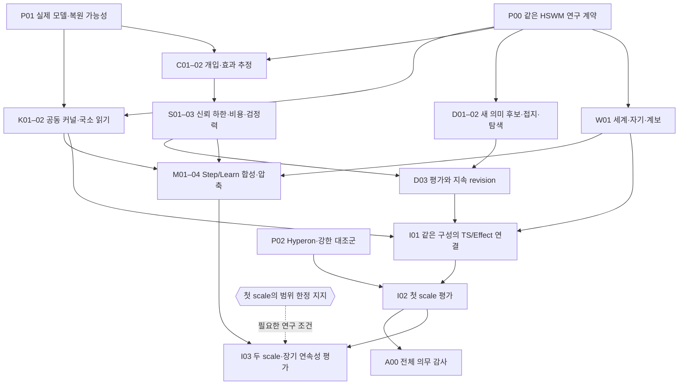

# 실제 LLM HSWM의 다음 증명 — 출처 결속 작업 계획

**계획 정리 완료, 후속 구현·증명·실험은 미실행.** [기존 연구 N1–N6](../research/HSWM_NEXT_PROOF_RESEARCH_2026-09-15.md)을 22개 작업, 9개 미검증 가정, 4개 미해결 연구 조건으로 구체화했다. 형식 증명은 기존 Lean 4.32.1을 사용한다.

- [기계 판독 작업 계약](../../_research/semantic_proof_plan_2026-09-15/plan.v1.json): 작업별 입력·출력·책임 역할·필수 선행·가정·검증·실패 처리.
- [작업 KG](../../ontology/development/HSWM_SEMANTIC_PROOF_WORK_PLAN_2026-09-15.v1.json): 선행 문헌·N1–N6·CR/FCL 및 현재 코드/정리와의 연결.
- [조회 및 검증](../../ontology/queries/hswm_semantic_proof_plan_2026-09-15/README.md): 시작 가능한 작업, 미검증 가정, 순환·누락·성급한 완료 탐지.

기준 소스는 `efd2bf0`이며 [사용자 원문](../canon/sources/USER_PRIMARY_HSWM_GRAPH_WORK_PLAN_REQUEST_2026-09-15.txt)은 계획 정리 요청이다. 아래 분해와 수용 조건은 SECONDARY_AI 제안이다. 담당자를 실제로 배정하거나 새로운 승인 절차를 만드는 기록이 아니다.

## 목표와 이번 계획의 차이

[헌법](../canon/HSWM_CONSTITUTION_2026-08-20.md)과 [상태/국소 연산자 정의](../canon/USER_PRIMARY_HSWM_STATE_LOCAL_OPERATOR_HYPERON_2026-09-14.md)를 유지한다. 거대한 Semantic Weight 하이퍼그래프가 하나의 AI 상태이고, LLM이 역할·문맥·관계 의미를 읽는 국소 신경 연산자다. 같은 상태의 실행·세계/자기 모델·지속 학습과 [FCL-1..8](../research/HSWM_FRACTAL_SCIENTIFIC_CONNECTIONS_2026-08-28.md)이 연구 대상이다.

이번 추가는 문헌 목록을 **근거 → 미해결 의무 → 가정 → 작업 → 예상 산출물 → 판별 기준**으로 연결하는 것이다. 실제 LLM 연결 가능성과 Hyperon 기준 확보는 초기에 조사한다. 후보 생성 연구는 인과 식별·통계 증명과 병행하고, 실제 채택·효능 주장은 검증된 공통 평가 규칙에 의존하게 한다. [9월 13일 전체 개발 계획](HSWM_NEXT_DEVELOPMENT_GRAPH_PLAN_2026-09-13.md)의 다른 작업·실패 기록은 대체하지 않는다.

## 재사용하는 것과 새로 해결할 것

| 재사용 소스 | 이미 있는 범위 | 이번 차이 |
|---|---|---|
| `HSWMSemanticWeightDefinition`: `SemanticWeight`, `behavior`, `fromLlm`, read 손실 반례 | 추상 Law, exact read·behavior 계약 | 정규화된 공동 확률 커널, 근사 오차와 실제 국소 입력의 충분성 |
| `HSWMLLMSemanticGraph`: `step`, `learn`, stale snapshot 거부 | outcome·revision의 데이터 흐름 | 무작위 처치·현실 효과 식별; caller-declared outcome의 독립성 문제 |
| `HSWMNoisyFeedback`: `choose`, `guarded_true_gain` | 선언된 유한 오염량 아래의 점수 경계 | 관측 자료로 계산하는 신뢰 하한, 오염 근거, 선택·비용·검정력 |
| `HSWMSemanticQuotient`: `ExactRefinement`, `run_refines_composed` | 결정적 Step/Learn의 exact 대응 | joint uncertainty, 근사 합성, 유용한 압축 |
| `canonical-atom-v2-llm-semantic-runtime.ts`: execute/stage/learn | 실제 I/O 인터페이스, receipt·CAS·역할과 text revision | 실제 모델 자격, 새 변수/관계 도입, 이론과 구현의 대응 및 독립 outcome |

기존 구조 검사·fixture·Lean 정리의 재사용을 새 학습 능력의 완료로 세지 않는다. `fromLlm`이라는 이름만으로 실제 LLM 정확성이 증명되지 않는다.

## 작업 순서

필수 선행은 필요한 산출물의 관계다. 아래 화살표는 대표 흐름이며 전체 DAG는 JSON/KG가 기준이다. 연구 우선순위와 필수 선행을 구분한다.

**지금 시작 가능한 작업은 P00·P01·P02다.** P00이 정한 관측/의미 계약 아래 K01, D01, W01을 병행한다. C01은 실제 복원 한계를 읽은 뒤 효과 식별을 설계한다. N4의 제안 연구 전체를 N3 완료 뒤로 미루지 않는다. M02의 구조적 합성 증명은 M01 뒤 독립적으로 진행하고, C02/S03의 효과 추정·통계적 채택까지 보존하는 M04는 그 결과가 나온 뒤 연결한다. I01의 통합 구현은 공통 규칙을 기다리지만 실제 모델 접근 검사는 P01에서 먼저 한다.

| 작업 | 산출물 | 필수 선행 |
|---|---|---|
| P00 · 동일 HSWM 연구 계약과 검증 질문 | 역할·관측·허용 개입·과제족·효용·공통 Step/Learn 및 claim matrix | 없음 |
| P01 · 실제 LLM 실행·복원 가능성 조기 확인 | 현재 실행→outcome→revision 경로의 모델 접근·숨은 상태·복원 가능성 보고 | 없음 |
| P02 · Hyperon과 강한 대조군의 실행 가능성 조사 | 동일 과제·모델 접근·예산에서 재현 가능한 comparator 명세 | 없음 |
| K01 · 정규화된 유한 공동 커널과 전이 의미 | Lean의 유한 joint law, bind/pushforward, 확률·타입 불변식 | P00 |
| K02 · 근사 국소 읽기 한계와 추가 관측 규칙 | read 충돌의 오차 하한과 bounded read 확장/보류 규칙 | K01, P01 |
| C01 · 국소 기여와 현실 revision 효과의 식별 계약 | 서로 다른 두 estimand, 무작위화·간섭·누락/지연 관측 계약 | P00, P01 |
| C02 · 관측 설계에서 효과 추정 정리 도출 | finite conditional estimator의 기대값/편향 경계 및 위반 반례 | C01, K01 |
| S01 · 관측으로 계산하는 순차 신뢰 하한 | 데이터 기반 L_t 계산과 동시 coverage의 Lean 정리 | C01, K01 |
| S02 · 오염·지연 outcome과 비용의 측정 계약 | 보정 가능한 오염/결측 경계와 공통 효용 단위 비용 계약 | C01 |
| S03 · 수정 채택의 타당성·검정력·종료 | accept/continue/reject 규칙, false-adoption 제어와 충분한 margin에서의 종료 정리 | S01, S02, C02 |
| D01 · LLM 의미 prior와 접지된 새 후보 설계 | 새 relation/변수/관측 경로의 typed proposal 계약과 검색 전략 | P00 |
| D02 · 후보 생성의 도달성과 탐색 비용 | 유익 후보의 도달 조건·novelty witness·탐색 비용 및 실패 분석 | D01, K01 |
| D03 · 새 관계의 평가·지속 revision 연결 | 생성→grounding→평가→canonical revision→다음 읽기의 동일 학습 구성 | D02, S03 |
| W01 · 세계·자기 구조·장기 연속성의 관측 계약 | world/self joint prediction, 예외·교체·fork/merge·exit의 판별 질문 | P00 |
| M01 · Step·Learn·개입을 보존하는 합성 계약 | child→macro state/output/intervention maps, Step와 Learn의 별도 오차 계약 | P00, K01, W01 |
| M02 · 공유 원인 아래 실행·학습 합성 오차 | 구조적 joint Step/Learn 합성 상계와 비가환 갱신·공유 원인 반례 | M01 |
| M03 · 유용한 압축과 여러 단계 학습의 비용 | 작은 macro 상태의 구성·압축비/비용·오차 성장 분석 | M02, K02 |
| M04 · 효과 추정·채택 규칙까지의 합성 보존 | 동일 estimator·신뢰 하한·오류 예산·비용 채택의 macro 보존/오차 정리 | M02, C02, S03 |
| I01 · 동일 구성의 TS/Effect·Lean 연결 | 순수 domain/Effect I/O adapter, 모델·outcome·revision 대응과 실행 기록 | K02, C02, S03, D03, W01 |
| I02 · 독립 outcome의 첫 scale 기전 평가 | 첫 scale의 SUPPORTED/RED/UNDERDETERMINED 보고와 remove/restore 결과 | I01, P02 |
| I03 · 합성·세계/자기·세대 변화의 두 scale 평가 | 두 scale의 shared-cause/uncertainty/exception/lineage/churn 평가 | I02, M03, W01, M04 |
| A00 · 동일 구성의 전체 의무와 남은 간극 감사 | CR/FCL별 proved/conditional/observed/refuted/unresolved matrix | I02 |

작업별 상세 수용 기준, 실제 source SHA, 미검증 가정과 실패 처리 문구는 기계 판독 계약에 둔다. 미래 산출물은 typed directory의 예상 산출물이며 아직 존재하지 않는 파일의 hash나 실행 근거를 만들지 않는다.

## 먼저 명시할 가정과 연구 조건

9개 가정은 관측/접지, backend 공동 법칙, 이력 복원, 인과 식별, 순차 추론, 오염/비용, 후보 도달성, 합성/요약, 세계/자기/계보다. 모두 `UNVERIFIED`다. 수학적 전제로 채택하는 것과 실제 시스템에서 확인하는 것을 나눠 기록한다. 각 가정은 담당 작업과 연결되며 실제 근거가 없으면 상태를 올리지 않는다.

| 조건 | 해결 작업 | 충족 근거 | 필요한 시점 |
|---|---|---|---|
| D-MODEL | P01 | 정확한 모델·설정·예산에서 실제 I/O 관측 가능 | I01 시작 |
| D-STUDY | C01 | 과제·효과·배정·자료 분리·오류 예산·비용·중단·판정 계약 고정 | I02 시작 |
| D-COMPARATOR | P02 | 필수 기전 대조군의 자격과 Hyperon의 실행/불가/비교불가 상태·비교 범위 공개 | I02 시작 |
| D-FIRST-SCALE | I02 | 독립 outcome과 필수 대조에서 첫 scale 기전의 범위 한정 지지 | I03 시작 |

조건은 모두 `OPEN`, 값과 근거는 미확정이다. 표본 수·비용·ε·α·최소 유용 효과·기한을 임의로 채우지 않는다. 해당 작업이 결과를 보기 전에 정하고 source-bound 계약으로 남긴다. 조건을 해결하는 작업 자체에 그 조건의 선행 충족을 요구하지 않으므로 순환 대기가 없다. 이것은 연구상의 의존성이고 사용자에게 추가 승인을 요구하는 장치가 아니다. Hyperon 실행 불가가 확인되더라도 필수 기전 대조군이 준비되면 I02의 범위 제한 연구는 가능하다. Hyperon의 아키텍처 비교·가용성 기록은 필수이며, 미실행 상태에서 Hyperon 대비 우위나 완전한 비교 평가를 주장하지 않는다.

## 작업 종료와 과학적 지지는 다르다

- 구성 작업의 `COMPLETE`에는 실제 수용된 구성과 기준별 검증 근거가 필요하다. 목표 명제를 깨뜨리는 반례만 얻었다면 성공한 증명 작업으로 닫지 않고 해당 구성을 수정하거나 `RETIRED`로 남긴다.
- 실험·가능성 조사 작업은 유효한 음성/불충분 보고로 끝날 수 있다. `result_status`는 별도로 `RED`·`UNDERDETERMINED`·`SUPPORTED_WITHIN_SCOPE` 등을 기록한다. 조사 종료가 연구 조건의 충족은 아니다.
- I02가 음성이면 D-FIRST-SCALE은 충족되지 않는다. I03 효과 실험은 시작하지 않고, A00에서 그 미실행과 실패 범위를 감사한다. 더 큰 scale로 upstream 실패를 구제하지 않는다.
- A00의 감사 완료는 전체 HSWM 완성이 아니다. CR-0..7/FCL-1..8의 전체 실현은 계속 미증명이며, 같은 구성에서의 이론·실행·독립 결과가 연결되어야 한다.

이 계획의 모든 작업은 `PLANNED`, 예상 산출물은 `NOT_PRODUCED`, 수용 기준은 `NOT_RUN`이다. 이후 실제 결과는 새 snapshot에 task ID·source commit·산출물 hash·결과 범위·실패 처리로 연결한다. 상태 문자열 변경이나 체크 개수는 성공 근거가 아니다. material 연구 결과에만 기존 연구 receipt/F1_R8 기록 규칙을 적용한다.

## 표준 그래프 계약

| 노드와 연결 | 의미 |
|---|---|
| WORK_PACKAGE → HAS_RESPONSIBILITY_ROLE | 작업당 제안 책임 역할 정확히 하나. 실제 인물 배정·canonical atom 소유권 부여와 구별 |
| USES_INPUT / EXPECTS_OUTPUT / HAS_CRITERION | typed 입력·미생산 출력·검증할 기준 |
| HAS_SOURCE → ENGINEERING_SOURCE | 현재 경로·commit·SHA·바이트 길이에 결속된 근거 |
| ADDRESSES → AUDIT_REQUIREMENT → REFERENCES_RESEARCH_TASK | 기존 N1–N6을 상세화하며 새 전체 의무를 발명하지 않음 |
| ADDRESSES_OBLIGATION / PRESERVES_FRACTAL_LAW | 소유 snapshot의 기존 CR/FCL UID 참조 |
| REQUIRES_ASSUMPTION / RESOLVED_BY | 가정과 그 충족/한계를 알아낼 작업. 아직 검증됐다는 관계가 아님 |
| DEPENDS_ON | 실제 필요한 수용 산출물의 DAG. 배치 선호·담당자의 일정과 별개 |
| REQUIRES_START_DECISION / RESOLVES | 수행 가능성·연구 설계·지지 조건과 해당 조사 작업 |

기존 [RDF 1.1](https://www.w3.org/TR/2014/REC-rdf11-concepts-20140225/), [SHACL 1.0](https://www.w3.org/TR/2017/REC-shacl-20170720/), [PROV-O](https://www.w3.org/TR/2013/REC-prov-o-20130430/), [SPARQL 1.1](https://www.w3.org/TR/2013/REC-sparql11-query-20130321/)의 공식 출판본을 2026-09-15 재확인했다. 기존 native KG compiler와 잠긴 구현을 재사용한다. 로컬 작업 어휘가 W3C 표준 업무 의미론이라는 주장은 하지 않는다. 새 DB/MCP/패키지 설치는 없다.

기존 `HSWM_NEXT_DEVELOPMENT_PLAN_SHACL_1_0.v1.ttl`의 작업·출력·기준·책임 제약을 재사용한다. 기본 SHACL과 작업 SHACL, SPARQL의 준비 작업·순환·미완료 의무·성급한 완료 조회, JSON/KG 일치·source SHA 검사를 함께 사용한다. pinned 독립 라이브러리의 로컬 검증이며 공식 전체 conformance suite 통과 주장은 아니다.

PROV-O는 실제 KG 투영의 출처에 적용된다. 아직 실행하지 않은 작업을 실행된 `prov:Activity`나 예상 산출물의 `wasGeneratedBy`로 기록하지 않는다. 그래프의 `DEPENDS_ON`이나 계획상의 책임 역할이 HSWM cognition, Permit, causal admission 또는 runtime learning으로 작동하지 않는다.

새 runtime 구현은 `src/hswm/`의 순수 immutable domain 함수와 typed Effect I/O, 검증은 `tests/`, 연구 실행은 `_research/`에 둔다. 기존 standalone Lean 모듈과 source-bound 검증 경로를 재사용한다. private 모델 출력·데이터·자격 증명은 공개 계획/KG에 넣지 않는다.
