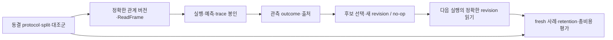

# HSWM 다섯 검증의 실험 기록 그래프

2026-09-22 · `SECONDARY_AI_ENGINEERING_CONTRACT` · `NO_NEW_MODEL_RESULTS`

**국소 실행, 실제 학습, 작은 읽기, 공동 출력·재귀 합성, Hyperon 비교에 필요한 기록을 하나의 출처 결속 계약으로 연결한다.** 기존 [30개 작업 계획](HSWM_JEV_RESEARCH_WORK_PLAN_2026-09-22.md)의 작업과 진행 조건은 보존한다. 이번 변화는 작업 수를 늘리는 것이 아니라, 실행에서 남겨야 할 필드·참조와 잘못된 기록을 찾는 검사를 구체화하는 것이다.

HSWM은 하나의 큰 AI, 하이퍼그래프 신경망 조직, LLM-function 기본 계산, hypergraph Semantic Weight 작동이라는 네 정체성을 함께 유지한다. 큰 그래프가 AI 상태이고 LLM이 작은 국소 입력을 받아 내부 연산자로 작동한다. 이 문서의 연구 기록 그래프는 그 목표를 평가하는 자료의 projection이다. 관계 의미, evidence, routing score, 예측 확률, 식별된 인과 효과는 구분하며, CR-0..7/FCL-1..8 판정을 바꾸지 않는다.

## 스킬과 표준은 무엇이 적용됐는가

현재 세션에 제공된 목록에는 **‘표준 첨단 그래프 엔지니어링’이라는 전용 스킬이 없다.** 적용한 `usl`은 기존 KG·저장소를 제한된 출처 연결로 탐색하는 로컬 스킬이다. `OpenAI Docs`는 스킬의 이용 방식을 공식 문서로 확인하는 데 사용했다. [공식 설명](https://learn.chatgpt.com/docs/build-skills)처럼 목록에 노출된 metadata, 선택한 SKILL.md 지침 읽기, 실제 도구 실행은 구분한다. 이번에는 USL의 지침과 세 참고 문서를 읽고 기존 계획의 E03/L04/R02/J02/M02/H00을 대상으로 실제 context 명령을 실행했다. 외부 resolver와 live write는 호출하지 않았다.

[스킬 사용 기록](artifacts/hswm_validation_graph_2026-09-22/skill-use.v1.json)에 읽은 지침의 hash, 실행한 CLI bytes, 입력·출력 digest와 범위를 남겼다. 새 스킬 설치나 W3C가 인증한 스킬이라는 주장은 없다.

| 역할 | 선택과 상태 | 적용 범위 |
|---|---|---|
| 표현·교환 | [RDF 1.1](https://www.w3.org/TR/rdf11-concepts/), W3C Recommendation | 기존 bundle별 named graph/N-Quads projection |
| 출처 | [PROV-O](https://www.w3.org/TR/prov-o/), W3C Recommendation | 기존 source→projection 계보; 실험의 인과 credit을 자동 도출하지 않음 |
| 구조 검사 | [SHACL 1.0](https://www.w3.org/TR/shacl/), W3C Recommendation | 공통 필드와 track별 필수 연결·타입·개수 |
| 연결 감사 | [SPARQL 1.1](https://www.w3.org/TR/sparql11-query/), W3C Recommendation | lineage, split, 비용·대조군·pin, joint/scale, 미평가 항목 조회 |
| 역할을 가진 다자 관계 | [N-ary Relations](https://www.w3.org/TR/swbp-n-aryRelations/), 2006 WG Note | relation/participation/participant를 구별하는 참고 패턴 |
| RDF dataset 정규화 | [RDFC 1.0](https://www.w3.org/TR/rdf-canon/), W3C Recommendation | 검토했으나 이번에는 도입하지 않음. 기존 blank-node-free profile을 재사용 |

RDF 1.2 계열과 SHACL/SPARQL 1.2의 초안 경로는 이번 실행 의존성으로 선택하지 않았다. [공식 자료·기존 패키지 pin 기록](artifacts/hswm_validation_graph_2026-09-22/standard-review.v1.json)에 선택과 미선택을 구별했다. N3·rdf-validate-shacl·Comunica는 독립 구현이며 W3C 공식 SDK가 아니다. 기존 lockfile의 도구를 재사용하며 새 패키지를 설치하지 않았다.

새로운 기능의 실용적 초점은 **버전별 증거 연결, 역할·slot 보존, 누락과 모순을 찾는 실행 가능한 검사**다. RDFC를 나중에 사용해도 prompt·tokenizer·JSON 원본 bytes의 hash를 대체할 수 없다. 일반 분산 그래프 플랫폼이나 새 DB 도입을 이번 다섯 검증의 전제로 만들지 않는다.

## 다섯 검증을 기존 연구에 연결

| 사용자 검증 | 기존 작업 | 실험에서 결속할 기록 | 결과를 읽을 때 구별할 것 |
|---|---|---|---|
| 국소 의미 실행 | E00–E04; B00–B03 | fixture·변환·출력 계약·모델 pin·반복 occurrence·거부·비용 | 정확도, 형식 유효성, 확률 품질, 추가 계산 비용 |
| 실제 학습 | L00–L04 | prediction→outcome→revision→fresh read, split·대조군·retention | commit, 표현 변화, 전이 변화, 새 사례의 효용 개선 |
| 작은 읽기의 충분성 | R00–R02 | 같게 보이는 상태 쌍·읽은 정보·추가 read·비용·후속 학습 | 현재 답, 제어, 다음 학습의 충분성 |
| 공동 출력·재귀 합성 | J00–J03와 M00–M02 | joint candidate·coupling·개입·child/parent version·학습 계보 | 주변 정확도, 공동 법칙, 두 scale의 학습 보존 |
| Hyperon 비교 | B02/H00 | component·commit·configuration·입력·모델 접근·비용 mapping | 구현 가능성, 비교 가능성, 관측된 효과 |

B00–B03의 관측 계약·모델 pin·대조군 자격·자료/비용/판정 동결은 공통 선행 작업이다. 기존 의존성과 실패 시 경로를 그대로 따른다. W1이 실패해도 유효한 실패 보고는 남기며, W4/W5의 규모 증가로 이를 성공 처리하지 않는다.

### 1. 128개 국소 입력과 계산 비용

기존 fixture는 **네 관계족 × 각 32개 조합 = 128개 사례**다. 알려진 census이므로 새 과제 일반화 평가라고 부르지 않는다. E0은 한 토큰 conditional-logprob, E1은 일반 생성의 최종 bit 채점, E2는 base/context/exception을 구분한 중간 출력과 최종 bit다. 중간 출력은 검사 가능한 외부 산출물이며 모델 내부 사고의 관측이라는 뜻은 아니다.

사례 ID, 관계 버전, 실제 역할과 slot, 문맥·예외, 변환 ID와 변환 후 expected mapping, parser/분모 규칙을 결속한다. 동일 역할을 유지한 표시 순서 변경과 역할 교환은 다르게 기록한다. 원본·두 paraphrase·재명명·열거 재배치·역할 교환, sentinel 반복의 구체적 bytes와 시행 순서는 실행 전에 고정한다. 반복 호출은 독립 사례 수를 늘리지 않는다. 형식 오류·거부·시간 초과도 분모와 비용에 남긴다.

비용은 입력·출력 token 외에 읽기, 수정 제안/선택, retry, wall time과 관측 가능한 reasoning usage를 포함하는 선언된 벡터다. 제공되지 않는 값은 `UNREPORTED`와 사유로 남기며 0으로 넣지 않는다. 각 항목을 합산할 때 중복 계상하지 않도록 회계 범위도 고정한다. 동일 예산 상한과 실제 소비량은 별개다. E2의 정확도와 비용을 함께 보고, 성공한 요청만 남겨 비용을 낮추지 않는다.

### 2. Outcome이 다음 그래프 실행을 바꾸는지



Outcome record는 봉인한 실행에 연결하고, revision은 그 outcome 및 parent에 연결하며, 후속 실행은 실제 읽은 revision의 ID와 digest를 기록한다. 참조 연결만으로 관측의 독립성이 입증되지는 않는다. outcome 생성/관측 절차와 불확실성을 별도로 감사해야 한다.

frozen, evidence-only, sham paraphrase, semantic revision을 동일한 평가 모집단에서 비교한다. 후보 생성·선택 자료와 final holdout을 분리하고 no-op·실패·거부를 intent-to-treat 분모에 보존한다. 유지해야 할 성공 사례와 remove/restore, fresh-process read도 기록한다. 의미 필드 hash 변화는 의미 개선의 충분조건이 아니다. 비용과 retention을 포함한 사전 동결 분석으로 판단한다.

기존 단일 관계 runtime은 trace/outcome/revision/reread 연결의 일부를 제공한다. outcome은 caller 선언이며 독립성을 자동 검증하지 않는다. 현재 API가 보존하도록 한 exception reference를 이번 profile이 임의로 수정할 권한을 만들지 않는다. 역할·예외·topology 변경은 기존 T00/T01의 별도 typed 확장 범위다. 사용자 작업 중인 local-process 파일은 이번 고정 근거에 포함하지 않는다.

### 3. 작은 읽기의 충분성

같은 최초 read를 갖지만 필요한 답이 다른 상태 쌍을 기록한다. 서로 다른 상태임을 알 수 있는 허용 관측을 `full / fixed / active` arm별로 명시하고, active의 `other/expand`와 실제 추가 read를 비용에 넣는다. 평가자가 가진 숨은 정답·full-state oracle을 실행 arm에 무료로 제공하지 않는다.

현재 출력 충분성, 다음 행동/제어 충분성, 동일 outcome 뒤의 후속 학습 충분성은 다른 항목이다. 현재 답이 같아도 예외 이력이나 불확실성 차이 때문에 필요한 갱신이 다를 수 있다. read-set/digest와 witness는 그 차이를 추적하는 기록이고, 값이 존재한다는 사실은 정보 충분성의 증명이 아니다.

### 4. 공동 출력과 두 scale 합성

Joint record는 출력 tuple·후보 공간·순서·factorization 또는 coupling 계약을 결속한다. 주변 확률을 곱해 공동 확률로 간주하지 않는다. 확률을 제공하지 않는 모델은 capability 미지원으로 남기고, 적절한 반복 표본·평가 설계를 별도로 정한다. 금지 조합, 상관·예외, 개입 응답을 공동 결과에서 측정한다.

두 scale record는 child와 parent의 정확한 state/revision, 전달한 요약, 보존해야 할 불확실성·예외 및 후속 Learn을 연결한다. flat, static wrapper, learning parent를 대조하고 손상·복구·계보 연속성을 평가한다. serial/batch/shared 실행은 같은 snapshot과 read/write 의존성 계약으로 비교한다. 공동 확률의 타당성과 scheduling 가능성은 별개의 질문이다.

이번 profile은 그 기록 구조를 요구한다. 실제 adaptive reading, joint operator, parent learner, damage/recovery 실험 전체를 구현하거나 실행한 결과는 없다. 두 scale 검증도 임의 깊이·의식·전체 FCL 완료로 확대하지 않는다.

### 5. Hyperon 동일 조건 비교

[직접 선행 감사](../research/HYPERON_2026_DIRECT_PRIOR_DEEP_DIVE_2026-08-20.md)의 MeTTa v0.2.10, commit `3f76dc460da6961f57f69f6c3e550c59c74ada83`은 역사적 기준점이다. 실제 비교는 component, source/lockfile, adapter, 모델·tokenizer·입력·설정·host와 비용 계측을 다시 고정한다. 백서 전체 기능과 해당 interpreter의 구현 범위를 합치지 않는다.

같은 world·split·허용 정보·모델 접근·총예산·평가 규칙에서 비교한다. 동일 조건을 만들 수 없는 항목은 `NOT_EVALUATED`로 남긴다. HSWM용 adapter가 제공한 기능과 Hyperon 고유 기능도 분리한다. 비교는 필수 연구 의무이며 backend 채택의 자동 결정은 아니다.

## 사용하는 방법과 검사의 범위

현재 작업환경에 `validation-contracts` 진입점을 추가했다. 기존 native runtime을 build한 checkout에서 실행한다.

```bash
src/hswm/effect-runtime/bin/hswm-workspace show validation-contracts
src/hswm/effect-runtime/bin/hswm-workspace query validation-contracts unresolved
src/hswm/effect-runtime/bin/hswm-workspace validate validation-contracts
node _research/hswm_validation_graph_2026-09-22/verify.mjs
```

[source-bound KG](../../ontology/development/HSWM_VALIDATION_GRAPH_2026-09-22.v1.json), [기계 판독 profile과 검증기](../../_research/hswm_validation_graph_2026-09-22/), [SHACL shape](../../schemas/HSWM_VALIDATION_RECORDS_SHACL_1_0.v1.ttl), [감사 질의](../../ontology/queries/hswm_validation_graph_2026-09-22/)를 함께 사용한다.

구조 검사는 필수 필드·타입·cardinality를, 연결 감사는 선언된 record 사이의 lineage·split·비용·대조군·pin·joint/scale 모순을 확인한다. 검증기는 별도의 `FIXTURE_ONLY` 자료에 누락과 모순을 주입해 검사기가 이를 발견하는지 확인한다. 이 fixture를 실험 성공이나 실제 관측으로 KG에 넣지 않는다.

구현된 범위는 공통 기록과 여섯 subtype, 선언된 사례의 split 중복, 정확한 outcome/execution·revision/fresh-read 연결, 비용 항목·단위·미측정 값, 역할 slot 중복, 누락된 joint/scale 참조다. 공동 출력과 상위 합성을 별도 subtype으로 검사하므로 사용자 검증 축은 다섯 개이고 record subtype은 여섯 개다. 지원하지 않는 validation record 종류와 참조되지 않은 execution/outcome/cost/revision 등의 부속 record도 감사한다.

**아직 자동 검증하지 않는 것:** 128개 census/변환 전체의 실제 시행 완전성, 실험 전체에 네 학습 arm이 모두 있는지, 외부 model pin의 실체와 원본 hash, 기록 밖의 정보 누수, joint 확률의 정규화, 실제 parent 학습 효과다. `control_arm`의 enum을 검사하는 것과 대조군 전체의 충분성을 확인하는 것은 다르다. 순서 필드도 선언된 선후관계이며 외부 시각의 인증이 아니다. 이 항목들은 동결 protocol·실제 runner·관측·분석으로 채워야 한다.

Profile의 선언 그래프에는 실제 모델 실행 record가 없다. 위반 질의의 0행은 검사한 projection에서 **그 질의가 구현한 조건**에 걸리는 record를 찾지 못했다는 뜻이다. Protocol의 완전성이나 실험 성공을 의미하지 않는다. `unresolved`의 미평가 상태와 실제 record 수를 함께 읽는다. Future evidence의 runtime→projection adapter, 원본 해시 재검산, 독립성·통계 분석·의미 판단은 별도 의무다. Shape나 digest만으로 새 사례 개선·공정 비교·인과 credit을 판정하지 않는다.

이 profile은 source와 선언된 연결의 검사 범위를 가진다. 다른 protocol·snapshot을 무조건 union해서 같은 UID를 병합하지 않는다. 후속 관측은 새 source-bound snapshot으로 남기며, 오늘의 계획·기존 실패 기록·원래 hash를 결과에 맞춰 덮어쓰지 않는다. 이번 작업은 모델 실행이나 live KG 반영을 수행하지 않는다.
