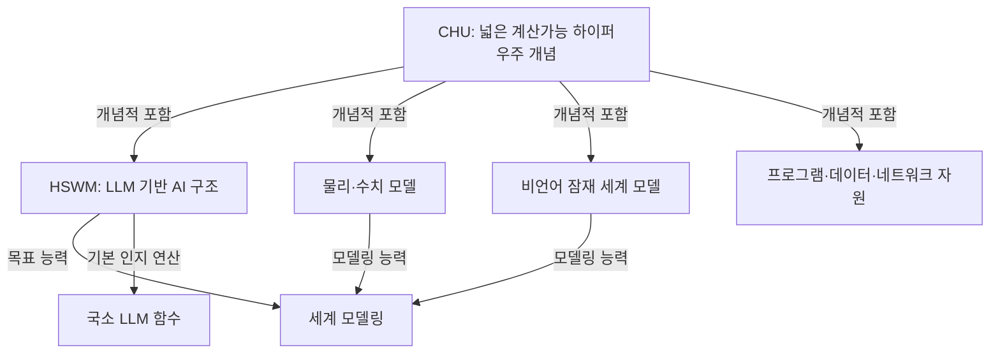

# CHU와 HSWM의 계산 구조 — 개념에서 표준 그래프 계약으로

2026-09-27 · `SECONDARY_AI_ARCHITECTURE / IMPLEMENTATION_AND_EMPIRICAL_LIMITS_EXPLICIT`

**CHU는 계산 가능한 모델·프로그램·상태·연결을 포괄하려는 넓은 개념이고,
HSWM은 그 범위 안에서 LLM 함수와 지속 Semantic Weight 그래프로 작동하는 AI 구조다.**
이 문서는 [사용자 방향](../canon/USER_PRIMARY_CHU_HSWM_SOFTWARE_SCOPE_2026-09-27.md)을
출처가 있는 개념·실행 계약·구현 경계로 구체화한다. 전체 CHU 실행환경을 완성했다는 보고는 아니다.

이번 개념적 변화는 CHU를 한 HSWM의 메모리로 한정했던 앞선 AI 설명을 교정하는 것이다.
CHU의 포함 범위와 HSWM의 LLM 계산 정체성을 별도로 표현한다. 기존 HSWM의 월드모델 역할은
보존한다. CHU와 HSWM을 두 개의 새 고정 인지 subsystem으로 쪼개지 않는다.

## 1. 포함 범위와 능력을 다른 관계로 표현한다

CHU에는 HSWM과 HSWM이 아닌 세계 모델이 들어갈 수 있다. **세계 모델링은 능력/역할**이고,
**HSWM은 계산 구조**다. 둘을 배타적인 종으로 선언하지 않는다. 위 포함 관계는 설계의
개념적 범위이며, 물리 우주 자체와 소프트웨어 모델의 동일성 또는 모든 대상을 담은 유한 DB의 존재 정리가 아니다.

| 구분 | 의미 | 같은 것으로 취급하면 생기는 오류 |
| --- | --- | --- |
| 추상적 CHU | 여러 계산 모델·표현·연결을 다루려는 개념적 전체 범위 | 특정 Neo4j DB나 메모리 용량을 CHU 전체라고 부름 |
| CHU의 실행 profile | 표현 형식, 타입, 실행 의미, 관측·개입과 변환 계약 | 타입 이름만으로 계산가능성·실행 가능성이 생겼다고 봄 |
| 유한 구현 인스턴스 | 실제 graph revision, artifact, runtime·backend와 데이터 | 저장된 일부 표현을 전체 세계나 그 진실과 동일시함 |
| HSWM profile | LLM을 기본 인지 연산으로 사용하는 하나의 AI | 비LLM simulator도 이름만 붙이면 HSWM이라고 봄 |

이 세 CHU 구분은 AI의 공학적 구체화다. 독립 시스템의 수나 층 수를 고정하지 않는다.
HSWM이 물리 도구·검색·수치 연산을 사용하는 것은 LLM 기본 계산 정체성과 양립한다.

## 2. 기존 CHU 정의와 연결

[기존 출처 조사](artifacts/chu_hswm_2026-09-27/existing-source-survey.v1.json)는
SYMPOSIUM의 CHU README·SOURCES·INDEX와 관련 KG 기록의 경로·digest·읽은 범위를 남긴다.
일부 오래된 KG CHU 기록은 `UNSPECIFIED` 권위이며 원문 출처 필드가 없다. 거기 적힌 내용을
새 USER_PRIMARY 발화처럼 사용하지 않는다. 이번 정의는 두 최신 사용자 원문에 결속한다.

기존 최소 타입 선언은 `axiom CHU : Type`, `CHUPiece := CHU → Prop`다.
이는 **타입과 그 위 술어의 형식**을 제공한다. 타입의 모든 원소가 하이퍼그래프라는 사실,
유한 부호화, 실행 함수, 열거 가능성 또는 모든 술어의 결정가능성을 증명하지 않는다.
`CHU → Prop`의 임의 술어를 곧바로 실행 가능한 DB query로 볼 수 없다.
따라서 이번 profile은 유한 표현·명시적 operator·관측 범위를 추가로 요구하는 설계다.

기존 HSWM 문서에도 CHU에 기반한 구조라는 설명이 있다. 오래된 조직도·승인 절차·
고정 H/W/A/F/Π 구분은 이번 설계로 가져오지 않는다. CHU라는 사용자 개념을 Pratt의 **Chu spaces**,
Tegmark의 **CUH**, Wolfram의 **Ruliad**와 동일시하지 않는다. 기존 Ruliad 동일시 관련 음성 기록은
그 평가 범위대로 보존하며, 이번에는 그 증명이나 실행 결과를 다시 검증했다고 주장하지 않는다.

## 3. 원전으로 확인한 연결

2026-09-27 확인. 아래 자료는 구체적인 연결의 근거다. CHU라는 사용자 개념을 외부 학계가
이미 같은 뜻으로 정립했다는 주장이 아니다. 새 라이브러리나 backend를 설치하지 않았다.

| 원전·공식 자료 | 확인되는 내용 | 이번 설계에 적용하는 범위 |
| --- | --- | --- |
| [Turing, 1936](https://www.cs.virginia.edu/~robins/Turing_Paper_1936.pdf) | 기계의 기술을 받아 다른 계산을 모사하는 보편 기계 | 프로그램 표현도 처리 대상이 된다는 연결. 우주 전체의 계산가능성·HSWM의 보편성 증명은 아님 |
| [von Neumann, EDVAC First Draft, 1945](https://web.mit.edu/STS.035/www/PDFs/edvac.pdf) | 저장 프로그램 컴퓨터 설계의 명령·기억·제어 | 프로그램과 데이터를 지속 메모리에 기술하는 계보. 모든 데이터의 실행 가능성을 뜻하지 않음 |
| [McCarthy, Lisp, 1960](https://www-formal.stanford.edu/jmc/recursive.html) | symbolic expression과 eval/apply를 통한 계산 | 코드의 조작 가능한 표현과 해석을 구분. 현대 용어·HSWM 효능을 원 논문에 소급하지 않음 |
| [MeTTa, 고정 commit README](https://github.com/trueagi-io/hyperon-experimental/blob/3f76dc460da6961f57f69f6c3e550c59c74ada83/README.md) | metagraph 위 프로그램·rewrite·외부 grounded function의 공개 구현 맥락 | 그래프 상태와 실행의 직접 비교 대상. 전체 Hyperon 통합·지능 성능은 별도 |
| [ONNX IR](https://onnx.ai/onnx/repo-docs/IR.html) | model graph, operator/function, tensor initializer와 external tensor data를 구분 | LLM 구조와 weight artifact의 버전 있는 연결. ONNX를 범용 CHU 실행기나 학습 보증으로 보지 않음 |
| [Transformers 5.7.0 cache 설명](https://huggingface.co/docs/transformers/v5.7.0/en/cache_explanation) | 이전 token의 key/value를 저장·재사용하는 inference cache | 고정 parameter, 실행 cache, 지속 Semantic Weight 상태를 구분 |
| [DreamerV3](https://arxiv.org/abs/2301.04104) / [MuZero](https://arxiv.org/abs/1911.08265) | 학습된 환경/계획 모델을 사용하는 비LLM 접근 | 세계 모델을 LLM에 한정할 수 없음. MuZero는 과제 관련 reward/policy/value 예측이며 전체 관측 복원을 요구하지 않음 |
| [MuJoCo overview](https://mujoco.readthedocs.io/en/stable/overview.html) | 모델 정의를 컴파일한 mjModel과 동적 mjData를 구분 | 명세·실행 artifact·상태를 분리하는 물리 simulator 사례. 이번에 adapter를 구현했다는 뜻은 아님 |

Hyperon 비교는 기존 [직접 선행 감사](HYPERON_2026_DIRECT_PRIOR_DEEP_DIVE_2026-08-20.md)와
[9월 14일 비교 계약](../canon/USER_PRIMARY_HSWM_STATE_LOCAL_OPERATOR_HYPERON_2026-09-14.md)을 따른다.
MeTTa 참조 commit은 `3f76dc460da6961f57f69f6c3e550c59c74ada83`이다. 기존 July 2026 백서 감사에서
구분한 구현·prototype·설계 단계와 현재 HSWM 증거의 한계를 유지한다. 최신 전체 release를
재감사하거나 비교 benchmark를 실행한 결과는 아니다. ONNX/MuJoCo 문서의 공개 설명은 설계 선례이며
의존성 채택 pin은 아니다. 실제 adapter를 만들 때 artifact·runtime·opset을 별도로 고정한다.

## 4. 컴퓨터 구조에 대응시키기

| 컴퓨터 관점 | CHU/HSWM에서의 계약 | 주의할 구분 |
| --- | --- | --- |
| 프로그램 | 의미·역할·문맥·예외, typed code 또는 rewrite rule과 정확한 revision | 저장 문자열만으로 실행 의미가 결정되지 않음 |
| 기본 연산자 | profile에 맞는 kernel; HSWM의 인지 kernel은 LLM 함수 | CHU 전체에는 수치·기호·물리 kernel도 가능 |
| ROM 비유 | 실행 범위에서 고정된 LLM parameter artifact와 반복 가능한 처리 능력 | 모델 실행은 연산이고 가중치는 artifact; fine-tuning·모델 교체는 새 version |
| 메모리 | 장기 graph state, 실행 중 activation/cache, 외부 artifact를 타입·lifetime별로 기술 | KV cache를 장기 의미 학습이나 CHU 전체로 간주하지 않음 |
| 실행 제어 | 의존성에 따른 국소 읽기·dispatch·병렬 실행·결과 결합 | 병렬 호출 수만으로 합성된 하나의 AI가 되지 않음 |
| 학습 | outcome과 연결된 관계·의미·구조 revision을 다음 실행이 다시 읽음 | 로그 추가, 입력 재바인딩, parameter 학습과 구분 |
| I/O와 네트워크 | 관측·행동·자원·연결의 typed interface와 버전 있는 참조 | URL이나 edge 자체가 실행 권한·실세계의 참을 제공하지 않음 |

따라서 **Semantic Weight의 저장 표현은 프로그램의 재료이고, 역할·문맥과 고정된 연산 계약을
통해 실현되는 전이 성향이 그 작동 의미**라는 해석이 적절하다. 점수·근거·관측이 모두 code인
것은 아니다. [기존 의미 정의](HSWM_SEMANTIC_WEIGHT_DEFINITION_AND_HYPERGRAPH_2026-09-14.md)의
저장 의미·전이 성향·LLM 실현·측정된 인과 효과 구분을 유지한다.

## 5. 실행 가능한 연결에 필요한 최소 계약

아래는 `SECONDARY_AI_DESIGN_CONTRACT`다. 이 표의 객체는 같은 그래프에서 구분되는 역할이며
새 독립 subsystem 목록이 아니다. 일반 CHU 실행 schema가 이미 구현됐다는 뜻도 아니다.

| 역할 | 연결할 필드·의미 | 현재 연결점 |
| --- | --- | --- |
| 모델 | modelRef·version/digest, 관측·행동·시간·지원 범위 | 유한 Cross-layer Map의 source/target·supportScope |
| 프로그램 | program revision, ordered role bindings, 문맥·예외·의미 | semantic_relation과 SemanticReadFrame |
| kernel | kind, model/backend version, 입력·출력 타입, seed/cache와 실행 조건 | 기존 LLM transport/runtime 계약; 일반 수치·rewrite registry는 설계 |
| 실행 | 읽은 revision·입력, kernel 참조, 출력 proposal·관측 outcome·오류 | 기존 sealed trace/outcome와 canonical 의미 revision 경로 |
| artifact | 내용 digest, format, schema/opset, typed tensor·binary 참조 | 기존 content descriptor; 일반 ONNX/MuJoCo import는 미구현 |
| view/Map | source revision, exposed fields, 변환 손실·복원 범위 | 전체 frame codec과 별도 derived MapSpec RDF view |

graph DB는 저장·조회·revision 관리 역할을 할 수 있다. 실제 실행에는 해석기·kernel과
명시적 입출력 의미가 필요하다. RDF triple의 존재만으로 실행을 시작하지 않는다.
기존 canonical atom의 schema-relative single owner와 revision 계약을 이어받는다.

병렬 실행은 같은 읽기 snapshot에서 여러 국소 연산을 수행할 수 있다. 같은 관계 revision을
서로 다르게 수정한 두 결과는 **충돌**이며, 마지막 쓰기로 덮어쓰거나 무조건 합치지 않는다.
기존 revision/CAS 계약에 따라 재검토·재시도하고, 독립성이 확보된 수정만 선언한 규칙으로 결합한다.
CRDT·confluence·인과 credit이 자동 확보된다고 가정하지 않는다. 범용 병렬 CHU scheduler는 미구현이다.

## 6. 문서·인터넷·LLM 구조가 그래프가 된다는 뜻

사용자의 ‘문서가 없어진다’는 비전은 **실행과 의미의 정본을 그래프에 두고 사람용 문서를
view로 생성하는 방향**으로 구체화한다. 읽을 수 있는 설명·주석·원문을 지우는 것과 다르다.
실제 renderer에는 source revision과 변환 범위를 붙이고, 임의의 문서 편집을 정본 프로그램
수정과 동일시하지 않는다. 기존 문서를 자동 삭제·변환하지 않는다.

인터넷은 자원·서비스·모델·연결·상호작용을 graph로 조직할 수 있다. 현재 Web의 주소·프로토콜·
권한과 원본 소유자는 유지하며 연결한다. CHU 표현이 인터넷의 모든 내용을 즉시 읽고 실행할
권한이나 완전한 전세계 snapshot을 뜻하지 않는다.

LLM의 연산 구조도 graph로 기술할 수 있다. 큰 weight tensor는 dtype·shape·digest와 외부
artifact 참조를 통해 연결할 수 있다. 모든 scalar를 개별 RDF edge로 펼치는 것이 효율적이라는
근거는 없다. 논리적 통합, 물리 저장, 실행 backend와 컴파일된 표현을 나누고 변환의 fidelity를
평가한다. ‘모든 것이 그래프’라는 표현 가능성과 보편적 최소비용 주장은 계속 구별한다.

## 7. 구현 수준과 확인한 범위

| 항목 | 현재 상태 |
| --- | --- |
| CHU의 넓은 범위 / HSWM의 LLM 기본 연산 | 사용자 원문과 새 출처 결속 concept graph에 명시 |
| 세계 모델 역할과 HSWM의 겹침 | 별도 capability 관계와 SPARQL 조회·SHACL 제약으로 표현 |
| Semantic Weight 실행·revision | 기존 finite scripted fixture; 실제 LLM 효능의 새 증거 없음 |
| MapSpec·frame 표현 | 기존 codec·derived RDF 구현을 참조; 유한 one-tick profile |
| 일반 CHU interpreter·병렬 scheduler | 설계 계약; 구현하지 않음 |
| MuJoCo/ONNX/비LLM latent model adapter | 문헌과 설계 연결; 설치·import·실행하지 않음 |
| 세계 전체의 완전한 모델 / 보편 최소비용 | 미증명·미검증 |

이번 구축물은 [KG bundle](../../ontology/identity/hswm_core/CHU_HSWM_SOFTWARE_SCOPE_ONTOLOGY.v1.json),
[세 조회와 profile 설명](../../ontology/queries/chu_hswm_scope_2026-09-27/README.md),
[실행 가능한 구조 검증](../../_research/chu_hswm_scope_v1/README.md)이다.
CHU 전체를 LLM 전용으로 잘못 제한한 데이터, HSWM의 LLM kernel을 제거한 데이터,
HSWM의 목표 월드모델 역할을 지운 데이터를 구조 검사에서 거부한다.
이는 선언한 profile의 일관성 검사이며 개념의 진실·인과 효능의 증명이 아니다.

라이브 KG에는 새 범위 정의와 공학적 해석을 기존 CHU·HSWM·직관 기록에 연결한 AI 초안으로
게시하며, [게시·검증 기록](artifacts/chu_hswm_2026-09-27/publication.v1.json)에 실제 readback 범위를 남긴다.
전체 local graph와 라이브 요약의 차이를 명시한다. hash-bound 과거 정의·증거는 수정하지 않는다.

다음 구현은 구체적인 세계 모델 하나의 상태·관측·개입 계약을 정하고, 그 native 실행과
HSWM의 의미 예측을 같은 Map으로 대응시키는 일이다. 관찰 일치, 개입 반응, 학습 뒤의 일치,
비용을 따로 평가한다. 이 순서는 연구 제안이며 새 고정 gate나 CR/FCL 성공 기준 변경이 아니다.
