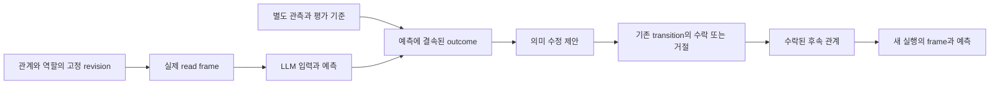

# HSWM 적대적 검토와 표준 그래프 공학 해결안

2026-09-27 · `SECONDARY_AI` · `DESIGN_REVIEW_NOT_MODEL_EFFICACY`

**앞선 진단의 방향은 유지하지만, 검사 결과만으로 원인을 확정한 부분은 좁혀야 한다.**
해결의 중심은 관계의 의미, 실제 모델 입력, 관측, 수정, 다음 실행을 연결하고, 어느 연결이
실패했는지 구별하는 것이다. 이번 변경은 해결 설계와 결정론적 반례 검증이다. 실제 LLM의
의미 실행·학습이 개선됐다는 결과도, runtime 수정의 완료도 아니다.

## 유지할 정체성과 이번 개념 변경

HSWM은 Semantic Weight 하이퍼그래프 자체를 상태로 갖고 LLM을 국소 계산 단위로 쓰는
하나의 큰 AI다. living harness·세계 모델·지속 학습은 그 조직의 역할이다.
[정체성](../canon/USER_PRIMARY_HSWM_HYPERGRAPH_NEURAL_AI_2026-09-14.md)과
[국소 연산자 정의](../canon/USER_PRIMARY_HSWM_STATE_LOCAL_OPERATOR_HYPERON_2026-09-14.md)를 유지한다.
CHU는 비LLM 세계 모델까지 포함하는 더 넓은 계산적 개념이다.
[CHU 범위](../canon/USER_PRIMARY_CHU_HSWM_SOFTWARE_SCOPE_2026-09-27.md)를 이유로 범용
CHU 실행기를 먼저 완성할 필요는 없다.

이번 delta는 **표현의 적합성, 주어진 의미의 실행 충실도, 외부 세계와의 적합성, 수정의
인과적 효용을 서로 다른 판별 대상으로 만드는 것**이다. 별도 인지 subsystem이나 승인
체계를 추가하지 않는다. 기존 W1–W5와 CR-0..7/FCL-1..8을 대체하지 않는다.

## 앞선 진단을 공격한 결과

[자기점검](HSWM_RESEARCH_SELF_REVIEW_2026-09-27.md)의 원본과 기존 실패 기록은 보존한다.
아래 A1–A7은 이번 계획의 탐색용 식별자이며 새 연구 단계나 통과 등급이 아니다.

| 공격 | 실제 반례·제약 | 교정할 해석과 해결 방향 |
| --- | --- | --- |
| A1: E2 중간값을 맞히면 의미 실행인가? | 기존 128사례에서 문맥·예외 필드를 복사하면 해당 두 필드 256개를 모두 맞힌다 | 이것은 base·최종 답·E2 전체 통과가 아니다. 중간값은 관측 출력 계약이다. 관계가 달라야 답이 달라지는 대조군과 최종 답을 함께 판별 |
| A2: 작은 frame에서 틀리면 LLM 능력 부족인가? | 아래 동일한 가시 입력의 두 세계는 숨은 예외 bit 때문에 정답이 반대다 | full/fixed/active read를 비교해 정보 부족과 실행 실패를 구분. 필요한 정보 자체가 관측 불가능하면 불확실성을 유지 |
| A3: 의미 수정이 없으면 학습기가 실패했나? | 초기 관계가 이미 맞거나 피드백이 후보를 구분하지 못하면 no-op이 합리적이다 | 틀린 초기 관계·구분 가능한 학습 관측의 양성 과제와, 수정 불필요·불충분 관측 음성 과제를 별도 선언. 수정 횟수를 성공 지표로 쓰지 않음 |
| A4: 새 revision이면 다음 행동도 바뀌나? | version/evidence만 바뀌거나 다음 호출이 이전 frame을 읽을 수 있다. 현재 API는 역할·예외 참조도 고정한다 | 의미 필드 delta, admitted key, 실제 다음 request를 연결. 구조 학습은 현 API의 기능으로 주장하지 않음 |
| A5: incidence 저장이 작으면 모델 비용도 줄었나? | 현 codec은 세 표현을 같은 전체 frame으로 복원한다 | 저장 비용과 모델 입력 표현 실험을 분리. 모델에게 다른 표현을 실제로 제공해야 후자를 시험할 수 있음 |
| A6: 정답 관계를 따르는 것이 세계 모델의 참인가? | 잘못된 관계를 충실히 실행하면 규칙 실행은 맞고 세계 예측은 틀릴 수 있다 | relation 기준 정답과 독립 관측 기준 정답을 별도 채점. 자기 작성 모델과 평가기를 닫힌 고리로 비교한 결과의 범위를 한정 |
| A7: 더 큰 CHU·병렬 LLM·프랙탈로 국소 실패를 구제할 수 있나? | 병렬 호출 수와 공동 분포 보존은 다르며 새 backend도 국소 실패 원인을 지우지 않는다 | 기존 W4/W5·Hyperon 비교는 보존하되 정확한 국소 실패 가족부터 교정. 합성 설계는 병행 가능 |

### 직접 실행한 반례의 정확한 범위

[도구](../../_research/hswm_adversarial_remediation_v1/counterexamples.mjs)와
[출력](../../_research/hswm_adversarial_remediation_v1/verification.v1.json)은 모델 호출 없이
작성된 유한 표를 검사한다. 복사 반례 외에 다음 두 관계를 사용한다. `b`는 기본 값,
`c`는 문맥, `e`는 예외이며 모두 bit다.

```text
법칙 A: 예외 e=1이면 0, 아니면 문맥 c=1일 때 1, 나머지는 b.
법칙 B: 문맥 c=1이면 0, 아니면 예외 e=1일 때 1, 나머지는 b.
```

두 법칙은 동일한 8개 입력 중 4개에서 답이 다르다. 각 법칙 안에서 `c ↔ e` 값 교환도
4/8에서 답을 바꾼다. 두 법칙×8입력을 동일 가중치로 평가하면, 법칙 정보를 전혀 쓰지 않고
`b,c,e`만 보는 결정론적 분류기의 최선은 12/16이다. 이는 정확히 이 유한 모집단의 상한이며
모든 지름길이나 미지 과제를 배제하는 일반 정리가 아니다. 모델 실험에서는 law ID, 순서,
case ID가 답의 단서가 되지 않도록 비공개 평가 ID와 가시 어휘를 분리하고 counterbalance한다.

법칙 A에서 가시 입력 `b=0,c=1`만 주고 `e`를 숨기면 두 정답은 각각 1과 0이다. 같은 가시
입력만 사용하는 결정론적 답의 최선은 1/2다. `e` 조회는 정보 집합을 바꾸지만, 이번 도구가
그 조회 정책이나 실제 LLM을 구현한 것은 아니다. 확률적 예측도 동등 가중치의 이 조건에서
기대 정확도 1/2를 넘지 못하며, 그 근거는 가시 입력 외 정보가 없다는 전제다.

불변 변환은 버리지 않는다. 기존 `pel ↔ nub`의 최종 답 불변성은 민감도 증거로 부족하지만
불변성 대조군으로 유효하다. 전체 분모와 답이 바뀌는 부분집합을 모두 보고한다.

## 그래프 계약: 무엇이 무엇에 결속되는가

기존 canonical atom과 typed reference를 그대로 쓴다. 아래 occurrence 이름은 **제안하는
실험 기록의 역할**이며 새 canonical kind가 아니다. schema가 허용한 atom과 정확히 하나의
책임 owner에 매핑하고 runtime 바깥에 두 번째 canonical writer를 만들지 않는다.



| 실험 기록의 역할 | 필요한 결속 | 기존 코드와 아직 필요한 연결 |
| --- | --- | --- |
| TaskInstance | world/split/transform 식별, 관계 key, role slot·target revision, evaluator-only 정답 기준 | 기존 W1 fixture 재사용. 의미 보존·변경 변환의 정확한 bytes와 blind label custody 추가 |
| PredictionOccurrence | frame hash, 실제 model-visible messages, model/tokenizer/template/server pins, 출력 계약, 호출·token 비용 | `SemanticReadFrame`, `executeLlmSemanticRelation` 재사용. frame hash와 실제 요청 bytes를 혼동하지 않도록 실제 요청 기록 연결 |
| OutcomeObservation | prediction/trace, observer/criterion, observation 시각·불확실성·출처 | `stageLlmSemanticOutcome`, owner-bound observation 계약 활용. 현재 `CALLER_DECLARED_NOT_INDEPENDENTLY_VERIFIED` 유지 |
| RevisionOccurrence | parent key, 의미 필드별 delta, 같은 evidence, 제안·검증 결과, expected state revision, terminal status | `prepareLlmSemanticRelationRevision`와 기존 graph-loop admission·CAS 재사용 |
| ReadbackOccurrence | accepted successor key와 실제 다음 frame, held-out task, 독립된 다음 예측 | fresh process에서 재조회. 저장됐다는 사실과 이후 행동의 개선을 따로 판정 |

구체적인 접점은 [semantic runtime](../../src/hswm/effect-runtime/src/canonical-atom-v2-llm-semantic-runtime.ts),
[graph-loop admission](../../src/hswm/effect-runtime/src/canonical-atom-v2-llm-semantic-graph-loop-admission.ts),
[transition domain](../../src/hswm/effect-runtime/src/canonical-atom-v2-domain.ts),
[owner-bound outcome](../../src/hswm/effect-runtime/src/canonical-atom-v2-outcome-judgment.ts)이다.
`SemanticReadFrame.roles`는 현재 ordinal 필드가 없는 배열이다. 배열 위치를 보존하고 RDF/codec의
slot ordinal로 옮긴다. 같은 entity의 다른 역할 참여를 하나의 edge로 합치지 않는다.

**현 API의 범위:** `strictRevision`은 `exceptionRefs` 배열의 정확한 보존을 요구하고 수정
atom도 기존 role reference를 그대로 복사한다. 초기 W2 구현 범위는 고정 역할에서
`semanticText`, `disposition`, `uncertainty` 수정이다. 과거 W2 설계의 `ROLE_OR_EXCEPTION`
후보 전체가 이미 실행 가능하다는 뜻이 아니다. 예외 의미의 문장 수정과 예외 target의 연결
변경을 구별한다. 새 역할·예외 연결·topology는 별도 버전의 허용 transition과 소비 경로를
구현한 후 별개 조건으로 시험하며, 현 검사 우회로 구현하지 않는다.

### 표준을 적용할 곳과 표준이 판정하지 않는 것

2026-09-27 공식 원문을 확인했다. 새 패키지는 설치하지 않고 기존 고정 의존성을 재사용한다.
아래 HSWM 어휘·실험 계약은 로컬 설계이며 W3C 표준 자체가 아니다.

| 표준·패턴 | 적용 | 한계 |
| --- | --- | --- |
| [RDF 1.1](https://www.w3.org/TR/2014/REC-rdf11-concepts-20140225/) | IRI, literal, snapshot/dataset의 교환 | graph name만으로 출처·권위·진실성이 성립하지 않음. union graph는 adapter가 명시적으로 구성 |
| [N-ary Relations Note](https://www.w3.org/TR/2006/NOTE-swbp-n-aryRelations-20060412/) | 관계 인스턴스와 role slot을 가진 incidence 표현 | informative Note. 정보 보존 이항 표현도 정당한 대조군이며 pair-only clique와 구별 |
| [SHACL 1.0](https://www.w3.org/TR/2017/REC-shacl-20170720/) | 현 Core profile의 type·필수 필드·기수 등 구조 검사 | digest 실제 일치, 순서 의미, CAS, 정답, 인과 효과는 별도 host/실험 검사. SHACL-SPARQL을 새로 추가하지 않음 |
| [PROV-O](https://www.w3.org/TR/2013/REC-prov-o-20130430/) | 실행 activity의 입력·생성물·파생 출처 | `wasDerivedFrom`은 통계적 인과 효과나 독립 관측 인증이 아님 |

기존 [canonical RDF projection](../../src/hswm/effect-runtime/src/canonical-atom-v2-rdf-projection.ts)은
raw payload를 생략하는 읽기용 view다. 실험을 위해 private frame 전체를 공개 KG에 복사하지
않는다. 공개 snapshot에는 source hash·집계·제안 상태만 두고 실제 private 요청·정답·응답은
기존 private 실험 출력에 둔다. named graph, actor 문자열, SHA만으로 독립성은 입증되지 않는다.

## 실행할 해결안: 기존 W1–W5에 붙이기

### 1. W1: 의미 실행을 먼저 식별할 수 있게 만든다

현재 준비된 384요청은 원본 128사례×E0/E1/E2다. 출력 방식 비교이며 역할 해석·재명명·능동
읽기까지 검증하는 도구는 아니다. 기존 [전체 W1 제안](../../_research/hswm_deep_research_v1/protocol.v1.json)은
변환과 sentinel을 포함해 2,784요청이며 아직 전부 구현·동결되지 않았다. 이 숫자에 아래
추가 비대칭 관계 진단을 몰래 포함하지 않는다. 별도 진단 block과 비용을 선언한다.

- 먼저 같은 정답 관계·입력에 E0/E1/E2를 적용한다. 출력 cap이 다른 현재 조건은 비용이 다른
  실행 진단이다. 파싱 실패·거절을 전체 분모에 포함하고 자동 정답 보정은 하지 않는다.
- 원래 의미를 보존하는 paraphrase·일관 재명명·열거 순서 변경과 의미를 바꾸는 결속/관계
  변환을 구분한다. 역할 배열 재정렬은 선언된 순서 의미를 깨지 않을 때만 불변 변환이다.
- 비대칭 법칙 A/B, 관계 제거, 의미 보존 sham을 진단에 추가한다. **실행 충실도** 정답은
  해당 요청에 실제 공급한 법칙을 따른다. **세계 적합성**은 별도 환경의 정답을 따른다.
  관계 제거로 정보가 부족해진 조건은 정상 실행 조건의 실패율과 합치지 않는다.
- 고정된 유한 reference table은 채점기와 통제군으로만 쓴다. LLM을 결정론적 DSL 실행기로
  바꾼 다음 의미 실행에 성공했다고 하지 않는다. pretrained prior는 유용할 수도 있는
  변수다. nonce 과제와 실제 의미가 있는 전이 과제를 구별해 향후 검증한다.

기존 W1의 전체 frozen census·변환에서 zero error/refusal 및 bit 안정성 기준은 유지한다.
추가 진단의 통과가 이를 대신하지 않는다. 실패하면 정확한 모델/serving/readout 범위를
기록하고 출력 계약·결속·계산 예산·local operator 학습 중 해당 경로를 수정한다.

### 2. W2: no-op을 강제 수정으로 바꾸지 않고, 수정의 효과를 시험한다

양성 과제는 학습 관측으로 틀린 초기 관계와 대안이 구별되고 held-out 입력에서도 차이가
나도록 작성한다. 올바른 초기 관계와 불충분 관측 과제는 별도 음성 진단군이다. 이를 W2의
독립 세계 모집단에 임의로 섞어 성공 기준을 바꾸지 않는다.

9월 22일 W2 **제안**의 네 군, 즉 frozen parent·evidence-only·의미 보존 sham·선택된 의미
수정을 유지한다. 이는 이미 실행된 네 군이라는 뜻이 아니다. 앞선 DGX v3의 여섯 군
`frozen/learned/evidence_only/removed/restored/oracle`과 그 결과는 그대로 보존하며,
의미 보존 sham은 후속 protocol에서 구현해야 한다.
후자의 세 군은 관측 근거를 맞추며, revision 탐색·평가 비용도 총 비용에 포함한다. parent와
차이가 나더라도 evidence-only/sham을 이기지 못하면 의미 수정 고유 효용으로 해석하지 않는다.
수정이 없거나 실패한 세계를 제외하지 않고 전체 intent-to-treat로 보고한다.

판별은 `semantic delta → 실제 model-visible 입력 변화 → 다음 행동 → held-out outcome`이다.
동일 입력/config를 동일 실행 조건에 제공한 두 군은 의도한 의미 입력 개입이 없다. 다른
byte만으로는 의미 개입이 입증되지도 않는다. revision ID, 순서, 근거량, 추가 token, cache,
server 상태를 기록하고 nuisance-only 변화·sham 대조군으로 구별한다. 동일 요청도 출력이
달라질 수 있으므로 원상 복귀는 byte 복구와 행동 분포 복구를 따로 측정한다.

기존 제안의 세계 단위 paired 분석, 세 개선 비교와 세 retention 비교, 실용적 margin 및
정밀도 의무를 유지한다. margin·표본 수·분포 가정·고정 stopping은 독립 pilot로 동결해야 한다.
작은 진단의 승리나 Bonferroni 공식 존재만으로 확인 실험이 준비되지는 않는다. final test를
열고 조정하면 그 test는 후속 확인용으로 재사용하지 않는다.

### 3. W3: 정보 부족을 별도 원인으로 다룬다

동일 초기 frame의 alias pair를 사용해 full admissible read, fixed local read, active read를
비교한다. `ReadRequest`에는 source snapshot·허용 query·남은 예산을, `ReadObservation`에는
관측 source·revision·수신 시각·비용·누락 여부를 결속하는 얇은 Effect service를 제안한다.
현재 lookup 함수만으로 능동 읽기가 구현됐다고 하지 않는다.

추가 읽기는 정해진 관측 채널만 사용하며 evaluator 정답·미래 outcome을 읽을 수 없다.
hidden `e` 조회는 기준 예이며, 더 일반적인 과제에서는 어떤 질의가 구분 정보를 주는지도
선택해야 한다. 같은 읽기 예산의 고정/무작위 query와 비교해야 능동 선택의 이득을 식별한다.
query 계획을 위한 LLM 호출도 비용이다. budget 소진·아무 query도 구분하지 못하는 쌍을
포함하고 abstention의 coverage와 정확도, 확률 출력의 적절한 score를 함께 보고한다.

full도 실패하면 국소 실행 문제가 남는다. full은 성공하고 local만 실패하면 정보 선택
문제를 조사한다. active가 full에 가까워져도 해당 과제·horizon·예산에서의 결과이며 보편적인
작은 frame 충분성은 아니다. [PSR 원전](https://proceedings.neurips.cc/paper/2001/file/1e4d36177d71bbb3558e43af9577d70e-Paper.pdf)의
미래 action–observation 예측 구분을 적용하는 설계상 해석이지 해당 논문으로 HSWM을 증명하는 것은 아니다.

### 4. 표현·세계·합성 비교를 같은 기준으로 연결한다

현 [codec](../../src/hswm/effect-runtime/src/semantic-frame-representation.ts)의 정확한 frame
복원은 유지한다. storage 실험은 bytes·index/read/update 비용을 측정한다. input presentation
실험은 같은 정보를 가진 direct/incidence/role-table 표현을 실제 model messages에 공급한다.
반환 전에 같은 frame으로 복원하면 input presentation 개입이 아니다. token padding도 중립적이지
않으므로 동일 byte/token 수를 임의로 강요하지 않는다. 실제 비용–효용과 사전 선언한 예산을
보고하며 비교 불가능한 비용은 미측정으로 남긴다. 의미 정보량·표현·추가 계산을 동시에 바꾼
군만으로 하이퍼그래프의 최소비용 가설을 지지하지 않는다.

세계 모델은 기존 [finite Map runtime](../../src/hswm/effect-runtime/src/cross-layer-map-runtime.ts)에
새 관측을 연결하는 경로부터 설계한다. 작성된 toy world는 작성된 범위만 검증한다. 같은
관측을 설명하는 경쟁 Map을 held-out 개입·시간 전개로 구분하고 relation interpreter와 분리한
evaluator·관측 출처를 둔다. 프로그램 분리만으로 외부 실재의 독립 관측이 되는 것은 아니다.
[Causal Abstraction 원전](https://www.jmlr.org/papers/v26/23-0058.html)의 개입 대응은 설계 근거이며
실제 LLM 내부의 인과 abstraction이 검증됐다는 결론은 아니다.

W4는 같은 주변 분포의 상관/반상관 joint law, W5는 그 위의 학습·불확실성·후속 상태 보존을
기존 설계대로 조사한다. stale read/CAS 충돌은 시스템 실행 결과로 분리하고 인지 실패와
동일시하지 않는다. 충돌 retry도 실제 비용·발생률로 보고한다.
[Hyperon 직접 선행](HYPERON_2026_DIRECT_PRIOR_DEEP_DIVE_2026-08-20.md)의
`hyperon-experimental v0.2.10`, commit `3f76dc460da6961f57f69f6c3e550c59c74ada83`을
동일 과제·LLM·관측/수정·총 비용에서 비교해야 한다. 구현·prototype·설계를 구별하고 정확한
component를 지정한다. 이 비교 의무는 backend 도입 결정이나 이미 실행한 비교가 아니다.

## 구현 순서와 검토 가능한 완료 조건

아래 경로의 새 모듈은 제안이며 이번에 생성하지 않았다. pure immutable domain과 typed
Effect I/O를 따른다. 기존 해시 결속 protocol·실험 결과를 덮어쓰지 않고 후속 버전을 만든다.
W2/W3·표현 비교의 설계는 병행할 수 있다. 모든 진단을 완전 Cartesian product로 늘리지 않고,
원인별 matched block을 준비하고 각 block의 분모·추가 비용을 사전에 기록한다.
R 번호는 위 공격에 대응하는 작업 식별자다. 아래 행은 우선 연결할 순서로 배치했으며,
번호 순의 일곱 필수 단계를 신설하는 것이 아니다.

| 순서 | 다음 변경의 구체적 위치 | 완료 조건·실패 시 행동 |
| --- | --- | --- |
| R1: W1 진단 완성 | `src/hswm/effect-runtime/src/local-semantic-execution-domain.ts`의 후속 변환 모듈, `_research/local_semantic_execution_v1/`의 새 versioned protocol/runner | reference로 변환 기대값·blind-label 경계 검사, 실제 serving pins 결속 후 모델 실행. 384/2,784/추가 block 비용 분리. 미통과면 해당 local realization 경로 수정 |
| R4: 실행–수정–재읽기 연결 | 기존 semantic runtime·graph-loop admission을 호출하는 연구 runner | 고정 역할 범위의 제안·거절·수락·CAS·재조회와 실제 입력 기록 연결. 해시만 바뀌는 arm은 의미 개입으로 분류하지 않음 |
| R2: W2 비교 구현 | `_research/hswm_deep_research_v1/`의 후속 W2 runner·analysis, 위 기존 runtime 재사용 | held-out 민감도·근거 일치·전체 분모·retention·총 비용. 정밀도 부족은 UNDERDETERMINED, 반증 범위는 정확한 mechanism family |
| R3: W3 읽기 실험 | 제안 `src/hswm/effect-runtime/src/semantic-read-observation.ts`, 연구 runner | alias/full/fixed/active/budget/불가관측 조건 구분. 정답 누출 없이 조회가 구분 정보를 추가하는지 확인 |
| R5: 표현 비용 비교 | 기존 representation codec과 별도 연구용 model presentation adapter | 정보 보존과 실제 모델 입력을 각각 검증. 실제 token·조회·갱신·추론 비용 측정 전 승자 없음 |
| R6: 세계 검증 | 기존 cross-layer Map runtime과 task-specific observation adapter | 기준 관계 실행/환경 outcome 채점 분리, held-out 개입과 시간 의미 선언 |
| R7: 비교·합성 | 기존 W4/W5와 Hyperon 비교 driver의 후속 설계 | joint·후속 상태·비용을 비교. 아래 단계 규모 확장으로 위 실패를 소급 구제하지 않음 |

새 모듈 구현 시에는 잘못된 역할 참조, 낡은 snapshot, 관측–예측 misbinding, 평가 정답 누출,
수락됐지만 이전 relation을 다시 읽는 경우를 겨냥한 계약 검사를 둔다. SHACL만으로 이것들이
전부 검증됐다고 하지 않는다. ontology와 MCP는 조회·교환용 경계로 남는다.

## 이번에 만든 검토물

- 반례 실행 도구와 source-bound 출력: A1, A2 및 비대칭 역할 진단의 범위만 확인한다.
- [계획 KG snapshot](../../ontology/development/HSWM_ADVERSARIAL_REMEDIATION_2026-09-27.v1.json):
  공격→해결 작업→관련 코드·근거를 탐색한다. 모든 구현 작업은 `PLANNED_NOT_RUN`이다.
- [검증·조회 명령](../../_research/hswm_adversarial_remediation_v1/README.md): 기존 SHACL Core
  bundle profile과 두 SPARQL query를 사용한다. 조회 성공은 해결책 효능의 증거가 아니다.

새 실제 모델 호출·의미 학습 결과·live KG publication은 없다. 이번 작은 반례는 설계 검토용이며
새 일반화 성과로 F1/R8에 등재하지 않는다. 기존 P1 RED, Jev 실패, CR/FCL 상태를 유지한다.
