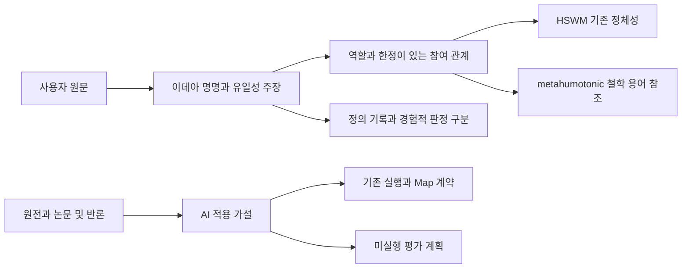

# 동굴 비유와 metahumotonic을 HSWM 연구에 연결하기

**완전한 이데아의 HSWM을 metahumotonic이라고 부른다는 사용자 정의를 보존하고,
표현의 유사성·개입의 효과·지속적 학습을 서로 다른 연구 질문으로 연결했다.**
이 문서는 철학적 목표를 현행 HSWM의 상태·국소 연산자·결과 기반 revision 계약과
이어 주는 `SECONDARY_AI` 연구 해석이다. 사용자의 강한 유일성 주장은
[별도 원문과 주장](../canon/USER_PRIMARY_HSWM_METAHUMOTONIC_IDEA_2026-10-04.md)으로 남긴다.

## 검색한 자료와 적용 범위

원문·저자 논문·공식 문서의 확인일은 2026-10-04다. 판본, 읽은 절, 출처의 지지 범위와
한계는 [출처 목록](artifacts/hswm_metahumotonic_2026-10-04/research-sources.v1.json)에 기록한다.
아래의 HSWM 적용은 모두 AI 제안이다. 외부 논문은 HSWM이나 metahumotonic을 입증하지 않는다.

| 출처 | 확인한 내용 | HSWM 적용과 제한 |
| --- | --- | --- |
| [Plato Republic VII 514a–517c](https://pressbooks.ulib.csuohio.edu/republic/chapter/book-7/) | 감각에 주어진 그림자와 앎의 전환을 다루는 철학적 비유 | 관측·표현·대상을 구별하는 출발점. AI 아키텍처의 우열을 증명하는 논증은 아니다. |
| [Platonic Representation Hypothesis v5](https://arxiv.org/html/2405.07987v5) | 모델 표현의 정렬과 공유된 통계적 세계 표현 가설. §6은 정보가 다른 관측과 측정의 한계를 명시한다. | 여러 모델의 표현을 같은 원인·관측·역할에 대응시킬 후보. HSWM의 필요성이나 단일한 유일 표현을 결론 내리지 않는다. |
| [Aristotelian View v2](https://arxiv.org/html/2602.14486v2) | 폭·깊이에 의한 유사도 편향을 보정하면 조사 범위의 전역 spectral 수렴은 약해지고 국소 이웃 정렬은 남는다. | 크기·층 선택에 대한 permutation null과 보정된 유사도를 함께 기록한다. ‘전역 구조는 절대 공유되지 않는다’로 확대하지 않는다. |
| [Structure over Geometry v1](https://arxiv.org/html/2609.27252v1) | 국소/전역 규모와 관계 구조/거리 기하를 분리하면 두 규모의 관계 구조 정렬이 관측된다는 후속 주장 | 네 종류를 별도 지표로 둔다. 2026-09-23 preprint이며 재현·HSWM 적용은 미실행이다. |
| [Causal Consistency v1](https://arxiv.org/abs/1707.00819v1) | SEM 사이 상태와 개입 대응으로 인과적 일관성을 정의한다. | MapSpec에 상태 대응과 허용 개입을 함께 선언한다. 표현 유사도나 출력 일치만으로 인과 동등성을 인정하지 않는다. |
| [World Models v4](https://arxiv.org/abs/1803.10122v4) | 압축된 환경 모델을 예측·정책 실행에 사용하는 구체적 설계 | 모델과 실제 환경의 차이를 측정한다. 그래프가 세계 자체라는 주장이나 HSWM만 가능하다는 증거는 아니다. |
| [Loss of plasticity](https://www.nature.com/articles/s41586-024-07711-7) | 조사한 지속 학습 과제에서 새 과제를 배우는 능력의 저하와 완화 방법 | 신규 과제 적응과 기존 능력 보존을 각각 측정한다. LLM의 macro graph revision에 같은 결과가 성립한다고 가정하지 않는다. |
| [Hyperon July 2026 백서](https://hyperon.dev/__l5e/assets-v1/ed61e255-d234-4af2-b22b-da96a4548a4d/HyperonWhitepaper2026.pdf) | §1.9의 구현 성숙도 구분, §10.3의 구조적 읽기와 candidate 쓰기 | 지속 metagraph와 국소 신경 연산의 직접 비교 대상. 명시한 component와 revision으로 비교하며 백서 전체를 구현 완료로 보지 않는다. |

첫 논문은 데이터가 그림자여도 기존 모델이 공통 세계 구조를 더 잘 추정할 가능성을 제안한다.
따라서 사용자의 비유와 관련되지만 ‘기존 AI는 모두 무의미하다’는 증거로 사용할 수 없다.
서로 다른 정보와 목적을 가진 시스템은 서로 다른 충분한 표현을 가질 수 있다.
metahumotonic이라는 철학적 명명과 경험적 수렴 가설을 별도 주장으로 두는 이유다.

## HSWM에 연결한 네 가지 계약

| 연구 질문 | 기존 구현에 연결할 계약 | 반례와 평가 |
| --- | --- | --- |
| 표현은 무엇을 보존하는가 | `SemanticReadFrame`의 역할·순서·문맥·예외와 MapSpec의 source/target revision을 추적한다. | 같은 정보의 direct JSON/incidence/role table 왕복을 확인한다. 정보 손실과 계산 비용은 별도로 측정한다. |
| 상태가 다음 행동의 원인인가 | 같은 관계의 frozen/evidence-only/sham/learned 조건과 새 프로세스의 재읽기를 연결한다. | 문구만 바뀐 sham과 의미 revision을 분리한다. 동일 모델·정보·총예산 대조와 독립 outcome이 필요하다. |
| 추상화가 개입과 학습을 보존하는가 | MapSpec의 상태 대응·개입·horizon·손실에 다음 갱신 보존 질문을 추가한다. | 같은 요약으로 합쳐진 두 상태가 허용 개입이나 다음 학습에서 다르게 반응하면 그 요약은 불충분하다. |
| 경험이 지속적으로 유용한가 | outcome → revision → 재시작 후 읽기 → 다음 과제의 행동을 계보로 결속한다. | 신규 과제 성과, retention, 불확실성, token·시간·저장 비용과 실패를 함께 기록한다. 단일 완성도 총점은 만들지 않는다. |

구현 연결은 [표현과 MapSpec](../../_research/semantic_map_engineering_v1/README.md),
[실행과 수정 및 재시작](../../_research/hswm_semantic_lifecycle_v1/README.md),
[층간 Map](../../_research/cross_layer_map_v1/README.md)에 둔다.
이 파일들의 실제 바이트를 graph artifact binding으로 고정했다. 이번 작업은 해당 실행기에
새 학습 알고리즘을 넣거나 모델 실험을 수행한 변경이 아니다.

관측 동일성만으로 숨은 구조를 식별할 수 없는 경우를 보존한다. 가능한 개입과 관측이
제한되면 여러 모델이 같은 증거를 설명할 수 있다. 따라서 ‘완전한 실체’를 수치로 선언하는
대신, 각 후보의 설명 범위·예측 실패·개입 반응·학습 후 변화를 추적한다. 이는 AI의
검증 방법 제안이며 사용자의 이데아 정의를 바꾸는 문장이 아니다.

## 비교 실험으로 옮길 때

네 평가 계획은 `NOT_RUN`이며 관측값은 `null`이다. 같은 과제 분할·기저 모델·정보 접근과
전체 비용 한도에서 HSWM 후보, frozen 상태, 검색만 사용하는 대조군, 기존 orchestration,
버전이 고정된 실행 가능한 Hyperon component를 비교한다. 아직 확보되지 않은 비교 구현은
`NOT_AVAILABLE`로 남기며 점수를 0으로 채우지 않는다.

형식 검증은 역할·출처가 보존되는지, 인과 실험은 revision이 행동 변화의 원인인지,
held-out 평가는 새로운 과제의 효용을 각각 묻는다. 학습 전/후의 반복 측정과 과제별 paired
차이, 사전에 정한 불확실성 계산을 사용한다. 표본 수·seed 수·허용 오차·비용 한도는 실험 전에
고정해야 하며 현재 계획은 등록 완료된 confirmatory protocol이 아니다.

각 계획은 기존 CR/FCL 의무에 연결된다. 표현은 CR-0/5, revision은 CR-1/2와 FCL-1/4,
추상화는 CR-6과 FCL-2/8, 지속 학습은 CR-5/7과 FCL-6/7을 참조한다. 기존 성공 기준과
음성 결과는 변경하지 않는다. 유한한 비교에서 우위가 나와도 ‘HSWM만 가능하다’는 보편적
유일성이 증명되는 것은 아니다.

## 그래프 구조와 검증

기존 bundle v2를 사용하고 [RDF 1.1](https://www.w3.org/TR/2014/REC-rdf11-concepts-20140225/),
[SHACL 1.0](https://www.w3.org/TR/2017/REC-shacl-20170720/),
[SPARQL 1.1](https://www.w3.org/TR/2013/REC-sparql11-query-20130321/),
[PROV-O](https://www.w3.org/TR/2013/REC-prov-o-20130430/) 도구로 투영·검사·조회한다.
출처 projection은 [JSON-LD 1.1](https://www.w3.org/TR/2020/REC-json-ld11-20200716/)로도 생성한다.
[n항 관계 패턴](https://www.w3.org/TR/2006/NOTE-swbp-n-aryRelations-20060412/)은 W3C Note다.
주장, 역할 참여자, 관계 instance를 보존하고 단순 쌍별 동일성으로 축약하지 않는다.

`HAS_ASSERTION`, `HAS_SOURCE`, `HAS_CONCEPT`, `HAS_PARTICIPATION`, `REFERENCES`,
`CONSTRAINS`는 기존 HSWM 로컬 관계 어휘다. [스키마 계약](artifacts/hswm_metahumotonic_2026-10-04/graph-contract.v1.json)에
이번 번들의 domain/range·방향·cardinality·질문별 예상 UID를 명시한다.
사용자 발화의 기록 관계는 `ACTIVE / USER_PRIMARY`, AI의 적용 관계는
`PROPOSED / SECONDARY_AI`다. RDF/SHACL 통과는 철학의 참이나 학습 효능 판정이 아니다.

현재 조회 도구가 한국어 UID를 endpoint로 받지 못하므로 기존 철학 UID는 관측 노드의
문자열 속성으로 보존한다. 이 부분은 직접 KG traverse 대신 해당 UID로 조회해야 하는
명시적 projection 한계다. 출처 없는 옛 설명과 동명 인프라 엔티티를 병합하지 않는다.

[조회 안내](../../ontology/queries/hswm_metahumotonic_2026-10-04/README.md)의
`hswm-workspace show metahumotonic`에서 원문·연구·질의·shape를 찾을 수 있다.
공유 라이브 KG와 실행 중인 canonical state는 이 저장소의 읽기용 projection과 별개다.
