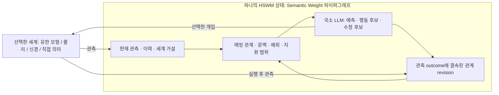

# HSWM 층간 Map — 문헌에서 실행 경로까지

2026-09-27 · `SECONDARY_AI_DESIGN / NOT_IMPLEMENTED / EXPERIMENT_NOT_RUN`

**제안: 서로 다른 모델링 층의 상태·관측·개입·시간을 대응시키는 관계를 HSWM의
Semantic Weight 하이퍼그래프 안에 두고, 그 대응이 실제 outcome에서 유지되는지
검사하며 수정한다.** 물리·시냅스·의미는 선택 가능한 모델링 해상도다. 세 층을 순서대로
구축할 필요는 없다. 실행하는 HSWM은 계속 하나의 AI이며 LLM이 국소 의미 연산을 맡는다.

[사용자 원문과 HSPINE 출처](../canon/USER_PRIMARY_HSWM_CROSS_LAYER_MAP_2026-09-27.md),
[매핑 충분성·반례·기존 실험 질문](HSWM_CROSS_LAYER_MAP_RESEARCH_2026-09-27.md)을 잇는
공학 설계다. 앞선 source-bound 기록은 수정하지 않는다. 아래 알고리즘·API·단계는 AI의
제안이며 사용자 발언 자체나 새로운 실증 결과가 아니다.

## 1. 검색에서 가져올 수 있는 것

2026-09-27 확인한 원 논문·공식 사양을 기준으로 한다. 표의 오른쪽은 HSWM에 대한 추론이다.

| 근거 | 원 연구·표준의 범위 | HSWM에 연결할 부분 |
| --- | --- | --- |
| [Approximate Causal Abstraction, UAI 2019, arXiv v2](https://arxiv.org/abs/1906.11583v2) | 명시된 인과 모형·개입·거리 아래 근사 추상화를 다룬다. | “비슷한 설명” 대신, 대응시킨 개입 후 관측의 오차를 측정한다. 순차적 HSWM에 적용할 상태·시간·외생 조건은 우리가 명시해야 한다. |
| [Deep Bisimulation for Control, ICLR 2021](https://arxiv.org/abs/2006.10742v2) | Markov 제어 과제에서 보상과 다음 상태 분포의 차이를 이용해 표현을 학습한다. | 무엇을 버려도 되는지는 질의·행동·목적에 달린다. 보상에 충분한 압축을 모든 의미 질의에 충분한 표현으로 확대하지 않는다. |
| [Pinductor, 2026-05-13 preprint v1](https://arxiv.org/html/2605.13740v1), 보조 후보 | 주어진 잠재 상태 공간/API·환경 설명에서 LLM이 POMDP 코드를 제안하고 관측 궤적과 belief 기반 점수로 수정한다. 숨은 정답 상태를 제공하지 않는 실험이다. | LLM의 사전 지식으로 후보를 만들고, 실패한 궤적·문맥을 수정 입력으로 돌려준다. 주어진 상태 공간까지 스스로 발견한 결과는 아니며, HSWM을 코드 생성 DSL로 바꿀 이유도 없다. |
| [Distributed Alignment Search, CLeaR 2024](https://proceedings.mlr.press/v236/geiger24a.html) | 신경 활성의 회전된 부분공간과 해석 가능한 인과 변수의 대응을 학습하고 interchange intervention으로 검사한다. | 의미 변수와 **LLM 내부 활성**의 연결을 시험할 후속 방법이다. 내부 활성 접근·명시된 상위 모형·별도 검증 데이터가 필요하므로 일반 모델 API 실험과 구분한다. |
| [FMI 3.0.2 공식 사양](https://fmi-standard.org/docs/3.0.2/) | 동적 모델의 교환·공동 실행·스케줄 실행 인터페이스. | 물리/제어 시뮬레이터를 연결할 때 Co-Simulation FMU를 작은 adapter로 감싼다. 상태·시간·입출력의 전달은 표준을 쓰되 의미 대응의 타당성은 따로 평가한다. |
| [NeuroML 2/LEMS 공식 설명](https://docs.neuroml.org/Userdocs/NeuroMLv2AndLEMS.html) | 신경 모델의 구조와 구성요소 동역학을 기술한다. | 신경 형태·연결·채널·시냅스 동역학이 필요한 실험에서 가져올 교환 표면이다. 연결도만으로 동역학이나 의미가 정해진다고 가정하지 않는다. |

이 선택은 새 패키지 설치가 아니다. FMI·NeuroML·DAS 도구는 해당 실험이 필요할 때
정확한 구현 버전·모델 digest·license를 고정한다. 현재 작은 유한 세계에는 추가 의존성이 필요 없다.

## 2. 두 종류의 매핑을 구분한다

**대상을 모델링하는 층 사이의 매핑**은 전압·발화·행동·의미 같은 서로 다른 상태 기술을
잇는다. **HSWM의 실행을 해석하는 매핑**은 그래프의 의미 변수와 LLM 내부 활성/반응을
잇는다. DAS는 후자에 직접 연결된다. 전자를 구현하려고 먼저 LLM 내부 뉴런을 해독할
필요는 없다. 어느 쪽도 파일 형식 변환이나 문장 embedding의 유사도만으로 완료되지 않는다.

사용자가 말한 “agent는 양파껍질 최외각의 우주 시뮬레이터”는 여기서 **현재 다루는 세계와
그 안의 행위자를 함께 모델링하고, 가능한 행동의 결과를 비교하는 바깥 역할**로 구현해 본다.
그 역할도 같은 그래프의 관계·국소 연산으로 수행한다. 더 큰 HSWM에서는 다시 내부가 될 수
있다는 해석이며, 별도 최상위 지휘 모듈이나 전체 우주의 계산 가능성을 전제하지 않는다.



그림은 제안하는 연산 흐름이다. 여러 상상 경로는 `world/branch/parent/model revision`을
구분해 보관하고, 관측·모델 예측·반사실 가정을 서로 다른 출처로 표시한다. 자기 예측끼리
일치하는 것은 독립 outcome이 아니다. 여러 경로의 불일치는 추가 관측을 선택할 신호가 될
수 있지만, 그 분산을 자동으로 보정된 확률이나 Semantic Weight로 취급하지 않는다.

## 3. 매핑 하나에 필요한 최소 내용

아래는 데이터 계약의 초안이다. 새로운 HSWM 구성요소 목록이 아니다.

| 내용 | 필요한 이유 |
| --- | --- |
| 출발/도착 모델과 정확한 버전·digest | 같은 “신경 모델”이라도 식·매개변수·관측법이 바뀌면 다른 대응이다. |
| 상태 대응 `q`, 관측/readout 대응, 개입 대응 `alpha` | 상태를 잘 요약해도 행동 효과가 같은 방식으로 대응된다는 보장은 없다. |
| 시간 구간·단위·동시 사건 순서·집계 규칙 | 물리 solver의 1 step과 의미 층의 1 event를 같다고 두지 않는다. |
| 지원 질의·개입·문맥과 가정 | 과제에 필요한 충분성과 범용 의미 보존을 구별한다. |
| 생략 변수·복원 가능 범위·알려진 반례 | `many-to-one`·부분 매핑을 허용하면서 손실을 드러낸다. |
| 구성/학습 방법, 훈련 자료·수정 근거 | 사람이 구성한 대응과 LLM이 발견한 대응을 구별한다. |

첫 매핑 함수는 다음과 같은 합타입 결과를 반환하도록 제안한다.

```typescript
// 설계용 의사 코드; 현재 runtime의 exported type이 아니다.
type MappingResult<T> =
  | { readonly kind: "mapped"; readonly value: T; readonly lossRefs: readonly string[] }
  | { readonly kind: "needs_observation"; readonly missing: readonly string[] }
  | { readonly kind: "outside_domain"; readonly reason: string }
```

결정적 변환, 학습한 encoder, LLM이 제안하는 의미 대응 모두 이 경계를 사용할 수 있다.
`mapped`는 선언된 변환을 수행했다는 상태이며 인과 검증 통과 표시가 아니다. 지원 범위와
누락 판단 기준은 최종 평가 전에 고정하고, 실패 사례를 사후에 범위 밖으로 빼지 않는다.

고정된 시간 대응 `h_A ↔ h_B`에서 기본 비교는 다음이다.

```math
\epsilon(x,u)=d\!\left(q(T_A^{h_A}(x,u)),\ T_B^{h_B}(q(x),\alpha(u))\right).
```

공통 상태 공간이 없으면 사전에 정한 관측 함수로 양쪽을 읽고 그 관측 거리만 보고한다.
부분 대응에는 정의된 공통 범위만 사용하고 coverage를 함께 낸다. 확률적 세계는 선언한
외생 조건 아래 분포를 비교한다. 표본 하나씩의 차이를 분포 동등성으로 읽지 않는다.
합성 `A→B→C`에서는 중간 상태가 다음 map의 지원 범위 안인지 확인하고 end-to-end 오차도
측정한다. 두 국소 오차가 작다는 사실만으로 합성 오차의 합 상계를 주장하지 않는다.

## 4. 기존 코드에 붙이는 위치와 실제 빈칸

코드 판독 기준은 Git `003aa7b`다. 별도의 미커밋 local-process 작업에는 의존하지 않는다.

| 기존 경로 | 이미 하는 일 | 이번 설계에서 필요한 것 |
| --- | --- | --- |
| [`readLlmSemanticFrame`](../../src/hswm/effect-runtime/src/canonical-atom-v2-llm-semantic-runtime.ts) | 최신 관계 revision과 정확히 고정된 참여자 revision을 읽는다. `subject/context/evidence`를 요구한다. | MapSpec과 시간·개입·현재 관측을 국소 입력으로 제공한다. 현재 v1 payload는 엄격하므로 임의의 `map` 필드를 추가할 수 없다. |
| 같은 파일의 `executeLlmSemanticRelation`, `stageLlmSemanticOutcome` | LLM 예측 trace와 caller가 제공한 outcome을 결속한다. | backend 관측을 수집하는 adapter와 비교기가 필요하다. 현재 outcome 상태는 `CALLER_DECLARED_NOT_INDEPENDENTLY_VERIFIED`이며 자동 검증 관측이 아니다. |
| 같은 파일의 `prepareLlmSemanticRelationRevision` | 예측 당시 frame을 재검사하고 의미 successor 후보를 만든다. | 현재 학습 출력은 의미 텍스트·disposition·uncertainty 수정이며 역할 참조를 그대로 보존한다. 구조화한 `q`나 새 관측 참조의 자동 학습/갱신은 없다. |
| [`makeLlmSemanticGraphLoopAdmission`](../../src/hswm/effect-runtime/src/canonical-atom-v2-llm-semantic-graph-loop-admission.ts)와 [state journal](../../src/hswm/effect-runtime/src/canonical-atom-v2-state-journal.ts) | 기존 commit 경로로 revision을 반영하고 오래된 상태에 대한 쓰기를 거부한다. | 입력 갱신도 정확한 read set과 예상 state revision을 사용한다. 전이 기록의 일관성과 관측의 진실성을 혼동하지 않는다. |
| [Inspect/GEPA 실험 연결](../../_research/gepa_relation_comparison_v1/README.md) | 관계 텍스트 후보를 평가·비교한다. | 새 과제용 입력·평가기가 필요하다. 도구가 canonical graph를 직접 수정하도록 만들지 않는다. |

**첫 구현은 semantic payload v1을 유지한다.** 기존 `context` atom의 내용에 버전 있는
MapSpec, `subject`에 현재 시점의 관측 묶음·개입 요청·시간 구간, `evidence`에 과거 자료를
담는다. 참여자의 종류·참조는 해당 canonical schema가 허용해야 하며, 외부 자료를 내용에
묶을 때는 source·digest를 보존한다. 내용 속 문자열 ID를 검증된 typed reference라고
부르지 않는다. 초기 작은 fixture에서는 필요한 내용을 직접 결속하고, 개별 상태 역할을
독립 조회·검사해야 할 때 schema에 역할을 추가한다.

현재 reader는 participant JSON의 시간·개입·MapSpec 내용을 해석하지 않는다. 따라서 새
순수 codec에서 허용 필드, 단위·시간 정렬, 허용 개입, 입력 관측 시각과 evidence의 가용
시점을 검증한다. 미래 **요청** 구간과 이미 수집된 **관측** 구간을 구별하고, 평가 정답은
입력 생성기에서 접근하지 못하게 분리한다. 필드명 검사만으로 의미적 정답 누출이 모두
방지됐다고 주장하지 않는다. 기존 `priorEvidence`에 실리는 이전 outcome도 같은 분할·
시간 조건을 만족해야 한다.

**새 관측은 자동으로 다음 실행에 들어오지 않는다.** 현재 관계 revision 함수는 참여자
키를 보존한다. 따라서 관측을 새 immutable atom으로 기록하고, 실행할 관계가 그 정확한
revision을 가리키게 하는 명시적 입력 바인딩 전이가 추가로 필요하다. 이 전이는 의미
텍스트를 보존하며, 학습 효과로 집계하지 않는다. 예측→outcome→학습 동안에는 같은 frame을
유지하고, 완료 후 다음 입력으로 바인딩한다. 충돌하면 재읽기·재실행하며 이전 예측을 새
frame의 예측처럼 재사용하지 않는다.

참여자 kind가 기존 fixture처럼 `SINGLETON`이면 새 관측/MapSpec은 새 UID가 필요하다.
같은 UID의 revision을 사용하려면 해당 kind를 `LINEAR`로 선언한 schema가 필요하다.
어느 경우든 새 참여자를 먼저 기록한 뒤 관계 전이의 read set에 그 정확한 키를 포함한다.

현재 또는 과거의 target 관측은 입력이 될 수 있지만 **예측해야 할 미래 target outcome은
frame에 넣지 않는다.** 숨은 정답 상태도 부분 관측 실험에서는 평가기에만 둔다.
MapSpec 자체를 학습하려면 후속 단계에서 context successor와 이를 가리키는 관계 참조까지
수정하는 전이가 필요하다. 의미 텍스트 revision만 성공한 결과를 구조적 매핑 학습으로
발표하지 않는다.

## 5. 외부 시뮬레이터는 작은 Effect adapter로 연결한다

제안하는 공통 동작은 `describe → reset → step → observe`다. `checkpoint/restore`는
backend가 지원할 때만 노출한다. TypeScript의 순수 함수가 단위 변환·시간 정렬·지원 범위·
오차 비교를 맡고, Effect service가 simulator I/O·artifact 읽기·관측 수집을 맡는다.

요청에는 model/adapter digest, 초기화 조건, 개입의 대상·값·효력 시각, 요청 종료 시각을
둔다. 결과에는 실제 도달 시각, 값·단위·관측 창, solver 설정/허용 오차·seed, 누락/실패,
관측 출처를 남긴다. 모든 backend가 임의 내부 상태에 `do` 개입을 허용하거나 정확히
같은 시각에 멈추거나 checkpoint를 제공한다고 가정하지 않는다.

물리/제어 모델이 필요해지면 FMI 3.0.2 Co-Simulation을 우선 검토한다. 공식 interface의
capability와 step 결과를 adapter에 반영한다. 신경 실험이 필요해지면 NeuroML/LEMS로 정의된
한 작은 모델과 호환 실행기를 선택한다. 둘 사이 변환이나 동일 결과를 사양 이름만으로
가정하지 않는다. 시뮬레이터의 출력은 그 모델 안에서의 관측이지 실제 뇌의 측정이 아니다.

## 6. 처음 구현할 연구 단위

### A. 4개 상태를 가진 제어 세계와 두 매핑

시험 세계의 상태는 `(r,h)`이며 각각 직전 발화에 따른 1 tick 불응기와 억제 여부를 뜻한다.
이는 생물학적 뉴런 모형이 아닌 유한 논리 장치다. 행동은 `wait/pulse/block/unblock`다.
한 tick에서 먼저 `block/unblock`이 `h`를 바꾸고, `pulse`일 때만 자극이 들어온다.
정확한 전이와 과제 출력 `fire`는 다음과 같다.

```typescript
// 유한 시험 세계의 전이 정의; 생물학적 모델이 아니다.
const nextH = action === "block" ? 1 : action === "unblock" ? 0 : h
const fire = action === "pulse" && r === 0 && nextH === 0 ? 1 : 0
const nextState = { r: fire, h: nextH }
```

보존 매핑은 `r,h`를 의미 변수로 모두 전달하고, 손실 매핑은 `h`만 전달한다.
보존 모델의 `T_B`는 이름만 의미 변수로 바꾼 동일 전이이고, 두 모델의 개입 대응은
`alpha(action)=action`이다. 손실 모델의 상태 전이는 `h→nextH`이며, 발화 예측기 후보는
현재 `h`와 action만 받는다.

손실 매핑은 `(r=0,h=0)`과 `(r=1,h=0)`을 합치지만 `pulse` 뒤의 `fire`는 다르다.
**`h`만 비교하면 이 손실 매핑도 상태 전이 검사를 통과한다.** 그러나 두 경우를 합친
결정적 발화 예측기는 둘 다 맞힐 수 없다. 따라서 사전에 선언한 과제 readout인 `fire`도
비교해야 한다. 압축 상태 자체의 일치만으로 중요한 출력을 보존했다고 결론내리는 오류를
이 fixture가 잡도록 한다.

`horizon=1`에서 4 states × 4 actions 전수로 상태·출력을 각각 검사할 수 있다.
여러 tick·행동 정책·학습 후 보존 주장은 별도 episode 평가가 필요하다.
과거 발화가 관측된다면 필요한 이력을
추가하여 잃은 `r`을 회복하는 조건도 따로 시험한다. 초기 상태가 모호하면 추가 관측이나
가설 집합을 유지한다. 관측 불가능한 차이를 LLM 추론만으로 알아냈다고 채점하지 않는다.

이 단계는 comparator가 정확한 대응과 정보 손실을 구별하는지 검증한다. 사람이 구성한
매핑이며 LLM의 발견·뇌 이해·새 이론의 증명이 아니다.

### B. 같은 입력에서 의미 실행과 outcome revision

실제 LLM에 역할·관계문·문맥·예외를 주고 다음 발화를 예측시킨다. 세계가 낸 outcome을
현재 trace에 결속하고, 기존 revision 경로를 통해 의미를 수정한 뒤 새 입력에서 읽는지
검사한다. 매핑은 이 단계에서 고정하여 의미 수정 효과와 매핑 생성 효과를 분리한다.

비교군은 직접 의미 상태, 보존 매핑, 손실 매핑, 역할을 섞은 매핑, revision 없는 군이다.
같은 정보 비교와 제한된 관측 비교를 구분하고, incidence 표현을 같은 정보를 담는 대조로
사용할 수 있다. 직접 의미 경로의 우위도 허용되는 결과다. 후보 생성과 수정은 train,
선택은 validation에서 하고 최종 held-out 개입 시퀀스에는 정답 피드백을 주지 않는다.
연속 trajectory의 인접 tick을 무작위 분할하여 정보가 새지 않도록 episode 단위로 나눈다.

정확 매핑의 반례 수, held-out 정확도, `needs_observation`/범위 밖 비율, revision 제거·복원
효과, 호출·토큰·시간·매핑 비용을 함께 낸다. LLM 반복 수·예산·성공 기준은 실행 전에
정하고 fixture 운송 성공과 실제 모델 성능은 별도 결과로 기록한다.

### C. 매핑 수정 또는 외부 모델 한 개로 확장

앞 단계가 작동하면 실패 이력에서 빠진 상태 변수·시간 집계·개입 대응 후보를 LLM이
제안하도록 확장한다. MapSpec과 관계 참조의 수정은 별도 검증하고, 새 환경/개입에서
고정 매핑과 비교한다. 혹은 실제 연구 질문이 먼저 생긴 경우 FMI 또는 NeuroML 모델
하나를 연결한다. 두 확장을 동시에 도입하여 개선의 원인을 잃지 않는다.

작업 위치는 순수 매핑/비교 함수와 Effect adapter를 `src/hswm/effect-runtime/src/`,
세계·protocol·평가기를 `_research/cross_layer_map_v1/`, 의미 있는 검증을 기존 `tests/`
관례에 둔다. 아직 이 파일이나 실행기는 만들지 않았다. 우선 필요한 통합 검사는
**입력 고정 → 예측 → 관측 결속 → 의미 revision → 새 입력 바인딩 → 새 revision 읽기**이며,
단위/시간 불일치·stale write·정답 누출을 함께 확인한다.

## 7. 비교와 현재 결론

[Hyperon 직접 선행 감사](HYPERON_2026_DIRECT_PRIOR_DEEP_DIVE_2026-08-20.md)의 비교 의무를
유지한다. 공개 [hyperon-experimental v0.2.10, commit 3f76dc4](https://github.com/trueagi-io/hyperon-experimental/tree/3f76dc460da6961f57f69f6c3e550c59c74ada83)의
typed Atom/Space·grounded function과, 2026 백서의 persistent metagraph·neural bridge
프로그램을 정확한 성숙도로 비교한다. 해당 release의 prerelease 표시를 Hyperon 전체의
성숙도로 일반화하지 않는다. 같은 관측·역할·revision 과제를 비교할 수 있는 baseline은
별도로 구현해야 하며, 이번에 실행 비교하거나 backend를 채택한 것은 아니다.

이번에 얻은 구체적 공학 결론은 **범위 있는 매핑 + 시간/개입 대응 + 독립된 세계 관측과의
비교를 기존 의미 실행·revision 경로에 연결할 수 있다**는 설계다. 새 simulator나 의존성은
설치하지 않았고 새 모델 요청·학습 실험은 실행하지 않았다. CR-0..7/FCL-1..8 판정은
그대로이며, 이 설계만으로 의식·실제 뇌·보편적 층간 동등성·HSWM 완성을 입증하지 않는다.
