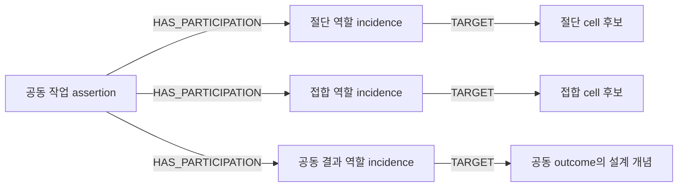

# HSWM — 경험에서 구분을 배우고, 계산을 바꾸고, 전체로 다시 참여한다

상태: `HYPERGRAPH_LEARNING_PLAN / MECHANISMS_UNTESTED`.
기준 commit: `a65323def4c0914a4c4d07c5525f2de1bcdb8c78`.
[직접 요청](../canon/sources/USER_PRIMARY_HSWM_HYPERGRAPH_LEARNING_PLAN_2026-09-06.txt)은
하이퍼그래프 기반 성장 방향과 repo·KG 기록을 지정한다. 아래 세부 기전·표현은
`SECONDARY_AI_PROPOSED`이며, 사용자가 인용한 assistant 설명도 그 출처를 유지한다.

## 목표와 이번 개념적 변화

[헌법](../canon/HSWM_CONSTITUTION_2026-08-20.md)의 HSWM은 하나의 token-native
LLM-function macro-neural network다. evolving hypergraph가 경험을 해석하고, 다음
계산을 조직하며, 결과에 따라 자기 관계를 수정하는 같은 몸이어야 한다.
그 전체는 상위 HSWM의 cognition-bearing cell로 다시 참여할 수 있어야 한다.

[앞선 철학적 계획](HSWM_WOLFRAM_RELATIONAL_CAPABILITY_RESEARCH_PLAN_2026-09-06.md)에
더하는 구체화는 **하위 내부의 학습, 구성원 사이의 관계 학습, 전체의 재참여를 동일한
typed relation·incidence·outcome-bound revision 문법으로 주소화한다**는 것이다.
world model의 관계와 실제 읽기·관찰·문제 분해·도구 사용을 연결할 interpreter/compiler가
필요하며, 저장 형식을 정하는 것만으로 그 연결이 구현되지는 않는다.

## 같은 성장 원리를 작은 단계부터 넣는다

| 생각할 대상 | 하위 접합 cell의 설계 예 | 상위 공방 HSWM의 설계 예 |
|---|---|---|
| 계속 경험할 세계 | 재료·표면·도구·순서가 반복되면서 새 조합과 반례가 생김 | 절단·접합·조립의 의존 순서, 전달 정보와 공동 실패 조건이 반복됨 |
| 실패 뒤 남길 설명 | 도구 부적합, 표면 조건, 재료 조합, 작업 순서가 경쟁 | 개별 능력의 오류, 전달 조건 누락, 조합 순서 오류가 경쟁 |
| 다음 관찰 | 비용 안에서 경쟁 설명을 구별할 표면 검사·조건 비교를 선택 | 구성원 입출력의 어떤 조건을 추가로 확인해야 하는지 선택 |
| 수정 가능한 관계 | 특정 조건에서 적용·보류할 연산과 확인할 조건 | 능력들의 적용 조건, 역할·순서·정보 전달·협력 관계 |
| 학습 뒤 계산 변화 | 불필요한 탐색을 줄이고 중요한 조건부터 관찰 | 내부 전 과정을 다시 풀지 않고 유효한 계약을 조합하되, 위반 시 다시 살핌 |
| 다음 규모의 참여 | 자기 학습·상태와 경계를 유지한 참여자 | 전체가 같은 Step/Learn/Inv/Permit/lineage 계약 아래 다시 참여자 |

공방은 사고실험 후보이며 task backend·평가 환경·정답 생성 규칙을 채택한 결과가 아니다.
local credit은 cell 내부 관계의 수정 근거이고 interaction credit은 함께 성립하는 관계의
수정 근거다. 전체 실패를 모든 구성원에게 나누어 감점하거나, 같은 outcome을 규모마다
중복 credit으로 더하지 않는다. 미식별 상황에서는 경쟁 설명과 수정 보류를 유지한다.

## 다음 논의를 이끌 네 가지 가설

1. **관찰 선택 자체가 능력이다.** 설명을 많이 저장하는 것보다, 현재 설명들 중 무엇이
   틀렸는지 구별할 다음 경험을 선택할 때 world model과 자기 계산의 수정이 연결될 수 있다.
   예상 정보 이득과 비용을 어떻게 추정·보정할지는 아직 미정이다.
2. **재사용은 조건을 가진 압축이다.** 상위가 하위 내부를 매번 재현하지 않아도 되는 것은
   적용 범위·불확실성·실패 조건이 유지될 때다. 예외를 만나면 내부 관찰을 다시 열거나
   참여를 거절할 수 있어야 한다. 압축 이익에서 선택·통신·유지·잘못된 일반화 비용을 뺀
   순이익이 양수인지는 별도 경험적 문제다.
3. **상위가 배우는 것은 결합의 조건이다.** 하위가 각각 성공해도 전체가 실패할 수 있으므로,
   상위에는 역할·순서·정보 전달을 수정할 독자적 학습 문제가 남는다. 그 문제가 있다는
   사실만으로 상위 인지나 거시적 인과 능력이 입증되지는 않는다.
4. **유용한 구분은 실행에서 차이를 만든다.** 새 관계가 다음 과제의 read-set, 관찰 순서,
   분해 또는 도구 선택을 어떻게 바꾸는지 추적해야 한다. 관계 수나 문서 수의 증가는 이
   변화를 대신하지 못한다.

이는 새 FCL 법칙이나 통과 기준이 아니다. 기존 FCL-1..8과
`SCIENTIFICALLY_CONNECTED / INTEGRATED_CLAIM_UNJUDGED`를 참조·보존하는 설계 가설이다.

## 하이퍼그래프를 표준 그래프로 표현하는 계약

각 n-ary assertion은 고유 UID를 가지고, `HAS_PARTICIPATION`으로 역할 참여 기록을,
각 참여 기록은 `TARGET`으로 참여 대상을 가리킨다. 참여 기록의 `role_name`, `ordinal`,
`revision_scope`, `membership_status`를 보존한다. 같은 대상이 다른 역할로 다시 등장해도
참여 기록을 합치지 않는다. ordinal은 표현상의 역할 순번이고 실제 작업 시간 순서는
`temporal_order_semantics`를 따로 선언한다.



네 assertion은 **국소 학습**, **공동 작업과 상위 관계 학습**, **경쟁 설명을 구별하는 관찰**,
**전체의 다음 규모 참여**를 나타낸다. 모두 설계 예시이며 실행 사건·canonical atom의
admission이 아니다. 마지막 assertion은 동일한 전체를 learner와 next-scale member라는
서로 다른 역할로 참조한다. 이 반복 참조는 동일한 conceptual whole의 역할 구별이며
member 수나 credit을 두 번 계산하는 근거가 아니다. 구성원·proposer·evaluator·executor·
custodian·authorizer와 schema-relative responsibility owner는 다른 개념이다.
각 canonical atom의 owner는 하나여야
하지만 이 projection은 가상 owner 주소를 발급하거나 상위가 하위를 소유한다고 선언하지 않는다.
경계·typed port·이탈/fork·불변식·권한·계보는 재참여 시 보존할 명시적 계약이다.

RDF의 기본 관계는 binary triple이므로 n-ary 의미는 관계 인스턴스와 참여 기록으로 표현한다.
이 방식은 [RDF 1.1 Concepts](https://www.w3.org/TR/rdf11-concepts/) 위의 HSWM 도메인
설계다. [W3C n-ary relations 문서](https://www.w3.org/TR/swbp-n-aryRelations/)는 참고한
**2006 Working Group Note**이며 Recommendation이 아니다. 이 도메인 어휘를 W3C 표준
HSWM ontology라고 부르지 않는다.

| 필요한 성질 | 이번 재사용 경로 | 정확한 경계 |
|---|---|---|
| 교환 가능한 dataset | 기존 compiler의 [RDF 1.1 N-Quads](https://www.w3.org/TR/n-quads/) export | UID·역할·incidence와 scope를 보존하는 조회용 표현 |
| 구조 검증 | 기존 generic shape + 도메인 [SHACL 1.0](https://www.w3.org/TR/shacl/) Core shape | cardinality·타입·제안 상태 검사; credit 진실성·FCL 통과 검사가 아님 |
| 출처 | 파일 byte SHA-256 binding과 [PROV-O](https://www.w3.org/TR/prov-o/) derivation | 기록→투영의 출처; 세계 outcome의 독립성·인과성은 별개 |
| 질문 가능한 계획 | 로컬 [SPARQL 1.1](https://www.w3.org/TR/sparql11-query/) SELECT, live KG Cypher 대응 | bounded read-only 질의, 일반 canonical write API 없음 |
| 운영 KG 기록 | 기존 registry·anchor 확인, bundle 소유 범위 transaction, exact readback | Neo4j backend가 인지·learning runtime이 되는 것은 아님 |

N-Quads는 blank-node-free deterministic profile이다. 정렬과 SHA를
[RDFC-1.0 canonicalization](https://www.w3.org/TR/rdf-canon/) 수행이라고 표시하지 않는다.
기존 [표준 acceptance 기록](../../_research/graph_standards/HSWM_GRAPH_STANDARDS_ACCEPTANCE.v1.json)과
[잠긴 runtime](../../_research/graph_standards/runtime/uv.lock)의 RDFLib 7.6.0·PySHACL 0.40.1을
재사용한다. 이들은 독립 구현이며 기존 suite의 명시된 qualification 범위를 넘겨 인증하지 않는다.

매핑 보존은 선언한 projection 어휘에 상대적이다. assertion UID와 참여 묶음, participation
UID, target UID, role, ordinal, revision scope, membership status, assertion의 scale·status·
시간 의미론과 출처·scope를 보존한다. 특히 묶음이나 반복 target의 동일성을 지우면 손실이다.
실행 가능한 token activation,
실제 atom revision, Permit, 관찰 truth, transition과 인과 효과는 이 export에 없다.
동일한 incidence 의미를 보존한 binary 저장 구현은 하이퍼그래프의 유효한 표현일 수 있다.
따라서 미래의 비교도 단순 “binary DB 대 hypergraph DB”가 아니라 역할·조건을 지운 lossy
flattening, 고정 routing, global credit 등의 정확한 대안과 비교해야 한다.

## KG로 물을 질문과 다음 작업

질의 파일은 [SPARQL](../../ontology/queries/HSWM_HYPERGRAPH_LEARNING_PLAN_2026-09-06.sparql)과
[Cypher](../../ontology/queries/HSWM_HYPERGRAPH_LEARNING_PLAN_2026-09-06.cypher)에 있다.

- Q1: 어떤 assertion에 누가 어떤 역할·revision scope로 참여하는가?
- Q2: local/interaction 설명과 관찰 선택, 제안 revision은 어떻게 연결되는가?
- Q3: 전체가 다음 규모의 cell이 되려면 어떤 경계·port·권한·계보가 보존되어야 하는가?
- Q4: C-1~C-6의 다음 산출물은 무엇이고, 어떤 가설을 구체화하는가?

현재 질의의 답은 **설계 의존관계**다. 아직 관측되지 않은 “가장 좋은 probe”나 “효능을 만든
revision”을 결과 행으로 꾸미지 않는다. 다음 실질 작업은 C-1~C-3을 한 사례로 잇는
관측→경쟁 설명→판별 관찰→수정/보류→달라진 계산의 개념 명세다. 관측 가능량과 hidden
rule, credit의 식별 가정, 연구자가 정답을 주입하는 지점을 먼저 드러내야 한다.
C-4~C-6의 분화·자기모델·재귀 합성 요구는 처음부터 그 명세를 제약한다.

[현재 증거 기록](HSWM_RESEARCH_INSIGHTS_AND_NEXT_EVIDENCE_2026-09-06.md)의 P1 RED,
v3/v4 실패와 v5 local mediation, G0 `NOT_PASSED`, G1 `NOT_EVALUATED`, D-4 미완료,
S-5 비교 파일 완료·S-6 second party 미지명 상태를 그대로 연결한다. 새로운 효능 결과나
canonical HSWM admission은 발생하지 않았다. 상위 합성으로 하위 실패를 구제하지 않는다.

## 재현

[bundle JSON](../../ontology/identity/hswm_core/HSWM_HYPERGRAPH_LEARNING_PLAN_ONTOLOGY.v1.json)은
문서·원문·정본·선행 증거·기존 표준 lock을 byte hash로 결속한다.
[표준 export](../../ontology/projections/hswm_hypergraph_learning_plan_2026-09-06/manifest.json)는
데이터 digest·shape digest·검증 결과를 기록하며 과학적 receipt가 아니다.

```bash
uv run --project _research/graph_standards/runtime --locked --extra graph \
  python -m hswm.infrastructure.fractal_learning_plan_projection \
  --additional-shapes schemas/HSWM_HYPERGRAPH_LEARNING_PLAN_SHACL_1_0.ttl \
  --export-dir ontology/projections/hswm_hypergraph_learning_plan_2026-09-06
uv run --locked --extra kg \
  python -m hswm.infrastructure.fractal_learning_plan_projection \
  --apply --source-config ~/.config/symposium-ontology/source.yaml
```

두 번째 명령은 도구 안에 고정된 검토 완료 SHA의 bundle에만 쓰기 가능하며, 동일 bytes의
재실행은 exact readback으로 기존 기록을 검증한다. 표준 projection 검증과 live 반영의
범위는 이 계획 bundle로 제한된다.
