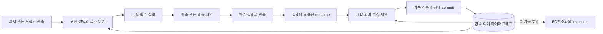

# HSWM을 어떤 구조로 개발할 것인가

2026-09-27 · `SECONDARY_AI_DESIGN` · 코드 확인 기준 `2ed3791`

**HSWM은 지속되는 의미 하이퍼그래프를 LLM 함수들이 국소적으로 읽고 실행하며,
관측 결과에 따라 그 그래프를 수정하는 하나의 프로그램으로 만든다.** 첫 배포 형태는
기존 TypeScript/Effect 런타임 한 프로세스, 현재 파일 기반 영속 상태, 연결된 LLM serving,
작은 실험 환경이면 충분하다. 구현 모듈의 구분은 한 AI의 소프트웨어 경계다.

[헌법](../canon/HSWM_CONSTITUTION_2026-08-20.md),
[네 가지 정체성](../canon/USER_PRIMARY_HSWM_HYPERGRAPH_NEURAL_AI_2026-09-14.md),
[그래프 상태·국소 연산자](../canon/USER_PRIMARY_HSWM_STATE_LOCAL_OPERATOR_HYPERON_2026-09-14.md)를 따른다.
CHU는 비LLM 세계 모델까지 포함하는 넓은 개념이고, HSWM의 계산 중심은 LLM 함수다.
이번 구체화는 **저장 형식의 설계에서 실제 실행·수정·다음 실행을 연결하는 개발 단위로
옮기는 것**이다. 기존 W1–W5, CR-0..7/FCL-1..8, 실패 결과와 성공 기준은 유지한다.

## 1. 사용자에게 보일 동작과 내부 형태

사용자가 과제나 관측을 넣으면 HSWM은 관련 관계와 참여자를 읽고, 예측·행동을 만들고,
실제 결과를 받아 다음 실행에 쓸 상태를 갱신한다. 화면을 붙인다면 처음에는 과제/결과,
실제로 읽은 관계·근거, 수정 전후 차이와 다음 실행 결과를 보여주는 작은 inspector면 된다.
같은 기능을 CLI로 먼저 확인한다. 전체 그래프 시각화는 그 뒤의 탐색 기능이다.

이 그림은 목표 동작이다. 현재는 caller가 실행할 relation UID와 outcome을 주며, 일반적인
과제→관계 선택·능동 읽기·환경 관측은 아직 연결할 부분이다. 현재 semantic 실행은 relation
UID 하나를 받아 한 frame과 한 관계의 수정 후보를 만든다. 목표 구조에서는 같은 LLM
연산 구현을 여러 관계에 재사용하고 worker들이 snapshot을 읽도록 확장한다. 이를 위한
scheduler는 후속 구현이다. node마다 별도 agent나 provider 요청 하나를 배정하지 않는다.
개념·근거·관계·실행 사건도 node가 될 수 있다.

컴퓨터 구조 비유를 쓰면 그래프는 지속 데이터와 실행할 의미 계약, LLM은 그 계약을 해석하는
연산 장치, local frame은 작업 입력, runtime은 호출·순서·지속성 관리에 대응한다.
이것은 설계 비유다. checkpoint는 버전이 있는 구현이며 영원히 고정된 ROM으로 가정하지 않는다.
그래프에 코드 주소나 문장을 저장한 사실만으로 실행되지는 않는다. schema가 선언한
연산과 승인된 I/O adapter가 그 내용을 실제 동작으로 연결한다.

## 2. 그래프 안에 무엇을 저장하는가

현재 [canonical schema](../../src/hswm/effect-runtime/src/canonical-atom-v2-schema.ts)의
`(schemaVersion, lineageId, atomUid, revisionId)`를 유지한다. atom은 type, 하나의 responsibility
owner, content digest, provenance, typed references를 가진다. 아래는 설계상의 역할이며
새 kind 여섯 개를 즉시 추가하라는 목록이 아니다. 현재 schema와 content 계약에 매핑한다.

| 표현할 내용 | 최소 의미 | 구현 원칙 |
| --- | --- | --- |
| 대상·개념·상태 | 어떤 대상의 어떤 상태인가 | 안정된 ID와 정확한 version 참조 |
| 의미 관계 | 참여자들이 어떤 조건에서 어떻게 작용하는가 | relation 자체가 version을 가진 atom |
| 역할 참여 | 입력·수신자·문맥·예외의 결속 | role, target revision, 필요한 순서·occurrence를 보존 |
| 근거·관측 | 무엇을 언제 어떤 방법으로 관측했는가 | 출처와 관측 내용을 관계 의미와 구분 |
| 실행 | 어떤 상태를 읽어 어떤 모델 입력·출력을 만들었는가 | trace와 실제 request/response 기록 |
| 수정 | 어느 parent를 어떤 근거로 바꾸었는가 | successor와 commit 결과, 다음 실행의 읽기 연결 |

예를 들어 작성된 문 환경에 `버튼·문·전원·잠금` 역할과 예외 참조를 처음부터 둔다.
초기 관계 문장 `버튼을 누르면 열린다`가 관측과 충돌하면, LLM이 `전원이 켜지고 잠금이
해제된 경우 열린다` 같은 후보를 제안한다. 학습 관측이 후보들을 구분하는지와 새 입력에서
맞는지는 따로 시험한다. 이 예시는 예정된 진단이며 이미 얻은 학습 결과가 아니다.

현재 [semantic runtime](../../src/hswm/effect-runtime/src/canonical-atom-v2-llm-semantic-runtime.ts)의
내용은 `semanticText`, `disposition`, `uncertainty`, `exceptionRefs`다. `roles`는 정확한
참조와 content를 가진 배열이다. 현 revision API는 역할 참조와 `exceptionRefs`를 보존하고
앞의 세 의미 필드만 바꾼다. 새 역할·연결을 만드는 구조 학습은 별도 transition과 소비 경로가
필요하다. 배열 순서와 반복 참여를 임의로 set으로 바꾸지 않고, 어떤 순서가 의미 있는지는
해당 schema에서 정한다. 현재 role 배열에는 명시적 ordinal 필드가 없으므로, 지속적인
slot 식별·순서 계약의 확장은 schema와 소비 코드를 함께 바꾼다. 독립 수정·복구가 필요한
incidence는 그에 맞는 atom으로 모델링한다.

Semantic Weight의 중심은 **역할·문맥에 따른 전이 성향**이다. 자연어는 현재 그 성향을
LLM에 전달하는 표현이다. 검색 점수, evidence 양, 불확실성 문장, 측정된 인과 효과를
하나의 숫자로 합치지 않는다. [정의와 표현 범위](HSWM_SEMANTIC_WEIGHT_DEFINITION_AND_HYPERGRAPH_2026-09-14.md)를 유지한다.

## 3. 표준 그래프 기술을 배치하는 위치

| 기술 | 이 아키텍처에서의 역할 | 별도로 구현·측정할 것 |
| --- | --- | --- |
| [RDF 1.1](https://www.w3.org/TR/2014/REC-rdf11-concepts-20140225/) | 고정 snapshot을 IRI와 typed relation으로 교환 | canonical 상태와 projection의 source binding |
| [n-ary relation 패턴](https://www.w3.org/TR/2006/NOTE-swbp-n-aryRelations-20060412/) | relation node와 role/occurrence로 다자 관계 표현 | 역할·순서·반복의 round trip; 이 문서는 informative Note |
| [SHACL 1.0](https://www.w3.org/TR/2017/REC-shacl-20170720/) | 지원 profile 내 type·기수·필수 속성 검사 | 의미 정답, actual digest, CAS와 실행 결과 |
| [SPARQL 1.1](https://www.w3.org/TR/2013/REC-sparql11-query-20130321/) | 읽기용 상태·출처 조회 | 조회 결과의 snapshot·scope와 runtime read mapping |
| [PROV-O](https://www.w3.org/TR/2013/REC-prov-o-20130430/) | 입력·실행·관측·수정의 파생 관계 | 관측 독립성, causal credit, 실제 성능 |

HSWM의 역할 어휘와 실행 계약은 로컬 설계다. 위 표준이 인지 아키텍처나 학습 알고리즘을
정해 주지는 않는다. 정보가 보존되는 incidence/factor graph 표현도 유효하다. bare clique
투영과 모든 이항 그래프를 같은 것으로 취급하지 않는다.

현재 [RDF projection](../../src/hswm/effect-runtime/src/canonical-atom-v2-rdf-projection.ts)은 raw payload를
생략하는 view다. RDF store에 쓴 내용을 암묵적으로 canonical state에 되돌리지 않는다.
QMD·embedding·adjacency index·compiled frame은 재생성 가능한 파생물로 두고 source revision을
검사한다. 캐시에는 relation뿐 아니라 실제 read set·내용·모델/인코더 설정의 결속이 필요하다.
공개 연구 KG와 private 실행 상태도 각자의 경로를 유지한다.

## 4. 현재 코드에서 재사용할 것과 추가할 것

| 경계 | 현재 있는 구현 | 다음에 연결할 부분 |
| --- | --- | --- |
| 상태·지속성 | [durable runtime](../../src/hswm/effect-runtime/src/canonical-atom-v2-durable-runtime.ts), [journal store](../../src/hswm/effect-runtime/src/canonical-atom-v2-state-journal-store.ts): content 결속, predecessor journal, 복구, CAS | 별도 프로세스 재개와 실험 runner의 연결 |
| 국소 연산 | semantic runtime의 `readLlmSemanticFrame`, `executeLlmSemanticRelation` | frame과 실제 model-visible request의 연결, 의미 실행 진단 |
| 관측 | `stageLlmSemanticOutcome`: trace/prediction과 caller outcome 결속 | evaluator가 관리하는 환경 관측 adapter와 provenance |
| 수정·commit | `prepareLlmSemanticRelationRevision`, [admission adapter](../../src/hswm/effect-runtime/src/canonical-atom-v2-llm-semantic-graph-loop-admission.ts), [graph-loop controller](../../src/hswm/effect-runtime/src/canonical-atom-v2-graph-loop-engineering.ts) | 실험군·후속 읽기·중단 시 상태 재확인 |
| 선택·추가 읽기 | 현재는 caller가 relation을 지정하고 pinned frame을 읽음 | task→relation 후보 선택, budget 안의 추가 읽기·기권 정책 |

조사 시 작업 트리의 `canonical-atom-v2-llm-semantic-local-process.ts`와 관련 launcher는
**미커밋 WIP**였다. 실행→caller outcome→수정→재조회 연결이 있지만 같은 프로세스의
재조회다. 이 설계 문서는 그 파일을 수정·커밋하거나 독립 프로세스 재시작 검증으로 세지 않는다.
현재 outcome의 `CALLER_DECLARED_NOT_INDEPENDENTLY_VERIFIED` 상태도 유지한다.

신규 runtime 로직은 `src/hswm/effect-runtime/src/`에서 순수 함수와 Effect I/O를 분리한다.
초기에는 작은 환경 adapter와 experiment driver면 된다. `ModelInvocation`, `EnvironmentObservation`,
`BoundedRead` 같은 이름은 제안하는 인터페이스 역할이며 이미 존재하는 API 이름이 아니다.
환경 adapter는 허용된 입력/행동을 받고 관측·source·시간·비용을 반환한다. 평가용 숨은 규칙,
정답, held-out split은 model-visible frame과 분리한다. [Effect v3 services](https://effect.website/docs/v3/requirements-management/services)의
교체 가능한 I/O 구현 방식을 기존 lockfile 버전에 맞춰 사용한다.

**저장소 결정:** 현재 canonical backend는 POSIX content/journal 파일이다. SQLite로
즉시 이관할 이유는 아직 측정되지 않았다. 조회가 느리면 우선 재생성 가능한 인덱스를
붙이고, commit/recovery가 실제 병목이면 기존 store interface 뒤의 backend 교체를 검토한다.
그때 revision·복구·충돌·불확정 publication 결과의 동등성을 확인한다.
[SQLite WAL](https://www.sqlite.org/wal.html)은 여러 reader와 한 writer를 지원하지만 그것만으로
분산 상태나 HSWM 합성이 만들어지지는 않는다.

**병렬 실행 결정:** 처음에는 순차 실행을 기준선으로 둔다. 이후 worker가 snapshot을 읽고
제안하는 것은 병렬화할 수 있으나, 현재 global `expectedStateRevision`은 서로 다른 관계의
수정에서도 충돌을 낼 수 있다. stale proposal은 새 snapshot에서 재검토·재계산한다. 단순히
parent 번호만 바꾸지 않는다. commit 결과가 불확정이면 transition 결과를 재확인한 뒤 재개한다.
모델 재호출은 새 비용·새 확률적 출력이므로 저장된 응답 replay와 구분한다. 외부 행동의
중복 실행 방지는 대상 도구의 idempotency/결과 조회 계약과 연결할 후속 작업이다.

## 5. 첫 개발 결과물과 그다음 순서

첫 결과물은 **작은 세계 하나에서 관계 하나가 관측을 받고 수정된 뒤, 프로그램을 껐다 켜도
다음 LLM 실행이 새 관계를 사용하는 실행 예제**다. 이를 기존 `_research/` runner에 연결한다.
새 runtime 동작만 `src/hswm/`에 두고, 과제·대조군·통계는 연구 runner가 책임진다.

1. **관계 실행의 판별부터 연결한다 — W1.** 역할·문맥·예외와 실제 요청을 기록한다.
   같은 입력에서 의미가 다른 관계가 답을 다르게 요구하는 과제를 사용한다. 복사 지름길,
   형식 오류, 정보 부족을 구별하고 기존 frozen census·성공 기준을 보존한다.
2. **환경 관측과 수정·재개를 연결한다 — W2.** 틀린 parent와 구분 가능한 관측을 사용하고,
   frozen/evidence-only/의미 보존 sham/선택된 의미 수정 군을 비교한다. 학습·개발에서 후보를
   선택한 뒤 별도 프로세스로 상태를 열어 held-out 입력을 실행한다. 수정 불필요·관측 부족
   조건의 no-op은 정상일 수 있다. 초기부터 전체 분모와 탐색·실행 비용을 기록한다.
3. **정보를 찾는 능력을 추가한다 — W3.** full/fixed/random/active read를 구분한다.
   읽을 수 있는 query·snapshot·예산을 선언하고 실제 읽은 것·누락·비용을 trace에 붙인다.
   fixed frame이 충분한 작은 과제의 결과를 임의 크기 그래프의 국소 충분성으로 확대하지 않는다.
4. **여러 관계의 메시지와 합성을 확장한다 — W4/W5.** typed 입출력·의존 관계로 스케줄하고,
   공동 분포·공유 원인·불확실성·수정 이력을 보존한다. 구조 학습은 새 role/exception/topology
   revision을 실행기가 실제로 소비하도록 별도 구현한다. 여러 worker 호출만으로 상위 HSWM이
   실현되었다고 판정하지 않는다.

각 단계의 설계는 병행할 수 있다. 실제 판정 기준과 실험 비용은
[적대적 해결안](HSWM_ADVERSARIAL_REMEDIATION_PLAN_2026-09-27.md)을 따른다.
첫 단계가 실패하면 정확한 모델·입력·출력·방법 범위를 교정하며, 큰 그래프로 옮겨 실패를
덮지 않는다. 연결 구현 완료와 실질적인 성능 개선은 따로 보고한다.

첫 예제의 공학적 완료 조건은 source-bound 관측, 수락/거절/충돌 결과, parent→successor,
실제 다음 frame·request를 하나의 실행 이력에서 추적하고 재시작 후 재현하는 것이다.
**연구상 질문은 그 수정이 held-out 결과와 retention을 대조군보다 개선했는가**다.
전자는 작동하는 소프트웨어의 근거이고 후자는 아직 실험해야 할 HSWM의 기전이다.

## 6. 프랙탈 목표와 도구 선택을 어디에 남기는가

M = Map 방향은 [층간 Map 설계](HSWM_CROSS_LAYER_MAP_ENGINEERING_2026-09-27.md)와 연결한다.
물리 상태·시냅스 상태·의미 상태는 해상도와 관측량이 다르므로 각 표현과 그 사이의 mapping을
명시한다. mapping에는 입력/출력 타입, 적용 범위, 보존하는 관측과 손실을 둔다. 외부 물리
시뮬레이터는 환경 adapter로 연결할 수 있다. 모든 층을 먼저 구현할 필요는 없으며, 서로
연결했다는 사실만으로 예측·개입·학습까지 보존되었다고 해석하지 않는다.

장기적으로 작은 HSWM 전체가 상위 관계의 참여자가 될 수 있도록 typed 입력·출력·관측·수정
경계를 설계한다. 상위가 하위의 요약만 읽을 때 학습에 필요한 불확실성·예외·joint 의존성을
잃지 않는지 시험한다. 기존 [FCL-1..8](HSWM_FRACTAL_SCIENTIFIC_CONNECTIONS_2026-08-28.md)을
그대로 유지한다. 모든 component에 같은 함수 이름을 붙이는 것만으로 인지적 합성이 증명되지는 않는다.

[Hyperon 직접 선행](HYPERON_2026_DIRECT_PRIOR_DEEP_DIVE_2026-08-20.md)을 핵심 대조군으로 둔다.
기존 고정 대상 `hyperon-experimental v0.2.10`, commit
`3f76dc460da6961f57f69f6c3e550c59c74ada83`의 실행 가능한 component와 백서의 prototype/설계를
구별한다. 같은 과제·모델 접근·관측·수정·총 비용에서 비교하며, 이번 설계로 독창성이나 우위를
확정하지 않는다. 새 Hyperon 버전을 평가하려면 별도 source pin과 구현 확인이 필요하다.

[추가 도구 검토](HSWM_ADDITIONAL_TOOLS_AND_PAPER_REVIEW_2026-09-27.md)의 Inspect·GEPA는 기존
평가·후보 탐색에, XGrammar는 지원되는 출력 형식 제한에, Reasoning Gym은 별도 진단 과제에
연결한다. Docling/GROBID는 PDF를 실제로 입력받을 때 쓴다. 이 도구들을 모두 설치하는 작업이
첫 실행 루프보다 앞설 필요는 없다. 이번 변경은 아키텍처·개발 경로 문서이며 runtime,
dependency, 공개 KG, 기존 연구 판정을 변경하지 않았다.
