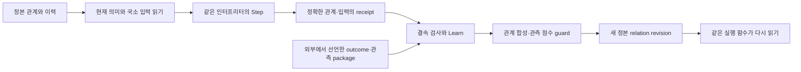

# HSWM을 향한 통합 폐루프 증명: 같은 정본 그래프의 수정과 재실행

2026-09-27 · `SECONDARY_AI / CONSTRUCTED_FINITE_CANONICAL_LOOP`.

**이번 목표는 서로 다른 모형의 긍정 정리를 모아 HSWM이라고 부르는 대신,
하나의 정본 그래프에서 실행·관측·수정·재실행과 제한된 성능 향상을 연결하는 것이다.**
[사용자 요청](../canon/sources/USER_PRIMARY_HSWM_INTEGRATED_LEAN_REQUEST_2026-09-27.txt)은
[세 철학의 증명](HSWM_THREE_PHILOSOPHIES_LEAN_2026-09-27.md)을 기반으로 HSWM 자체의
증명을 요구한다. 아래는 그 방향의 유한 구성적 연결이며 전체 HSWM의 실현 판정은 아니다.

대상은 [헌법](../canon/HSWM_CONSTITUTION_2026-08-20.md)의 하나의 token-native AI다.
하이퍼그래프 신경망 조직, LLM 기본 계산 단위, Semantic Weight 작동, 하나의 거대한 AI라는
[네 정체성](../canon/USER_PRIMARY_HSWM_HYPERGRAPH_NEURAL_AI_2026-09-14.md)을 함께 유지한다.
그래프가 AI의 상태 자체이고 LLM은 작은 국소 입력을 받는 내부 연산자라는
[정의](../canon/USER_PRIMARY_HSWM_STATE_LOCAL_OPERATOR_HYPERON_2026-09-14.md)도 축소하지 않는다.
이번 정확한 참조 인터프리터가 실제 pretrained LLM이라는 전제는 두지 않는다.

## 연결한 빈틈

기존 `HSWMLLMSemanticGraph`는 문자열 의미·역할·owner·근거·revision을 가진 정본 관계의
Step/Learn을 증명한다. 기존 `HSWMGeneratedLearningBridge`와 `HSWMSemanticSoftware`는
실행 가능한 관계 프로그램 `Expr`의 생성·선택·점수 향상을 증명한다. 이 둘은 서로 다른
타입이므로 별도로 참이라는 사실만으로 같은 정본 실행의 향상이 나오지 않는다.

[통합 모형](../../formal/HSWMIntegratedClosedLoop.lean)은 문자열과 제한된 실행 의미 사이의
codec을 명시한다. 지속되는 기계 상태는 기존 `GraphState` 하나다. 실행용 정답 프로그램을
별도 mutable state에 두지 않고, 매번 현재 관계의 `semanticText`에서 실행 의미를 읽는다.

이 구조는 세 철학 중 M = Map을 **명시적 표현 변환**, 하이퍼그래프를 **역할 있는 관계**,
소프트웨어 철학을 **저장된 프로그램의 실행과 수정**으로 연결한다. 앞선 조건부 저장 비용
정리는 이 폐루프의 성능 전제가 아니다. 하이퍼그래프의 보편 최소비용을 증명했다고
끼워 넣지 않는다.

## 증명 모형의 입력과 범위

- 의미 codec은 기존 입력 `x0`와 생성된 `x0 AND (x1 AND x2)`의 두 저장 표현을 다룬다.
  임의 자연어·전체 문법의 손실 없는 저장이나 새로운 topology 생성은 아니다.
  지원 밖의 프로그램·입력에는 명시한 기본값을 사용하는 모형이다. 이것을 올바른 의미
  복원이나 안전한 런타임 오류 처리로 해석하지 않는다. 왕복 증명은 지원한 표현에 한정한다.
- 입력은 세 Boolean 신호다. 텍스트 입력 codec과 현재 관계의 직렬화를 통해 실행한다.
  정확한 작은 참조 인터프리터이며 확률적 LLM 호출·tokenizer·HTTP·DB의 증명이 아니다.
- outcome은 trace에 결속된다. 외부에서 고정한 package는 작은 `Outcome` record 전체의
  동등성으로 선택하며 clean 합성 관측, 점수 평가 관측, 오염 허용량과 비용을 전달한다.
  이 값들을 `observedToken`에서 추출하거나 내용 hash·서명·외부 출처로 인증한 것은 아니다.
  package가 다른 경우 정본 상태를 그대로 반환하며, stale receipt·틀린 trace를 가진 receipt·잘못된
  직렬화는 실제 Learn 경로에서 `none`으로 거부한다. 이 구분은 관측의 진실성·독립성이나
  인과 credit을 인증하지 않는다.
- 합성과 선택은 참 세계 함수에 접근하지 않는다. 참 함수는 증명의 사후 평가에만 쓰인다.
  참조 세계와 관측값은 연구자가 작성한 유한 구성이다.
- 관계의 기존 owner·역할·추가 역할·이전 버전 보존은 구조적 계약이다.
  필드 보존을 예외의 행동 효과, uncertainty calibration, 완전한 schema/Permit 검증으로
  확대하지 않는다.
  역할 주소와 세 신호 slot의 해석은 고정되어 있으며, 임의 역할 재배치·국소 read-set 선택의
  정확성이나 거대한 그래프에서의 정보 충분성을 증명하지 않는다.

## 학습 입력과 분리한 평가

이번 갱신은 앞선 전체 census를 채택 평가로 사용하지 않는다. 합성은 `111`, `110`,
`101`, `011` 네 입력만 사용한다. guard의 관측도 같은 네 입력에 한정한다. 각 입력 질량은
2이고 `111`의 한 단위 라벨만 오염시킨다. 따라서 전체 학습 평가 질량은 8, 오염량은 1이다.

| 선언한 양 | 수정 전 `x0` | 수정 후 3항 AND |
| --- | ---: | ---: |
| 학습 영역의 관측 정답 질량 | 3/8 | 7/8 |
| 학습 영역의 참 정답 질량 | 4/8 | 8/8 |
| 분리된 평가 영역의 참 정답 질량 | 6/8 | 8/8 |

guard는 `3 + 2 × 1 + 1 < 7`을 계산해 후보를 선택한다. 비용 1은 선언한 정답 질량 단위다.
분리된 평가 영역은 `000`, `001`, `010`, `100`이며, 합성과 guard 어느 쪽에도 입력되지
않는다. 같은 정본 successor를 다시 실행했을 때 이 영역에서 비용을 넘는 이득
`6 + 1 < 8`을 얻는다. 실제 토큰·시간·돈의 단위나 측정된 일반화 성과가 아니다.

[분리 평가 증명](../../formal/HSWMClosedLoopEvaluation.lean)은 입력 집합의 비중첩과
동일한 정본 실행의 점수를 연결한다. 이 네 입력은 사전에 작성된 작은 Boolean 세계의
나머지 입력이다. 새로운 현실 표본을 수집한 통계 실험이나 모든 세계의 학습 보장은 아니다.
통합 모듈에 함께 보존한 `10/16 → 16/16` 정리는 학습 입력이 겹치는 전체 census 진단이다.
분리 평가 결과는 `6/8 → 8/8`이며 둘을 같은 증거로 세지 않는다.

중심 정리는 `constructed_canonical_loop_has_disjoint_gain`이다. **실제 `integratedLearn`이
반환하는 정본 successor가 존재하고, 그 동일한 successor를 실제 `Step`으로 다시 읽은
평가 점수가 8이며 이전 점수 6과 비용 1을 엄격히 넘는다**는 하나의 존재 증명이다.
`pre_outcome_step_does_not_read_future_evidence`는 미래 evidence package의 내용이
이전 Step을 바꾸지 못함을 보인다. 수정 뒤 예측은 별도 점수 전용 인터프리터를 사용하지 않는다.

## 같은 학습 기록이어도 다른 세계에서는 실패한다

`alternativeWorld`는 모든 학습 입력에서 원래 세계와 동일하다. 학습 영역 밖에서는 `x0`를
정답으로 삼는다. 그래서 같은 합성 관측·같은 오염량·같은 guard는 같은 정본 수정을 만들지만,
분리 평가의 점수는 **8/8 → 6/8**로 떨어진다.

이 반례는 HSWM 목표의 폐기가 아니다. 관측한 영역으로부터 미관측 세계를 식별하려면
어떤 inductive bias·세계 가정·추가 관측이 필요한지를 보여 준다. 실제 LLM의 사전학습
지식은 이런 가정을 제공할 유용한 후보지만, 그것의 현실 정확성을 이 형식 증명이
자동으로 부여하지 않는다. 실패를 이름만 바꿔 향상으로 기록하지 않는다.

## 전체 HSWM과 남은 의무

[CR-0..7](HSWM_CONSTRUCTIVE_REALIZABILITY_PROGRAM_2026-09-10.md)은 유지한다.
CR-0의 전체 schema/owner/typed reference/Inv/Permit/계보, CR-1의 지속적 유용한 갱신,
CR-2의 인과 식별, CR-3의 중복 없는 credit, CR-4의 coalition·topology 생성과 회복,
CR-5의 world/self·세대 간 능력 보존, CR-6의 권리·효과를 보존하는 합성,
CR-7의 한 실제 런타임에서의 동시 충족은 이번 작은 모형으로 모두 닫히지 않는다.

[FCL-1..8](HSWM_FRACTAL_SCIENTIFIC_CONNECTIONS_2026-08-28.md)의 local causal learning,
composition preservation, emergent coalition, multiscale credit, topology morphogenesis,
world–self co-model, diachronic continuity, HSWM-of-HSWMs 목표도 그대로다.
한 관계의 버전 변경을 거대한 인지적 HSWM의 실현으로 재정의하지 않는다.

OpenCog Hyperon은 여전히 필수 핵심 비교 대상이다. 기존
[직접 선행 감사](HYPERON_2026_DIRECT_PRIOR_DEEP_DIVE_2026-08-20.md)의 persistent metagraph와
neural bridge를 해당 버전·성숙도에서 비교해야 한다. 이번 증명은 새 Hyperon 실행·비교
결과가 아니며, backend 채택·최초성·동등 비용 우위도 주장하지 않는다.

## 재현

[재실행 안내](../../_research/integrated_hswm_proof_v1/README.md)의 TypeScript/Effect 검증기는
기존 세 철학 profile을 유지하고 `--profile integrated-hswm`을 추가한다. 기존 증명 기록은
그 당시 소스의 역사적 기록으로 보존한다. 새 결과는 새로운 검증 파일에 소스 해시,
정리별 공리와 고정 Lean toolchain을 결속한다. 실제 모델 실행과 TS 런타임 전체 refinement는
이 검증의 범위 밖이다.

[새 검증 기록](../../_research/integrated_hswm_proof_v1/lean-verification.v1.json)은
Lean 4.32.1의 정확한 바이너리로 16개 모듈을 새 import 디렉터리에서 `--trust=0` 컴파일한
결과다. 새 두 모듈의 정리 50개(통합 33·분리 평가 17)와 기존 철학 정리 33개를 합쳐
83개의 이름 있는 정리·보조 정리·반례에 `#print axioms`를 실행했다. 공리는
`propext`, `Quot.sound`, `Classical.choice` 이내이며 `sorryAx`와 추가 공리는 없었다.
TS/Effect 검사·빌드, 검증 출력 parser 테스트 3개, 개발 workflow 회귀 55개도 통과했다.
공개 결과는 호스트 절대 경로 세 필드만 제거한 투영이며, 별도 독립 커널 검사기를 실행한
결과는 아니다. 정리 개수는 HSWM의 인지 능력이나 완성도의 척도가 아니다.
