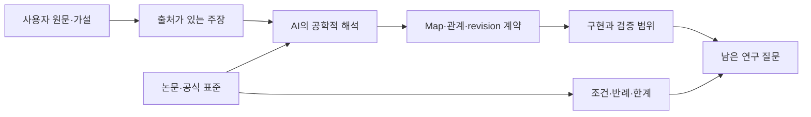

# HSWM 직관·문헌·구현의 표준 그래프 지도

2026-09-27 · `SECONDARY_AI_SYNTHESIS / INTEGRATED_CLAIM_UNJUDGED`

**HSWM의 설계 방향은 여러 해상도의 세계 모델을 매핑하고, 역할 있는 공동 관계를
AI 상태로 유지하며, 국소 LLM 연산과 결과에 결속된 수정으로 그 상태를 바꾸는 것이다.**
그 구조가 우주 기술의 보편적 최소비용 체계라는 주장은 사용자 연구 가설로 보존한다.
문헌의 연결성과 현재의 표현·조회 검증은 이 가설의 증명이 아니다.

이번 개념적 정리는 **사용자 직관 → 조건이 있는 해석 → 출처 → 구현 계약 → 미해결 질문**을
각각 식별 가능한 그래프 객체로 연결한다. 새로운 인지 subsystem이나 개발 승인 절차를
추가하지 않는다. [헌법](../canon/HSWM_CONSTITUTION_2026-08-20.md)의 하나의 AI,
하이퍼그래프 신경망 조직, LLM 기본 계산 단위와 Semantic Weight를 함께 유지한다.

## 사용자 원문과 공학적 번역

원문은 [층간 Map 발화](../canon/sources/USER_PRIMARY_HSWM_CROSS_LAYER_MAP_2026-09-27.txt)와
[최소비용 가설 발화](../canon/sources/USER_PRIMARY_HSWM_MINIMUM_COST_HYPERGRAPH_2026-09-27.txt)다.
원본 bytes와 SHA-256을 KG snapshot에 연결한다. 사용자는 범주 1·2의 내용만 제시했으며
범주 3은 아직 정의하지 않았다. 아래 표의 행 수는 사용자 범주의 수가 아니다.

| 사용자 방향·가설 | `SECONDARY_AI` 공학적 번역 | 확인해야 할 것 |
| --- | --- | --- |
| agent는 양파껍질 최외각의 우주 시뮬레이터 | 현재 모델링 경계에서 세계·자신·다른 모델을 다루는 역할. 더 큰 HSWM의 cell이 될 수 있다. | 모델의 정의역·해상도·시간·질문과 관찰 가능한 출력 |
| 물리·시냅스·Semantic Weight에서 시작할 수 있다 | 특정 모델링 층을 필수 선행 단계로 두지 않는다. 층들은 고정된 직렬 파이프라인이 아니다. | 각 모델이 보존·생략하는 정보와 과제 범위 |
| M = Map은 이들을 매핑하게 한다 | 버전 있는 source/target 모델, 상태 대응, 허용 개입, 관측, 시간과 손실을 명시한다. | 관찰 일치·개입 반응·학습 후 일치를 각각 평가 |
| 하이퍼그래프가 세계 기술의 최소비용 체계다 | 같은 정보·평가 오차·과제에서 n항 의미 조직과 대안 표현의 비용을 비교한다. | 비용의 단위·후보군·정확도·encoder/decoder·조회·갱신 비용 |

‘최외각’을 상대적인 모델링 역할로 읽는 것은 [기존 AI 해석](../canon/USER_PRIMARY_HSWM_CROSS_LAYER_MAP_2026-09-27.md)이다.
사용자의 강한 보편적 최소성 주장과 아래의 좁은 검증안을 동일한 주장으로 바꾸지 않는다.
[프랙탈 목표](HSWM_FRACTAL_SCIENTIFIC_CONNECTIONS_2026-08-28.md)는 합성된 HSWM도 같은
typed·outcome-bound dynamics를 만족해야 한다는 의무를 유지한다. 모델을 중첩한 것만으로 충족되지 않는다.

## 인터넷 자료가 연결해 주는 부분

원 논문·저자 자료·공식 표준을 2026-09-27에 확인했다. 아래 판정은 AI의 출처 해석이다.
사용자 권위, 출처의 발행 주체, 명제의 경험적 상태를 별도 속성으로 둔다.

| 출처 | 가져오는 내용 | 확대하면 안 되는 결론 |
| --- | --- | --- |
| [World Models](https://arxiv.org/abs/1803.10122) | 환경을 압축해 예측·정책에 사용하는 구체적 설계 | 모든 AI가 우주 전체를 정확히 시뮬레이션한다는 정의 |
| [Information Bottleneck](https://www.princeton.edu/~wbialek/our_papers/tishby%2Bal_99.pdf) | 주어진 결합분포·목표 변수에 관련된 정보를 보존하는 압축 | 개입의 충분성이나 특정 그래프·LLM 비용의 최적성 |
| [Causal states](https://csc.ucdavis.edu/~cmg/papers/cmppss.pdf) | 이산값·이산시간·정상 과정에서 미래 전체 예측을 보존하는 경쟁 상태 중 최소 상태 엔트로피 | 비정상 환경·유한 학습·개입·실행 비용에 대한 일반 정리 |
| [MDL](https://arxiv.org/abs/math/0406077) | 선언한 코드·모델군에서 모델과 자료의 설명 길이 비교 | 짧은 설명이 언제나 빠른 실행 또는 싼 학습이라는 결론 |
| [Factor Graphs](https://www.isiweb.ee.ethz.ch/papers/arch/aloe-2001-1.pdf) | 다변수 관계를 변수–factor 연결로 표현하는 계산 구조 | 임의 관계가 유용하게 인수분해되거나 고차 계산이 무료라는 가정 |
| [Causal Consistency](https://staff.fnwi.uva.nl/j.m.mooij/articles/camera_ready_uai2017.pdf) | 모델 간 상태 대응과 개입 대응의 조건 | 실제 LLM 모델 사이에 그 조건이 이미 성립한다는 주장 |
| [Transformer 원 논문](https://arxiv.org/abs/1706.03762) | query–key 점수와 value 가중합 | 지속적·역할 있는 하이퍼그래프로 수렴진화했다는 기술사적 사실 |
| [Wolfram Physics](https://www.wolframphysics.org/technical-introduction/) | graph/hypergraph 관계 rewrite 기반의 물리 모델 제안 | 실제 우주의 확정 이론이나 보편적 최소비용 증명 |
| [ZFC 언어, Oxford §2](https://people.maths.ox.ac.uk/zilber/ast-web.pdf) | 비논리 관계 기호는 이항 membership `∈`; 하이퍼그래프도 집합론 안에서 정의 가능 | ZFC가 하이퍼그래프 이론 위에서 시작됐다는 주장 |
| [Fermat 원리 설명](https://www.feynmanlectures.caltech.edu/I_26.html#Ch26-S5) | 광학 경로에 대한 시간의 정류 조건을 생각하게 하는 비유 | 모든 경로의 전역 최솟값 또는 표현 비용의 동일한 최적화 법칙 |

이 연결에서 얻는 검증 가능한 후보는 **반복되는 공동 의존성이 있고 그 관계를 재사용할 수
있을 때, 역할·문맥·예외를 가진 관계 단위가 같은 정확도에서 특정 저장·읽기·갱신 비용을
줄이는가**다. 정보가 없는 쌍별 투영과 정보가 보존된 incidence를 같은 비교군으로 취급하지 않는다.
[상세 반례와 비교 설계](HSWM_MINIMUM_COST_HYPERGRAPH_HYPOTHESIS_2026-09-27.md)에 조건을 둔다.

## 표준 그래프로 표현하는 방법

그림의 화살표는 탐색 연결이다. 구체적인 KG 관계에는 의미·범위·권위·상태를 함께 기록한다.
모든 연결을 인과관계나 논리적 증명으로 해석하지 않는다.

| 그래프 객체 | 보존할 정보 | 표준·기존 구현에 연결 |
| --- | --- | --- |
| 주장·출처 | 안정된 UID, 원문 위치·digest, 작성 권위, 가설/관측/해석의 지위 | 기존 KG bundle v2, RDF IRI, 출처 artifact binding |
| 의미 관계 | relation identity, 의미, 문맥, 예외, 근거, revision | canonical `semantic_relation` atom과 전체 `SemanticReadFrame` |
| 참여 slot | 대상의 정확한 revision, 역할·방향·타입·ordinal | 관계 노드 + incidence; 같은 대상의 여러 역할도 보존 |
| 모델 간 Map | source/target ref·digest, 관측·허용 행동·horizon·손실 | canonical context의 MapSpec과 명시적 derived RDF view |
| 표현과 상태 추상화 | 무손실 codec인지, 과제 상대적 정보 생략인지 | direct JSON/incidence/role table 비교와 유한 상태 매핑을 구분 |
| 검증·미해결 질문 | 실제 검사 범위, 미측정 비용, 반례, 후속 평가 | 구현 근거와 연구 가설을 별도 노드로 연결 |

교환에는 [RDF 1.1](https://www.w3.org/TR/2014/REC-rdf11-concepts-20140225/)과
[N-Quads](https://www.w3.org/TR/2014/REC-n-quads-20140225/), 조회에는
[SPARQL 1.1](https://www.w3.org/TR/2013/REC-sparql11-query-20130321/), 구조 검사에는
[SHACL 1.0](https://www.w3.org/TR/2017/REC-shacl-20170720/), 파생 출처 연결에는
[PROV-O](https://www.w3.org/TR/2013/REC-prov-o-20130430/)를 재사용한다. 모두 명시한 Recommendation
버전에 근거한다. [W3C n-ary relation 패턴](https://www.w3.org/TR/2006/NOTE-swbp-n-aryRelations-20060412/)은
informative Working Group Note다. HSWM의 로컬 어휘와 비용 가설 자체는 W3C 표준이 아니다.
일반 관계 인스턴스 노드와 `rdf:Statement`로 triple을 기술하는 RDF reification도 구별한다.

## 현재 공학으로 연결된 범위

[Semantic Map Engineering v1](../../_research/semantic_map_engineering_v1/README.md)은
다음 계약을 구현한다. 이는 새 실험을 실행한 보고가 아니라 기존 구현의 현재 범위다.

- 전체 frame의 direct JSON / incidence / role table 왕복. 같은 정보가 복원되는지와
  직렬화 바이트를 확인하며, 기존 검증은 세 frame에서 총 9회 왕복했다.
- context digest와 relation revision에 묶인 MapSpec RDF view. 기존 canonical projection과
  같은 atom IRI를 사용하므로 join할 수 있고, 노출된 모델·행동·시간·손실을 조회한다.
- 의미 수정 뒤 같은 canonical 관계를 다시 읽는 durable fixture.
  revision 1은 의미 수정, revision 2는 새 입력 연결이다. 실제 모델 호출은 0회였다.

일반 canonical RDF view는 raw payload를 생략하고, MapSpec view는 선언된 필드를 추가로
노출한다. 어느 view도 전체 AI 상태의 무손실 codec이나 canonical 쓰기 경로가 아니다.
조회 결과의 구조 적합성과 관계 내용의 참·인과 효능은 별도다.

현재 MapSpec 실행은 `finite-toy-rh/v1`, one-tick 범위다. 물리·시냅스 simulator 연결,
자동 층 발견, 실제 LLM의 개선, 토큰·latency·인덱스·학습을 포함한 전체 비용은 여기서 검증되지 않았다.
[Hyperon 직접 선행 감사](HYPERON_2026_DIRECT_PRIOR_DEEP_DIVE_2026-08-20.md)의 component/version
비교 의무를 유지한다. 이 문서는 8월 20일 감사를 참조하며 최신 Hyperon을 새로 평가한 결과는 아니다.
기존 CR-0..7·FCL-1..8 판정과 음성 결과를 유지한다.

## 다음 연구 질문

앞선 대화의 AI 해석을 연구 질문으로 연결하면, 실패 후 **관계 의미를 고칠지, 읽지 않은
문맥을 읽을지, 모델링 해상도를 바꿀지**를 구별할 수 있는가가 된다. 이 셋은 배타적인
원인 분류가 아니고, 단일 실패만으로 원인을 식별할 수 있다고 가정하지 않는다.
동일한 과제·정보 접근·예산에서 각 변경과 변경 없는 대조군을 비교하고, 새 outcome 뒤의
held-out 평가로 정확도·비용·기존 능력 보존을 함께 본다는 연구 제안이다. 아직 실행되지 않았다.

## KG와 조회

[출처 결속 bundle](../../ontology/identity/hswm_core/HSWM_MINIMUM_COST_HYPERGRAPH_ONTOLOGY.v1.json)은
원문 가설, AI 해석, 문헌의 제한 조건, 구현 계약과 미해결 질문을 구분한다.
[조회 안내](../../ontology/queries/hswm_minimum_cost_hypergraph_2026-09-27/README.md)는
사용자 가설·문헌·공학 범위를 각각 조회하는 SPARQL과 구조 검사 명령을 제공한다.
원문과 출처의 bytes를 바꾸어 과거 snapshot을 갱신하지 않는다.

라이브 KG에는 이 bundle의 내용을 요약한 연결된 `SECONDARY_AI / PENDING_OR_PRELIMINARY`
레코드를 게시한다. 이는 사용자 원문을 대신하는 새 USER_PRIMARY 정전이 아니다.
실제 게시·readback 범위는 [게시 기록](artifacts/hswm_intuition_graph_2026-09-27/publication.v1.json)에
남긴다. 로컬 bundle 전체가 라이브 KG에 같은 노드·edge로 복제됐다고 주장하지 않는다.
