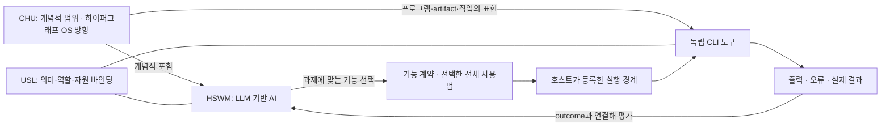

# HSWM-like 도구의 CLI 계약과 CHU·HSWM·USL의 관계

2026-09-29 · `SECONDARY_AI_DESIGN / PROPOSED`

사용자 방향: HSWM-like 도구는 우선 CLI로 동작하는 프로그램을 가져야 하며,
USL·HSWM·CHU와의 관계를 표준 그래프 엔지니어링으로 구체화한다.
아래 공통 profile과 선택 정책은 Codex의 제안이다. 기존 USL CLI 실행은 확인했지만,
모든 도구에 이 profile을 구현하거나 CHU/HSWM 실행을 통합 완료한 것은 아니다.

## 1. 세 체계와 도구의 책임

| 대상 | 책임 | 다른 대상과의 관계 |
| --- | --- | --- |
| CHU의 개념적 범위 | 계산 모델·프로그램·상태·세계를 포괄한다. | HSWM과 비LLM 세계 모델을 포함한다. 한 데이터베이스로 범위를 제한하지 않는다. |
| CHU OS | 작업환경을 typed n항 하이퍼그래프로 다루려는 구현 방향이다. | 프로그램·artifact·작업·이력·질의 view의 환경이 된다. 폴더/경로는 표현이며 정본 트리 계층을 강요하지 않는다. |
| HSWM | 지속 Semantic Weight 하이퍼그래프와 국소 LLM 연산으로 작동하는 하나의 AI다. | 필요한 도구를 선택하고 결과를 해석하며, outcome에 결속된 graph revision을 이후 행동에 사용한다. |
| USL | 서로 다른 소유자의 자원·표현을 의미와 이름 있는 역할로 연결한다. | CHU·HSWM·CLI·원문·결과를 연결한다. 자체 DB나 전체 workflow 실행기로 확장해 해석하지 않는다. |
| HSWM-like CLI 도구 | 명시한 입력에 대해 자체 프로그램으로 기능을 실행한다. | HSWM 밖에서도 직접 사용할 수 있다. LLM을 쓰지 않는 변환기·검사기에도 HSWM-like 조직 원리를 적용할 수 있다. |

범위의 근거는 [CHU·HSWM 사용자 정의](../canon/USER_PRIMARY_CHU_HSWM_SOFTWARE_SCOPE_2026-09-27.md),
최근 OS 방향과 기존 연결은 [USL의 CHU 연결](https://github.com/gj3447/USL/blob/06490d08bb610ad68a2ba318e3fb6f2efbc90f38/docs/CHU_CONNECTION.md)이다.
프로그램과 성질의 구분은 [HSWM / HSWM-like](HSWM_PROGRAM_AND_HSWM_LIKENESS_2026-09-29.md)를 유지한다.

이 도식은 역할 대응이다. 모든 edge가 호출 순서, 실행 권한 또는 현재 설치 상태를 뜻하지 않는다.

## 2. CLI가 있어야 한다는 요구의 구체화

**채택 후보 도구에는 직접 호출 가능한 CLI와 버전 있는 기능 계약이 있어야 한다.**
CLI 명령 이름은 각 도구가 유지하며, 공통 명세는 의미·입출력·사용법·효과·결과에 둔다.
모든 도구에 동일한 `plan/run/status` 명령을 의례적으로 추가하지 않는다.

| 요소 | 최소 계약 | 기존 연결점 |
| --- | --- | --- |
| ProgramArtifact | 도구 ID와 구체 build/revision, 실행 환경, 설치·의존성 근거 | 기존 package/bin·Git·content pin |
| CliEntrypoint | 직접 실행 경로, 도움말, 고정한 operation/argv 규칙 | native CLI; USL host의 고정 command |
| Capability | 의미, 입력/출력 schema, 효과·범위, 지원하지 않는 조건 | `usl-capability/v1`의 기존 descriptor |
| UsageBundle | 선택한 기능의 전체 규칙·예제·전제·오류 처리·source revision | instruction 자원과 USL 역할 링크 |
| Invocation | 정확한 capability/build/input·문맥·host 결속 | 기존 `cli-plan` / `cli-run`의 단일 entry 실행 |
| Result | 기계 판독 출력, 실패 종류, 산출물 참조와 실제 관측 | JSON stdout, stderr diagnostics, exit status, 실행 결과 |
| Assessment | 과제별 정확도·활성화·비용·복귀 등 측정 | [MAP 평가 제안](HSWM_MAP_STATISTICAL_EMERGENCE_2026-09-29.md); 이번에 새 점수 계산 없음 |

CLI 가용성은 이 도구 profile의 실행 조건이다. 그것만으로 의미 보존·국소 활성화·지속 학습을
입증하지 않는다. 데이터 자체는 실행 파일이 없어도 HSWM-like할 수 있으며, 그 데이터를
다루는 도구에 CLI를 요구하는 것이다. CLI 외 SDK·MCP·UI는 같은 core 계약의 다른 진입점이 될 수 있다.

자원 입력과 구조화된 출력은 JSON/JSONL 등 명시한 형식으로 다룬다. 기존 CLI가 다른 형식이면
그 변환을 담당하는 얇은 adapter와 손실을 명시한다. 실행 중인 서비스는 CLI가 제한된 요청을
전달할 수도 있다. 이때 연결·인증·실제 효과는 해당 owner가 맡는다.

## 3. 정체성·내용·배치·실행을 분리한다

| 식별 대상 | 변경 의미 |
| --- | --- |
| USL 자원 ID | 소유자가 정한 논리적 자원이다. 경로 이동만으로 새 자원이 되지 않는다. |
| CHU의 내용 주소/CID | 특정 내용/버전의 식별이다. 내용이 바뀌면 새 CID와 revision 관계가 필요하다. |
| 표현·workspace binding | 특정 checkout·파일·URL을 선택한다. 경로는 해석되는 view다. |
| CLI 이름·operation | 호출 표면이다. 같은 이름이 같은 build를 보장하지 않는다. |
| 실행 ID | 특정 입력·build·환경에서 시도한 사건이다. 프로그램 자체와 별개다. |

USL 자원 ID와 CHU CID를 `sameAs`로 합치지 않는다. **논리적 자원 → 선택한 표현 → 해당 내용의
CID/digest** 대응을 소유자·revision·시점과 함께 둔다. 수정은 새 내용과 계보를 만들고,
배치 변경은 그 내용을 찾는 관계/view를 바꾼다. 가변적인 `latest` 참조를 쓴다면 해석 시점과
실제로 고른 revision을 기록한다. 이는 현재 모든 저장소에서 통합 구현된 identity 규약이 아닌 연결 설계다.

CHU에서의 위치 조정은 필수 원문·프로그램 정체성을 다시 쓰지 않고, 질의/과제에 따른 묶음·
탐색 후보·해상도·활성화 조건을 바꾸는 것으로 설계한다. 하나의 도구가 여러 작업 묶음에 속할 수 있다.

## 4. 두 MAP의 접점과 지침 로딩

HSWM의 층간 Map은 **모델 사이의 변환과 과제 보존**을 다룬다. USL의 M map 초안은
**연결된 자원·역할·계층을 찾는 파생 인덱스**를 다룬다. 이름이 닮았다고 동일한 객체나 같은
완료 상태로 합치지 않는다. 인덱스가 HSWM 모델·변환·원문을 찾도록 참조하는 접점이 적절하다.
USL의 weighted semantic evaluation·M index 생성/보관/stale 판단은 현재 후속 설계다.

지침 로딩은 다음 순서로 제안한다.

1. 가벼운 시작 지침에서 기능 catalog와 조회 경로를 찾는다.
2. 과제 의미·입출력·효과·소유 범위로 소수의 capability 후보를 고른다.
3. 선택된 capability의 정확한 revision에 결속된 UsageBundle과 필수 의존 지침을 끝까지 읽는다.
4. 효과·입력 조건과 현재 설치 build를 확인한 뒤 native CLI 또는 등록 host를 호출한다.
5. 결과와 실패를 평가하고, 재사용할 근거가 있는 변경만 다음 선택/실행에 반영한다.

**탐색용 축약과 실행 전 필수 지침의 완전한 로딩을 구별한다.** 예산이 모자라면 과제를
나누거나 필요한 다음 자료를 읽는다. top-k 요약에서 빠진 예외를 충족했다고 간주하지 않는다.
지침 순환은 방문 ID로 종료하고, source revision 불일치는 갱신/재조회로 처리한다.

목표는 낮은 degree 자체가 아니라 **필요한 공동 조건이 적은 비용으로 함께 도착하는 것**이다.
과활성 허브는 역할·문맥별로 분리할 수 있지만, 관계를 잘라 과제에 필요한 결합을 잃으면 실패다.

## 5. 조회 가능한 n항 계약

[기계 판독 그래프와 사용법](../../ontology/queries/hswm_like_cli_ecosystem_2026-09-29/README.md)은
기존 `usl-resource-graph/v1`과 domain profile을 사용한다. 다음은 이 profile의 **로컬 어휘**이며
W3C가 정의한 HSWM 클래스나 라이브 KG의 새 predicate가 아니다.

| 관계 의미 | 필수 참여 역할과 방향 | 다중성·조건 |
| --- | --- | --- |
| scope | 넓은 CHU 범위 → HSWM·비LLM 모델, source | 각 역할 하나. 개념적 포함이며 배타적 종 분류가 아니다. |
| execution_contract | tool → entrypoint·capability·usage·contract | 각 역할 하나인 최소 계약. operation이 여럿이면 별도 계약을 둔다. |
| semantic_binding | grammar → tool·identity_contract | USL의 연결 책임; 등록만으로 실행 가능성을 만들지 않는다. |
| invocation_contract | agent → tool·host·result_contract | 선언된 역할 대응이며 특정 실행 사건이 아니다. |
| placement_contract | environment → tool·placement_policy·usage | 위치와 내용·의미의 변경을 분리한다. |
| map_lookup | index_proposal → model_map·source·usage | 검색 인덱스와 모델 변환을 분리한다. |
| assessment_contract | tool → property·assessment | CLI 가용성과 HSWM-like 품질을 따로 평가한다. |

관계마다 출처·authority·제안 상태를 붙이고, participant 역할을 보존한다. endpoint 누락,
역할 중복·누락, 잘못된 역할 타입과 미등록 meaning을 거부한다. 모든 관계를 하나의 전역
acyclic tree로 제한하지 않는다. 구체 prerequisite 순서가 필요한 profile에서만 순환 규칙을 정한다.

[JSON-LD 1.1](https://www.w3.org/TR/json-ld11/) 교환은 기존 USL adapter를 재사용한다.
[SHACL](https://www.w3.org/TR/shacl/)은 구조 제약, [PROV-O](https://www.w3.org/TR/prov-o/)는
원문·변환·작성 주체의 출처 연결에 사용한다. [SKOS](https://www.w3.org/TR/skos-reference/)의
관련 개념/계층 구분을 참고하되, 이 최소 graph에 SKOS 추론이나 완전한 표준 적합성을 주장하지 않는다.

## 6. 확인한 구현과 다음 적용

USL `06490d08bb610ad68a2ba318e3fb6f2efbc90f38`, package `0.3.0`의
[CLI host](https://github.com/gj3447/USL/blob/06490d08bb610ad68a2ba318e3fb6f2efbc90f38/docs/CLI_GRAPH_ARCHITECTURE.md)를
읽고 `npm run example:cli`를 실행했다. 결과는 계획 `READY`, 실행 `SUCCEEDED`, 출력 검사
`valid: true`, 같은 operation key의 재시도 `OPERATION_ALREADY_RESERVED`였다.
이것은 USL의 자체 `check` 프로그램을 실행한 로컬 예제다. HSWM 실행·학습이나 전체 GraphSpec
workflow는 수행하지 않았고, 예제도 `wholeGraphExecution: NOT_EXECUTED` 범위를 유지한다.

현재 `cli-list`, `cli-plan`, `cli-run`, `cli-inspect`, capability discovery/preflight가 있으므로
새 실행기를 중복 제작할 필요는 없다. HSWM runtime의 여러 CLI와 `HSWM_LIKENESS`도 프로그램
표면을 갖고 있지만, 이번 조회에서 공통 profile의 연결·입출력 호환성을 시험한 것은 아니다.

다음 구체 적용은 부작용 없는 CLI 하나를 기존 host에 등록하고, 기능 발견 → 선택한 전체 지침
로딩 → 입력/출력 검사 → 실행 결과 → 독립 평가를 연결하는 것이다. 프로그램 실행 성공,
graph 구조 검사, HSWM-like 품질과 실제 HSWM 학습 효과를 각각 기록한다. 계획 graph를 실행된
workflow로 읽거나 문헌 추가만으로 평가 점수를 올리지 않는다.

HSWM-connected 실행을 실제로 시작할 때는 기존 owner의 등록·선택 자원 접근·도달성 계약을
따른다. 이 문서/graph 조회와 로컬 USL 자체 검사 예제는 그 원격 실행을 시작하지 않는다.
