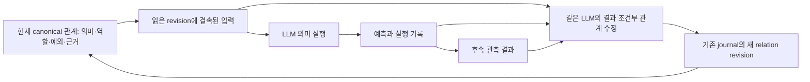

# LLM이 실행하고 교정하는 Semantic Weight 하이퍼그래프

**날짜:** 2026-09-14
**권위:** 사용자 방향은 `USER_PRIMARY`; 설계·증명 해석은 `SECONDARY_AI`.
**범위:** 관계 의미의 실행·outcome-conditioned revision·영속 재사용을 잇는 구성. 전체 HSWM 및 CR/FCL 효능 판정은 승격하지 않는다.

## 1. 작업 전제와 이번 변화

[사용자 원문](../canon/sources/USER_PRIMARY_HSWM_SEMANTIC_GRAPH_ENGINE_2026-09-14.txt)의 전제는 LLM이 이미 가진 의미 지식으로 Semantic Weight 하이퍼그래프를 직접 활용할 수 있다는 것이다. 이 방향을 [작업 규칙](../../AGENTS.md)에 기록했다. 모든 개념을 수작업 논리식으로 먼저 번역해야만 HSWM을 시작할 수 있다고 가정하지 않는다.

[헌법](../canon/HSWM_CONSTITUTION_2026-08-20.md)의 대상은 하나다. LLM이 관계의 token content를 해석해 실행하고, 관측 결과로 같은 그래프의 다음 disposition을 바꾼다. TypeScript/Effect는 그 실행의 입력·출력·저장 경계를 담당한다. Semantic Weight는 문맥·역할에 조건화된 전이 성향이며, 단일 점수나 근거 확률과 동일하지 않다.

기존에는 실제 LLM 호출, canonical atom의 역할 참조, durable revision journal이 각각 구현되어 있었다. 그러나 관계의 의미 본문을 LLM 실행과 outcome-conditioned 수정에 연결한 경로가 없었다. 이번 구성은 기존 canonical atom 저장과 revision 연산 위에서 이 연결을 만든다. 작은 구성의 범위를 전체 HSWM의 정의로 축소하지 않는다.

## 2. 이론에서 가져오는 것

[선행 연구 및 가정별 분석](HSWM_LLM_SEMANTIC_ENGINE_RESEARCH_2026-09-14.md)을 구현 방향의 근거로 사용한다.

| 기반 | 이번에 가져오는 구성 | 추가로 입증해야 하는 것 |
|---|---|---|
| [VML](https://arxiv.org/html/2406.04344v3) | 자연어 관계 내용이 실행 파라미터가 되고, 예측과 실제 label을 본 LLM이 그 내용을 수정 | HSWM의 관계·예외·역할 조건에서 일반화와 반복 안정성 |
| [VPP](https://arxiv.org/html/2607.22961v1) | 텍스트 가설 후보와 관측 근거를 구분 | 논문의 휴리스틱 입자 갱신을 정확한 Bayesian posterior로 주장할 수 없음 |
| [Pinductor](https://arxiv.org/html/2605.13740v1) | LLM의 의미 prior로 world-model 후보를 만들고 실제 trajectory로 교정 | 주어진 POMDP API 밖 의미 접지·변수 발명·인과 식별 |
| [Bayesian mixture](https://www.jmlr.org/papers/volume4/hutter03a/hutter03a.pdf) | 후보 의미와 후보에 대한 evidence mass를 분리 | 실제 LLM 제안 확률·likelihood·새 후보 출생의 정당화 |
| 기존 Step/Learn refinement | 실행뿐 아니라 학습 뒤에도 바뀐 상태를 다음 읽기에 보존 | 실제 TS 런타임의 Lean refinement와 공동 확률 동역학의 합성 |

위 논문들이 이 저장소의 효능을 증명한 것은 아니다. LLM prior는 실험적으로 활용할 정보이며, 현실의 참이나 인과 효과라는 판정은 관측·개입에서 별도로 얻는다.

[Transformer·수학 기법 조사](HSWM_TRANSFORMER_ARCHITECTURE_AND_MATH_2026-09-14.md)의 ICL, attention 기반 학습 구성, 여러 시간척도의 메모리 갱신도 같은 연구 지도에 남긴다. 현재 구현은 frozen LLM의 해석 능력과 그래프의 지속되는 macro state를 먼저 연결한다. 특정 attention 변형이나 checkpoint 재학습이 이 연결의 선행 필수조건이라고 가정하지 않는다.

## 3. 하나의 그래프 안의 실행과 수정



관측 전에 예측을 남긴다. `learn`의 LLM 입력에는 당시 읽은 관계와 예측, 이후 관측한 결과를 함께 넣는다. 결과를 단순한 저장 허가 표지로만 사용하면 관계의 의미 교정이 아니므로 이 경로는 구별해서 확인한다.

동일한 입력·응답이 반복돼도 실행 occurrence는 다르므로, 호출 전에 생성한 execution ID를 요청과 trace에 결속한다. content hash만으로 반복 실행을 하나로 합치지 않는다. UUID와 hash의 실제 생성·충돌 특성은 Lean 증명 범위 밖이다.

relation의 owner와 역할 참조는 모델이 생성한 자유 텍스트로 바꾸지 않는다. 기존 예외와 근거를 남기고, 수정된 의미와 disposition을 새 버전으로 기록한다. 다음 실행은 저장된 최신 관계를 다시 읽는다. 이력 저장소 밖의 임시 prompt에만 수정 결과를 남기는 것은 이 계약을 충족하지 못한다.

관측값의 출처를 별도로 제공한다는 것만으로 그 출처가 독립적이거나 관측값이 참이라는 사실은 증명되지 않는다. 해당 자료는 source가 명시된 관측 주장으로 취급한다. LLM의 자기 설명도 인과 credit의 대체물이 아니다.

## 4. Lean4 증명 범위

[그래프 구성](../../formal/HSWMLLMSemanticGraph.lean)은 LLM을 입력을 소비하는 interpreter로 추상화한다. 실행 입력에는 미래 outcome이 없고, 후속 수정 입력에는 실제 주어진 outcome이 들어가도록 한다. 임의의 interpreter 출력에 대해 구조·참조·이력을 보존하는 성질과, outcome에 따라 의미 수정이 달라지는 구체적 witness를 검증한다. 임의 interpreter를 사용한 데이터 흐름 증명은 pretrained LLM의 언어 이해 정확성 증명이 아니다.

[근거 갱신의 산술](../../formal/HSWMSemanticEvidence.lean)은 임의의 가설·근거 타입 위에서 다음 비정규화 연산을 정의한다.

```math
m_{t+1}(h)=m_t(h)\,\ell(h,e_t).
```

유한 순차 갱신은 동일 근거 factor들의 곱과 같고, 양의 질량·factor는 양의 지지를 보존한다. 두 후보에 같은 양의 factor가 적용되면 상대 우열은 바뀌지 않는다. 한 관측만으로 후보의 근거 우열이 바뀌는 유한 witness도 있다. 이는 미관측 입력의 정답을 알아냈다는 증명이 아니다. 이 산술은 **이번 LLM 수정의 구현 알고리즘이 아니라 별도의 후보 평가 기반**이며 Semantic Weight 자체의 정의도 아니다.

동일한 두 주변분포가 서로 다른 공동 XOR 결과를 만들 수 있다는 반례도 포함한다. 따라서 하위 셀의 평균 성적만 보존하고 합성 학습이 보존됐다고 주장할 수 없다.

Lean의 interpreter는 결정적 함수 추상화다. 실제 모델의 sampling, 버전 변경 및 오류 확률까지 포함한 확률 동역학을 증명하지 않는다. 실행 입력 타입에 후속 outcome 필드가 없다는 것은 호출자 입력의 미래 정보 누수를 일반적으로 판별했다는 뜻도 아니다.

Lean의 텍스트·참조·상태 연산을 TypeScript 구조에 대응시키는 것은 구현 검토의 지도다. Lean이 TypeScript, HTTP, SHA-256, POSIX 저장의 실제 실행을 검증한 것은 아니다. 그 경계는 별도 transport·재시작·충돌 시험으로 검사한다.

## 5. 남은 HSWM 연구를 진행하는 순서

1. **동일 정보 비교:** 같은 모델·입력·token 예산 아래 전체 의미 관계, 의미 본문 제거, 역할 섞기, 장문 전체 이력, 수정 동결 조건을 비교한다. 구조를 더 준 효과와 의미 수정의 효과를 구별한다.
2. **관계 교정:** 실패 뒤 본문을 바꿨다는 사실 외에, 예외를 유지하며 새 입력에서 예측 오차가 줄었는지 확인한다. 평가 suffix는 수정 시점에 보여 주지 않는다.
3. **변수와 관계 생성:** 고정 역할 구조를 재해석하는 현재 구성에서 나아가, LLM이 새 변수·관계 후보를 제안하고 관측/개입으로 구별할 수 있게 한다. 후보의 존재는 효능 판정과 다르다.
4. **인과 credit:** 관찰 적합도에서 원인 식별로 넘어가려면 구별 가능한 개입군, 교란 가정, 불확실성 및 실패 반례를 명시한다. 좋은 최종 답변만으로 참여 관계 전체를 강화하지 않는다.
5. **공동 합성:** 공유 원인·예외·지연 outcome이 있는 하위 셀들을 연결해 공동 Step/Learn을 검사한다. 주변 점수의 합으로 공동 분포나 학습 보존을 대신하지 않는다.

[CR-0..7](HSWM_CONSTRUCTIVE_REALIZABILITY_PROGRAM_2026-09-10.md)와 [FCL-1..8](HSWM_FRACTAL_SCIENTIFIC_CONNECTIONS_2026-08-28.md)의 기존 성공 기준과 RED 경로는 그대로 유지한다. 이번에 고정하는 것은 유일한 최종 알고리즘이 아니라, LLM의 의미 능력을 실제 실행과 지속되는 결과 교정에 쓰는 연구 방향이다.

## 6. 실제 코드와 증명의 대응

[TypeScript/Effect 구현](../../src/hswm/effect-runtime/src/canonical-atom-v2-llm-semantic-runtime.ts)은 기존 canonical durable runtime을 받는 library API다. package entrypoint에도 아래 함수들을 내보낸다. 현재 `hswm-dev`/`hswm-live`의 기본 scalar routing을 이 경로로 교체하지는 않았다.

| API | 실제 동작 | Lean과의 관계 |
|---|---|---|
| `readLlmSemanticFrame` | 최신 관계와 정확히 참조된 역할 revision의 UTF-8 내용을 읽는다. 가장 최근 예측·불확실성·관측·출처도 읽는다. | `serialize`, `read`; UTF-8·hash·실제 저장소는 Lean 범위 밖 |
| `executeLlmSemanticRelation` | event와 관계 frame을 LLM에 보내 예측한다. 요청·응답·불확실성·선언한 backend 설정을 기록한다. | `step`, `.execute`; 실제 HTTP와 stochastic LLM은 별도 구현 |
| `stageLlmSemanticOutcome` | 예측 trace에 결속된 관측값과 source를 별도 저장한다. | `Outcome`; 관측값의 참·출처 독립성은 미검증 |
| `learnLlmSemanticRelation` | 저장 bytes에서 예측·관측을 다시 확인하고 같은 선언 backend의 LLM에 전달한다. 의미·disposition 수정과 요청·응답 근거를 새 canonical revision에 저장한다. | `revisionProposal`, `learn`, `revise`; 실제 TS refinement를 증명한 것은 아님 |

초기 schema는 `semantic_relation`의 선형 revision과 `subject/context/evidence` 역할 및 선택적인 `exception` 역할을 승인해야 한다. 다른 typed 역할도 참조 배열의 순서·reference type·owner와 함께 보존한다. 같은 UID가 여러 lineage를 가리키면 선택을 거부한다. 이 제한은 이번 library slice의 경계이며 HSWM의 최종 ontology를 고정하지 않는다.

의미 본문·각 역할 내용은 각각 최대 64 KiB, 전체 frame은 최대 512 KiB이며 초과하면 잘라서 의미를 잃는 대신 typed error를 낸다. 모델의 수정안은 기존 exception reference를 그대로 보존해야 한다. 역할·owner·topology를 수정하는 제안은 이 API의 쓰기 범위가 아니다.

가장 최근 outcome은 다음 실행 입력에 들어가고, 더 오래된 내용은 predecessor journal에 보존한다. 전체 이력을 매번 prompt에 재귀적으로 펼치지는 않는다. 동시 변경 검사는 전체 state revision에도 보수적으로 결속하므로 무관한 쓰기도 진행 중인 수정을 무효화할 수 있다. Lean의 무관 relation 보존 정리는 이 런타임의 충돌 빈도·성능 보장과 다르다.

설정 hash는 선언한 endpoint·model·token 제한·credential 환경변수 이름의 동일성을 검사한다. provider의 실제 checkpoint 고정이나 출처 인증을 증명하지 않는다. 저장된 기록의 byte 결속도 해당 기록이 독립 기관의 참된 관측이라는 증거는 아니다.

[파일 기반 통합 테스트](../../tests/effect-runtime/canonical-atom-v2-llm-semantic-runtime.test.ts)에 초기 schema·역할 내용·durable layer·transport 구성 예가 있다. 실제 endpoint에는 기존 `NativeAdaptiveHttpClient`와 호출자가 설정한 `LlmSemanticCell`을 연결한다. 새 package나 provider SDK를 설치하지 않았다.

## 7. 검증과 재현

[검증 기록](../../_research/llm_semantic_graph_v1/verification.v1.json)과 [Lean axiom 감사](../../_research/llm_semantic_graph_v1/lean-verification.v1.json)는 exact source hash에 결속한다. 두 Lean 파일의 **34개 정리**를 Lean 4.32.1 `--trust=0`로 검사했다. `sorry`, 사용자 선언 axiom, `admit`, `native_decide`를 추가하지 않았다.

```sh
npm --prefix src/hswm/effect-runtime run build
npm --prefix src/hswm/effect-runtime run check
npm --prefix src/hswm/effect-runtime test -- canonical-atom-v2-llm-semantic-runtime
```

테스트는 injected HTTP fixture로 재개방 후 재사용, 실제 역할·예외·직전 outcome 전달, caller가 바꿔 끼운 prediction/outcome/config/uncertainty 거부, duplicate JSON 및 누락된 예외 거부, LLM 호출 중 state 변경 거부를 검사한다. 테스트 응답은 모델 추론의 대용 관측이 아니다. 이번 실제 provider 호출은 **0회**이고, 새 과제 일반화·인과 개선·recursive cognition 효능은 측정하지 않았다.

[KG snapshot](../../ontology/development/HSWM_LLM_SEMANTIC_GRAPH_IMPLEMENTATION_2026-09-14.v1.json)은 사용자 지시, 논문 기반, 구현, 34개 정리, 기존 CR/FCL와 남은 연구 의무를 출처별로 연결한다. [SPARQL](../../ontology/queries/hswm_llm_semantic_graph_2026-09-14/proofs_and_remaining.rq)로 정리별 source와 여전히 열린 의무를 조회한다. 이것은 checked-in 연구 projection이며 live cognition이나 학습 판정을 뜻하지 않는다.
