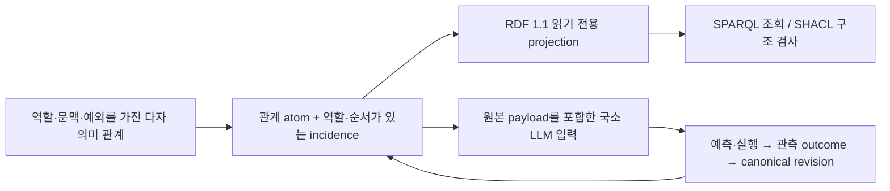

# 하이퍼그래프는 세계 기술의 최소비용 체계인가

2026-09-27 · `SECONDARY_AI_ANALYSIS / HYPOTHESIS_NOT_TESTED`

[사용자 주장](../canon/USER_PRIMARY_HSWM_MINIMUM_COST_HYPERGRAPH_2026-09-27.md)의 핵심은
AI의 역할과 그 역할에 적합한 표현 구조의 선택 원리를 연결하는 것이다. 아래는 그 주장을
검토하기 위한 구체화이며, 보편적 최소성의 증명이나 새 실험 결과가 아니다.

후속 공학 구현: [Semantic Map Engineering v1](../../_research/semantic_map_engineering_v1/README.md)은
아래 설계 중 frame의 세 표현 왕복·직렬화 바이트 비교·명시적인 derived MapSpec RDF 조회를
실행한다. 아래의 전체 비용·실모델 효능 가설은 여전히 미검증이며, 기존 canonical RDF의
payload 생략 계약을 바꾸지 않는다.

## 0. 현재 판단과 이번 심화의 범위

**다자 관계를 유지하는 HSWM 설계에는 근거가 있다. 하이퍼그래프가 우주를 기술하는
보편적 최소비용 체계라는 결론은 아직 뒷받침되지 않는다.** “우주가 존재한다”는 전제만으로
그 세계의 구조, 우리가 풀 질의, 허용 오차, 부호화 방식과 계산 비용이 결정되지는 않는다.

| 주장 | 현재 판단 |
| --- | --- |
| AI는 양파껍질 최외각의 우주 시뮬레이터다 | HSWM의 모델링 역할에 대한 사용자 방향이다. 모든 AI의 필요충분 정의나 실재 우주 전체의 정확한 시뮬레이션 정리로 확정하지 않는다. |
| 다자 관계의 경계와 역할을 보존해야 한다 | 그런 구별을 요구하는 과제에서는 필요하다. incidence/factor encoding으로도 보존할 수 있다. |
| 서로 다른 분야의 표현 가능성이 수렴진화를 입증한다 | 성립하지 않는다. 각 분야의 선택 과정과 대안 대비 비용 감소를 추가로 보여야 한다. |
| 하이퍼그래프가 항상 가장 싸다 | 비용·과제·후보가 지정되지 않아 아직 판정 가능한 최적화 명제가 아니다. 지정한 뒤에도 별도 검증이 필요하다. |

이번 개념적 추가는 **과제에 충분한 상태의 압축 → 다자 관계의 조직 → 구체적인 부호화와
실행 비용**을 연결하는 것이다. 사용자의 보편적 가설은 그대로 두고, 아래의 조건부 주장과
실험안을 AI의 해석으로 분리한다. 사용자 범주 3을 새로 정의하지 않는다.

## 1. 사례가 지지하는 범위

2026-09-27 확인한 원 논문·저자 설명·공식 수학 자료를 사용한다.

| 사례 | 자료에서 확인되는 것 | 이 자료만으로 확정할 수 없는 것 |
| --- | --- | --- |
| [페르마 원리, Feynman I §26–5](https://www.feynmanlectures.caltech.edu/I_26.html#Ch26-S5) | 정확한 일반 서술은 작은 경로 변동에 대한 이동 시간의 정류 조건이다. | 항상 모든 경로 중 전역 최단시간이라는 주장, 또는 표현 체계도 동일한 변분 원리를 따른다는 결론 |
| [Transformer 원 논문](https://arxiv.org/abs/1706.03762) | query–key score를 구하고 softmax로 value를 가중합한다. 토큰 쌍의 점수와 여러 토큰을 함께 처리하는 계산이 공존한다. | 표준 Transformer가 역할·예외·계보를 가진 지속적 하이퍼그래프로 수렴진화했다는 기술사적 사실 |
| [Wolfram의 technical introduction](https://www.wolframphysics.org/technical-introduction/) 및 [관계 rewriting 예](https://www.wolframphysics.org/technical-introduction/basic-form-of-models/first-example-of-a-rule/) | 관계들의 묶음을 rewrite하는 graph/hypergraph 기반 모형을 제안한다. | 실제 우주의 모형으로 확정됐다는 판단, 하이퍼그래프의 보편적 최소비용 정리 |
| [ZFC의 집합론 언어, Oxford 강의노트 §2](https://people.maths.ox.ac.uk/zilber/ast-web.pdf) 및 [mathlib ZFC 구현](https://leanprover-community.github.io/mathlib4_docs/Mathlib/SetTheory/ZFC/Basic.html) | 집합론의 비논리 관계 기호는 이항 membership `∈`다. 집합 안에서 순서쌍·관계·하이퍼그래프를 정의할 수 있다. | ZFC가 원래 하이퍼그래프 이론 위에 세워졌거나 비용 최적화로 하이퍼그래프에 수렴했다는 주장 |

Transformer의 attention을 그래프 관점으로 분석하는
[Graph-to-Graph 연구](https://research.google/pubs/transformers-as-graph-to-graph-models/)와,
incidence·node/hyperedge 구조를 명시적으로 사용하는
[HyperGT](https://arxiv.org/abs/2312.11385)도 있다. **그래프로 해석 가능함**, **명시적 다자
관계를 사용하는 설계**, **독립적인 최적화가 같은 구조로 수렴함**은 서로 다른 주장이다.
세 번째에는 출발 구조·선택 압력·비용 지표·대안 경로의 근거가 추가로 필요하다.

## 2. 검증할 의미를 유지하며 비용을 줄이기

사용자의 강한 가설은 그대로 보존한다. 다음은 그것의 일부를 시험하는 `SECONDARY_AI`
연구 문제다. 특정 과제의 성공이 보편적 가설을 증명하지 않으며, 비용과 범위를 좁힌
실험안이 원래 주장을 대체하지도 않는다.

**후보 질문:** 같은 세계의 같은 관측·개입·수정 요구를 같은 오차 안에서 수행할 때,
역할을 보존한 다자 관계 표현은 어떤 조건에서 전체 비용을 낮추는가?

`Q`는 질의·개입·학습 후 평가의 분포/범위, `R`은 상태 요약·부호화·실행 방법을 함께
지정한 후보, `D_Q`는 평가 오차다. 다음 목적식은 비용을 측정하기 위한 초안이다.

```math
\min_{R\in\mathcal R} C_Q(R)
\quad\mathrm{subject\ to}\quad D_Q(R)\leq\epsilon.
```

우선 비용을 하나의 임의 점수로 합치지 않고 **설명 길이, 저장 바이트, 읽은 토큰,
실행 시간, 갱신 비용, 변환 비용**으로 나누어 보고한다. 단일 비용을 원하면 단위·가중치를
비교 전에 고정한다. encoder/decoder, schema·해석기, 관계의 역할 목록, 인덱스, 학습 비용을
무료로 숨기지 않는다. foundation model을 공유할 때도 무엇을 공통 비용으로 처리했는지 밝힌다.

이 질문은 [MDL의 모델 선택 관점](https://arxiv.org/abs/math/0406077)과 연결된다.
모델 및 자료를 얼마나 짧게 기술하는지 묻는 관점이지, MDL이 특정 자료구조의 보편적
최적성을 이미 증명했다는 뜻은 아니다. 설명 길이는 부호화 규약과 해석기에 의존하며,
짧은 설명이 자동으로 빠른 실행이나 저렴한 학습을 뜻하지 않는다.

### 2.1 네 직관과 더 직접적으로 연결되는 이론

| 원 연구 | 실제로 연결되는 내용 | HSWM에 옮길 때 남는 조건 |
| --- | --- | --- |
| [Ha·Schmidhuber, World Models (2018)](https://arxiv.org/abs/1803.10122) | 환경의 시공간 구조를 압축한 모델로 예측·정책 학습을 수행하는 구체적 AI 설계 | 특정 환경의 학습 결과다. 모든 AI의 정의, 우주 전체의 재현, 하이퍼그래프 필요성을 증명하지 않는다. |
| [Tishby·Pereira·Bialek, Information Bottleneck (1999/2000), §3](https://www.princeton.edu/~wbialek/our_papers/tishby%2Bal_99.pdf) | 주어진 결합분포에서 목표 변수에 관한 정보를 보존하며 입력 표현을 압축한다. 무엇이 관련 정보인지는 목표에 의존한다. | 목표·분포·압축 절충을 지정해야 한다. 관찰적 관련성만으로 개입의 충분성이나 LLM 비용 최소성을 얻지 않는다. |
| [Shalizi·Crutchfield (2001), §III·Theorem 2–3·§VII B](https://csc.ucdavis.edu/~cmg/papers/cmppss.pdf) | 이산값·이산시간의 정상 확률과정에서 미래 전체의 조건부 분포가 같은 과거들을 causal state로 묶는다. 미래 전체의 조건부분포를 보존하는 prescient 경쟁 상태 표현 중 상태 엔트로피가 최소이며 최소 표현은 거의 확실한 동형까지 유일하다. | 정확한 과정 분포를 이용하는 이론이다. 유한 자료에서의 학습, 비정상 환경, 개입, 수정·실행 비용은 별도 문제다. 여기서 causal이라는 명칭도 개입 효과 식별을 자동 보장하지 않는다. |
| [Rissanen, MDL (1978)](https://research.ibm.com/publications/modeling-by-shortest-data-description) 및 [Grünwald 해설](https://arxiv.org/abs/math/0406077) | 선언한 모델군과 코드에서 모델 및 자료의 설명 길이를 비교한다. | hyperedge 수만 세거나 해석기·모델 가중치 비용을 숨기는 방식과 다르다. 최적의 저장 자료구조를 지정하는 정리가 아니다. |
| [Kschischang·Frey·Loeliger, Factor Graphs (2001), §I–II](https://www.isiweb.ee.ethz.ch/papers/arch/aloe-2001-1.pdf) | 다변수 함수를 국소 함수들로 분해하고 변수–factor 이분 그래프에서 계산한다. 여러 분야의 알고리즘에 공통 계산 구조가 나타나는 구체적 사례다. | HSWM의 의미 관계가 해당 확률적 factorization을 만족한다는 뜻은 아니다. 인수분해와 국소 연산의 비용을 실제로 확보해야 한다. |

따라서 다음은 **문헌에서 도출한 연구 가설**이다. 반복되는 역할 구조와 재사용 가능한
국소 메커니즘이 있고, 과제에 필요한 공동 의존성을 보존할 때, 그 관계를 명시적인 단위로
조직하면 중복 설명·조회·수정 비용을 줄일 수 있다. 이 조건들이 현실 과제에서 성립하는지와
이득이 overhead보다 큰지는 측정 대상이다. factorization이 없는 임의 관계에도 같은
효율을 약속하지 않는다.

HSWM의 M에는 두 종류의 변환을 구분해서 연결한다. **부호화 변환**은 역할·관계 정보를
유지한 채 hyperedge와 incidence 표현을 오간다. **상태 추상화**는 미시적 차이를 생략한다.
후자의 충분성은 [기존 이론 P1](HSWM_SEMANTIC_WEIGHT_THEORETICAL_FOUNDATIONS_2026-09-14.md)과
[층간 매핑 연구](HSWM_CROSS_LAYER_MAP_RESEARCH_2026-09-27.md)처럼 관측·개입뿐 아니라
outcome 이후의 상태 갱신까지 따져야 한다. 이 둘을 같은 ‘그래프 변환’으로 계산하지 않는다.

## 3. 공정한 반례와 비교군

하이퍼그래프의 장점 후보는 역할 있는 n항 관계를 하나의 재사용·수정 단위로 직접 묶는
것이다. 예를 들어 문·열쇠·권한·행동·문맥을 함께 조건화하는 관계를 따로따로 기억하는
비용을 줄일 수 있다는 가설이다. 관계 하나라고 그 내용을 저장·실행하는 비용이 1은 아니다.

[기존 표현 연구](HSWM_SEMANTIC_WEIGHT_DEFINITION_AND_HYPERGRAPH_2026-09-14.md)는
단순 pair-only clique 투영의 손실을 보이지만, 역할을 표시한 incidence/factor graph는
n항 관계를 보존할 수 있음을 함께 명시한다. n개 참여자의 관계는 보조 relation node와
n개 incidence로도 표현할 수 있다. 따라서 “일반 이항 그래프는 n항 정보를 표현할 수 없다”를
출발점으로 삼지 않는다. n항 의미 조직과 이항 저장 형식은 양립한다.

비교에는 같은 정보를 담은 hyperedge 표현, tagged incidence/factor graph, n항 관계 테이블,
과제에 맞는 tensor/프로그램 표현을 포함한다. 단순 pairwise 상호작용 과제와 고차 상호작용
과제도 나눈다. 모든 표현을 충분히 일반적인 ‘하이퍼그래프’라고 부르면 공통성은 얻지만
어느 설계가 더 싸다는 예측은 사라지므로 후보의 연산과 비용을 구체적으로 고정한다.

판정은 먼저 fidelity를 맞춘 뒤 cost를 비교한다. 손실 표현이 싸지만 질의를 틀리면
동일한 능력의 최소비용 해법이 아니다. 반대로 lossless incidence가 같거나 더 싸다면
typed n항 조직의 유용성과 특정 저장 방식의 우월성을 분리해서 기록한다.

### 3.1 구조의 보존과 최소비용을 분리하는 작은 예

다음은 설명용 구성이며 새 실험 결과가 아니다.

```text
A: 하나의 공동 관계 {a,b,c}
B: 세 관계 {a,b}, {a,c}, {b,c}
```

참여자 사이의 쌍별 연결 유무만 남기면 둘 다 삼각형이다. 원래 공동 관계의 존재를 묻는
질의에는 이 투영이 불충분하다. 반면 A의 관계 노드 하나와 B의 관계 노드 세 개를 각각
보존한 incidence 표현은 이를 구분한다. 이것이 직접 지지하는 것은 **관계 경계의 보존**이다.
어느 직렬화·저장 엔진이 더 싼지는 이 예만으로 결정되지 않는다.

독립적으로 갱신되는 N개 센서를 하나의 거대 관계로 묶는 경우도 보자. 각 센서의 다음
상태만 묻는 과제에서는 독립 규칙과 국소 인덱스가 충분할 수 있다. 거대 관계의 payload에
같은 규칙을 다시 넣는다고 설명량이 줄지는 않는다. 이는 큰 arity가 항상 이롭다는 주장의
반례 방향이다. 하이퍼그래프도 독립된 작은 관계를 허용하므로 **하이퍼그래프 전체의
반례라고 확대하지 않는다.** 중요한 선택은 관계의 적절한 분해와 갱신 단위다.

k개 Boolean 변수의 임의 factor를 표로 저장하면 값은 `2^k`개다. factor node 하나로
그린다고 이 표가 무료가 되지는 않는다. 짧은 규칙으로 표현 가능한 factor라면 그 규칙의
해석 비용까지 비교한다. [그래프 추론 복잡도 연구](https://proceedings.mlr.press/r6/chandrasekaran08a.html)는
모형의 treewidth가 정확한 추론 비용에 중요함을 다룬다. 그 논문의 일반 하한에는 명시된
조합론적 가정이 있으며 모든 특수 factor의 계산이 어렵다는 뜻은 아니다. 큰 factor를
star로 그린 incidence graph의 폭만 보고 factor 자체의 계산 비용을 생략해서도 안 된다.

**표현 가능성, 정보 보존, 계산 효율, 실제 원인 적합성은 각각 다른 주장이다.** 이 구분이
없으면 모든 계산을 하이퍼그래프로 부호화할 수 있다는 보편성에서 최소비용을 잘못 도출하게 된다.

## 4. 표준 그래프 엔지니어링으로 연결하기

의미 관계, 그 관계의 부호화, 실행 계획을 서로 구분한다. 이는 하나의 HSWM 상태를 다루는
공학적 관점이며 세 개의 인지 subsystem을 새로 만드는 제안이 아니다.



RDF projection에는 원본 payload 전체가 없으므로 위 그림에서 LLM 입력은 RDF 조회 결과만으로
재구성하지 않는다. 의미 본문·근거·예외를 포함한 원본 frame을 기존 runtime 경로로 읽는다.

### 4.1 재사용할 표준과 패턴의 지위

2026-09-27에 아래 공식 고정 버전을 확인했다. 현재 채택 버전을 유지하는 설계이며
새 의존성이나 draft 사양을 도입하지 않는다.

| 표준 또는 자료 | 지위 | HSWM에서의 사용 |
| --- | --- | --- |
| [RDF 1.1 Concepts, 2014-02-25](https://www.w3.org/TR/2014/REC-rdf11-concepts-20140225/) | W3C Recommendation | 안정된 IRI, typed atom/reference, dataset의 교환 의미론 |
| [N-ary Relations, 2006-04-12](https://www.w3.org/TR/2006/NOTE-swbp-n-aryRelations-20060412/) | **informative Working Group Note** | 관계 인스턴스를 노드로 두고 참여 역할을 연결하는 패턴 참고; 별도의 표준 적합성 인증으로 취급하지 않음 |
| [SPARQL 1.1 Query, 2013-03-21](https://www.w3.org/TR/2013/REC-sparql11-query-20130321/) | W3C Recommendation | 지정한 dataset에서 현재 관계·참여 역할·revision 조회 |
| [SHACL, 2017-07-20](https://www.w3.org/TR/2017/REC-shacl-20170720/) | W3C Recommendation | RDF로 노출한 구조의 타입·개수·필수 속성 검사 |
| [JSON-LD 1.1, 2020-07-16](https://www.w3.org/TR/2020/REC-json-ld11-20200716/) | W3C Recommendation | JSON 소비자와 교환할 필요가 생길 때의 선택지; 현재 N-Quads 경로에 중복 도입하지 않음 |
| [PROV-O, 2013-04-30](https://www.w3.org/TR/2013/REC-prov-o-20130430/) | W3C Recommendation | 외부 provenance 소비자가 필요할 때 Entity/Activity/Agent 등의 명시적 매핑 후보 |

HSWM의 `role`, `ordinal`, `contentSha256` 등은 저장소 소유 어휘다. RDF를 사용한다고
이 어휘 자체가 W3C 표준이 되거나 현재 provenance가 자동으로 PROV-O를 구현하는 것은 아니다.
관계 노드는 일반 n항 관계의 인스턴스다. `rdf:Statement`로 triple 자체를 재서술하는
표준 RDF reification과 동일시하지 않는다.

### 4.2 기존 코드와 실제 조회 가능한 범위

| 보존할 내용 | 기존 구현·표준 표면 | 현재 경계 |
| --- | --- | --- |
| 관계 identity·revision | `semantic_relation` atom, canonical key, supersedes reference | 조회는 supersedes 후속 참조가 없는 leaf를 선택; lineage의 선형성은 canonical schema/runtime의 전제 |
| 참여자와 역할·순서 | `TypedReference`의 source/target·referenceType·role·ordinal | 순서를 RDF triple의 나열 순서에서 추정하지 않음 |
| 의미·MapSpec·근거 본문 | 원본 content bytes와 digest, 기존 frame decoder | 현재 RDF에는 content descriptor만 있으며 본문 전체가 없음 |
| 층 매핑의 모델·시간·개입·손실 | `context`의 버전 있는 MapSpec | JSON payload의 필드는 현재 SPARQL/SHACL 검사 대상이 아님 |
| revision의 출처 | 기존 source reference·evidence digest·provenance mode | 기록의 존재와 그 기록이 주장하는 사실의 참은 별도 |
| 현재 관계 조회와 profile 구조 검사 | `.rq`는 현재 leaf 조회, SHACL Core `.ttl`은 제공된 cross-layer dataset의 모든 `ReifiedRelationAtomVersion`에 적용 | 전체 의미의 정확성·인과성·최소비용은 판정하지 않음 |

구현 근거는 [RDF compiler](../../src/hswm/effect-runtime/src/canonical-atom-v2-rdf-projection.ts),
[국소 frame 실행](../../src/hswm/effect-runtime/src/cross-layer-map-runtime.ts),
[현재 관계 조회](../../_research/cross_layer_map_v1/queries/current-map-roles.rq),
[구조 shape](../../_research/cross_layer_map_v1/shapes/map-profile.ttl)다.
현재 runner의 named graph union은 명시적인 로컬 dataset 설정이며 SPARQL의 암묵적 기본값이
아니다. SHACL Core profile도 ordinal의 유일성·전체 순서를 모두 검증하는 것은 아니다.
그 항목은 원본 projection과 관련 검사의 범위로 남긴다.

따라서 **추상적인 incidence encoding의 무손실성**과 **현재 RDF projection의 보존 범위**는
다르다. 후자는 raw payload와 full journal을 생략하는 view이며 전체 canonical state를
복원하는 무손실 codec이 아니다. 공개 field-level MapSpec 조회가 실제로 필요해지면 원본
digest에 연결된 versioned derived view를 추가할 수 있다. 이 선택은 canonical write 경로를
만들거나 숨겨진 payload를 자동 공개하는 변경과 별개다.

## 5. 비용 가설의 실험 설계

**설계 후보 / 미실행.** 아래는 현재 연구 과제를 위한 비교안이며 새 개발 gate나 성공 기준의
완화가 아니다. 구조 도구를 추가하는 것만으로 이 실험을 수행했다고 기록하지 않는다.

| 비교 축 | 최소 비교 구성 | 판정할 질문 |
| --- | --- | --- |
| 정보 보존 | 같은 관계의 직접 n항 직렬화 / 역할을 보존한 incidence / n항 테이블 | 동일한 질문에 답하며 내용·역할·예외를 복원하는가 |
| 알려진 손실 | 관계 경계 없는 clique 투영 / 역할 제거 | 예상한 구별을 잃는가; 손실 때문에 싼 결과를 동일 능력의 승리로 세지 않음 |
| 구조 선택 | 독립·pairwise 과제 / 반복되는 고차 관계 과제 | n항 조직의 이득이 예측한 조건에 국한되는가 |
| 실행 방법 | 필요한 국소 읽기와 전체 읽기, 인덱스·cache·컴파일 비용 포함 | 이득이 데이터 형식인지 읽기 계획인지 구분되는가 |
| 갱신 | 같은 새로운 outcome을 적용한 뒤 별도 후속 질의 | 현재 예측뿐 아니라 수정에 필요한 상태도 보존되는가 |

한 번에 상태 추상화와 codec을 모두 바꾸면 비용 차이의 원인을 알기 어렵다. 먼저 같은
정보를 가진 부호화들을 비교하고, 다음에 정보 생략을 허용하는 mapping 실험을 분리한다.
모든 비교군에 같은 원본 정보·허용 인덱스·모델 접근·튜닝 예산을 제공한다. canonical
저장 형식만 바꾸고 최종 LLM frame이 같다면 토큰 감소를 자동 기대하지 않는다.

오차는 관찰, 개입, outcome 이후 후속 질의의 세 항목으로 보고한다. 하나의 평균 성공률이
개입 실패를 가리지 않도록 각 항목의 평가 범위·horizon·허용 오차를 먼저 고정한다.
훈련·개발·held-out world/episode를 나누고, 최종 평가 정답이 frame이나 revision에
먼저 들어가지 않게 한다. 현재 입력의 충분성과 미래 정답을 보여 준 성능을 구별한다.

비용은 실제 직렬화 바이트, 해당 모델 tokenizer의 입력/출력 토큰, 조회·모델 실행 시간,
갱신·인덱스 유지·변환·훈련 비용으로 분리한다. warm/cold cache, 모델·artifact·코드 버전,
hardware와 반복 실행의 변동을 남긴다. 새 기반 모델의 사전학습 비용을 비교할 수 없다면
공유된 고정 prior로 처리한 범위를 명시한다. 임의의 가중합 승자보다 우선 Pareto trade-off를
보고한다. 즉 더 빠르지만 더 크거나 수정이 비싼 결과를 그대로 드러낸다.

검증할 조건부 예측은 **반복되는 고차 관계에서 명시적인 관계 경계를 재사용하면,
같은 평가 오차에서 특정 중복 저장·읽기·수정 비용이 줄어드는가**다. incidence나 테이블이
같거나 더 싸면 그 결과를 유지한다. 그것은 특정 구현의 비용 우위를 반박할 수 있지만
정보를 보존한 n항 의미 조직 자체의 반박은 아니다. 전체 후보·과제 범위를 넘는 보편 최소성은
어느 한 번의 승리에서도 도출하지 않는다.

## 6. 현재 증거와 후속 구현의 범위

[Cross-layer Map v1](../../_research/cross_layer_map_v1/README.md)의 유한 세계는 상태 투영의
일치와 과제 출력 보존이 다를 수 있음을 점검한다. 그 실행 결과는 비용 최소성이나
Transformer·Wolfram·ZFC의 수렴을 검증한 결과가 아니다. causal-state 재구성이나
Information Bottleneck/MDL 최적화도 실행한 상태가 아니다.

다음 비용 비교를 실행한다면 동일한 과제·관측·개입·LLM·예산에서 정보 보존 표현을 바꾸고,
직렬화 크기·읽기 토큰·질의/수정 시간·변환 비용과 held-out 성능을 함께 측정한다.
schema 검증·SPARQL/SHACL 성공은 구조 검증으로 남긴다. HSWM 자체의 알고리즘을 검토할 때는
[Hyperon의 정확한 component/version 비교](HYPERON_2026_DIRECT_PRIOR_DEEP_DIVE_2026-08-20.md)도 유지한다.

이번에는 사용자 방향의 진위 범위를 더 구체화하고 기존 표준 구현과 비용 비교 설계에
연결했다. runtime·비용 최적화 알고리즘·새 공리·실험 성공 기준을 바꾸지 않았고
CR-0..7/FCL-1..8의 기존 상태도 변경하지 않았다. 출처 검토와 설명용 구성은 새 실험 성과로
세지 않는다.
