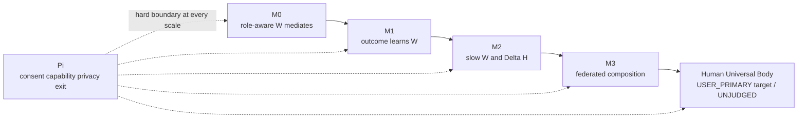

# HSWM Occam core — Semantic Weight = learned causal difference

> **상태:** `SECONDARY_AI_RESEARCH_SYNTHESIS / UNJUDGED`
> **기준일:** 2026-08-20
> **USER_PRIMARY 방향 원문:**
> [`USER_PRIMARY_HSWM_OCCAM_CORE_DIRECTION_2026-08-20.txt`](../canon/sources/USER_PRIMARY_HSWM_OCCAM_CORE_DIRECTION_2026-08-20.txt)
> **권위 경계:** 사용자는 HSWM을 오캄의 면도날처럼 줄이고, 기억 가능한
> 연구 명제로 만들며, 그 연구를 KG에 올리라고 요청했다. 아래 표제, 공리,
> §2.1 외 수식, 구현 절단선과 반증 기준은 `SECONDARY_AI_PROPOSED`다. §2.1의 책임 좌표계
> 해석만 `SECONDARY_AI_CONCEPTUAL_CLOSURE_CANDIDATE`로 구분한다.
> **비주장:** 이 문서는 현재 구현, 효능, 절대적 새로움, 의식, 인격 또는
> 인류보편체의 완성을 주장하지 않는다.

## 0. 결론

추천 연구 표제는 다음이다.

> # **Relations That Make a Difference**
>
> **관계를 보존하고, 그 관계가 다음을 어떻게 바꾸는지 학습하라.**

`Attention Is All You Need`식으로 더 직접 압축하면 다음 문장이 된다.

> **Semantic Weight Is All You Need — for the cognitive kernel.**

그러나 정확한 HSWM 명제는 “weight 하나면 모든 소프트웨어가 필요 없다”가
아니다. 더 좁고 반증 가능하다.

> **Semantic Weight는 role-bearing relation을 바꾸었을 때 다음 가능한
> 활성·행동의 분포가 어떻게 달라지는지를 나타내고, outcome에 의해 다시
> 수정되는 versioned semantic transport operator다.**

이 제안을 **Counterfactual Continuation Axiom (`CCA`)**이라 부른다.

이를 가장 짧게 쓰면 다음과 같다.

> **Semantic Weight = learned, role-conditioned causal difference.**

그리고 HSWM의 헌법적 보어는 다음 한 줄이다.

> **Relations learn; boundaries rule. — 관계는 학습하고, 경계는 통치한다.**

인지 계산은 관계의 가중된 전이로 최대한 압축할 수 있지만, consent·capability·
privacy·rollback을 정하는 `Π`는 reward나 weight로 환원하면 안 된다. 따라서
최소 HSWM은 **계산핵 하나와 별도로 비보상적인 경계 하나**다. 여기서
`별도`는 물리적으로 분리된 subsystem이라는 뜻이 아니라, 학습된 score나 reward가
권한 거부를 상쇄할 수 없다는 책임·집행상의 비환원성을 뜻한다.

```math
\mathrm{HSWM}_{\min}=\bigl(\text{learned causal semantic transport},\;\Pi\bigr)
```

## 1. 오캄의 면도날을 잘못 쓰지 않는 법

오캄의 면도날은 “가장 짧은 말이 참이다”도, “부품 수가 가장 적은 코드가
좋다”도 아니다. 경쟁 설명이 같은 현상을 설명할 때 이유 없이 존재자와
가정을 더하지 말라는 방법론적 제약이다. 현대 철학에서도 단순성은
원리 수의 간결성인 **통사적 단순성**과 가정한 존재 종류 수의 절약인
**존재론적 단순성**으로 구분되며, 항상 `다른 조건이 같을 때` 적용된다.

HSWM에 적용할 면도날은 다음이다.

> **어떤 개념을 제거해도 예측, 학습, 권리 보존, 또는 후속 행동이 달라지지
> 않는다면 그 개념은 HSWM의 근본 원리가 아니다.**

이 기준은 단어를 지우는 문체 편집이 아니라 **counterfactual deletion test**다.
복잡성을 `WorldModel`, `Cognition`, `Emergence` 같은 큰 이름 하나 안에 숨기는 것도
절약이 아니다. 각 잔존 개념은 제거했을 때 무엇이 실패하는지 말할 수 있어야 한다.

## 2. 하나의 원리로 무엇이 압축되는가

기존 헌법의 `S_t=(H_t,W_t,A_t,F_t,Π)`를 다섯 개의 독립 실체로 볼 필요는
없다. 한 폐루프의 서로 다른 형식 역할로 읽을 수 있다.

| 역할 | Occam 해석 | 제거하면 실패하는 것 |
|---|---|---|
| `H` | relation과 incidence의 주소·role·계보 | n-ary 차이, provenance, 제거·복원 단위 |
| `W` | 그 relation이 다음 상태를 바꾸는 학습된 disposition | HSWM만의 핵심 가설 |
| `A` | 현재 사건에서 실제로 적용된 `W`의 유한한 활성 절단면 | 실행 가능한 현재 상태 |
| `F` | relation transport를 실현하는 국소 비선형 cell | 표현력; 처음에는 frozen이어도 됨 |
| `Π` | 허용되는 읽기·활성·학습·행동을 정하는 독립 경계 | 권리, 안전, rollback, 정체성 |

따라서 기억, 추론, routing, world model, continual learning도 별도 물질이 아니다.

- **기억**은 느리게 지속되는 `H/W`다.
- **추론**은 현재 `A`가 `W/F`를 거쳐 반복 전이하는 과정이다.
- **routing**은 어떤 relation의 disposition이 이번 활성 절단면에 적용되는가다.
- **world model**은 provenance와 version을 가진 지속 `H/W`가 다음 행동을
  조건화하는 역할이다.
- **continual learning**은 outcome에 결속된 변화가 검증 후 다음 episode의
  `W`, 그리고 훨씬 나중에 `H`를 바꾸는 일이다.

이 압축은 형식적 역할을 지우지 않는다. 중복된 존재론을 제거한다.

### 2.1 책임 좌표계의 지위와 유일성 부담

아래 `H/W/A/F/Π`는 다섯 개의 통계적으로 독립한 변수, 인과적으로 고립된 원인,
물리적으로 분리된 저장소, 최소 차원의 latent axis, 또는 자연계가 이미 제공하는
유일 분해가 아니다. 이것은 하나의 HSWM 상태를 읽고 바꾸기 위한
**interdependent canonical typed-responsibility chart**다. 즉 각 정본 원자는 한
책임 역할을 가지되, 전체 상태와 전이는 typed incidence, reference, permission,
outcome을 통해 결합한다. 이 해석은 `SECONDARY_AI_CONCEPTUAL_CLOSURE_CANDIDATE`이며
과학 상태는 `UNJUDGED`다. HSWM의 현재 구현 또는 효능을 증명하지 않는다.

스키마 버전 `σ`에서 HSWM이 정본으로 admit한 원자 집합을 `X_σ`라고 할 때, 이
chart가 주장할 수 있는 가장 강한 유일성은 다음이다.

```math
\operatorname{owner}_σ:X_σ\to\{H,W,A,F,\Pi\},
\qquad
\forall x\in X_σ\;\exists!r:\operatorname{owner}_σ(x)=r.
```

이 식이 말하는 유일성은 **승인된 정본 원자의 schema-relative owner**뿐이다. 전체
상태는 다섯 항의 독립 곱이 아니며, 한 유용한 해석은 다음 의존합이다.

```math
S\in
\sum_{H:\mathcal H}
\sum_{\Pi:\mathcal P(H)}
\sum_{F:\mathcal F(H,\Pi)}
\sum_{W:\mathcal W(H,F,\Pi)}
\mathcal A(H,W,F,\Pi).
```

이 순서는 시간 순서나 별도 subsystem 계층이 아니라 의존성을 드러내는 표기다. Occam
판정은 각 경계를 다음 matched counterfactual로 방어할 수 있을 때에만 다섯 역할을
유지한다.

| 경계 | 최소 반증 시험 |
|---|---|
| `H↔W` | committed incidence 삭제와 `W=0` gate가 history·rollback·`do(W)`에서 구별되는가 |
| `A↔H` | episode-local activation과 event-log 재구성이 지속성·미래 개입에서 구별되는가 |
| `W↔F` | transport 교란과 typed cell swap이 서로 다른 failure를 내는가 |
| `Π` 표현↔집행 | policy 저장·컴파일 위치를 옮겨도 current deny·revocation·rollback이 우회 불가능한가 |

경계가 독자적인 failure와 책임을 만들지 못하면 합치거나 다시 factorize해야 한다. 반대로
시험을 통과해도 자연적 유일성은 증명되지 않는다. 현재 방어 가능한 것은 폐쇄된 primitive
grammar와 관측·개입·권리 계약 아래의 **schema-relative responsibility normal form**뿐이다.
gauge 반례, 정규화와 `unique up to typed isomorphism`의 증명 부담은 상세 감사 문서가
단일 책임을 가진다.

### 2.2 약어와 update/evidence 표기

공식 헌법 표기는 `H/W/A/F/Π`다. 문자 그대로의 `HWAFN`은 canonical 약어가 아니며
`N`의 뜻을 먼저 밝혀야 한다. `N=normative boundary`라면 `Π`의 비공식 ASCII 별칭일
뿐이고, `N=network/neural`이라면 `H/W/A/F`가 이루는 전체 또는 그 projection이라서
독립 owner가 아니다. `N=learning/update`라면 snapshot의 여섯째 물질이 아니라 system
transition/learning signature에서 다룬다. 특히 저장소의 `\mathcal N_t`는
network/Internet projection으로 이미 쓰이므로, 연구 수식과 정본 schema에는 `Π`를
유지하고 새 canonical object를 추가하지 않는다.

또한 update operator의 관습적 `U`와 §3.3 evidence channel `U_e`는 읽을 때 충돌하기
쉽다. 이 문서 이후의 새 설계에서는 episode transition과 durable update를
`\mathsf{Step}`·`\mathsf{Learn}_{\Pi^*}`, evidence/uncertainty channel을
`\mathcal E_e`로 쓰는
것을 권한다. 역사 수식과 이미 hash-bound인 기록은 이 이유만으로 일괄 재작성하지
않는다.

독립성·유일성 반례, 열린 system signature와 graph-engineering 계약의 전체 감사는
[`HSWM_DEPENDENT_FACTORIZATION_GRAPH_ENGINEERING_AUDIT_2026-08-26.md`](./HSWM_DEPENDENT_FACTORIZATION_GRAPH_ENGINEERING_AUDIT_2026-08-26.md)에 둔다.

## 3. 최소 수학핵

### 3.1 forward: role-aware semantic transport

hyperrelation `e`의 incidence를 `I_e`라 하고, 각 incidence가 member `i`와
role `ρ_i`를 가진다고 하자. 최소 forward 연산은 다음 한 줄이다.

```math
m^{t}_{e\to j}
=W^t_e\!\left(\{(\rho_i,a_i^t)\}_{i\in I_e},\;j,\;c_t\right)
```

`W_e`는 scalar score가 아니라 **set-to-set operator**다. 동일 role 안에서
incidence 열거 순서를 바꿔도 결과는 같거나 대응되게 순열되어야 하지만,
role을 바꾸는 것은 대칭이 아니다. recipient `j`별 message도 달라질 수 있다.

현재 활성은 `Π`의 hard mask를 먼저 적용한 뒤, 유한 frontier와 유한 sweep으로만
전개한다.

```math
a^{t+1}=\operatorname{BoundedRoute}_{\Pi}
\left(a^t,\{m^{t}_{e\to j}\},F\right)
```

### 3.2 backward: outcome-bound plasticity

이번 episode 전에 봉인된 eligibility `z_e`, 독립적으로 귀속 가능한 outcome
`o`, versioned 이전 weight를 사용한다.

```math
W^{v+1}_e
=\operatorname{Commit}_{\Pi}
\left(W^v_e,\operatorname{Credit}(z_e,o)\right)
```

`Commit`은 무조건 갱신이 아니다. candidate → fresh → retention → canary →
atomic activation 또는 reject/rollback의 축약이다. 관측 상관만 있는 trace는
causal credit이 아니다. 무작위 gate나 충분한 식별 가정 없이 `outcome`이라는
이름을 붙였다고 인과가 되지 않는다.

### 3.3 semantic operator와 causal evidence를 합치지 않는다

`W`의 의미 변환, relation을 enable/ablate했을 때의 실현 효과, 그 효과를
믿게 하는 evidence, 현재 activation, permission은 다른 채널이다.

```math
W_e \neq \theta_e \neq U_e \neq A_e \neq \Pi_e
```

- `W_e`: role-aware semantic transport disposition
- `θ_e`: intervention으로 추정한 scoped causal efficacy
- `U_e`: 근거, 불확실성, 모순, freshness, provenance
- `A_e`: 현재 활성
- `Π_e`: 허용 여부; 다른 score가 상쇄할 수 없는 hard constraint

`Semantic Weight = learned causal difference`는 이 채널을 한 scalar에 섞으라는
말이 아니다. `W`가 **어떤 차이를 만들도록 학습되는가**를 말하는 압축 명제다.

## 4. 의미를 반사실적 결과로 읽는 이유

이 문서는 인간 의미 전체를 공학적 인과성으로 환원하지 않는다. HSWM 내부에서
“semantic”이라는 말을 검증 가능하게 쓰기 위한 **operational semantics**를 제안한다.

문맥 `q`에서 relation `e`를 허용한 continuation kernel과 제거한 kernel의 차이를
다음처럼 둔다.

```math
\Delta_e(q)=d\!\left(
P(Y_{t:h}\mid do(g_e=1),q),
P(Y_{t:h}\mid do(g_e=0),q)
\right)
```

여기서 `g_e`는 relation version의 gate이고 `d`는 사전 등록된 behavior/outcome
distance다. `Δ_e=0`이면 그 relation은 저장돼 있을 수는 있어도 그 실험 범위에서
인지 계산을 매개하지 않았다. 반대로 큰 `Δ_e`도 진리, 선함, 존엄, 합법성 또는
영구 보존 권리를 뜻하지 않는다.

이 정의는 세 철학적 축을 한데 묶는다.

1. **Ockham:** 설명적으로 놀고 있는 entity를 제거한다.
2. **Peirce:** 개념의 명료성은 그것이 낳는 실천적 차이를 명시할 때 높아진다.
3. **Bateson:** 정보는 이후 사건에 차이를 만드는 차이로 읽을 수 있다.

HSWM의 추가분은 하나다. **차이가 다음을 바꾸고, outcome이 다시 그 차이를
만드는 disposition을 바꾸는 영속 폐루프**를 요구한다.

## 5. 왜 hypergraph이고, 왜 deep인가

두 단어도 이름만으로 보존되지 않는다.

### hypergraph의 필요조건

role-bearing n-ary relation이 pairwise edge나 clique expansion으로 접힐 때 서로
다른 세계가 같은 digest가 되고, native relation operator만 둘을 구분해야 한다.
그런 paired world에서 pairwise baseline이 같은 비용으로 똑같이 잘한다면 해당
과제에서 hypergraph 가정은 필요하지 않다.

### deep의 필요조건

한 번의 member→relation→member sweep로 풀 수 없는 compositional task에서 여러
bounded nonlinear sweep가 실제로 필요해야 한다. `1 sweep`과 `T sweeps`가 같은
결과를 내면 그 과제에서 recurrent depth는 설명적으로 놀고 있으므로 제거한다.

### Set의 필요조건

동일 role 안의 임의 열거 순서는 의미가 없어야 하고 multiplicity는 보존되어야
한다. Deep Sets는 permutation-invariant set function의 기본 형식을, AllSet은
hypergraph propagation을 두 multiset function의 합성으로 나타내는 강한 선행을
제공한다. 이것은 HSWM의 새 발견이 아니라 빌려 쓸 수 있는 numeric core다.

## 6. `Attention Is All You Need`와 닮은 점, 다른 점

Transformer 논문의 힘은 attention이라는 단어를 발명한 데 있지 않았다. 당시
주요 sequence architecture의 recurrence와 convolution을 제거하고, 두 번역 과제에서
더 좋은 품질과 병렬성을 실험으로 보였다는 데 있었다.

HSWM도 제목만 빌려서는 안 된다. 대응되는 scientific burden은 다음과 같다.

| Transformer식 주장 | HSWM이 실제로 보여야 할 것 |
|---|---|
| recurrence/convolution 제거 | 별도 memory/routing/world-model controller를 동일한 `H/W/A/F` loop로 설명 |
| attention-only architecture | role-aware learned semantic transport를 중심 계산으로 사용 |
| task 성능과 병렬성 | matched-budget noncollapse, depth, LLM-loop, causal learning 이득 |
| ablation 가능한 구성 | edge version remove/restore가 gain을 제거·복구 |

따라서 “Semantic Weight Is All You Need”는 현재 **연구 프로그램 제목**이지
통과한 논문 결론이 아니다.

## 7. 한 개의 결정적 반증

최소 HSWM의 중심 가설은 다음 실험 하나에 생사를 걸 수 있다.

1. train/dev/test의 full role triple은 겹치지 않되 unary와 role-conditioned pair
   marginal은 동일한 third-order worlds를 만든다.
2. 모델에는 raw incidence role/value만 주고 target 공식, split latent, UID, oracle
   parameter를 숨긴다.
3. 학습된 role-aware `W`를 pairwise/additive/no-role pooling뿐 아니라
   role-embedding Deep Sets, role-partitioned AllSet, role-conditioned ED-HNN,
   information-complete flat MLP와 matched-budget으로 비교한다.
4. frozen model의 learned third-order relation channel만 remove하고 exact restore한다.
5. 사전 등록 utility에서 다음을 측정한다.

```math
\Delta_{med}=U(\text{restored})-U(\text{removed})
```

`Δ_med`의 사전 등록 lower confidence bound가 최소 효과 `δ_min`을 넘지 못하거나,
동일 비용의 simpler control과 구분되지 않으면 **최소 HSWM 중심 가설을 기각한다.**
이때 그래프를 더 크게 만들거나 LLM을 더 많이 호출하는 것은 구제가 아니다.

학습 주장까지 하려면 한 조건이 더 필요하다.

```text
correct outcome credit → durable ΔW → changed next route/behavior
shuffled/uniform/zero credit → no such gain
rollback/removal → gain disappears
exact restore → gain returns
```

## 8. 공학적 Occam cut

### M0a / SWM-0R — representation noncollapse를 먼저 확인

LLM, recurrence, graph database, agent swarm, self-modification 없이 시작한다.
현재 저장소는 `q=3`의 아홉 의미 세계에서 다음 공학 prerequisite를 통과했다.

- immutable role-bearing incidence schema
- 서로 독립적으로 구현된 native n-ary / typed-star constructive traversal
- exact ceiling이 `1/3`인 scalar, pairwise, role/grouping-erased, flat, ID controls
- preregistration을 먼저 commit/push한 뒤 연 confirmatory seed `100..119`
- relevant edge removal, irrelevant edge control, exact restore, byte-exact replay

결과는 target/star `1.0`, 모든 lossy arm `1/3`, removal fraction `1.0`의
**engineering PASS**다. 그러나 encoder가 유한 `F₃` 구성을 알고 있고 ridge lookup만
fit하므로 `Θ/R/W` 학습 증거가 아니다. seed 반복도 같은 아홉 의미 세계의 UID/order만
바꾼다. 따라서 `IMPLEMENTED / UNJUDGED`이며 다음 gate만 연다.

### M0b / SWM-0W — learned n-ary operator를 분리해 증명

SWM-0R 뒤에는 recurrence를 붙이지 않는다. 먼저 raw role-incidence feature만 받는
작은 operator가 held-out third-order 구조에 일반화하는지 시험한다.

- role별 learned encoder와 unary/pair/triple interaction
- full tuple split은 disjoint, unary·role-pair marginals는 matched
- additive/pairwise/roleless와 information-complete strong controls
- permutation/UID/oracle leakage checks와 matched optimization budget
- learned triple channel의 frozen removal/restore mediation

role-blind arm만 이겼다면 role metadata의 필요성만 보인 것이다. role-simple·strong
information-complete controls와 구분되지 않으면 HSWM 고유 operator 우위를 주장하지
않는다. 이 gate가 통과해야만 depth 실험으로 간다.

### M0c / SWM-1 — depth만 추가

SWM-0W가 통과한 뒤 동일한 operator를 weight-tied `2–4`회 bounded residual sweep로
반복한다. locality상 여러 hop이 필요한 task에서 `T=1`보다 이득이 없거나 cut-edge
뒤에도 이득이 남으면 deep/recurrent 주장을 제거한다.

### M1a / SWM-2 — frozen LLM loop만 추가

SWM-1이 통과한 뒤에만 다음을 붙인다.

- frozen LLM 한 개와 소수 typed function port
- same call/token/latency budget
- fixed DAG, text/RAG, trajectory-lesson baseline
- prompt, topology, `W`, model을 동시에 학습하지 않는 격리

### M1b / SWM-3 — outcome learning만 추가

SWM-2가 통과한 뒤에만 다음을 붙인다.

- 한 번에 candidate edge 하나만 여닫는 pre-outcome randomized gate
- snapshot hash, edge version, gate, propensity, outcome reference receipt
- independent outcome adapter
- fast `W` 한 plane
- candidate hash, activation CAS, exact rollback

### SWM-4 이후로 격리

다음은 삭제가 아니라 **critical path 밖으로 격리**한다.

- slow `W`와 learned `ΔH`
- topology morphogenesis
- Neo4j, AtomSpace, DAS, MeTTa를 canonical runtime으로 채택하는 일
- sheaf/topological geometry
- selfmod와 multi-agent orchestration
- federation, internet/sensor ingest, 인류보편체 runtime

특히 `ΔW`의 mediation을 보이기 전에 `ΔH`, federation, 인류보편체를 실행 경로에
넣으면 실패 원인이 조합적으로 늘어난다. 장기 목표는 보존하되, 현재 실험의
독립변수로 사용하지 않는다.

## 9. 현재 저장소에 대한 판정

현재 substrate의 기존 hypergraph core는 boolean incidence와 mean/sum/max pooling을
제공한다. 새 SWM-0R 경로는 first-class role incidence, lossless native/star compilation,
removal/restore와 frozen protocol을 구현해 finite representation-conformance gate를
통과했다. 하지만 이는 constructive decoder이며 role-bearing learned operator가 아니다.
기존 P1 macro-weight loop는 공학 경로를 실행했지만 `12` candidate 중
fresh pass와 active publication이 `0`, `456` candidate/query replay 중 top-10 변화가
`0`이었다. 따라서 현재 증거는 다음 문장을 허용한다.

> **Occam core의 representation prerequisite는 구현·공학 검증됐다. 그러나 learned
> semantic operator, recurrent depth, causal `ΔW`는 아직 구현·실증되지 않았다.
> 기존 실패와 SWM-0R의 제한은 더 큰 구조를 붙일 이유가 아니라, 다음 최소 gate인
> SWM-0W를 격리해 시험할 이유다.**

상세 증거는 [`EFFICACY.md`](../../EFFICACY.md)와
[`HSWM_TOKEN_HYPERGRAPH_SEMANTIC_WEIGHT_PRIOR_ART_2026-08-20.md`](./HSWM_TOKEN_HYPERGRAPH_SEMANTIC_WEIGHT_PRIOR_ART_2026-08-20.md)에 있다.

## 10. 인류보편체와 인류보완계획에 주는 절단선

인류보편체는 새 계산 원리가 아니다. 같은 typed relation port와 `Π`를 여러 규모에서
합성하는 장기 target이다. 따라서 HSWM 인류보완계획의 기술적 순서는 다음처럼
단순화된다.



이 순서는 역사적 필연도 배포 명령도 아니다. `SECONDARY_AI_PROPOSED` 연구 사다리다.
M0/M1이 실패하면 더 큰 전체는 같은 이름을 가질 수 있어도 HSWM의 인지효능
주장을 상속하지 못한다. 합성 단계에서도 part UID, local state, attribution,
privacy, dissent, fork와 exit가 보존되어야 한다.

## 11. KG projection 원칙

KG에는 이 문서 전체를 잘게 복제하지 않는다. 다음 네 개만 addressable하게 올린다.

1. USER_PRIMARY Occam-minimization direction
2. `learned causal semantic transport`라는 제안된 계산핵
3. 계산핵과 독립 `Π`의 two-irreducible boundary
4. mediation·plasticity·remove/restore로 이루어진 membership test와 Occam cut

KG 게재는 연구의 발견 가능성과 provenance만 증명한다. 이론의 참, 구현, 효능,
정전 승격을 증명하지 않는다.

## 12. 1차·권위 소스

- [William of Ockham — Stanford Encyclopedia of Philosophy](https://plato.stanford.edu/entries/ockham/): 면도날의 역사적·방법론적 범위와 과잉 존재론 경계
- [Simplicity — Stanford Encyclopedia of Philosophy](https://plato.stanford.edu/entries/simplicity/): 통사적 단순성과 존재론적 절약, `ceteris paribus` 조건
- [C. S. Peirce, *On Definition and the Clearness of Ideas* manuscript](https://www.cspeirce.com/menu/library/bycsp/l75/ver1/l75v1-09.htm): 개념의 실천적 함의에 의한 명료화
- [Gregory Bateson, *Steps to an Ecology of Mind*](https://www.bibliovault.org/BV.landing.epl?ISBN=9780226924601): 차이, 정보, 관계적 마음의 계보
- [Causal Models — Stanford Encyclopedia of Philosophy](https://plato.stanford.edu/entries/causal-models/): intervention과 observation/counterfactual의 구분
- [Vaswani et al., *Attention Is All You Need*, NeurIPS 2017](https://proceedings.neurips.cc/paper_files/paper/2017/hash/3f5ee243547dee91fbd053c1c4a845aa-Abstract.html): 단순화된 중심 연산과 실험 부담의 선례
- [Zaheer et al., *Deep Sets*, NeurIPS 2017](https://papers.nips.cc/paper/2017/hash/f22e4747da1aa27e363d86d40ff442fe-Abstract.html): permutation-invariant set function의 기본 형식
- [Chien et al., *You are AllSet*, ICLR 2022](https://openreview.net/pdf?id=hpBTIv2uy_E): 두 multiset function으로 보는 hypergraph propagation
- [Bodnar et al., *Neural Sheaf Diffusion*, NeurIPS 2022](https://proceedings.neurips.cc/paper_files/paper/2022/hash/75c45fca2aa416ada062b26cc4fb7641-Abstract-Conference.html): relation-dependent transport의 선택적 확장 선행
- [Ramsauer et al., *Hopfield Networks is All You Need*, ICLR 2021](https://openreview.net/pdf?id=tL89RnzIiCd): attention과 associative update의 직접 연결

## 13. 최종 연구 명제

> **HSWM은 관계를 많이 저장하는 시스템이 아니다. role-bearing relation이
> 다음 가능한 행동을 어떻게 바꾸는지 학습하고, 그 차이를 versioned
> remove/restore로 증명하는 시스템이다.**

그 밖의 모든 것은 이 명제를 실현하는 부품이거나, 이 명제를 지키는 경계이거나,
아직 핵심이 증명된 뒤에 열어야 할 규모 확장이다.
