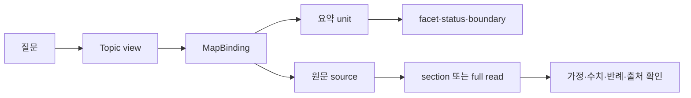

# HSWM 연구 Atlas — 원문으로 돌아가는 다중 해상도 지도

이 문서는 HSWM 연구를 새 이론으로 합치지 않고, 질문에서 주제·요약·원문·문맥으로
내려가는 읽기 지도다. 원문은 각자의 권위·작성 시점·상태를 유지하고, 여기의 요약과
배치는 `SECONDARY_AI`의 탐색 보조물이다.

Atlas는 Semantic Weight나 학습된 router가 아니다. 현재 runtime state를 읽거나 쓰지 않고,
검색 품질이나 의미 retrieval이 좋아졌다는 실험 주장도 하지 않는다.

## 범위와 고정점

- 주 원문 corpus는 Git revision `a7272a13cd6d304b7f8a1911dca0158e0bc67f29`의 직접
  `docs/research/*.md`다. 이 corpus의 각 문서는 하나의 content-curated unit으로 배치한다.
- `docs/canon`의 Markdown/text, 중첩 research/operations 문서, `_research` 기록,
  `formal/*.lean`, ontology JSON, 결과·역사 기록은 원문 구조와 경로를 색인한다. 이들은
  모두 내용을 요약·판정한 corpus라는 뜻이 아니다.
- curation과 atlas code는 cut 뒤에 작성되었으므로 별도 SHA binding을 갖는다. 원문 cut의
  역사적 상태를 현재 상태로 바꾸지 않으며, 파일명·ingestion time에서 event time을 추정하지 않는다.
- 이전의 전체 지도는 [2026-09-30 연구 지도](HSWM_RESEARCH_MAP_2026-09-30.md)와
  [2026-10-01 whole map](HSWM_WHOLE_MAP_2026-10-01.md)에 남는다. Atlas는 그 결론을
  대체하지 않는 source-linked successor다.

| 조사 범위 | 수량 | 정리 깊이 |
| --- | ---: | --- |
| 고정 커밋의 tracked 파일 | 5,005 | 경로·Git blob·SHA-256·바이트 수 |
| 주 연구 문서 | 157 | 문서별 내용 요약·자료 역할·주제·과거 상태·주장 한계 |
| 관련 원문 전체 | 764 | 위 157개를 포함한 구조 색인과 정확한 원문 복귀 |
| 원문 절 | 4,574 | UTF-8 바이트 범위, 상위 절과 전체 원문 |
| 주제별 배치 | 323 | 13개 주제와 요약·원문의 역할 관계 |
| 기존 ontology node 발생 | 13,226 | 239개 JSON에서 출처별 UID·JSON pointer 보존 |

주 연구 문서 157개는 모두 개별 정리했다. 보조 원문까지 포함한 764개는 구조를 색인한
범위이며, 나머지 tracked 파일은 파일 목록과 해시로 추적한다. 원문의 explicit local
citation 1,995건은 cut에서 대상 파일을 찾았고, 59건은 미해결 경로로 남겼다. 이 수치는
인용의 타당성이나 내용의 완전성을 판정한 결과가 아니다.

## 무엇을 보존하는가

HSWM의 목표는 LLM function의 국소 계산과 지속되는 hypergraph state가 하나의 큰 AI를
이루는 것이다. 이 목표와 사용자 원문은 atlas 요약보다 우선하며, 이 지도는 그 정체성을
새로 ratify하거나 구현 완료로 바꾸지 않는다.

연구 문서는 목표, AI 해석, 형식 가정, 구현, protocol, 직접 측정, 반례와 역사 기록을
서로 다른 status로 둔다. 그래서 과거의 `RED`, `NOT_EVALUATED`, `UNJUDGED`,
`PROPOSED`, failure와 open obligation은 positive claim 옆으로 지워지지 않는다.

Lean 형식화의 보장 범위는 각 문서에 적힌 모형·가정·계약에 한정된다.
그것은 실제 LLM, 전체 HSWM, 인과 credit, 일반화 또는 효능을 증명하지 않는다.

## HSWM-like 지도 구조



`MapBinding(topic, summary, original, context)`은 같은 문서를 한 주제에 두는 n항 배치다.
주제는 질문의 관점, summary는 손실 있는 AI 요약, original은 고정 원문이다.
이 세 참여 역할과 context facet 속성을 구분하고, claim boundary는 unit에 보존한다.

한 문서가 여러 주제에 나타나도 복제된 사실이나 중복된 runtime atom이 아니다. 배치를
수정해도 원문 바이트와 원문의 authority/status는 바뀌지 않는다.

원문 citation도 `EXPLICIT_CITATION_NOT_DEPENDENCY`로 기록한다. 링크가 있다는 사실만으로
지원, 채택, 실행 권한, 동치 또는 과학적 검증을 뜻하지 않는다.

## 13개 주제에서 시작하기

| 주제 | 읽을 질문 | Atlas page |
| --- | --- | --- |
| 정체성·권위 | 무엇이 사용자 목표이고 무엇이 AI 제안인가 | [target / authority](atlas_2026-10-02/target_identity_and_authority.md) |
| 프랙탈·철학 | 하나의 HSWM과 상위 cell 참여는 어떤 목표인가 | [fractal / philosophy](atlas_2026-10-02/fractal_composition_and_philosophy.md) |
| C1–C3·조건부 능력 | 개념 계약과 conditional capability의 범위는 무엇인가 | [C1–C3](atlas_2026-10-02/conceptual_c1_c3_and_conditional_capabilities.md) |
| 인과 합성 실험 | 어떤 control과 반증이 causal claim에 필요한가 | [causal spine](atlas_2026-10-02/causal_composition_experiment_spine.md) |
| closure·적대 감사 | bounded done과 남은 의무를 어떻게 구분하는가 | [closure / audit](atlas_2026-10-02/closure_plan_and_adversarial_audit.md) |
| opaque·음성 결과 | 무엇이 식별되지 않았고 어떤 실패가 보존되는가 | [opaque / negative](atlas_2026-10-02/opaque_identifiability_and_negative_results.md) |
| 구성적 실현·증명 | Lean이 보장하는 가정과 명제는 어디까지인가 | [proof](atlas_2026-10-02/constructive_realizability_and_proof.md) |
| relation learning·LLM calibration | 관계 수정과 LLM 판독의 검증 경계는 무엇인가 | [relation learning](atlas_2026-10-02/relation_learning_ru1_and_llm_calibration.md) |
| Native Effect·ICE | TypeScript/Effect 경계와 remediation은 무엇인가 | [Effect / ICE](atlas_2026-10-02/native_effect_runtime_and_ice.md) |
| graph engineering·표준 | n항 관계·provenance·projection을 어떻게 보존하는가 | [graph / standards](atlas_2026-10-02/graph_engineering_and_standard_interoperability.md) |
| 연구 coordination·USL | 연구 자료와 USL interface는 어디까지 연결되는가 | [coordination / USL](atlas_2026-10-02/research_coordination_and_usl_interfaces.md) |
| 학습 문헌·frontier | 비교 문헌과 baseline discipline은 무엇인가 | [literature / frontier](atlas_2026-10-02/learning_literature_and_frontier_baselines.md) |
| 역사 evidence·RED | 이전 프로젝트와 반증·미증명 의무는 무엇인가 | [history / RED](atlas_2026-10-02/historical_evidence_red_paths_and_projects.md) |

첫 행의 목표/authority는 원문 우선성의 경계다. semantic weight·n항 relation·Map은
그 뒤의 문서들이 제안하거나 형식화한 연구 대상이며, atlas 자체의 작동 메커니즘이 아니다.

학습 주제는 문헌과 계획, 프로토콜, 직접 결과를 섞지 않는다. 한 문서의 `source_status`와
`boundary`를 먼저 읽고, 결과를 일반화하거나 현재 runtime claim으로 바꾸지 않는다.

proof 주제는 theorem name만 찾는 색인이 아니다. relevant section 뒤에 full read로 돌아가
assumption, scope, 반례, exact claim ceiling을 확인한다.

opaque/negative 주제에는 측정된 failure와 식별 불가 경계가 함께 있다. 음성 결과는
후속 설계가 생겼다는 이유만으로 해소된 것으로 표시하지 않는다.

Hyperon은 목표 정체성·architecture·novelty·empirical comparison에서 명시적 비교 대상이다.
이 atlas는 Hyperon을 채택했다거나 특정 version의 능력을 검증했다고 주장하지 않는다.

CHU는 HSWM을 포함할 수 있는 계산 가능한 hyperuniverse/OS라는 scope 원문과 연결되지만,
HSWM의 LLM-only AI 범위와 CHU의 wider scope는 분리해 읽는다.

## 데이터 계층

| 계층 | 역할 | 읽을 때의 주의 |
| --- | --- | --- |
| topic | 오래 유지되는 질문 축 | system partition이나 runtime module이 아님 |
| MapBinding | topic과 unit/original/context의 역할 있는 배치 | relevance이지 동치·의존성·지원 판정이 아님 |
| research unit | 두 문장 AI 요약, kind, facet, status, boundary | 상세 가정·수치·증명 body를 생략함 |
| source | cut에 고정한 원문과 SHA/section | 원문마다 독립 authority와 역사 시점이 있음 |
| section/full | byte-bound section 또는 전체 원문 | section만 읽어 claim closure를 선언하지 않음 |
| entity occurrence | source-scoped ontology node occurrence | 같은 UID라도 source 선택 전 identity merge하지 않음 |

`kind`는 `TARGET`, `THEORY`, `FORMAL`, `IMPLEMENTATION`, `PROTOCOL`, `RESULT`,
`PLAN`, `REVIEW`, `HISTORY`, `NAVIGATION` 중 하나다. kind는 진실성 등급이 아니며,
`source_status`와 `boundary`가 그 문서의 시간·증거·제안 범위를 담는다.

facet은 `proof`, `implementation`, `experiment`, `negative`, `hypothesis`, `plan`,
`protocol`, `philosophy`, `map`, `learning`, `comparison`, `operations`, `history`다.
facet query는 명시적으로 선택한 요약을 좁히는 필터이지 scalar Semantic Weight가 아니다.

## 로컬 조회 CLI

다음 CLI는 read-only navigation이다. 네트워크, model call, graph write, runtime state access,
learned Semantic Weight를 사용하지 않는다.

```bash
node _research/research_atlas_2026-10-02/cli.mts overview
node _research/research_atlas_2026-10-02/cli.mts gaps
node _research/research_atlas_2026-10-02/cli.mts topic TOPIC
node _research/research_atlas_2026-10-02/cli.mts search 'TEXT'
node _research/research_atlas_2026-10-02/cli.mts context TOPIC FACET|- QUERY|- BYTES
node _research/research_atlas_2026-10-02/cli.mts show PATH
node _research/research_atlas_2026-10-02/cli.mts read PATH full
node _research/research_atlas_2026-10-02/cli.mts entities UID [SOURCE]
```

`overview`는 declared coverage와 topic view를, `topic`은 한 축의 curated unit을 보여 준다.
`search`는 summary/status/boundary의 literal term conjunction이며 semantic match나 W 값이 아니다.
`gaps`는 고정 원문에서 대상 파일을 찾지 못한 citation 59건을 반환한다.

`context`는 `TOPIC FACET QUERY BYTES`의 명시적 선택 안에서만 요약 context를 만든다.
입력 budget을 넘으면 `NEEDS_NARROWING`을 반환하며 whole corpus를 암묵적으로 활성화하지 않는다.

`show PATH`는 요약·heading·명시 citation을 확인한다. `read PATH full`은 고정 원문 전체를
되돌려 주며, 특정 section ID는 `show`로 확인한 뒤에만 사용한다.

`entities UID [SOURCE]`는 ontology의 exact source occurrence를 찾는다. 같은 UID가 여러 source에
있으면 `SOURCE_SELECTION_REQUIRED`를 돌려주며, 자동 병합·live graph 존재·authority upgrade를 하지 않는다.

## 질문별 읽기 경로

### Lean proof가 무엇을 증명했는가

1. [구성적 실현·증명](atlas_2026-10-02/constructive_realizability_and_proof.md)에서 `proof` facet의 unit을 고른다.
2. `show`로 `source_status`, `boundary`, `source_locator`와 section 목록을 확인한다.
3. `read PATH full`로 exact claim ceiling, 가정, finite/reference model, 반례를 읽는다.
4. formal module과 구현 test의 pass를 실제 LLM efficacy나 전체 HSWM proof로 승격하지 않는다.

### live learning이 실제로 확인되었는가

1. [인과 합성](atlas_2026-10-02/causal_composition_experiment_spine.md)과
   [opaque·음성](atlas_2026-10-02/opaque_identifiability_and_negative_results.md)을 함께 본다.
2. `experiment`와 `negative` facet을 명시하여 `RESULT`와 `PROTOCOL`을 구분한다.
3. 원문에서 task, comparator, fresh outcome, stored observation time을 확인한다.
4. synthetic benchmark나 bounded state observation을 새 과제의 semantic retrieval quality,
   causal credit, continuous learning efficacy claim으로 바꾸지 않는다.

### Map과 표준 graph engineering은 무엇을 보장하는가

1. [graph/standards](atlas_2026-10-02/graph_engineering_and_standard_interoperability.md)에서 `map`과 `implementation`을 좁힌다.
2. n항 relation identity, participant role, ordering, context, exception, provenance와 projection loss를 확인한다.
3. RDF 1.1, SHACL 1.0, SPARQL 1.1, JSON-LD 1.1, PROV-O는 교환·검증·질의의 표준 도구다.
4. atlas의 navigation graph는 source-bound view이며 canonical runtime write path나 표준 적합성 증명은 아니다.

### Hyperon 또는 넓은 CHU 경계는 어디서 읽는가

1. [정체성·권위](atlas_2026-10-02/target_identity_and_authority.md)에서 canon-linked source를 찾는다.
2. [fractal/철학](atlas_2026-10-02/fractal_composition_and_philosophy.md)과
   [coordination/USL](atlas_2026-10-02/research_coordination_and_usl_interfaces.md)로 연결 문맥을 읽는다.
3. Hyperon의 component version·maturity·comparison boundary와 CHU/HSWM scope 원문을 full read한다.
4. 비교 대상으로 기록된 사실은 채택, 통합, empirical superiority의 증거가 아니다.

## 작업공간과 질의 의무

이 atlas 작업공간 이름은 `research-atlas-1002`다. 아래 질문은 완성 판정이 아니라
지도와 검증이 계속 답해야 할 competency question이다.

| ID | 질문 |
| --- | --- |
| Q1 topics | 각 research unit은 어떤 topic view에, 어떤 context로 배치되는가 |
| Q2 units | 전체 attributed summary의 자료 역할·상태·한계·원문 결속은 무엇인가 |
| Q3 formal | formal claim의 source, 조건, exact boundary는 무엇인가 |
| Q4 negative | 측정/기록된 negative result와 미해결 의무는 무엇인가 |
| Q5 coverage | 주 원문 content curation과 support structure index의 범위 차이는 무엇인가 |
| Q6 bindings | 한 document의 topic–summary–original–context 참여 역할은 무엇인가 |
| Q7 citations | 색인된 764개 문서 사이의 explicit citation은 어디를 가리키는가 |
| Q8 violations | 새 owned node의 AI authority와 runtime-write 경계를 위반한 항목은 없는가 |

coverage는 현재 주 원문 curation과 support 구조 색인의 선언으로 읽는다. 이는 전체 tracked
metadata에 대한 진실성 audit, 모든 citation의 support audit, 또는 현행 구현 coverage의 보장이 아니다.

Q5는 764개 indexed source를 집계하고, Q7은 이 문서들 사이의 인용 1,257쌍을 반환한다.
fragment 차이 2건은 file pair로 합쳐지며 catalog에는 보존된다. 실험 결과 JSON 등 색인
밖 파일로 향하는 resolved citation 736건은 catalog에서 `show`/`read`로 접근한다.

원문 누락, 중복 unit, unknown topic/facet/kind, 부재 locator와 원문 바이트 일치는 별도
verifier가 검사한다. [질의 계약](../../ontology/queries/hswm_research_atlas_2026-10-02/README.md)과
[생성·재검증 사용법](../../_research/research_atlas_2026-10-02/README.md)에 실행 방법이 있다.

## 검증 기록

생성 절차는 fixed cut의 path/blob/bytes/section을 읽고, 주 원문이 정확히 한 번씩 curation에
들어갔는지, topic·facet·kind가 registry에 있는지, locator가 원문에 있는지 확인한다.

검증 결과는 [validation receipt](artifacts/hswm_research_atlas_2026-10-02/validation.v1.json)에
고정한다. 생성물 16개 바이트 대조, 전체 원문 해시·절·entity pointer, native/local SHACL,
8개 SPARQL 결과, 10개 잘못된 변이의 거부와 4개 고정 조회 사례를 통과했다.
한글 경로와 UTF-8 절 범위에서도 실제 Git 원문 바이트를 확인했다.

작업공간 회귀 테스트 10개도 통과했다. 새 안내·주제 문서의 local link는 모두
대상 파일이 있으며, portable Markdown math 컴파일은 18개 문서에서 수정 없이 통과했다.
원문에 이미 있던 unresolved citation 59개는 이 새 문서 링크 검사와 구분한다.

표준 export는 [N-Quads gzip](artifacts/hswm_research_atlas_2026-10-02/rdf/dataset.nq.gz),
[descriptor](artifacts/hswm_research_atlas_2026-10-02/rdf/descriptor.json),
[PROV-O JSON-LD](artifacts/hswm_research_atlas_2026-10-02/rdf/provenance.jsonld)로 보존한다.
검증은 이 탐색 자료의 바이트·구조·조회 동작에 관한 것이다. 이번 정리에서 Lean 재증명,
실제 LLM 실험, W 학습 또는 HSWM 효능 실험을 새로 수행한 것은 아니다.

## 읽기 원칙

요약은 질문을 좁히기 위한 출발점이다. 실질적 설계·증명·성능 판단에는 반드시 원문 전체와
그 원문이 가리키는 조건·결과 자료를 읽고, historical status를 현재 상태로 승격하지 않는다.

Atlas의 값은 corpus를 하나의 scalar로 점수화하는 데 있지 않다. 서로 다른 원문, 가설,
반례, proof, 구현과 측정의 provenance를 보존한 채 필요한 해상도로 왕복하는 데 있다.
