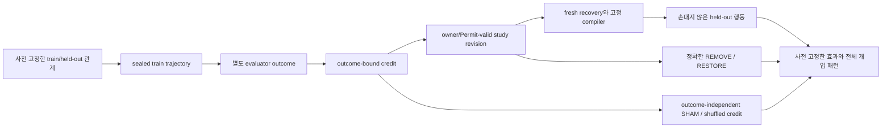

# HSWM: 현재 증거에서 다음 판별 실험으로

상태: `SECONDARY_AI_SYNTHESIS / PROPOSED_INSIGHTS_UNTESTED`.
기준 checkout: `0fd62db2497062fc433d1309e716da40d5a475f8`.
이 문서는 기존 결과의 해석과 다음 실험 후보를 연결한다. 새 연구 결과, 사전등록,
사용자 ratification, D-4 완료 또는 G0/G1 판정이 아니다.

## 정본 역할과 이번 정리의 변화

[헌법](../canon/HSWM_CONSTITUTION_2026-08-20.md)의 대상은 하나의 token-native
LLM-function macro-neural HSWM이다. evolving canonical hypergraph가 living harness,
world model, continuous learner의 역할을 함께 수행한다. schema-relative single owner,
typed reference, provenance-bound transition과 outcome-bound causal-learning loop를
보존한다. [fractal 연결](HSWM_FRACTAL_SCIENTIFIC_CONNECTIONS_2026-08-28.md)의
FCL-1..8도 그대로 참조하며, cognition-bearing HSWM이 다시 상위 HSWM의 cell이 되는
목표를 축소하지 않는다. 통합 주장은 여전히 `INTEGRATED_CLAIM_UNJUDGED`다.

이번 KG는 파일·커밋 목록에서 **관측 → 해석 → 경쟁 설명 → 판별 실험 → 반증 결과**로
탐색할 수 있게 하는 bounded projection이다. graph의 성장 자체는 HSWM의 인지나 학습이
아니다. 모든 새 해석·규칙·실험 노드는 `SECONDARY_AI`이며 새 법칙은 미검증 제안이다.
기존 사용자 원문과 정본은 기존 anchor로 연결하고 그 권위를 새 제안에 상속하지 않는다.

## 현재 확보한 증거

| 계보 | 관측 | 허용되는 해석 |
|---|---|---|
| opaque v3/v4 | ACTIVE·RESTORE 각 32/32, forced 0/32; frozen control clause 실패 | 실패한 원래 판정은 보존. no-state의 first-candidate 패턴이 control 설계 문제를 드러냄 |
| opaque v5 | ACTIVE·RESTORE 각 32/32, forced 0/32, 세 control 각 16/32; 새 occurrence의 모든 조항 충족 | 선언한 opaque task에서 local compiled disposition의 선택 매개 관측 |
| 세 occurrence 합계 | ACTIVE 96/96, RESTORE 96/96, forced 0/96; NO_UPDATE·REMOVE 각 48/96 | arm별 기술 통계. 서로 다른 protocol을 하나의 새 확증 실험으로 합치지 않음 |
| B0 원본 / B2 v1·v2 | actor 이전 실패 또는 tokenizer 실패; 유효 성과 분모 없음 | 계측 계보이며 0% 성과나 학습 알고리즘 반증으로 계산하지 않음 |
| B0 successor / B2 v3 | 각 12/12 완료; train 0/8 대 1/8, valid_seen 둘 다 0/4 | 작은 별도 cohort의 기술 결과. unpaired·budget 불일치, HSWM arm 없음 |
| S-5 | 첫 B0/B2 결과와 비교 파일 존재 | 결과 파일 deliverable 완료. 효능·D-4 완료와 별개 |
| D4 구현 | 실제 Atom V2/Lean admission과 별도 process recovery를 fixture로 확인 | 구현 가능성 증거. live held-out occurrence는 없음 |
| 과거 P1 | 12 candidate 중 fresh pass·activation 0, A1−A2 gain 0 | 해당 scalar slow-weight 경로의 scientific RED 유지. 후속 local 관측이 이 결과를 구제하지 않음 |

원자료는 [v3](../../results/HSWM_G1_OPAQUE_IDENTIFIABILITY_V3_RESULTS_2026-09-06.md),
[v4](../../results/HSWM_G1_OPAQUE_IDENTIFIABILITY_V4_RESULTS_2026-09-06.md),
[v5](../../results/HSWM_G1_OPAQUE_IDENTIFIABILITY_V5_RESULTS_2026-09-06.md),
[S-5 비교](../../results/HSWM_S5_B0_B2_COMPARISON_2026-09-06.md)와 각 결과가 연결한
content-addressed evidence에 있다. 새 ontology는 이 파일들의 SHA-256을 결속한다.
P1과 typed-policy 후속의 서로 다른 범위는 [효능 기록](../../EFFICACY.md)에 보존한다.
과거 closure/session bundle의 열린 S-5 표기는 그 시점의 기록으로 보존하고,
이번 별도 status reading에서 더 뒤의 결과 파일 완료를 연결한다.

`G0=NOT_PASSED`, `G1=NOT_EVALUATED`, 효능 미입증이다. v5 ceiling은
`MEASUREMENT_READY_SINGLE_OWNER_UNDER_DECLARED_OPAQUE_TASK`다.
OS 사용자 분리는 actor의 sudo 권한 때문에 독립 권한 custody를 뜻하지 않는다.
S-6 second-party 지명은 여전히 열려 있다.

## 새로 드러나는 구분과 규칙 후보

아래 R-1..8은 **추론한 연구 휴리스틱**이다. 새 gate·집행 규칙이나 기존 계약 변경이 아니다.

| ID | 통찰·규칙 후보 | 다음에 확인할 것 |
|---|---|---|
| R-1 | 통제가 예상 null policy를 따를 때 충족 가능한 기준인지 먼저 점검한다. 위치별 default는 정보이며 pooled 성과와 질문이 다르다. | 별도 설계에서 position·표현을 바꾸어 null을 확인. v3/v4 실패는 소급 변경하지 않음 |
| R-2 | state version 증가, atom 최초 생성, 기존 atom의 학습 revision을 구분한다. | pre-existing disposition의 revision 및 회복 가능한 pre/post bytes를 직접 추적 |
| R-3 | 새 ID보다 train과 holdout 사이의 선언한 관계와 제외된 정보가 중요하다. | answer/readset 누수 없이 unseen instance에 같은 disposition이 적용되는지 평가 |
| R-4 | 실행 실패, 유효한 음성, 비교 불능을 서로 다른 연구 분기로 둔다. | instrument 결함만 repair하고, 유효한 RED는 exact mechanism 범위에서 retire/reroute |
| R-5 | hash·seal·credit 산술의 일관성과 outcome의 독립적인 진실성을 구분한다. | actor trajectory seal 이후 source-bound evaluator가 outcome을 만들었는지 확인 |
| R-6 | canonical state가 prompt를 통해 영향을 주는 것과 canonical 구조의 추가 이점을 구분한다. | 같은 recovered payload의 prompt replay는 매개와 양립; 구조 우월성은 별도 비교 필요 |
| R-7 | 다음 작업은 어떤 살아 있는 설명들을 구별하는지 명시한다. | 코드·테스트·KG 수가 아니라 아직 빈 causal link와 해석의 모호성이 줄었는지 점검 |
| R-8 | REMOVE의 대상은 이름이 아니라 정확한 개입이다. | revision 이전 state로 복귀와 전체 state 제거를 구별하고 RESTORE는 ACTIVE bytes를 복원 |

현재 D4 engineering fixture는 실제 V2 admission/recovery 경로를 실행하며 global state
`0→1`, disposition `absence→revision 0`을 만든다. 이 구현 검사는 기존 disposition의
`revision 0→1` 학습 변화나 scientific occurrence가 아니다.
첫 admission도 제한된 causal-state 실험의 대상이 될 수 있다. 기존 revision을 경험으로
수정하는 실험은 continuous learning에 더 가까운 **추가 successor 후보**이며,
이를 기존 D-4에 몰래 새 필수 조건으로 더하지 않는다.

또한 현재 binary-transform 후보는 연구자가 XOR 관계와 credit 계산을 제공한다.
이를 성공시켜도 모델이 credit algorithm이나 새로운 학습 법칙을 스스로 발견한 것이 아니다.
검증 가능한 것은 outcome으로 정해진 작은 disposition이 아직 보지 않은 instance에서
쓰이는지다. 같은 family의 전이와 새로운 task family로의 일반화도 따로 기록한다.

## 실제로 다음 증거를 만드는 순서

[D4 초안](../../_research/causal_composition/preregistrations/d4_v1_canonical_heldout_DRAFT/README.md)을
출발점으로 쓰되 아직 실행 계약은 아니다. 아래는 그 빈틈을 메우는 제안이다.

1. **과제 관계와 baseline을 먼저 고정한다.** 최소 후보는 현재 latent XOR task다.
   예를 들어 경험으로 bit 하나를 정하고, 다른 selector·opaque action table의 새 instance에
   적용한다. 최종 held-out seed commitment와 생성 규칙은 outcome 이전에 고정하고,
   held-out 내용·정답은 revision을 동결할 때까지 접근하지 않는다. 이 작은 예시는
   within-family transfer이며 broad task generalization이 아니다.
2. **outcome부터 복구된 state까지 한 경로를 완성한다.** 별도 evaluator의 input/output,
   source identity, trajectory seal 시점, credit, owner/Permit, journal head와 state bytes를
   연결한다. 현재 fixture의 evaluator 함수·self-seal만으로 외부 truth를 주장하지 않는다.
   G0-local 설계가 곧 second-party custody는 아니며 S-6를 별도로 보존한다.
3. **개입과 비교를 prospectively 동결한다.** ACTIVE, NO_UPDATE, REMOVE, RESTORE,
   SHAM, SHUFFLED_CREDIT의 task·runtime·예산·state 대상을 명시한다. 현재 process의
   비-ACTIVE admission은 미구현이다. 중간 구현 연습을 scientific occurrence로 세지 않는다.
4. **실행 전에 분석을 확정한다.** 평가 단위, effect margin, 표본수 근거, paired 배정,
   denominators, 실패·중단 처리, 모든 issued call 비용을 고정한다. 같은 instance의 여러
   call을 독립 표본으로 부풀리지 않는다. fixture의 32행은 power 분석을 대신하지 않는다.
   D-3의 기존 primary estimand를 유지하고 B0/B2는 secondary comparator로 둔다.
5. **한 번 실행하고 전체 패턴으로 판단한다.** ACTIVE의 held-out 개선, REMOVE에서
   소실, RESTORE에서 복귀, SHAM/SHUFFLED에서 미재현이 함께 필요하다. 유효한 음성은
   해당 기전을 반박하고 instrument 실패는 inconclusive로 남긴다. 소비한 run을 결과를
   보고 다시 채우지 않는다.

동일 compiled payload의 prompt replay는 선택적 후속 비교다. 재현되면 그 payload가
효과를 전달하기에 충분하다는 설명과 양립한다. canonical-state→compiler→prompt 매개를
자동 반박하지 않으며, 이 비교를 새 D-4 통과 조항으로 올리지 않는다. canonical 구조가
추가로 유리하다는 주장은 provenance·수정·복구나 성과상의 별도 비교 증거가 필요하다.

이 순서를 통과해도 선언한 finite study의 제한된 기전 증거다. G0-external, G1,
HSWM-wide canonical admission, broad efficacy 또는 fractal closure가 자동 성립하지 않는다.
[adaptive strategy](../canon/HSWM_ADAPTIVE_RESEARCH_STRATEGY_2026-08-30.md)에 따라
과거의 유효한 RED는 정확한 실패 범위에서 유지하며, v5나 comparator 결과로 구제하지 않는다.

## KG에서 질문하는 방법

[ontology](../../ontology/identity/hswm_core/HSWM_RESEARCH_INSIGHTS_2026-09-06.v1.json)는
observation, interpretation, hypothesis, proposed_rule, experiment, status_reading,
source를 구분한다. `DERIVED_FROM`은 출처 기반 해석, `TESTS`는 미래 판별 대상,
`MOTIVATES`는 실험 제안의 이유이며 어느 것도 PASS를 뜻하지 않는다.
`CONSTRAINS`는 claim 범위를 제한하고 `PRESERVES`는 기존 target·실패 계보를 참조한다.
정확한 edge scope와 node의 반증 조건을 함께 읽는다.

[읽기 전용 Cypher 질의](../../ontology/queries/HSWM_RESEARCH_INSIGHTS_2026-09-06.cypher)는
다음을 탐색한다: 어떤 관측에서 규칙이 나왔는가, 어떤 실험이 경쟁 설명을 구별하는가,
무슨 결과가 해석을 반박하는가, 아직 빈 dependency는 무엇인가. Neo4j Browser의 bundle
parameter를 먼저 지정한 뒤 각 질의를 따로 실행한다. ontology MCP를 쓸 때는
`include_preliminary=true`로 검색·이웃 탐색해야 이 AI 제안들이 보인다.

검증·게시 CLI는 `uv run --locked --extra kg python -m
hswm.infrastructure.research_insight_projection`이다. `--apply --source-config`를 주면
검토한 정확한 파일만 기존 bounded publisher를 통해 게시하며, 기존 anchor bytes를
수정하지 않는다. 게시 후 node·relation의 속성까지 exact readback한다.
이 정리는 새 실험 결과가 아니므로 F1_R8 행이나 scientific receipt를 추가하지 않는다.
