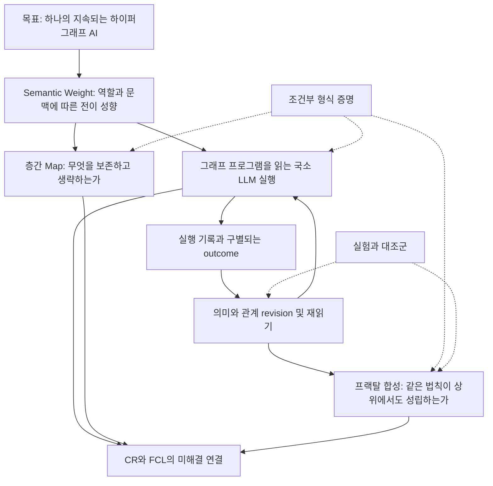

# HSWM 연구 내용과 근거를 연결하는 표준 그래프

2026-09-30 · 작성 `agent:codex` · `SECONDARY_AI / SOURCE_BOUND_SYNTHESIS`

**HSWM은 지속되는 Semantic Weight 하이퍼그래프를 AI 상태로 삼고, 국소 LLM 연산과
outcome에 결속된 그래프 수정으로 추론·행동·학습하는 하나의 AI를 목표로 한다.**
관계 표현, 유한 모형의 증명, 영속 실행의 일부 연결은 갖추어졌다. 실제 모델에서 유용한
의미 수정, 다중 규모 인과 기여, 같은 구성에서의 재귀 합성까지 입증한 상태는 아니다.

이 문서는 연구 내용의 **정체성 → 의미와 가정 → 구현 → 관측 → 남은 의무**를 연결하는
진입점이다. 9개 연구 축의 34개 핵심 기록을 45개 파일의 정확한 바이트와 묶고,
기존 CR-0~7 및 FCL-1~8의 식별자를 재사용한다. 전체 저장소의 모든 주장에 대한 감사나
새 실험 보고가 아니다. 9개 축은 탐색용 분류이며 HSWM의 고정 subsystem 분해가 아니다.

[기계 판독 그래프](../../ontology/development/HSWM_RESEARCH_MAP_2026-09-30.v1.json) ·
[RDF N-Quads](artifacts/hswm_research_map_2026-09-30/rdf/dataset.nq) ·
[PROV JSON-LD](artifacts/hswm_research_map_2026-09-30/rdf/provenance.jsonld) ·
[SPARQL 질문과 재현](../../ontology/queries/hswm_research_map_2026-09-30/README.md) ·
[선정한 기록](../../_research/research_map_2026-09-30/curation.v1.json) ·
[출처 고정 목록](../../_research/research_map_2026-09-30/source-pins.v1.json)

## 연구를 읽는 기준

| 종류 | 확인하는 것 | 그 자체로 성립하지 않는 것 |
| --- | --- | --- |
| 사용자 목표와 원문 | 무엇을 HSWM이라고 만들려는가 | 구현 완료·과학적 효능 |
| AI 해석과 연구 제안 | 목표를 어떤 계약·실험으로 구체화할 것인가 | 사용자 비준·채택 완료 |
| 수학적 정의와 형식 증명 | 명시한 모형·가정에서 어떤 결론이 따르는가 | 현실 LLM이 가정을 만족한다는 보장 |
| 구현과 fixture 검사 | 저장·실행·수정·재읽기가 선언한 예에서 연결되는가 | 의미의 정확성·일반화·인과 효과 |
| 실험 관측 | 특정 프로토콜·모델·과제에서 실제로 무엇이 일어났는가 | 다른 조건의 효능 또는 전체 HSWM 실현 |
| 미해결 의무 | 어떤 연결을 더 입증해야 하는가 | 그래프에 연결됐다는 이유만으로 완료 판정 |

이번 요약과 연결은 모두 AI가 작성했다. 원문이 `USER_PRIMARY`여도 요약 node의 권위를
승격하지 않는다. 원문 파일과 해석 문서를 별도로 연결한다. 사건 날짜는 원문이 보고한
날짜이고, 그래프 기록일과 다르다. 날짜를 확인하지 않은 항목은 미상으로 남긴다.

## 전체 연구 구조

화살표는 연구상 연결을 설명한다. 구현된 호출 순서나 이미 식별된 인과관계의 선언은 아니다.

| 연구 축 | 핵심 내용 | 근거와 현재 한계 |
| --- | --- | --- |
| 대상 정체성과 범위 | 하나의 AI, 하이퍼그래프 신경망, LLM 기본 계산, Semantic Weight 작동을 함께 유지한다. | [사용자 정의](../canon/USER_PRIMARY_HSWM_HYPERGRAPH_NEURAL_AI_2026-09-14.md). 목표 정체성과 달성 여부를 구별한다. |
| Semantic Weight와 관계 표현 | 역할·문맥·예외에 조건화된 전이 성향이다. 성향을 읽는 점수·관측 활성·인과 효과·근거는 별개다. | [이론 기반](HSWM_SEMANTIC_WEIGHT_THEORETICAL_FOUNDATIONS_2026-09-14.md), [표현 정리](HSWM_SEMANTIC_WEIGHT_DEFINITION_AND_HYPERGRAPH_2026-09-14.md). 관계 identity를 유지한 incidence는 손실 pairwise와 다르다. |
| 국소 실행과 그래프 프로그램 | 큰 그래프의 필요한 부분을 읽고 고정 버전 실행기가 graph-resident program을 해석한다. | [방향과 구현](HSWM_GRAPH_PROGRAM_DIRECTION_2026-09-28.md). 수동 프로그램 순서 revision 검사가 자율 프로그램 학습을 뜻하지 않는다. |
| outcome 학습과 인과 기여 | prediction과 outcome을 결속하고 관계를 수정하여 다음 실행이 재사용하게 한다. | [실제 의미 학습 결과](../../results/HSWM_DGX_SEMANTIC_LEARNING_2026-09-20.md). 수정·저장은 실행됐지만 정확도 이득은 관측되지 않았다. |
| 층간 Map과 통계적 추상화 | 과제에 필요한 구분을 상위 모델에 보존하고, 예외에서 세부 모델과 원문으로 돌아간다. | [Map 연구](HSWM_CROSS_LAYER_MAP_RESEARCH_2026-09-27.md), [통계적 층 구성](HSWM_MAP_STATISTICAL_EMERGENCE_2026-09-29.md). 예측·개입·학습 보존은 각각의 의무다. |
| 프랙탈 합성과 지속성 | 작은 HSWM의 동역학·권한·계보·분리 가능성을 보존하며 상위 HSWM을 구성한다. | [FCL 연구](HSWM_FRACTAL_SCIENTIFIC_CONNECTIONS_2026-08-28.md). nested graph나 중앙 wrapper만으로 충족되지 않는다. |
| 형식 증명과 구현 연결 | 유한 구성, 실행·학습 보존, 통계적 선택, decoded 기록의 대응을 다룬다. | [Lean 검토](HSWM_LEAN_VALIDATION_REVIEW_2026-09-28.md). 실제 TS 전체 refinement와 현실 표본·LLM의 품질은 별도다. |
| 실험과 비교의 판정 | 의미 제거·복원, 독립 outcome, fresh 평가, 동일 정보·비용의 대조를 구별한다. | [직접 결과 로그](../../F1_R8_RESULTS_LOG.md). 과거 RED, G0 미통과·G1 미평가와 CR/FCL 미완료를 유지한다. |
| CHU USL 및 도구 | CHU의 넓은 범위, LLM 기반 HSWM, 자원 연결인 USL, 독립 CLI를 구별한다. | [생태계 계약](HSWM_LIKE_CLI_USL_CHU_CONTRACT_2026-09-29.md). HSWM-like 성질·호환성·HSWM 시스템 정체성은 서로 다르다. |

## 실제로 얻은 결과와 그 범위

아래는 보존된 결과의 재정리다. 이번 작업에서 모델을 호출하거나 Lean을 다시 실행하지 않았다.

| 연구 | 관측 또는 증명된 범위 | 유지해야 할 한계 |
| --- | --- | --- |
| [P1 scalar slow-weight](../../F1_R8_RESULTS_LOG.md) | 2026-07-23의 12개 candidate에서 fresh pass·activation 0, A1−A2 0, 456개 rank replay에서 top-10 변화 0. | 해당 경로의 과학적 RED를 보존한다. 전체 목표의 불가능성 판정으로 넓히지 않는다. |
| [opaque v5](../../results/HSWM_G1_OPAQUE_IDENTIFIABILITY_V5_RESULTS_2026-09-06.md) | ACTIVE·RESTORE 각각 32/32, FORCED_OPPOSITE 0/32. | 한정된 local state-readout 식별 관측이다. v3·v4의 실패 terminal과 G0 `NOT_PASSED`, G1 `NOT_EVALUATED`를 유지한다. |
| [USL 유한 관계 합성](../../results/HSWM_USL_RELATION_INSTRUMENT_RESULTS_2026-09-08.md) | 최종 B 12/12, 제거 0/12, 복원 12/12. 같은 native 정보의 동일 학습기도 12/12. | authored finite DSL·같은-process 측정기다. LLM 학습·native 대비 우위를 측정한 것이 아니다. 중단된 두 시도를 보존한다. |
| [국소 의미 해석](../../results/HSWM_LOCAL_SEMANTIC_PROBE_2026-09-20.md) | 16입력×5조건, 80추론. 원본 16/16, 의미 제거 15/16. | 의미 관계가 더한 효용은 식별되지 않았다. prompt 재입력과 canonical 복원을 구별한다. |
| [실제 의미 수정](../../results/HSWM_DGX_SEMANTIC_LEARNING_2026-09-20.md) | v3 learned·frozen 모두 155/320, evidence-only 156/320, oracle 166/320. canonical 복원 16/16. | 네 합성 Boolean 규칙군·4B·일괄 출력 조건의 음성 결과다. 같은 graph hash와 같은 모델 응답을 구별한다. |
| [typed 출력과 수정 감사](../../results/HSWM_JEV_PRINCIPLES_2026-09-21.md) | 직접 확률 480/480 유효·71.95ms, JSON 389/480·970.71ms. 4개 revision의 의미 필드는 그대로였다. | 출력 비용 차이를 의미 학습으로 바꾸지 않는다. learned 보정 NLL 0.954는 평탄 기준 0.693보다 나쁘다. Jev/RLCD 재현도 아니다. |
| [역할 교환 채점 감사](HSWM_RESEARCH_SELF_REVIEW_2026-09-27.md) | pel·nub 교환은 중간 출력 64/128을 바꾸지만 최종 답 변화는 0/128. | 모델 호출 0인 작성된 과제 감사다. 최종 답 불변만으로 역할 무시를 단정할 수 없다. |
| [유한 통합 폐루프](HSWM_INTEGRATED_CLOSED_LOOP_PROOF_2026-09-27.md) | 참조 세계에서 6/8→8/8, 같은 학습 기록의 대안 세계에서 8/8→6/8. | 정확한 작성 interpreter와 유한 세계의 결과다. 보편 일반화나 실제 LLM의 개선을 증명하지 않는다. |
| [fresh 평가 증명](HSWM_FRESH_EVALUATION_LEAN_PROOF_2026-09-28.md) | 독립·유계 평가와 유한 후보의 동시 오차 상계, 행 교체 보정, 비용 포함 선택 타당성. | 한 번의 frozen round와 명시한 표본 법칙에 의존한다. 실제 운영의 fresh 표본 확보를 대신하지 않는다. |
| [graph program 실행](HSWM_GRAPH_PROGRAM_DIRECTION_2026-09-28.md) | 같은 실행기가 수동 revision된 A→B 및 B→A를 재시작 후 실행한다. | scripted HTTP fixture이며 실제 모델 효능·자율 program synthesis·범용 CHU VM은 미입증이다. |

핵심 공백은 “그래프에 상태를 저장할 수 있는가”를 넘어 **그 의미가 실제 실행에 충분하고,
outcome에 따른 의미 수정이 이후 새로운 과제에서 유용한 차이를 만드는가**에 있다.
이는 위 결과를 연결한 AI의 연구 판단이다. 증거 수나 통과한 테스트 수로 답할 수 없다.

## 남은 증명 의무

CR은 [원래 구성적 실현 프로그램](HSWM_CONSTRUCTIVE_REALIZABILITY_PROGRAM_2026-09-10.md)의
분해다. 다음 표의 원래 상태는 **2026-09-10 snapshot**이고, 현재 완료 판정이 아니다.
그래프의 `source_status_as_of`와 `REFERENCE_ONLY_NOT_DISCHARGED`로 이 차이를 보존한다.

| 의무 | 증명할 연결 | 원래 상태와 후속 연결 |
| --- | --- | --- |
| CR-0 | 구체 Step/Learn 의미와 안전성 | `PARTIAL_EXISTING_FORMAL_MODEL`. decoded 전이·실제 adapter·실행기의 연결을 더 확인한다. |
| CR-1 | outcome에 조건화된 개선을 실제 구성에서 도출 | `CLASSICAL_PRIMITIVE_DERIVATION_ONLY`. 후속 유한 증명과 실제 모델 음성 결과를 함께 참조한다. |
| CR-2 | 인과 식별의 도출 | `OPEN`. local 식별 관측과 독립 outcome·외적 타당성의 차이를 유지한다. |
| CR-3 | 중복 없는 다중 규모 credit | `OPEN`. global reward나 설명문만으로 충족되지 않는다. |
| CR-4 | 유용한 coalition·topology의 생성과 회복 | `OPEN`. 고정 topology와 outcome 무관 rewrite를 대조한다. |
| CR-5 | world/self의 공동 예측과 시간적 연속성 | `OPEN`. 정적 목록이나 UID 지속과 구별한다. |
| CR-6 | 구체 합성에서 개입·effect·학습 보존 | `OPEN`. 표현 codec의 왕복만으로 합성의 효능을 보장하지 않는다. |
| CR-7 | 같은 구성에서 모든 조건과 runtime·현실 연결 | `OPEN`. 서로 다른 좋은 사례를 합쳐 하나의 증거로 만들지 않는다. |

FCL은 [기존 법칙 projection](../../ontology/identity/human_universal_body/HSWM_HUMAN_UNIVERSAL_BODY_FRACTAL_PROJECTION.v1.json)의
UID·수락 조건·`UNASSESSED` 상태를 그대로 참조한다. 사용자 목표와 AI 반증 조건이 섞인
`MIXED_EXPLICIT` 출처이며, 이번 AI 요약의 권위와 구별한다.

| 법칙 | 요구하는 성질 | 배제해야 할 대체 설명 |
| --- | --- | --- |
| FCL-1 | 국소 인과 학습 | 행동이 바뀌지 않는 로그·revision 추가 |
| FCL-2 | 합성 시 같은 동역학과 정체성 보존 | 구성원의 계보를 지우는 중앙 wrapper |
| FCL-3 | 문맥에 맞는 coalition의 생성과 해산 | 고정 roster·route의 이름 변경 |
| FCL-4 | 규모별 인과 기여 귀속 | uniform·shuffled·global-only reward |
| FCL-5 | topology와 역할의 학습 및 회복 | 고정 topology·무제한 node 증식·계보 파괴 |
| FCL-6 | 같은 graph의 world/self 공동 모델 | 분리된 dashboard·정적 자기 목록 |
| FCL-7 | 세대와 모델 변경을 넘는 계보 연속성 | 이름만 유지한 model swap·snapshot 복제 |
| FCL-8 | 상위 HSWM도 같은 학습 계약을 만족 | federation·message bus·사회적 연결만 존재 |

## 표준 그래프의 실제 구성

기존 HSWM KG bundle v2 compiler를 재사용한다. 교환은
[RDF 1.1](https://www.w3.org/TR/rdf11-concepts/)의 N-Quads dataset, 구조 검사는
[SHACL 1.0](https://www.w3.org/TR/shacl/), 조회는 기존 SPARQL 1.1 도구,
파생 출처는 [PROV-O](https://www.w3.org/TR/prov-o/)다. 새 DB나 의존성을 추가하지 않았다.
이 표준 원문은 2026-09-30에 확인했다. 전체 공식 suite의 재실행이나 새 표준 준수 범위 확대는 아니다.

주장·주제·출처·기존 의무를 직접 연결하고, 주장별 참여 occurrence도 별도로 둔다.
이를 통해 같은 `obligation` 역할의 복수 대상과 ordinal을 보존한다.
[W3C n항 관계 패턴](https://www.w3.org/TR/swbp-n-aryRelations/)은 이를 설명하는 Working Group Note이며
Recommendation이나 HSWM 실행 언어가 아니다. 아래 predicate는 기존 **HSWM 로컬 어휘**다.

| 관계 | 방향과 domain 및 range | 이 지도에서의 cardinality와 의미 |
| --- | --- | --- |
| `HAS_CONCEPT` | bundle → topic·summary·obligation reference | 0..N. 탐색 소속이며 part-of·subclass·정본 분해를 뜻하지 않는다. |
| `ABOUT` | summary → research topic | 정확히 1. 요약의 주제이며 causal relation이 아니다. |
| `DERIVED_FROM` | summary·obligation reference → source record | 정확히 1. 어떤 파일에서 읽었는지 밝히며 출처 내용의 진실성을 보증하지 않는다. |
| `REFERENCES` | bundle → source; source·obligation → 기존 anchor; summary → 원문·코드; slot → participant | 일반 참조 0..N, obligation의 원래 anchor와 slot의 target은 각각 정확히 1. 동일성·권한·현재 설치를 도출하지 않는다. |
| `RELATES_TO` | summary → obligation; CR reference → FCL reference | 0..N. 관련 의무 또는 기존 crosswalk다. 완료·인과·동치가 아니다. |
| `HAS_PARTICIPATION` | summary → role occurrence | 최소 2. subject·source 각 1, original·implementation·obligation은 선택적. ordinal은 주장 안에서 중복 없이 0부터 이어진다. |

기존 26개 anchor를 새 소유 node로 복사하지 않는다. 원래 UID와 label을 소유 bundle에서
해결하며 로컬 존재와 라이브 KG 존재를 구별한다. 새 node의 `authority_class`,
`canonical_scope`, `record_lifecycle`, `epistemic_state`, `workflow_state`와 관계 `status`를
분리했다. node가 `ACTIVE`여도 관계는 모두 이번 AI 정리의 `PROPOSED`다.

원본의 전체 내용은 source 파일에 남는다. 이 지도는 선정한 주장·의무의 조회용 projection이며
runtime payload·모든 문헌·모든 실험 trace를 무손실로 복제하지 않는다. RDF view에서
전체 canonical AI state를 복원할 수 있다고 주장하지 않는다. 전체 그래프의 비순환성도
요구하지 않으며, 출처가 있는 합성·되먹임 관계와 역할 occurrence 제약을 구별한다.

## 오래된 설명과 다음 조사

라이브 `sym:Concept:hswm`의 오래된 `definition`에는 폐기된 H/W/A/F·Pi 분해가 남아 있다.
이번 bounded lookup에서도 이를 확인했다. [기존 정정](HSWM_GRAPH_PROGRAM_DIRECTION_2026-09-28.md)과
[현재 헌법](../canon/HSWM_CONSTITUTION_2026-08-20.md)을 함께 참조한다.
원래 canonical record와 다른 작성자의 작업은 수정하지 않았다. 이번 파일 그래프가 공유
Neo4j나 실행 중인 HSWM 상태에 자동 동기화되지는 않는다.

다음은 [기존 해결안](HSWM_ADVERSARIAL_REMEDIATION_PLAN_2026-09-27.md)과
[Lean 연결 과제](HSWM_LEAN_VALIDATION_REVIEW_2026-09-28.md)를 연결한 연구 순서 제안이다.

1. oracle 의미를 실제 모델이 안정적으로 실행하는 조건과 역할·문맥·예외를 구별하는 채점을 확인한다.
2. 의미 내용의 수정, 근거 추가, request 변동을 분리하고 독립 outcome과 새 평가를 결속한다.
3. learned·frozen·evidence-only·remove·restore의 품질과 총비용을 비교하고 기존 능력 보존도 본다.
4. 국소 read-set과 실제 codec/admission/trace를 증명 모형에 연결한다.
5. 유용한 국소 학습을 가진 두 규모 구성에서 합성·credit·world/self·계보를 같은 조건으로 검증한다.

Hyperon은 핵심 비교 대상으로 유지한다. 조회 Q8은 기존 문서가 고정한
`hyperon-experimental v0.2.10`과 commit을 반환한다. 이는 과거 비교 대상의 식별이며
2026-09-30의 최신 버전 확인이나 새 benchmark가 아니다. 비교 실행 시 component·commit·
성숙도·모델 접근·예산을 다시 명시해야 한다.

## 검증과 유지

[검증 기록](artifacts/hswm_research_map_2026-09-30/validation.v1.json)은 원본 바이트 결속,
기존 v2 및 이 지도 SHACL, 8개 질문의 정확한 대상·본문·출처·상태, 잘못된 그래프의 거절을 기록한다.
성공적인 구조 검사를 과학적 효능으로 환산하지 않는다.

원본이 바뀌면 builder는 저장된 digest를 덮어쓰지 않고 중단한다. 당시 Git revision에서
재현하거나 새 날짜·버전의 정리를 만든다. 이 문서는 사람이 읽는 종합이며 자동 생성된
본문은 아니다. 유지 시 `curation.v1.json`의 문장과 원문을 함께 대조해야 한다.
