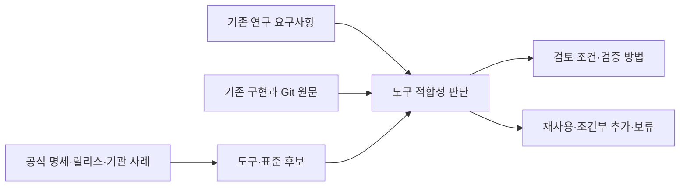

# HSWM 과학 연구 도구화 조사 — 2026-09-13

> 상태: `SECONDARY_AI_RESEARCH_SYNTHESIS / NO_NEW_RUNTIME_OR_EFFICACY_CLAIM`
>
> Repository cut: `c57f39a8c33bb86d19cfcaa40b880b944707e53d`

이번 기록은 후보 35개, 기존 기능 9개, 연구 요구사항 8개를 연결한 265개 노드·662개
관계다. 출처 관측 80건 중 76건은 외부 웹 자료이고 4건은 저장소 자료다. 별도로 고정 Git
원문 15개의 해시를 결속했다. 기존 지식 지도와 HSWM 정체성 노드를 anchor로 참조한다.
6개 SPARQL/Cypher 쌍은 실제 KG와 로컬 RDF의 반환값이 모두 일치했고, 누락 연결 질의는
0건이었다. 이 수치는 기록·교환 검증이며 연구 효능이 아니다.

KG UID: `sym:AbstractNode:hswm-scientific-research-tooling-2026-09-13`.
MCP에서는 preliminary 기록을 포함해 `HSWM 과학 연구 도구`로 찾을 수 있다.

## 목적과 결론

이 조사는 HSWM의 target을 바꾸지 않는다. HSWM은 token-native LLM-function
macro-neural network이며, canonical hypergraph의 outcome-bound revision이 다음 행동을
바꾸는지를 보여야 한다. 도구는 그 주장에 필요한 관찰·재현·반증을 돕는 경계일 뿐 HSWM
cognition, causal credit 또는 learning의 대체물이 아니다.

개념적 delta는 `source → requirement → existing capability → candidate → assessment →
qualification`이다. 새 runtime, 평가 gate, scientific efficacy를 만들지 않는다. 현재의
최소 우선순위는 새 workflow engine을 추가하는 일이 아니라, 기존 Inspect와 native Effect
경로로 작은 fresh-task causal comparison 하나를 결정적으로 수행하는 일이다.

모든 source, qualification, candidate는 [ontology bundle](../../ontology/research_tooling/HSWM_SCIENTIFIC_RESEARCH_TOOLING_2026-09-13.v1.json),
[artifact directory](artifacts/hswm_research_tooling_2026-09-13/), 그리고
[six paired queries](../../ontology/queries/hswm_research_tooling_2026-09-13/)에 source-bound로
정리된다. 이 문서는 그 projection의 한국어 entrypoint다.



각 후보는 하나의 통합 판단과 제안된 검증 과제를 가진다. 사용 근거는 별도 노드에서
기관의 직접 보고, 구현 사례, 표준 문서, 기능 설명으로 구분한다. 이 판단들은 사용자
확정 사항이 아닌 `SECONDARY_AI / PENDING` 기록이다. P2 항목 전체를 구현할 backlog로
해석하지 않는다. 명시한 조건이 생기지 않으면 도구를 추가할 이유도 없다.

## 판정 언어

| 구분 | 뜻 |
|---|---|
| 표준 | 공식 Recommendation, ISO, 또는 명시적으로 versioned된 specification/conformance surface |
| 구현 | HSWM checkout에서 source-bound로 확인된 코드·pin·test 경계 |
| 후보 | 특정 requirement를 위한 qualification 대상이며 설치·채택 결정이 아님 |
| 평가 | source scan이 내린 범위 한정 판단; popularity/effectiveness 증거가 아님 |
| qualification | version, digest, licence, source, task, mapping loss, control을 고정해 실제 경계에서 확인하는 작업 |

release page의 “latest” 표기와 날짜는 당시 관측일 뿐 install pin이 아니다. source scan은
technical metadata와 연구 tooling에 한정됐으며 모든 과학 도구·논문·시장 채택을 포괄하지 않는다.
ISO GQL의 full text도 읽지 않았으므로 abstract와 public metadata를 넘어선 conformance 주장은 하지 않는다.

## 이미 있는 기반

HSWM에는 RDF 1.1/N-Quads, RDF Dataset Canonicalization, SHACL 1.0, PROV-O의
source-bound projection이 있으며, 표준 자체는 W3C Recommendation이다.
[RDF 1.1](https://www.w3.org/TR/rdf11-concepts/),
[N-Quads](https://www.w3.org/TR/n-quads/),
[RDFC](https://www.w3.org/TR/rdf-canon/),
[SHACL](https://www.w3.org/TR/shacl/),
[PROV-O](https://www.w3.org/TR/prov-o/)는 교환과 validation의 authority이지 HSWM의
causal semantics authority는 아니다.

checkout에는 native TypeScript/Effect research graph, JSON-LD/N-Quads/PROV envelope,
SHACL, document-local USL view, paired SPARQL/Cypher navigation이 구현돼 있다.
이는 bounded local engineering이며 live KG truth, independent source custody, learning,
efficacy를 보장하지 않는다. 정확한 scope는
[repository gap inventory](../../_research/graph_standards/research_tooling_2026-09-13/repository-gap-inventory.json)에
기록돼 있다.

Inspect AI `0.3.260`은 existing HSWM outer-preflight pin이다. PyPI에서 2026-09-13에
`0.3.263`이 관측되었다 해도 이 scan의 upgrade 권고는 아니다. 이후 justified revision은 새 qualification으로 다시 pin할 수 있다. existing Inspect가 할 일은 HSWM
execution 바깥에서 frozen task, scorer, trace, baseline/candidate/sham/restore와 resource
accounting을 읽는 것이다. 그것은 independent evaluator나 causal comparison을 자동 제공하지 않는다.
[Inspect documentation](https://inspect.aisi.org.uk/)와 HSWM의
`src/hswm/evaluation/inspect_outer_runner.py`가 이 구분의 primary source다.

Lean 4 `v4.32.1`도 기존 pin이다. Lean kernel check는 선언된 finite premise/model의
정합성을 보장할 수 있지만 external outcome, probability model, runtime witness, strong
baseline separation을 생성하지 않는다. HSWM round 1의 conditional selection,
randomized-identification, composition-interference model은 이 제한을 명시한다.

OpenTelemetry SDK와 W3C Trace Context도 이미 bounded observation surface다.
[W3C Trace Context](https://www.w3.org/TR/trace-context/)는 trace propagation 표준이지만
telemetry span이 causal attribution이나 credit assignment는 아니다.

## Fresh-task causal comparison: 가장 작은 다음 실험

현재 실험적 requirement는 D-4/G1 방향과 같다.

1. action/prediction을 outcome 전에 seal한다.
2. external 또는 독립적으로 attributable outcome을 받는다.
3. declared credit rule이 real Permit 경유 durable canonical revision을 만든다.
4. 새 held-out episode에서 behavior가 달라지는지 본다.
5. exact removal로 효과가 사라지고 byte-identical restoration으로 돌아오는지 본다.
6. sham, shuffled credit, frozen policy, native history, text learner, program learner를
   같은 prior experience와 total-resource accounting 아래 비교한다.

Inspect는 outcome/scorer/trace harness로, native Effect runtime은 declared revision과
receipt 경로로, bounded OTel은 관찰 metadata로 쓴다. 이 조합은 새 도구를 설치하지 않고
가장 직접적인 causal gap을 겨냥한다. outcome을 본 뒤 task, threshold, baseline, holdout,
budget을 바꾸는 것은 qualification이 아니라 post-hoc immunization이다.

parallel lane은 theorem/witness bridge다. Lean에서 update/selection, causal identification,
composition interference의 전제를 좁히되, 각 theorem의 runtime observable과 external
measurement witness를 명시적으로 연결한다. theorem이 실험을 면제하지 않고 실험이
theorem의 unmodeled premise를 참으로 만들지 않는다.

## Evaluation and formal tooling 후보

### Inspect AI and Inspect Evals

Inspect는 open-source evaluation framework이며 formal interoperability standard는 아니다.
AISI는 Inspect가 frontier evaluations에 쓰이고 METR와 Apollo Research가 사용한다고
보고한다. 이는 publisher/institutional self-report이며 market ranking이나 independent
efficacy comparison은 아니다. [AISI Engineering Playbook](https://www.aisi.gov.uk/blog/releasing-aisis-engineering-playbook)이 그 직접
source다.

HSWM에는 새 evaluator harness보다 source-pinned Inspect integration이 낫다. qualification은
provider/model identity, seed policy, task revision, image digest, scorer determinism, log
custody, leakage boundary, secrets redaction을 first request 전에 고정해야 한다. model-generated
code가 있는 task는 sandbox와 log review가 필요하다.

### METR Task Standard and lm-evaluation-harness

METR Task Standard는 published work-in-progress project specification이지 ratified
international standard가 아니다. METR은 2024년 1월 기준 약 200 task families와 2,000 tasks에 사용했다고
보고하지만 이것도 project statement다. 첫 sealed HSWM task가 안정된 뒤 portable task
description으로 검토할 수 있다. [METR 명세 원문](https://github.com/METR/task-standard/blob/main/README.md)을 참조한다.

lm-evaluation-harness `v0.4.13`은 static LM regression baseline에 유용하지만 agentic
causal learning의 primary tool은 아니다. task YAML, dataset, template, tokenizer, decoding,
model revision, scoring patch를 고정하지 않으면 score 비교가 오염된다. release note의
leakage fix는 historical score continuity가 자동이 아님을 뜻한다.
[공식 릴리스 기록](https://github.com/EleutherAI/lm-evaluation-harness/releases)에 수정 범위가 있다.

### Lean and constructive models

Lean/Mathlib은 proof assistant/community library이고 scientific standard는 아니다.
[Lean](https://lean-lang.org/)은 kernel-checked artifact의 authority다. HSWM의 existing
formal artifacts를 재사용하되, CR-2..CR-7을 “proved”로 부르지 않는다. 필요는 actual
sampling error, fresh-evaluation, multiscale credit, n-ary effect, rights/exit/lineage,
simultaneous witness다.

LeanDojo는 formal-code retrieval/automation 후보지만 current proof bottleneck이 measured
search cost 또는 unavailable automation임을 보인 뒤에만 평가한다. 지금 설치하면 existing
Lean pin과 source closure만 넓힌다.

## Reproducibility, packaging, and lineage

### RO-Crate and Workflow Run RO-Crate

RO-Crate는 JSON-LD/Schema.org 기반 community-maintained open specification이며 W3C/ISO
standard가 아니다. HSWM에는 RO-Crate `1.3` terminal/synthetic rehearsal export가 이미 있다.
그러나 GitHub release page의 1.2.0 Latest/Recommendation 표기와 normative Workflow Run
RO-Crate 0.6 collection의 1.3 references 사이에 official-status ambiguity가 있다. 따라서
1.3을 “unreleased”라고도, 1.2로 downgrade해야 한다고도 쓰지 않는다.

Workflow Run RO-Crate profile collection `0.6`은 Process/Workflow/Provenance Run profiles
0.6을 명시하며 RO-Crate 1.3 + Workflow RO-Crate 1.1 compatibility를 명시한다.
이 ecosystem의 engine integration table은 implementation indicator일 뿐 adoption-rate
통계가 아니다. [RO-Crate](https://www.researchobject.org/ro-crate/),
[Workflow Run RO-Crate profile collection 0.6](https://www.researchobject.org/workflow-run-crate/profiles/)를 참조한다.

추천은 existing exporter 재사용이다. 먼저 preregistration/input package rehearsal을 outcome
전에 하고, 그 다음 replay-verified `SEALED`와 valid `VOID` terminal 모두를 profile/validator
qualification한다. VOID/negative result도 valid scientific record여야 하며, protected state,
private data, credential, mutable pointer는 public crate에 넣지 않는다.

### OpenLineage, OTel, and workflow engines

OpenLineage `2.0.2`은 existing terminal projection의 **RunEvent JSON schema** version이며 project 전체 release가 아니다. documentation `1.53.0` 관측과 구분한다.
OTel과 함께 execution observation을 구조화할 수 있지만 learning state 또는 causal outcome을
판정하지 않는다. [OpenLineage](https://openlineage.io/)는 project authority다.

CWL은 frozen batch analysis/validation pipeline에는 후보가 될 수 있지만 live Effect causal
loop의 대체물이 아니다. 실제 연구 환경에서의 사용 근거는 분야에 따라 다르다.
[nf-core](https://nf-co.re/configs/)는 기관·클러스터 설정 157개를 공개하고,
[기여 기관 설명](https://nf-co.re/contributors)은 독일 국가 시퀀싱 사업의 사용을 설명한다.
[Galaxy 서버 목록](https://galaxyproject.org/use/)은 224개 이상의 서버와 대학·연구기관 운영
사례를 보여준다. [Snakemake 문서](https://snakemake.readthedocs.io/en/stable/)의 다운로드·인용
수는 프로젝트가 보고한 지표다. 이 자료들은 각 생태계의 사용 사례를 보여주지만,
전체 과학 연구의 점유율이나 HSWM에 대한 우월성을 측정한 것은 아니다.

여러 환경에서 실행할 분석 파이프라인이라면 Nextflow/nf-core, 파일 간 의존성이 중심인
분석이라면 Snakemake, 생물정보학 도구와 GUI·분석 이력이 필요하다면 Galaxy를 검토할 수
있다. 현재 HSWM의 Effect 실행 경로를 이들로 교체할 근거는 없다. DVC와 MLflow도 각각
큰 데이터의 복원·버전 관리, 반복 실험 비교가 기존 Git·KG·실행 기록으로 감당하기 어려워질
때 검토한다. 표준이라고 잘못 분류하거나, 모두 설치할 필수 도구 목록으로 만들지 않는다.

## Data, causal inference, and discovery 후보

Croissant는 public dataset/sample metadata가 실제로 release될 때 source/distribution/schema
metadata pilot으로 유용하다. [Croissant](https://docs.mlcommons.org/croissant/)는 task outcome,
credit, canonical admission을 정의하지 않는다. public data catalog가 필요한 시점에는 DCAT 3/
DCAT-AP도 discovery layer로 검토할 수 있다.

DoWhy는 declared causal estimand와 graph assumptions를 stress-test하는 targeted pilot에
유용할 수 있다. [DoWhy](https://www.pywhy.org/dowhy/)가 causal identification을 자동으로
보증하지 않는다는 점이 핵심이다. HSWM에는 actual randomized assignment, outcome custody,
interference model, counterfactual support가 먼저 필요하다.

OpenAlex/Crossref는 existing bounded paper discovery/metadata tools로 재사용한다.
[OpenAlex](https://openalex.org/), [Crossref REST API](https://api.crossref.org/) 결과는 discovery
metadata이며 full-text evidence나 license grant가 아니다. source record, accessed date, DOI,
publisher URL, license/availability를 분리한다.

## Graph standards and draft lane

RDF 1.2, SPARQL 1.2, SHACL 1.2는 current W3C candidate/draft lane이다. stable export에
draft-only syntax를 조용히 넣지 않는다. concrete mapping loss 또는 query limitation이 생긴
뒤 isolated profile로 official tests와 stable paired export를 비교한다.

DCAT 3은 published catalog metadata standard이며 public dataset catalog가 생길 때까지
defer한다. ISO GQL/Cypher mapping은 property-graph interoperability requirement가 measured
될 때만 qualification한다. existing paired SPARQL/Cypher navigation으로 현재 research map
needs를 충족한다.

## Qualification sequence

1. 선택한 실험의 source cut과 버전을 고정한다. 이번 조사는 기존 도구를 업그레이드하지
   않는다. 향후 수정이 필요하면 별도 버전과 평가 의미의 변화를 확인해 다시 검증한다.
2. Task family와 source cutoff, model identity, evaluator custody, scorer, holdout, resources,
   stop rule을 preregister한다.
3. Input/preregistration RO-Crate rehearsal을 produce/validate한다. outcome이 없어도 valid
   package qualification result가 될 수 있다.
4. Existing Inspect + native Effect + bounded telemetry로 one fresh-task occurrence를 execute한다.
5. Complete, valid negative, and VOID terminals를 distinct dispositions로 record한다.
6. Estimand, causal model, benchmark descriptor, package profile이 설계에 필요하면 outcome 전에 선택·pin·qualification한다. 결과 뒤 새 mapping/measurement gap은 별도 successor pilot으로만 다루며, 어떤 도구도 approval gate가 되지 않는다.

## 35개 후보의 통합 비교

기존 구현과 외부 최신 버전 관측을 구분한다. 아래 버전은 2026-09-13 공식 자료 확인값이며,
새 패키지 설치를 뜻하지 않는다. 최신 여부를 확인하지 못한 항목은 그대로 표시했다.
각 항목의 원문·확인일·한계는 [전체 출처 목록](artifacts/hswm_research_tooling_2026-09-13/source-index.md),
HSWM 판단과 완료 조건은 [integrated assessment](../../_research/graph_standards/research_tooling_2026-09-13/integrated-assessment.json)를 따른다.

| 후보 | 기존 pin 또는 확인한 명세·버전 | 사용 근거 유형 | HSWM 판단 / 검토 조건 |
|---|---|---|---|
| Inspect AI | existing pin 0.3.260 | institutional self-report | integrate / next fresh task |
| METR Task bridge | observed spec | historical task inventory | defer / METR-conform task |
| lm-eval-harness | observed 0.4.13 | release/capability | defer / static regression |
| Lean4/mathlib | existing pin 4.32.1 | formal research cases | integrate / explicit contract |
| LeanDojo-v2 / Pantograph | 공식 문서 확인; 최신 버전 미확정 | capability only | defer / measured proof search |
| TLC | 공식 문서 확인; 최신 버전 미확정 | capability only | pilot / concurrency invariant |
| Apalache | 공식 문서 확인; 최신 버전 미확정 | capability only | defer / TLC limitation |
| DoWhy | 문서 v0.14 확인; 최신 릴리스 단정 안 함 | method capability | pilot / preregistered causal model |
| EconML | 릴리스 v0.16.0 관측 | release/capability | defer / repeated heterogeneous data |
| PyMC/ArviZ | PyPI 6.3.2 / 1.3.0 관측 | release/capability | defer / declared likelihood/prior |
| RDF/RDFC/SHACL/PROV | existing graph stack | normative suite | reuse / this catalog |
| RDF 1.2 | observed CR 2026-04-07 | candidate standard | watch / mapping loss |
| SPARQL 1.2 | observed WD 2026-09-12 | draft | watch / unmet query |
| SHACL 1.2 | observed WD 2026-08-28 | draft | watch / missing shape |
| DCAT 3 | W3C Recommendation 2024-08-22 | institutional profile | defer / public catalog |
| ISO GQL/Cypher | ISO/IEC 39075:2024; Cypher는 부분 지원 | standard/vendor conformance | reuse / cross-engine need |
| Croissant | 명세 1.1, 2026-01-29 | integrations | pilot / benchmark manifest |
| OpenLineage | existing RunEvent 2.0.2 | integration capability | qualify / external consumer |
| OpenTelemetry | 기존 SDK 2.2.0; 외부 명세 1.60.0 관측 | official capability | reuse / experiment execution |
| GenAI semantic conventions | observed development spec | development only | watch / diagnostic attribute |
| MCP | 명세 2026-07-28; native SDK pin은 미설치 | official protocol | reuse / missing capability |
| OpenAlex/Crossref | 현재 공식 API 문서; 전용 HSWM 통합 미주장 | metadata service | pilot / literature question |
| RO-Crate | existing export 1.3, status unresolved | named implementations | qualify / package rehearsal |
| Workflow Run RO-Crate | observed profile 0.6 | workflow integrations | conditional qualify / step provenance |
| CWL | 명세 v1.2.1 | conformance suite | defer / multi-engine batch |
| FAIR | guidance | institutional guidance | apply / evidence export |
| DataCite | metadata schema 4.7, 2026-03-03 | consortium schema | defer / citable release |
| CFF | 명세 1.2.0 | GitHub integration | defer / software citation |
| SWHID | ISO/IEC 18670:2025, SWHID V1.2 | archive/standard | defer / archived source citation |
| Zenodo | 현행 서비스 문서; 패키지 버전 해당 없음 | service capability | defer / licence-cleared release |
| DVC | 공식 Latest 3.67.1 관측 | release/capability | defer / large-data restore burden |
| MLflow | changelog 3.16.0, 2026-09-03 관측 | release/capability | defer / multi-run tracking burden |
| Nextflow/nf-core | stable 26.04.6; edge 제외 | institutional/national self-report | defer / scientific batch pipeline |
| Snakemake | Latest 9.27.0, 2026-09-11 관측 | project metrics | defer / file workflow |
| Galaxy | Latest 26.1.1, 2026-08-04 관측 | project service statistics | defer / bioinformatics GUI/history |

## HSWM-specific nonclaims

- graph node/relation count, SHACL pass, source pin, RO-Crate validity, telemetry completeness,
  or Lean build does not prove HSWM efficacy.
- institutional deployment statements and publisher-reported integrations are not prevalence,
  market share, independent quality, or causal-effect evidence.
- standards make exchange contracts clearer; they do not supply semantic truth, authority,
  permission, consciousness, personhood, or scale closure.
- protocol controls belong to the current replaceable realization route under adaptive strategy;
  they are not immutable target identity.

## Source appendix

그래프 재생성은 기존 표준 compiler를 사용하는 다음 명령으로 수행한다.

```bash
src/hswm/development/bin/hswm-python graph python -m hswm.infrastructure.research_tooling_projection --check
```

`--check`는 현재 파일의 바이트를 재생성 결과와 비교하며 live KG에 쓰지 않는다.
질의는 Q1 후보·우선순위, Q2 기존 기능 연결, Q3 개발 중 명세, Q4 요구사항·검증 과제,
Q5 사용 근거·출처, Q6 누락 연결을 각각 묻는다. 출처 연결을 고의로 제거한 음성 사례도
검사하여 Q6가 오류를 검출하는지 확인한다. 실제 적용·질의 대조 결과는
[검증 기록](artifacts/hswm_research_tooling_2026-09-13/verification.json)에 둔다.

[전체 원문 목록](artifacts/hswm_research_tooling_2026-09-13/source-index.md)과
[source catalog](artifacts/hswm_research_tooling_2026-09-13/source-catalog.json)에 외부 웹 관측과
고정 Git 원문을 구분해 기록했다. 외부 웹 페이지의 원문 바이트를 보관·해시했다는 주장은 하지
않는다. 재현 입력과 항목별 상세 판단은 다음 파일에 있다:
[evaluation/formal](../../_research/graph_standards/research_tooling_2026-09-13/evaluation-formal-findings.json),
[graph standards](../../_research/graph_standards/research_tooling_2026-09-13/graph-standards-findings.json),
[reproducibility](../../_research/graph_standards/research_tooling_2026-09-13/reproducibility-findings.json),
and [repository-gap inventory](../../_research/graph_standards/research_tooling_2026-09-13/repository-gap-inventory.json),
plus [integrated assessment](../../_research/graph_standards/research_tooling_2026-09-13/integrated-assessment.json).

Core primary specifications: [RDF 1.1](https://www.w3.org/TR/rdf11-concepts/),
[N-Quads](https://www.w3.org/TR/n-quads/), [RDFC](https://www.w3.org/TR/rdf-canon/),
[SHACL](https://www.w3.org/TR/shacl/), [PROV-O](https://www.w3.org/TR/prov-o/),
[Trace Context](https://www.w3.org/TR/trace-context/), [RO-Crate](https://www.researchobject.org/ro-crate/),
[WRROC](https://www.researchobject.org/workflow-run-crate/profiles/), [Inspect](https://inspect.aisi.org.uk/),
[Lean](https://lean-lang.org/), [OpenLineage](https://openlineage.io/),
[Croissant](https://docs.mlcommons.org/croissant/), [DoWhy](https://www.pywhy.org/dowhy/),
[OpenAlex](https://openalex.org/), and [Crossref](https://api.crossref.org/).
