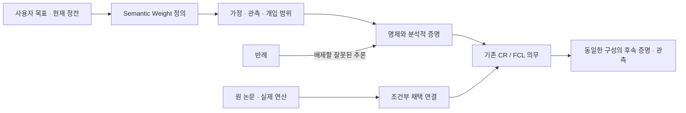

# HSWM Semantic Weight의 이론적 기반

2026-09-14 · `SECONDARY_AI_THEORETICAL_FORMALIZATION / INTEGRATED_CLAIM_UNJUDGED`

**중심 명제:** Semantic Weight는 역할과 문맥에 따라 관계가 다음 가능한 전이를 어떻게 바꾸는지를 나타내는, 경험으로 수정 가능한 **전이 성향**이다. 이 성향을 표시하는 점수, 성향을 실현하는 연산, 실제 인과 효과의 추정값, 그 추정을 지지하는 근거는 구분한다. 여기서는 이 구분을 정의·가정·명제·반례·기존 증명 의무로 연결한다.

이 문서는 [헌법](../canon/HSWM_CONSTITUTION_2026-08-20.md), [schema-relative 정본](../canon/USER_PRIMARY_HSWM_SCHEMA_RELATIVE_SINGLE_OWNER_2026-08-26.md), [FCL-1..8](HSWM_FRACTAL_SCIENTIFIC_CONNECTIONS_2026-08-28.md), [목표 유지·방법 교체 원칙](../canon/HSWM_ADAPTIVE_RESEARCH_STRATEGY_2026-08-30.md)을 따른다. HSWM은 하나의 token-native LLM-function macro-neural network이며 evolving hypergraph가 harness, world/self model, continuous learner 역할을 함께 한다. 새 subsystem 분해나 새 FCL을 만들지 않는다.

**사용자가 확정한 방향**은 시멘틱 웨이트를 정확히 이해하고 이론부터 탄탄하게 세워 연구를 HSWM에 통합하라는 것이다. 아래 확률 커널·동등성·명제·채택 조건은 그 방향에 대한 SECONDARY_AI 형식화다. 분석적 증명은 명시된 수학 모형 안의 결과이며, 새 Lean 검증이나 현실 HSWM의 실현·효능을 보고하지 않는다.

## 1. 기존 개념을 어떻게 이어받는가

| 출처 | 이어받는 의미 | 현재 해석 |
|---|---|---|
| [2026-08-20 사용자 원문](../canon/sources/USER_PRIMARY_HSWM_DEEP_SET_HYPERGRAPH_SEMANTIC_WEIGHT_2026-08-20.txt) | 깊은 neural Set-Hypergraph와 Semantic Weight를 중심에 둘 것 | USER_PRIMARY 목표 |
| [token-hypergraph core §2.2](../canon/USER_PRIMARY_HSWM_TOKEN_HYPERGRAPH_CORE_2026-08-20.md) | 역할별 n항 의미 연산·transport, 시간척도별 변화, topology·근거 구분 | 당시 SECONDARY_AI operator 구성. 고정 H/W/A/F/Π 분해는 후속 정전에 의해 폐기됨 |
| [Occam core §3](HSWM_OCCAM_CORE_2026-08-20.md) | learned, role-conditioned causal difference라는 연구 명제 | 실제 효과가 식별되었다는 선언이 아니라 무엇을 학습하려는지에 대한 압축 표현 |
| [2026-08-26 정본 §3](../canon/USER_PRIMARY_HSWM_SCHEMA_RELATIVE_SINGLE_OWNER_2026-08-26.md) | schema-approved transition-disposition candidate | 현재 기준. causal efficacy는 별도의 식별·측정 근거가 필요 |
| [2026-09-10 구성적 실현 프로그램](HSWM_CONSTRUCTIVE_REALIZABILITY_PROGRAM_2026-09-10.md) | CR-0..7, 같은 구성의 안전성·개선·인과·합성·현실 연결 | 아래 명제의 후속 의무를 연결하는 기존 연구 프로그램 |
| [2026-09-14 Transformer·수학 지도](HSWM_TRANSFORMER_ARCHITECTURE_AND_MATH_2026-09-14.md) | 구현 가능한 연산과 그 수학적 조건 | 본 문서의 정의를 만족하는지 따져 채택할 방법 후보 |

**이번 conceptual delta:** 문헌을 관련성으로 묶는 데서 나아가, 어떤 상태 표현이 같은 의미 전이와 같은 학습을 실현하는지 판별하는 조건을 둔다. 특히 현재 출력의 일치, 개입 반응의 일치, 미래 갱신의 일치를 서로 다른 의무로 명시한다. 기존 hash-bound 정전·실험·RED 기록은 그대로 보존한다.

## 2. 정의: 무엇이 Semantic Weight인가

### D1. 정본 상태와 실행 상태

정본 상태는 기존과 같이 다음 형태다.

```math
S=(\sigma,\mathcal C_\sigma),\qquad
\mathcal C_\sigma\models\mathrm{WellFormed}_\sigma.
```

각 admitted atom version은 해당 schema 안에서 responsibility owner 하나를 갖는다. 지속·revision·복구되는 relation과 incidence도 그 의무를 가진다. 한 의미 연산이 여러 atom의 typed reference를 읽는 것은 한 atom에 owner를 여러 개 두는 것과 다르다.

**S만 알면 미래가 결정된다고 가정하지 않는다.** fast state, optimizer moment, KV cache, 미완료 trajectory, 외부 환경의 숨은 상태가 미래를 바꿀 수 있다. Markov 모형을 쓰려면 그 모형의 operational configuration Z에 필요한 상태를 명시하거나, 전체 관련 이력에 조건화한다. `proj_σ: Z → S`는 정본 snapshot을 읽는 projection이며 canonicalization·admission 연산이 아니다. Z는 실행·환경 분석을 위한 수학적 설정이며 HSWM 정체성을 새로운 고정 성분들로 분해하지 않는다.

### D2. 역할을 가진 n항 입력과 수신자별 전이 성향

관계 e의 입력은 bare node set이 아니라 역할·방향·타입·식별자·계보가 붙은 incidence들의 유한 multiset이다. 같은 unordered role 안의 열거 순서는 의미가 없지만 역할 교환, 시간 순서 변경, 서로 다른 참여자 대체는 일반적으로 의미가 있다.

```math
d_{e,S}=\mathrm{Interpret}_\sigma(S,e),\qquad
d_{e,S}:\mathcal Z^{\mathrm{exec}}_{e,S}\times\mathcal X_{\mathrm{roles}(e)}\times\mathcal C_e
\longrightarrow\mathcal P(\mathcal M_{\mathrm{recipients}(e)}),
\qquad d_{e,S}(\mathrm{d}m\mid z,x,c).
```

`Z_exec(e,S)`는 `proj_σ(z)=S`인 HSWM 실행 상태의 선언된 범위이며 외부 세계의 숨은 정답을 포함하지 않는다. `x`는 typed 입력 활성, `c`는 허용된 문맥, `m`은 수신자별 typed message·전이 제안의 **결합된** 출력이다. `P`는 확률분포 집합이며 deterministic operator는 점 질량인 특수 경우다. 역할·수신자·출력 공간은 schema와 relation version에 결속한다. 이 표기는 구현 하나를 지정하지 않으며, 해당 부분을 읽고 실행하는 전체 Step 의미론과 연결해야 한다.

실제로 구현이 읽는 것은 선언된 `read_e(z)`이며, disposition은 고정·versioned backend 계약 β 아래 `d̄_e(dm|read_e(z),x,c;β)`로 factorize해야 한다. 이 read-map은 HSWM 실행 상태에 대한 것으로, 외부의 미관측 세계 상태는 Env에 남긴다. seed·cache·provider session이 출력 법칙을 바꾸면 무엇을 조건화했고 무엇을 명시한 분포 아래 주변화했는지 기록한다. 같은 관측 입력에서 숨은 정답을 직접 읽는 oracle을 가정하지 않는다.

각 child의 이 kernel이 주변분포라면 그 곱을 composite kernel로 둘 수는 없다. 공유 난수·상태의 coupling이 상위 출력에 영향을 주면 별도의 선언된 joint kernel 또는 허용된 shared-state 조건화를 통해 표현해야 한다. 이것이 P4의 반례와 연결된다.

`d`는 관계에 저장된 숫자 하나의 별칭이 아니다. schema가 승인한 contract·parameter·관계 atom들을 해석한 성향이다. 모든 의미를 한 relation payload가 중복 소유하게 만들지도 않는다. LLM은 이 성향을 실현하는 국소 transition일 수 있고, foundation parameter는 그 realization의 micro-parameter다.

### D2a. 의미 접지: 그 관계는 세계의 무엇을 가리키는가

`Interpret_σ`라는 이름만으로 외부 의미가 생기지 않는다. 각 관계족은 **reference/grounding contract**를 가져야 한다. 어떤 provenance-bound 관측·측정 절차·행동·대상 참조를 입력이 나타내는지, 출력이 어떤 관찰 가능한 차이를 예측하는지, 식별할 수 없는 범위는 어디인지 명시한다. 근거의 출처와 측정값의 참도 같은 명제가 아니다.

**C6 — 내부적으로 일관되지만 잘못 접지된 관계.** 한 transport가 온도 sensor A를 특정 공간의 온도로 해석하지만 A가 다른 공간에 설치돼 있다면, 역할 대칭과 수치 갱신이 모두 맞아도 대상 해석은 틀릴 수 있다. 주소를 읽었다는 사실만으로 이 연결이 참이 되지 않는다.

두 종류의 반증을 구분한다. 같은 외부 대상을 가리키도록 식별자를 일관되게 재명명하면 의미적 결과는 대응되게 유지되어야 한다. 반대로 외부 대상·속성과 **접근 가능한 관련 근거**를 바꾸면 선언된 예측·행동이 그 차이를 반영해야 한다. 문장 형식·역할 수·예산은 맞추되, 모든 관측을 똑같이 숨겨 놓고 다른 세계를 맞히라고 요구하지 않는다. 올바른 대응 방향·측정 절차는 후보의 답을 본 뒤 정하지 않으며 fresh 사례로 확인한다.

이는 task-relative 의미 적합성을 반증 가능하게 만드는 제안이다. 자연언어 의미 전체·형이상학적 진리·의식의 설명이 아니며, 의미 적합성이 맞아도 해당 관계 사용의 causal efficacy는 D5/CR-2에서 별도로 식별한다. CR-0/4/5와 FCL-6/7에 연결한다.

### D3. 구분해야 하는 의미

| 이름 | 정확히 무엇인가 | 다른 항목으로 자동 변환되는가 |
|---|---|---|
| disposition `d` | 역할·문맥별로 어떤 전이를 산출할 수 있는가 | 표현이 있다는 것만으로 효과가 검증되지 않음 |
| compatibility/read score | 이번 입력에서 어떤 관계를 읽을지 정하는 coordinate | attention·cosine·routing score는 causal credit이 아님 |
| realized activation | 이번 실행에서 실제로 열린 경로와 사건 | 지속되는 학습과 구분 |
| causal estimand | 지정한 개입의 효과를 비교하는 목표량 | 행동 차이가 곧 효용 향상은 아님 |
| evidence/uncertainty | 어떤 자료와 가정으로 그 효과를 얼마나 믿는가 | 예측 분산·표본 오차·출처 신뢰도는 각각 의미가 다름 |
| credit/update proposal | 결과 중 어떤 부분으로 어떤 atom을 수정할지 | global reward의 균등 분배만으로 인과 배분이 되지 않음 |
| admissibility | 현재 schema·invariant·권한에서 허용되는가 | 큰 score·효과·소유권이 허용 여부를 대신하지 않음 |

이 표는 독립 subsystem이나 영구적인 owner registry가 아니라 한 시스템에 관한 서로 다른 질문이다. “Semantic Weight = learned causal difference”는 **관계가 어떤 차이를 만들도록 학습되는가**라는 목표다. 후보 단계부터 causal truth를 담았다고 가정하면 목표를 전제로 되받는 순환이 된다.

### D4. 실행·외부 결과·학습의 시간 순서

```text
Step: 허용된 token/context → 역할별 전이 → 출력·sealed trajectory
Env: 그 출력·행동과 환경 상태 → 외부 outcome
Learn: 이전 상태·sealed trajectory·outcome·식별 근거 → revision 후보/유지/복원
다음 Step: 허용된 새 revision을 실제로 읽고 다른 전이를 수행하는가
```

Outcome은 HSWM이 이미 알고 내놓는 정답으로 Step에 넣지 않는다. 환경 법칙은 별도로 명시하며, 이 순서는 통계적 독립이나 별도 HSWM subsystem을 뜻하지 않는다. “자기 답변을 좋다고 평가했다”와 “독립 결과로 관계를 교정했다”를 같은 관측으로 취급할 수 없다.

### D5. 효과와 학습 개선의 목표량

허용된 두 개입 i, i₀, 결과 함수 g, 환경족·자원·시간 범위가 먼저 정해져야 한다.

```math
\Delta_{e,g}(c)=
\mathbb E[g(Y)\mid\mathrm{do}(i_e),c]
-\mathbb E[g(Y)\mid\mathrm{do}(i_0),c].
```

이 식은 estimand의 정의이며 식별식이 아니다. 제거가 입력 정보·token·계산량까지 바꾸면 그 차이를 함께 측정한 개입일 수 있다. 관계 자체의 효능을 주장하려면 선언한 estimand에 맞게 exposure·비용을 통제하고 sham·복원·독립 outcome 등을 연결해야 한다. 효과가 음수일 수도 있고, 현재 출력이 변해도 다음 과제의 성능이 좋아지지 않을 수 있다. 개선 명제에는 별도의 utility·cost·제약·fresh 평가 분포가 필요하다.

### D6. 의미 동등성은 관측·개입 범위에 상대적이다

두 표현이 같은지 묻기 전에 허용 실험족 E, readout족 O, horizon, 초기 외부 세계 상태·분포를 포함한 환경 법칙족, metric을 정한다. 그 모든 실험·readout에서 출력 법칙이 같으면 해당 범위의 행동 동등성이다. 차이가 ε 이하라는 관계는 근사 구별 불가능성으로 부르며, 일반적으로 추이적인 동치관계라고 부르지 않는다. ε 관계를 연쇄 적용하면 오차가 누적된다.

입력 하나에서 답이 같거나 embedding·score가 같다는 것은 이 동등성보다 약하다. 계보·role·권한·복구도 보존한다는 주장을 하려면 그것들을 관측·개입 계약에 포함해야 한다. 행동 동등성만으로 통시적으로 같은 HSWM이라는 정체성까지 결론내리지 않는다.

## 3. 닫을 수 있는 명제와 실제 반례

아래 P1..P5는 정의된 모형 안의 **분석적 유도**다. HSWM 전체 정리나 새 발견으로 제시하지 않는다. 필요한 가정은 A1: 유한 비공허 공간, A2: 선언된 전이에 충분한 operational state, A3: 공통 허용 입력·개입 label과 fiber에서 일치하는 허용 여부, A4: 명시된 출력·상태 projection, A5: 정규화된 kernel이다. 현실 적용에는 이 가정 자체를 입증해야 한다.

### P1. 전이와 학습을 보존하는 정확한 요약의 필요충분조건

유한 operational state Z와 전사 `q: Z → Z̄`, finite output B와 `r: B → B̄`를 둔다. `(q×r)(z′,b)=(q(z′),r(b))`이다. 각 상태의 허용 Step label 집합 A(z)와 qualified Learn 입력 집합 U(z)가 같은 q-fiber에서 각각 같다고 가정한다. 또는 거부를 명시적 출력으로 포함해 total kernel을 만든다. 허용 label a에서 `K_a(z',b|z)`는 Step kernel이다. 완전한 학습 입력 u에서 `L_u(z'|z)`는 Learn kernel이다. 여기서는 a와 u를 압축하지 않으며 모든 비교에서 동일 label을 사용한다.

**명제.** `q×r`로 출력·다음 상태를 보낸 Step과 q로 다음 상태를 보낸 Learn이 각각 q(z)만으로 결정되는 macro kernel을 갖는 것과 다음 두 조건은 동치다.

```math
q(z_1)=q(z_2)\ \Longrightarrow\
(q\times r)_\# K_a(\cdot\mid z_1)
=(q\times r)_\# K_a(\cdot\mid z_2),\quad\forall a,
```

```math
q(z_1)=q(z_2)\ \Longrightarrow\
q_\# L_u(\cdot\mid z_1)
=q_\# L_u(\cdot\mid z_2),\quad\forall u.
```

`#`는 pushforward, 즉 원래 분포를 사상으로 보낸 분포다. **필요성:** q(z₁)=q(z₂)이면 macro kernel이 받는 입력이 같으므로 출력 법칙도 같아야 한다. **충분성:** 각 q-fiber에서 대표 z를 골라 위 pushforward를 macro kernel로 정의한다. 두 조건 때문에 대표 선택에 무관하고, 비음수·합 1을 보존한다. 두 kernel에 각각 적용하면 된다.

입력을 p_a, p_u로 압축한다면 조건은 `(q(z₁),p_a(a₁))=(q(z₂),p_a(a₂))`인 `(z,a)` 쌍과 `(q(z₁),p_u(u₁))=(q(z₂),p_u(u₂))`인 `(z,u)` 쌍 전체에 각각 적용해야 한다. 허용 여부도 이 결합 fiber에서 일치해야 한다. trajectory·evidence의 입력 압축도 여기에 포함된다. 한 label에서만 확인하고 입력 압축을 정당화할 수 없다. 전체 episode의 결과까지 보존하려면 외부 outcome 법칙과 그 연결도 보존해야 한다.

**C1 — 현재 예측은 같지만 학습이 다른 반례.** 선형 Gaussian scalar 추정에서 mean m=0인 두 상태의 variance가 P=1과 P=4라고 하자. Env가 `y=1`을 제공한 뒤 이 추정 갱신을 Learn으로 선택하고, 관측 행렬 H=1, noise variance R=1이라 하면 gain은 각각 1/2, 4/5이고 새 mean도 각각 1/2, 4/5이다. q(m,P)=m만 남기면 같은 입력·같은 초기 macro mean에서 다른 다음 mean이 필요하므로 Learn 조건이 실패한다. 이 산술 예는 실험 결과가 아니다. 공분산을 반드시 모두 저장하라는 결론도 아니며, 선언한 갱신에 충분한 정보를 남기라는 조건이다. [Kalman 기반](https://doi.org/10.1115/1.3662552)

이 명제는 “좋은 요약이 실제로 존재한다”거나 “그 요약을 효율적으로 학습한다”는 보장이 아니다. q가 identity이면 조건은 쉽게 성립하지만 압축 이득이 없다. 유용한 작은 q를 구성하는 것이 CR-5/6의 실질적 연구 문제다.

### P2. 같은 점수로 뭉개진 차이는 그 점수만 읽어 복원할 수 없다

**명제.** 선언한 summary s에서 s(z₁)=s(z₂)이지만 어떤 허용 조건의 목표 출력 법칙이 다르면, s만 입력으로 받는 decoder는 두 법칙을 모두 정확히 재현할 수 없다. **증명:** decoder의 입력이 같아 출력 법칙도 같으므로 모순이다.

**C2.** 역할을 무시한 합에서 `(source=1,target=0)`과 `(source=0,target=1)`은 모두 1이다. 목표 message가 source 값을 target으로 전달한다면 필요한 출력은 다르다. 역할을 버린 합은 이 transport에 충분하지 않다.

이는 “모든 scalar 표현은 수학적으로 불가능하다”는 명제가 아니다. 유한 객체를 정수 하나에 부호화할 수도 있고, 충분한 context를 별도로 읽는 scalar parameter로 복잡한 함수를 조절할 수도 있다. 문제가 되는 것은 **선언한 의미 해석 아래의 비단사적 손실**이다. vector나 tensor라는 이름만으로 손실이 해결되지도 않는다.

### P3. 관찰에서 같아도 원인은 다를 수 있다

**C3와 증명.** 모형 M₁은 fair bit A가 외생이고 `Y:=A`, M₂는 fair bit Y가 외생이고 `A:=Y`라고 하자. 관찰에서는 모두 A=Y이고 두 값이 균등하다. 하지만 `do(A=0)`에서 M₁의 Y는 항상 0, M₂의 Y는 여전히 fair bit다. 따라서 같은 관찰 분포는 같은 개입 효과를 결정하지 않는다.

의미 연결을 잘 예측한 score, 높은 reward, 낮은 residual만으로 원인별 credit을 얻을 수 없다는 반례다. 유효한 개입이나 추가 구조 가정이 있는 특정 효과는 식별 가능하다. [인과 식별의 기반](https://web.math.ku.dk/~peters/jonas_files/ElementsOfCausalInference.pdf)

### P4. 하위의 주변분포만으로 상위 결합을 결정할 수 없다

**C4와 증명.** 두 child 출력 A, B가 각각 fair bit라고 하자. 독립이면 `Pr(A XOR B=1)=1/2`이다. 같은 난수 U를 공유해 A=B=U이면 이 확률은 0이다. 두 경우의 각 child 주변분포는 동일하지만 상위 출력은 다르다.

따라서 child confidence나 개별 kernel을 나열한 것만으로 composite kernel이 정해지지 않는다. shared cause, coupling, 통신, 실행 순서의 어떤 결합 법칙을 사용하는지 명시해야 한다. 공유 원인을 지운 채 child credit을 독립인 것처럼 더하는 방식도 같은 문제를 갖는다. 확률적 합성과 conditional independence를 다루는 일반 문법은 [Markov categories](https://arxiv.org/abs/1908.07021v8)에서 참고할 수 있지만, 그 문법이 필요한 독립성을 만들어 주지는 않는다.

### P5. 역할 내부 순열 불변성과 역할 교환은 다르다

schema가 unordered로 정한 각 role의 열거 순열을 g라 하자. 입력 incidence와 대응하는 출력 수신자를 같이 재색인할 때 `d(gx,c)=g_#d(x,c)`를 요구한다. **명제:** 입력·중간·출력 공간의 group action이 호환되고 각각 이 equivariance를 만족하는 두 typed deterministic map의 합성도 equivariant다. **증명:** `f(h(gx))=f(g h(x))=g f(h(x))`. 확률 kernel도 유한 합에서 중간 변수를 재색인하면 같은 결과를 얻는다. 각 map의 입력·출력 group action이 맞아야 한다.

**C5.** source와 target을 교환하는 것은 허용된 role 내부 재색인이 아니므로 P2의 두 입력이 같은 의미가 될 필요가 없다. 순열 대칭을 잘못 크게 잡으면 관계의 방향을 제거한다. [Deep Sets §2](https://proceedings.neurips.cc/paper/2017/file/f22e4747da1aa27e363d86d40ff442fe-Paper.pdf)

중요한 교정은 **sum 자체를 금지하지 않는 것**이다. role별 learned feature를 합한 뒤 context·recipient별 비선형 함수를 적용하는 구성은 유효한 후보가 될 수 있다. raw scalar pooling과 이런 구성을 같게 취급하면 안 된다. 반대로 원 논문이 다룬 연속 함수·최대 cardinality가 제한된 집합의 continuous sum-decomposition에서는 보편 표현에 latent dimension과 최대 집합 크기의 제약이 있으며, 충분한 표현력이 최적화 성공까지 보장하지 않는다. [Wagstaff et al., Theorem 4.1과 discussion](https://proceedings.mlr.press/v97/wagstaff19a/wagstaff19a.pdf)

## 4. 최신 연구는 어느 명제의 어떤 자리에 들어오는가

다음은 [앞선 원문·버전 카탈로그](artifacts/hswm_transformer_math_2026-09-14/research.v1.json)를 재사용하는 **조건부 채택 지도**다. 모두 연구 후보이며, 기존 알고리즘을 HSWM 전체와 동일시하지 않는다.

| 연결 | 사용할 수 있는 연산·이론 | 먼저 성립해야 하는 HSWM 조건 | 대응 의무 |
|---|---|---|---|
| B1 · Deep Sets / role-aware transport | 역할 내부 대칭을 지키는 set-to-set 함수족 | 외부 참조·roles·recipient·arity·observables, 손실 여부, 충분한 표현 차원 | P2/P5, CR-0/4 |
| B2 · Hopfield / attention / sparse read | query별 관련 활성·근거의 조건부 조회 | 읽은/빠진 근거와 역할을 구분; score를 causal effect로 쓰지 않음 | D2/D3, CR-0/2 |
| B3 · delta rule / TTT / GDN | 관측 예측 오차에 따른 상태 갱신 | 업데이트 loss·변수·reset·지속 범위; 결과 오염과 원인 식별을 별도 해결 | D4/P3, CR-1/2 |
| B4 · Kalman / KDN | 지정한 확률 모형의 mean·uncertainty 갱신 | 모형·잡음 가정, 학습에 충분한 상태, 실제 calibration 범위 | P1/C1, CR-5/6 |
| B5 · Nested Learning / 다중 시간척도 | 서로 다른 주기의 갱신과 기억 유지 | 시간척도별 무엇이 바뀌는지, revision 계보·retention·예외 유지 | D1/P1, CR-1/5 |
| B6 · low-rank / MLA / spectral projection | 계산 가능한 축약·압축 | 행렬 오차와 개입·학습 오차를 별도 bound; 원래 role/근거 복원 | P1/P2, CR-5/6 |
| B7 · causal abstraction / open-system composition | 상태·개입 사상을 통한 합성 의미론 | joint coupling, Step·Learn·Env·lineage 각각의 보존 | P1/P4, CR-3/6 |
| B8 · mHC / recurrent computation / small-gain | 제한된 혼합·상태 재사용·조건부 안정성 분석 | 행렬 closure·boundedness·표현력을 의미/학습 보존으로 확대하지 않음 | P1/P5, CR-6/7 |

MoE·FA4·diffusion·LoRA·GRPO 등도 기존 지도에 남긴다. 실제 역할·학습 목표·접근권이 정해지면 그 자리에 평가할 수 있다. 현재 이론에서 기본 알고리즘으로 정해 놓을 이유는 아직 없다. 모델 내부 연산을 black-box API prompt만으로 구현했다고 부를 수도 없다.

## 5. 기존 FCL·CR에 대한 증명 의무

다음은 새 법칙이 아니라 기존 [CR-0..7](HSWM_CONSTRUCTIVE_REALIZABILITY_PROGRAM_2026-09-10.md)을 Semantic Weight 관점으로 상세화한 것이다. 분석적 필요조건을 충족했다고 CR이나 FCL의 상태를 바꾸지 않는다.

| 기존 의무 | 이번에 명시한 질문 | 보존하는 FCL |
|---|---|---|
| CR-0 | 역할·외부 참조·출력·state와 Step/Learn의 타입 및 허용 범위를 비순환적으로 정의했는가 | FCL-1..8의 구조 계약 |
| CR-1 | outcome으로 d가 실제 바뀌고 새 과제의 기대 효용이 개선되는 구성을 줄 수 있는가 | FCL-1 |
| CR-2 | compatibility와 efficacy를 구분하고 개입·가정에서 credit 식별식을 유도할 수 있는가 | FCL-1/4 |
| CR-3 | joint coupling과 interaction을 고려한 다중규모 credit이 중복되지 않는가 | FCL-4 |
| CR-4 | 아직 선언되지 않은 관측 가능한 변수·관계·coalition을 발견하고 접지·유용성을 보일 수 있는가 | FCL-3/5 |
| CR-5 | world/self·예외·불확실성·계보를 남긴 상태가 다음 예측과 갱신에 충분한가 | FCL-6/7 |
| CR-6 | 유용하게 축약된 composite가 P1의 Step·Learn과 개입·환경·권한·복구를 함께 보존하는가 | FCL-2/8 |
| CR-7 | 동일한 실행 가능한 구성에서 앞의 의무들이 함께 성립하고 실제 LLM·환경에 연결되는가 | FCL-1..8 통합 |

현재 native adaptive loop에는 유한 문맥 feature의 residual 기반 갱신·조건부 관계 분화가 있다. 별도의 native S2S operator에는 역할·수신자별 유한 transport가 있다. [HSWMCellular](../../formal/HSWMCellular.lean)는 조건부 형식 계약을, [CompositionInterference](../../formal/HSWMCompositionInterference.lean)는 국소 변경의 결합이 전체 효용을 해칠 수 있는 반례를 담는다. 이들은 연결할 실재하는 출발점이다. **같은 d의 실행·식별·지속 갱신·합성까지 하나의 구성으로 닫히는지**가 남은 문제다. 세부 source cut과 코드 위치는 [이론 카탈로그](artifacts/hswm_semantic_weight_theory_2026-09-14/theory.v1.json)에 기록한다.

## 6. HSWM 연구의 일부로 읽고 사용하기

이 문서는 문헌 제목을 추가한 목록 대신 다음 질문의 현재 진입점이다.



[이론 KG](../../ontology/identity/hswm_core/HSWM_SEMANTIC_WEIGHT_THEORY_ONTOLOGY.v1.json)는 정의·가정·명제·증명·반례·채택 연결·기존 의무를 별도 node로 두고 그 의존관계를 조회하게 한다. 기존 Semantic Weight UID, FCL UID, Transformer 출처 UID, G1/G2/G3, 과거 지식 지도에 연결한다. CR record는 원래 custom JSON의 정확한 selector를 가리키는 참조이며, 새로운 CR 정본을 발명하지 않는다.

기존 [2026-09-13 지식 지도](../operations/HSWM_KNOWLEDGE_MAP_2026-09-13.md)는 그 source cut의 snapshot으로 보존한다. 현재 탐색은 README·INDEX·AGENTS의 이론 진입점과 새 bundle을 사용한다. repository graph 연결은 HSWM 연구 기반의 통합이며, 실행 중 canonical disposition을 학습·admit했다는 뜻은 아니다.

교환과 검증은 기존 [RDF 1.1](https://www.w3.org/TR/rdf11-concepts/)·[N-Quads](https://www.w3.org/TR/n-quads/)·[SHACL 1.0](https://www.w3.org/TR/shacl/)·[PROV-O](https://www.w3.org/TR/prov-o/) 경로를 사용한다. HSWM의 `DEFINES`, `REQUIRES_ASSUMPTION`, `HAS_COUNTEREXAMPLE`, `CONSTRAINS_ADOPTION` 등은 **local typed vocabulary**이며 W3C가 의미를 인증한 predicate가 아니다. named graph·version·source hash와 reified relation으로 출처를 추적하고, 구조 적합성을 수학적 참·인과 증거로 올리지 않는다. RDF의 binary triple 형식도 reified relation·role incidence를 통해 n항 관계를 표현할 수 있다. 원래 n항 구조를 직접 pairwise 의미로 평탄화하는 것과는 다르다.

실제 질의와 재생성 명령은 [질의 안내](../../ontology/queries/hswm_semantic_weight_theory_2026-09-14/README.md), 범위별 검증은 [검증 기록](artifacts/hswm_semantic_weight_theory_2026-09-14/validation.v1.json)에 둔다. live KG 조회의 가용성과 checked-in snapshot의 존재는 구분하며, 이 변경은 live KG 게시를 보고하지 않는다.

## 7. 다음 연구의 구체적 산출물

먼저 기존 CR-0/2/5/6 안에서 **하나의 역할 있는 유한 관계족, 그 관계를 구별하는 관측·개입, 충분한 상태와 갱신 규칙**을 같은 구성으로 적는다. P1에 대해 실행 가능한 축약 q를 제시하고 Step과 Learn의 fiber 조건을 계산한다. 실패하면 어떤 예외·공분산·공유 상태가 빠졌는지 반례를 남긴다. 작은 정확한 모형에서 출발해도 목표를 그 모형으로 축소하지 않는다.

그다음 그 구성의 역할 대칭·인과 식별·갱신·합성 조건을 formal proof로 옮기고, 실제 LLM realization과 가정이 맞는지 별도로 관측한다. 이미 좋은 결과가 난다는 Boolean이나 witness를 전제로 넣어 개선 정리를 만드는 방식은 피한다. 일반적인 새로운 변수 발견, 유용한 압축의 존재·학습, open-world 비정상성, 여러 scale에서의 동시 향상은 여전히 열린 연구다.

연구 순서는 **의미 정의 → 명시적 가정 → 구성과 반례 → 증명 의무 → 필요한 관측 → 구현 선택**이다. 이 순서는 실행을 영구히 미루는 승인 절차가 아니라, 어떤 구현이 HSWM의 핵심 문제를 실제로 해결하는지 판단할 기준이다.
