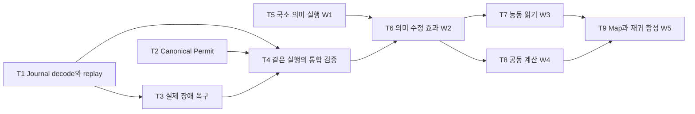

# HSWM 전체 진행상황과 표준 그래프 작업 계획

2026-10-06 · `SECONDARY_AI_SOURCE_BOUND_REVIEW_AND_PLAN`

**그래프 표현·상태 보존·저장 복구의 구현과 제한 범위 증명은 진전됐다. 전체 실행의
형식 검증과 실제 의미 학습의 효능은 아직 열려 있다.** 다음 작업의 중심은 기존 증명과
실제 실행을 연결하고, 실제 LLM이 관계 의미를 실행하고 수정해 이득을 내는지 확인하는 것이다.

검토한 구현 기준은 Git `05fe5d3cfbd89623bf249cf5e0682b3565640e1f`다. 다른 작성자의 미커밋
local-process·relation-synthesis 변경은 이 진행 판정에 포함하지 않는다. 아래는 선택한
근거의 상태표이며 저장소 전체 감사나 완성률이 아니다. HSWM은 별도 AI 프로그램이고,
HSWM_LIKENESS는 성질·근거를 평가하는 도구다. 둘의 완료 상태를 합산하지 않는다.

[진행 그래프](../../ontology/development/HSWM_PROGRESS_PLAN_2026-10-06.v1.json) ·
[질문과 재현 방법](../../ontology/queries/hswm_progress_plan_2026-10-06/README.md) ·
[검사 결과](artifacts/hswm_progress_plan_2026-10-06/validation.v1.json)

## 현재 어디까지 왔는가

| 영역 | 확인된 진전 | 아직 남은 연결 |
| --- | --- | --- |
| 표준 그래프 | 기존 RDF 1.1·SHACL 1.0·SPARQL 1.1·PROV-O 도구를 사용한다. [incidence 증명](HSWM_STANDARD_GRAPH_INCIDENCE_LEAN_2026-10-05.md)은 선택한 메타데이터와 순서 있는 역할 관계를 보존한다. | RDF view는 원본 전체를 담지 않는다. 원본 payload·lifecycle·schema·journal의 보존은 각각 별도 계약으로 다룬다. |
| 실제 그래프 실행 | [genesis의 graph-loop 경유](HSWM_SEMANTIC_BOOTSTRAP_ADMISSION_2026-10-05.md), [stale 후보 거절](HSWM_GRAPH_LOOP_PREFLIGHT_2026-10-05.md), 실행·수정·재시작의 경로가 연결됐다. | scripted fixture의 성공과 실제 모델의 의미 이해·자율 프로그램 학습을 구별해야 한다. |
| Canonical 상태 보존 | [필수 보존 검사와 Lean 증명](HSWM_CANONICAL_PRESERVATION_2026-10-06.md)이 기존 atom·schema·순서 있는 이력의 보존을 다룬다. 검사 실패는 커밋을 막는다. | JSON 표현, journal decode, receipt와 native replay가 이 모델을 구현한다는 일반적 대응은 열려 있다. |
| Payload와 journal | [바이트·grant·게시 조건](HSWM_DURABLE_PRESERVATION_2026-10-06.md)을 실제 순수 함수와 Lean에 연결했다. 재열기·14개 호출 중단·독립 프로세스 경쟁을 검사했다. | 호출 중단은 전원 차단이 아니다. 추상 원자적 게시와 POSIX 실행, 참조 grant와 canonical Permit을 추가로 연결해야 한다. |
| 실제 학습 | [9월 20일 실험](../../results/HSWM_DGX_SEMANTIC_LEARNING_2026-09-20.md)에서 실제 의미 수정·저장·복원은 실행됐다. | learned와 frozen 모두 155/320, evidence-only 156/320이었다. 이 조건에서는 의미 수정의 추가 이득이 관측되지 않았다. |
| 다음 모델 진단 | [기존 W1 계획](HSWM_RESEARCH_SELF_REVIEW_2026-09-27.md)의 원본 128입력·384요청이 준비돼 있다. | 해당 준비 실행은 `PREPARED_NOT_RUN`. 전체 W1의 변환·sentinel 2,784요청이나 모델 준비 기준을 완료한 것이 아니다. 현재 serving 상태는 미확인이다. |

최근 보존 작업의 기록은 관련 14개 파일·108개 테스트 통과와 Lean 4.32.1의
`EXACT_SOURCE_KERNEL_CHECKED`다. 이번 검토에서는 최신 작업 기록에 결속된 10개 파일의
해시를 다시 확인했다. 테스트·Lean 전체를 이번에 다시 실행한 것은 아니다. 테스트 수와
정리 수는 범위를 알려 주며 HSWM의 완성도나 효능 점수로 환산하지 않는다.

## 여섯 고정 의무로 보는 상태

[기존 PS-1~6](HSWM_PROOF_STATUS_GRAPH_2026-09-02.md)의 질문을 재사용한다. 아래 판정은
새 근거를 연결한 10월 6일 검토이며 과거 snapshot을 덮어쓰지 않는다.

| 의무 | 구현 상태 | 근거 판정 | 말할 수 있는 범위 |
| --- | --- | --- | --- |
| PS-1 명시한 Lean 모델의 안전성과 조건부 합성 | `QUALIFIED` | `SUPPORTED_IN_SCOPE` | 인용한 모델과 가정 안의 형식 증명. 전체 HSWM 증명은 아님. |
| PS-2 실제 TS와 Lean 사이 기록·판정 연결 | `IMPLEMENTED` | `SUPPORTED_IN_SCOPE` | 실제 경로와 유한 대조 사례의 공학 근거. 모든 입력에 대한 동등성은 아님. |
| PS-3 모든 대상 실행의 모델 대응 | `PARTIAL` | `UNDERDETERMINED` | 전체 runtime refinement 미증명. 먼저 journal decode/replay의 유한 범위를 닫는다. |
| PS-4 실제 권한과 원자적 저장·복구 | `IMPLEMENTED` | `SUPPORTED_IN_SCOPE` | 기존 로컬 경로 및 최근 바이트·grant·journal 검사 범위. 배포 전체의 key/time/nonce·전원 손실 보장은 아님. |
| PS-5 외부 outcome의 진실성과 독립 인과 기여 | `PARTIAL` | `UNDERDETERMINED` | 로컬·합성 과제의 관측이 있지만 전체 외부 세계의 truth와 credit은 미확립. |
| PS-6 정확한 revision이 실제 LLM을 개선 | `PARTIAL` | `UNDERDETERMINED` | 실제 음성 결과를 보존한다. 새 학습 대조 실험과 독립 재현 필요. |

최근 보존 증명은 주로 PS-1·2·4의 근거를 강화했다. PS-3·5·6을 완료로 바꾸는 결과는
아니다. CR-0~7·FCL-1~8의 원래 성공 기준과 과거 RED·G0/G1 판정도 유지한다.
metahumotonic은 [사용자가 명명한 이데아](HSWM_CAVE_METAHUMOTONIC_RESEARCH_2026-10-04.md)로
보존하며, 그 명명이 구현 완료나 HSWM 유일성의 증거가 되지는 않는다.

## 다음 작업과 완료 기준

작업은 새 거버넌스 단계가 아니라 기존 구현 의무와 W1~W5의 실행 순서를 연결한 것이다.
기간·성능 이득·미측정 비용은 아직 추정하지 않는다. 상태는 미래 완료 약속이 아니라
이 snapshot 시점의 관측이다.

| 작업 | 현재 상태와 선행 조건 | 구체 작업 | 완료 판정에 필요한 결과 |
| --- | --- | --- | --- |
| T1 Journal decode와 replay 대응 | `NEXT`; 바로 진행 가능 | `canonical-atom-v2-state-journal.ts`의 byte decode·receipt·전이 replay를 기존 보존 모델에 연결한다. | 실제 기록의 decode→receipt→native state 대응과 유한 replay 보존을 증명. 잘린 기록·중복 필드·잘못된 revision/descriptor·receipt 바꿔치기의 처리 결과를 명시하고 실제 구현과 대조. JSON decoder 자체의 검증 범위를 별도 표시. |
| T2 Canonical Permit 연결 | `PLANNED`; T1의 모델 범위와 함께 고정 | 기존 signed Permit 경로의 key·scope·nonce·clock·head 검사를 현재 참조 grant 경로와 구별해 연결한다. | 유효/거절 trace가 실제 검증기와 모델에 같은 결과를 냄. trusted key·time·nonce 저장의 외부 전제와 아직 미확립인 조건이 남김없이 표시됨. |
| T3 실제 게시와 장애 복구 연결 | `PLANNED`; T1에 의존 | v2 journal의 no-replace link·동기화·재복구와 추상 게시 모델을 연결한다. | 명시한 OS·filesystem에서 v2 전용 별도 프로세스 중단과 경쟁 후 이전 prefix 또는 정확한 successor 복구. 전체 tail rollback·전원 손실은 별도 미검증으로 유지. |
| T4 한 실행 기록의 통합 검증 | `WAITING`; T1·T2·T3에 의존 | 같은 실행의 승인→content→journal→재시작→read frame을 하나의 source-bound trace로 만든다. | 서로 다른 fixture의 성공을 합치지 않고 동일 기록에서 대응 확인. 실제 바이트·source revision·Lean 결과·표준 view의 provenance를 질의할 수 있음. |
| T5 국소 의미 실행 W1 | `PREPARED_NOT_RUN`; T1~T4와 독립 준비 가능 | 현재 모델·tokenizer·template·serving 바인딩 확인 후 기존 384요청 진단. 원본 진단 뒤 기존 W1 변환·sentinel 확장. | 정답 관계를 주었을 때의 오류·형식·역할 결속·비용을 실제 관측. 384요청 완료와 전체 W1 완료를 구별. 실패하면 국소 실행 조건을 수정하고 동일 조건의 규모 확대를 멈춤. |
| T6 의미 수정의 효과 W2 | `WAITING`; T4·T5에 의존 | frozen·evidence-only·learned·sham·removed·restored·oracle을 독립 평가한다. | train/calibration/heldout 분리, 후보·예산·판정 규칙 고정, 실제 요청에 반영된 의미 변경과 다음 행동을 결속. 불확실성과 비용을 포함해 이득/무효/판단 불가를 보고. |
| T7 능동 읽기 W3 | `PLANNED`; 효과 판정은 T6 뒤 | 필요한 상태의 선택·누락·추가 읽기·원문 복귀를 현재 실행에 연결한다. 인터페이스 설계는 먼저 가능하다. | 동일 정보·총비용 대조에서 읽기 선택의 기여를 구분. 누락과 불충분한 요약에 대한 반례를 보존. |
| T8 두 셀의 공동 계산 W4 | `WAITING`; T6에 의존 | 같은 snapshot 아래 상보·배타 제약과 stale read, 공동 outcome의 기여를 비교한다. | 독립 호출을 합친 기준과 비교해 공동 효과 및 불확실성을 측정. 단순 병렬 처리량을 의미적 합성으로 세지 않음. |
| T9 층간 Map과 재귀 합성 W5 | `WAITING`; T7·T8에 의존 | 상태·개입·다음 학습을 보존하는 Map과 한 단계 상위 구성을 검증한다. | 같은 구성에서 역할·순서·문맥·예외·학습 대응 및 비용 확인. CR/FCL 각 의무의 근거를 연결하고 충족한 범위만 갱신. |

T2의 설계와 T5의 실행 준비는 T1과 독립적으로 할 수 있다. T4는 한정된 실행 증거의
통합 기준이며 TypeScript 전체의 보편 증명을 요구하는 무기한 선행 조건이 아니다.
실제 모델 실행에서는 이미 승인된 접근 범위와 연구 실행 절차를 사용한다. 현재 endpoint가
살아 있다고 과거 기록만으로 가정하지 않는다.

비교는 같은 기저 모델·정보 접근·과제 분할·총비용으로 수행한다. 새로운 아키텍처 우위
주장을 할 때에는 실행 가능한 버전과 성숙도가 고정된 OpenCog Hyperon component도 포함한다.
비교 구현을 확보하지 못한 경우 `NOT_AVAILABLE`로 남긴다. 기존 성적을 0으로 채우거나
다른 모델의 성공으로 과거 음성 결과를 덮어쓰지 않는다.

## 표준 그래프에 계획을 연결하는 방식

기존 bundle v2와 RDF·SHACL·SPARQL·PROV-O 구현을 재사용한다. 새 graph engine이나
표준 버전을 도입하지 않는다. Claim, Decision, Source, Task를 분리하고 기존 PS 식별자를
참조한다. 각각에 작성자·기록일·원본 revision·source byte hash·주장 한계를 둔다.
RDF·PROV 출력은 읽기 전용이며 실행 권한이나 canonical state가 아니다.

| 기존 관계 | 이번 계획에서의 방향과 의미 | cardinality |
| --- | --- | --- |
| `HAS_CONCEPT` | 계획→Claim/Task, Claim→현재 Decision | 각 Claim의 Decision은 정확히 1 |
| `HAS_SOURCE` | Claim/Decision→근거 Source | 각 Claim/Decision에 1개 이상 |
| `CONSTRAINS` | Decision→평가한 Claim의 주장 범위 | 각 Decision에 정확히 1 |
| `REFERENCES` | Claim→기존 PS Claim, Task→평가할 Claim, 계획→HSWM | Task에 1개 이상 대상 의무 |
| `REQUIRES` | Task→먼저 충족할 Task | 0개 이상; 이 관계만 순환 금지 |

이 관계 이름들은 HSWM 로컬 어휘다. RDF 사용을 이유로 W3C가 작업 상태나 판정을
보증한다고 해석하지 않는다. 승인 계약은 실제 native runtime에서 집행하고 표준 그래프는
그 계약·근거·미해결 의무를 조회할 수 있게 한다.

확인할 질문은 세 가지다. **각 의무의 현재 판정과 근거는 무엇인가**, **다음 작업과 완료
기준·선행 조건은 무엇인가**, **음성 결과가 효능 완료로 승격되지 않았는가**. 조회 검사는
행 개수뿐 아니라 의무 ID·판정·출처 경로·작업 간 실제 연결을 기대값과 대조한다.

이번 계획에서는 새로운 모델 실험이나 Lean 정리를 실행하지 않는다. 표준 그래프의 구조,
source hash, 질의 응답을 검증하며 원격 KG·HSPINE에 자동 게시하지 않는다. 기존
HSWM_LIKENESS 평가를 다시 채점하거나 `GAPS_REMAIN`을 완료로 바꾸지 않는다.
