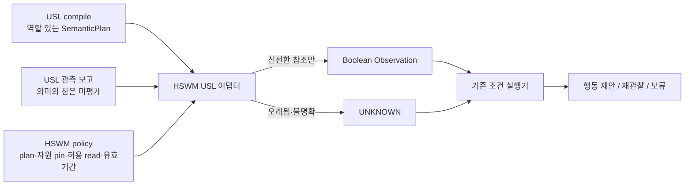

# USL을 HSWM 어댑터로 도입하기 — 구현과 적대적 검토

판정: **참조 관측 어댑터는 도입 가능하며 작은 구현을 연결했다.**
현재 USL 전체를 HSWM의 학습·실행 권한 경계로 바로 사용하는 것은 부족하다.
이번 구현은 `EXPERIMENTAL_EXTERNAL_REFERENCE_OBSERVATION`이다.

## 목표와 이번 변화

[HSWM 헌법](../canon/HSWM_CONSTITUTION_2026-08-20.md)의 하나의 token-native 관계적 몸과
[FCL-1..8](HSWM_FRACTAL_SCIENTIFIC_CONNECTIONS_2026-08-28.md)을 유지한다.
USL은 외부 대상·의미 선언·역할을 전달하는 입력 표현으로 사용한다.
이 연결을 읽고 다음 계산을 바꾸는 책임은 HSWM의 선언된 관측·관계·outcome 경로에 있다.

개념적 변화는 이전 [USL 연결 설계](HSWM_USL_SEMANTIC_ENGINEERING_BRIDGE_2026-09-07.md)의
E2·E3 중 **USL의 역할 있는 참조를 HSWM의 유한 관측으로 변환하는 부분**을 실행한 것이다.
한 USL 링크의 모든 참여자와 명시한 의미 grounding이 신선하게 조회되면 Boolean 참조 준비
관측을 만들고, 불명확하거나 만료되면 `UNKNOWN`으로 남긴다. 이 차이는 기존 조건 실행기의
행동 제안·재관찰 제안을 실제로 바꾼다. 의미의 참, 과제 성공, 인과적 credit은 도출하지 않는다.

어댑터를 만들었다고 USL을 영구히 수동 포인터로 규정하지 않는다. USL 관계가 HSWM의
학습 상태로 편입되는 후속 경로는 별도의 outcome·revision 계약으로 검증할 수 있다.
이번 호환 profile은 USL의 OQ-A~D를 사용자 답으로 닫거나 canonical atom kind를 정하지 않는다.

## 실제로 확인한 USL

검토 대상은 별도 로컬 `USL` 디렉터리의 **runtime 0.3.0 / language 0.1**이다.
현재 TypeScript+Effect 구현에는 `resource → meaning → link`, 순수 parse/compile,
Effect resolver 관측과 KG projection이 있다. 언어 링크는 역할 수에 따른 n-ary 구조이며
컴파일러는 역할 순서·타입·참여자를 검사한다. 과거 2항 레코드의 한계를 최신 언어 전체의
한계로 소급하지 않는다.

반면 관측은 `semanticTruth: NOT_EVALUATED`로 남긴다. 이는 올바른 현재 경계다.
`RESOLVES`, `EXTRACTED`, `trust_host`는 각각 조회·해석 분류·실행 환경에 관한 값이며
의미의 참, 확률, 실행 허가가 아니다.

검토 당시 이 디렉터리에는 `.git`이 없었다. `package.json`은 `private: true`,
`UNLICENSED`이며 공개 배포 패키지로 취급하지 않는다. HSWM에 USL 코드를 복사하거나
새 의존성을 설치하지 않고 **JSON 입출력 호환 어댑터만** 작성했다.
USL의 존재하지 않는 commit 대신 실제 읽은 파일·lockfile의 SHA를 감사 기록에 남긴다.

## 어댑터로 쓸 때 부족한 부분

| 쟁점 | 실제 제한·반례 | 이번 HSWM 처리와 남은 보완 |
| --- | --- | --- |
| 의미 revision과 관측의 결속 | `observeProgram` 결과에 plan digest가 없다. 같은 이름·역할의 의미 설명만 바뀌면 보고서에서 구별되지 않을 수 있다. | HSWM policy가 전체 plan digest를 고정한다. 입력 보고서가 그 plan에서 생성됐다는 독립 증명은 아니며, USL 측 원본 plan/source digest 결속이 필요하다. |
| grounding 누락 판독 | 링크의 `resourcesResolve`는 참여자만 계산한다. grounding 실패는 전체 program 상태에 반영된다. | 링크 flag만 믿지 않고 선택된 의미의 grounding까지 직접 대조한다. |
| 좁은 KG 지문 | KG hash는 UID·이름·title·labels·target version·권위 일부의 지문이다. description·전체 relation·projection digest를 포괄하지 않는다. | hash를 표현의 제한된 지문으로만 취급한다. 의미 계약 보존에는 선택 필드·revision·출처 범위를 명시하는 USL 확장이 필요하다. |
| 조회 범위와 HSWM 권한 | `observeProgram`은 선언된 자원·grounding을 조회한다. URL redirect와 로컬 파일 접근에 HSWM의 작업별 exact allowlist는 없다. | 새 어댑터는 외부 조회를 호출하지 않는다. HSWM이 resolver를 자동 호출하려면 조회 전에 경로·origin·KG source·redirect별 권한을 제한해야 한다. |
| 불명확함·신선도 | 조회 시각은 있지만 HSWM 과제의 유효기간은 별도로 필요하다. ORPHAN도 KG의 실제 삭제를 항상 뜻하지 않는다. | 호출자 최대 나이, 정확한 locator·hash·scope를 확인한다. stale·future·ORPHAN·AMBIGUOUS는 `False` 대신 `UNKNOWN`, pin 불일치는 거부한다. |
| 표현과 학습의 간격 | 역할 있는 연결을 표현할 수 있어도 그 연결이 유용한지, 누구에게 credit을 줄지는 해결되지 않는다. | 연결을 Boolean 참조 준비 관측으로 제한하고 전체 역할 순서와 digest를 보존한다. 가중치 갱신·보상·owner·admission은 생성하지 않는다. |
| 재현·배포 | 로컬 버전 문자열과 dependency lock은 있지만 USL 소스 Git revision·배포 라이선스가 없다. | 이번은 파일 SHA가 결속된 로컬 상호운용 검사다. 배포 의존성으로 넣기 전 USL 자체의 버전·배포 조건을 정리해야 한다. |

표의 `UNKNOWN`은 미완료 과제를 숨기는 값이 아니다. 자료가 없거나 오래됐을 때 조건을
참·거짓으로 단정하지 않고 재관찰하는 실제 분기다. byte 동일성에서 의미 동등성이나
양방향 갱신 가능성을 추론하지 않는다.

표준 연결은 W3C Recommendation인 [Web Annotation의 자원·selector·state 구분](https://www.w3.org/TR/annotation-model/)
및 [PROV-O의 출처·파생 관계](https://www.w3.org/TR/prov-o/)를 참고했다(2026-09-08 확인).
이 표준들은 HSWM 성공 label이나 USL의 고유 실행 계약을 대신하지 않으므로 현재 USL
JSON을 받아들이는 얇은 호환 어댑터가 필요하다. W3C 전체 적합성이나 새 표준을 선언하지 않는다.

## 구현된 연결



- [usl_adapter.py](../../src/hswm/infrastructure/usl_adapter.py): 순수 JSON 변환, n-ary 역할·타입·이름·보고서 일치 확인, source pin·신선도·허용 read 검사.
- [usl_cli.py](../../src/hswm/infrastructure/usl_cli.py): `hswm-usl project|preview`, 기존 `conditional` preview에 관측을 전달.
- [공개 작성 예제](../../_research/usl_adapter/examples/preview.v1.json): 실제 USL 컴파일러로 만든 3역할 plan과 **작성된 관측 fixture**. 외부 프로젝트나 서비스의 실측이 아니다.

예제 실행:

```bash
uv run --locked hswm-usl preview \
  --request _research/usl_adapter/examples/preview.v1.json
```

신선한 예제는 `ACTION_PROPOSAL`을 반환한다. 같은 요청의 `preview.checks.now`를
120초 늘리면 관측이 만료되어 `OBSERVE`로 바뀐다. 두 경우 모두 외부 실행·학습이 없는
기존 `DESIGN_ONLY_NO_EXECUTION` preview다. 현재 날짜로 실측한 데이터처럼 쓰지 않는다.

실제 입력은 다음 세 가지와 HSWM의 기존 preview 계약을 함께 준비한다.

| 입력 | 책임·내용 |
| --- | --- |
| `plan` | USL `compile`의 `usl-semantic-plan/v1`; namespace, resources, meanings, ordered participants |
| `report` | USL `observeProgram`의 `usl-program-observation/v1`; 자원·grounding별 관측 |
| `policy` | HSWM 호출자가 관리하는 `hswm-usl-observation-policy/v1`; 고정 plan digest, link→관측 field, 자원별 기대 hash·해석 주소, 최대 나이 |

`policy.bindings[].role`은 **HSWM 관측의 역할 이름**이다. USL participant 역할과는
다르며 어댑터가 원래 n-ary 참여자를 지워서 만들지 않는다. `meaning:<이름>`은 명시한
grounding의 pin 이름이다. plan digest는 `hswm.cells.conditional.digest(plan)`의 JSON
정규화 결과이고, 포맷팅된 파일에 대한 `sha256sum`과 구별한다.

policy는 외부 보고서가 스스로 부여하는 권한이 아니다. 호출자의 독립 `allowed_reads`에
없는 field는 보고서 처리 전에 거부한다. `preview`는 외부에서 만든 관측을 끼워 넣는 입력을
받지 않으며, mapped Boolean domain과 scope를 확인한 뒤 어댑터 결과만 전달한다.
일부 선택 링크만 신선하면 그 관측은 보존하되 전체 adapter 상태는 `UNRESOLVED`다.

크기는 요청 1 MiB, 종류별 64개 선언, 의미당 16개 역할, 유효기간 최대 86,400초로 제한한다.
JSON 구조 오류·hash 불일치는 JSON `REJECTED`와 exit 2, 정상적인 UNKNOWN을 포함한
유효 응답은 exit 0이다. 적응 runtime DB·USL baseline·KG·파일 자원을 변경하지 않는다.

## 사용 순서와 검증 범위

메이플리니지·버엑시·수풀림에서는 먼저 “이번 변경이 참조하는 코드·개념·문서가 같은 기준을
가리키는가”를 점검하는 보조 경로로 사용할 수 있다. 게임 규칙의 참, 테스트 통과, 개발
유용성은 기존 검사와 명시 feedback으로 판단한다. 이번 변경으로 `hswm-dev` 자동 실행,
USL live resolver, MCP·Skills 배치를 완료한 것은 아니다.

다음 자동 연결에 우선 필요한 것은 **USL 원본 plan digest 결속 → resolver 작업별 권한 제한
→ KG 지문의 필드·revision 범위 선언**이다. 이후 USL에서 읽은 실제 도메인 값을 typed
관측으로 해석하고 기존 outcome 경로와 연결하는 작은 실사용 사례를 추가할 수 있다.

검증은 실제 USL 코드의 주입된 resolver 반례와 HSWM adapter의 회귀를 구분한다.
검사 통과나 참조 재현으로 G0·G1·D-4·P1 RED 또는 새 과제의 효능을 변경하지 않는다.

2026-09-08 실행 결과:

| USL 소스에 주입한 사례 | 관측 |
| --- | --- |
| `supports`와 `contradicts`로 의미 설명 교체 | 두 관측 보고가 byte 단위로 같고 plan digest 필드가 없음 |
| 연결에 참여하지 않는 자원 하나 추가 | 참여자 2개인 링크에 대해 선언 자원 3개 모두 resolver 호출 |
| 참여자는 모두 조회되고 의미 grounding만 ORPHAN | program은 `UNRESOLVED`, 링크의 `resourcesResolve`는 `true` |
| 세 역할의 입력 순서를 바꿈 | 컴파일 결과는 의미 선언의 역할 순서 유지 |
| KG description·projection SHA만 바꿈 | 기존 `contentHash` 동일 |

[재현 프로그램](../../_research/usl_adapter/audit_usl_source_2026_09_08.ts)과
[실제 출력·USL source SHA](../../_research/usl_adapter/source_audit_2026-09-08.json)를 남겼다.
USL runtime을 실행하되 resolver·HTTP 응답은 주입한 fixture를 사용했다. 네트워크나 외부
자원 조회는 없었으며 실행 전후 USL 소스·package·lockfile hash가 동일했다.
원본 USL에 수정사항을 배포한 결과는 아니다.

```bash
# 기존 USL checkout의 설치된 runner가 있을 때. 다운로드·설치하지 않는다.
../USL/node_modules/.bin/tsx _research/usl_adapter/audit_usl_source_2026_09_08.ts \
  --usl-root ../USL

uv run --locked pytest -q tests/test_usl_adapter.py tests/test_usl_cli.py \
  tests/test_conditional_capability.py tests/test_conditional_probe.py \
  tests/test_conditional_task_cli.py tests/test_hswm_canon_doc_honesty.py
```

HSWM 검사는 **60개 통과**(새 adapter·CLI 9개, 기존 조건·문서 51개)했다.
작성 예제의 `READY → ACTION_PROPOSAL`, 만료 후 `UNRESOLVED → OBSERVE`와
3개 역할 보존을 [adapter 확인 기록](../../_research/usl_adapter/adapter_verification_2026-09-08.json)에
소스 SHA와 함께 저장했다.
