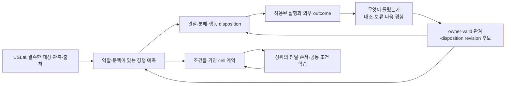

# HSWM과 USL — 의미 연결을 경험·계산·재귀 합성으로 내리는 설계

상태: `SECONDARY_AI_CONCEPTUAL_PROPOSAL / MECHANISMS_UNTESTED`.
정본 역할: HSWM의 목표 정체성을 보존하면서 USL과 만나는 연구 계약을 구체화하는 제안이다.
USL 정전의 재정의, OQ-A~D의 사용자 답, 구현 완료 또는 효능 결과가 아니다.

**중심 제안은 ‘경험에서 만든 구분이 다음 계산을 바꾸고, 유효한 구분은 조건을 가진 능력으로 다시 합성되는 구조’다.** USL은 사용자가 서로 다른 기질의 대상과 의미를 연결하도록 명명한 공용 연결 개념·개발 방향이고, HSWM은 그 연결 중 무엇을 믿고·읽고·시험하고·수정할지를 경험으로 바꾸는 하나의 관계적 몸을 목표로 한다. USL을 영구히 수동 포인터로 제한하지 않는다. 어떤 USL 관계가 HSWM 정본에 편입되고, sealed typed trajectory → 외부 outcome → 경쟁 설명을 대조한 causal credit → owner/Inv/Permit-valid canonical revision을 거쳐 다음 계산을 바꾼다면, 그 관계는 본체의 학습 상태로 작동하는 후보가 될 수 있다. 이것은 아직 채택·구현·검증되지 않은 연결 가설이다.

## 1. 출발점과 실제로 확인한 USL

HSWM 정체성은 [헌법](../canon/HSWM_CONSTITUTION_2026-08-20.md), 재귀 합성 의무는 [FCL 연결 문서](HSWM_FRACTAL_SCIENTIFIC_CONNECTIONS_2026-08-28.md), 경로 교체의 원칙은 [적응적 연구 전략](../canon/HSWM_ADAPTIVE_RESEARCH_STRATEGY_2026-08-30.md)을 따른다. 같은 evolving hypergraph가 living harness·world/self model·continuous learner 역할을 한다. 아래의 관측·가설·계약·disposition 구별은 별도 고정 subsystem 분해가 아니라 같은 몸 안에서 서로 다른 증거·수정 의무를 가진 atom 후보의 구별이다.

USL 정전의 식별자는 `sym:Concept:usl`이다. SYMPOSIUM의 `THEORY/LONGINUS/USL_UNIVERSAL_SEMANTIC_LINK_2026-09-07.md`는 §1 사용자 원문, §2 구조 투영, §3 AI 열린 질문, §4–§6 AI 개발 초안으로 구분되어 있다. 사용자는 ‘유니버셜 시멘틱 링크’, 롱기누스 최소단위, 기질 사이의 의미 연결과 HSWM 확장 방향을 말했다. 영문 `Universal Semantic Link`는 원문 발화가 아닌 역음차 검색 alias라는 출처도 유지한다.

[외부 자료 읽기 기록](sources/USL_KG_SOURCE_READING_2026-09-07.json)에 source bundle SHA `3883a474d6620355ae1ee2396a4c3d36cb86d16f8d7ca6fa26a21b2532af434e`, 두 UserVerdict, 네 OpenQuestion, 원래 관계의 권위·역할과 게시 영수증을 결속했다. 자료는 읽을 당시 SYMPOSIUM의 미커밋 파일이었으므로 존재하지 않는 Git revision을 붙이지 않았다. HSWM에서 새 UserVerdict를 만들거나 외부 정전의 책임을 가져오지 않는다.

영수증의 게시 시각은 **2026-09-07 04:42:30 UTC**, 9개 node·30개 relation이다. 앞선 `/tmp/usl-recheck-prefix-20260907.json` 조회 파일은 04:24 UTC에 작성됐다. 그러므로 그 조회 실패를 게시된 USL의 검색 실패로 소급할 수 없다. 별칭 배열 타입 처리 오류는 별도로 발견된 조회 결함이다. 이번 작업의 현재 live 확인은 MCP transport와 Bolt 연결 실패로 불가능했다. 영수증은 게시 당시의 증거이며 현재 live exact readback을 대신하지 않는다.

## 2. 철학에서 공학으로 내려가는 다섯 연결

| 철학적 직관 | 수학·운영 계약 후보 | 실제 계산에서 달라져야 할 것 | 계약을 깨는 반례 |
|---|---|---|---|
| 의미 있는 구분은 어떤 경험 차이를 예상하게 한다 | 문맥·역할·허용 개입·예측 결과에 상대적인 관계 | 같은 단어라도 다른 조건에서는 다른 관찰·보류·행동 선택 | 같은 URI·hash·이름이라는 이유로 다른 적용 범위를 합침 |
| 같은 관계적 몸이 세계를 예측하고 자기 실행을 조직한다 | 가설 revision과 disposition revision을 연결하되 수정 근거·권한을 구별 | 특정 relation 변경이 read-set·순서·분해·도구 사용을 바꿈 | 설명은 바뀌었지만 실행은 고정 prompt·router만 따름 |
| 오류는 더 좋은 구분을 만드는 계기다 | 경쟁 설명·미식별 상태·대조할 경험·비용을 함께 유지 | 실패 뒤 임의 감점 대신 설명을 가르는 관찰을 선택 | 연결 drift·환경 변화·공동 조건을 모두 한 cell 탓으로 돌림 |
| 능력의 재사용은 유효한 조건을 가진 압축이다 | typed port·범위·불확실성·시간·비용·재개방 조건 | 상위가 내부 재추론을 줄이고 계약을 조합 | 숨긴 내부 상태가 달라져도 같은 요약을 계속 신뢰 |
| 전체도 다시 참여자가 될 수 있다 | 동일한 Step/Learn/Inv/Permit/lineage 문법, 역할 있는 결합과 이탈 계약 | 상위가 전달 조건과 공동 실패를 배우고 전체로 재참여 | 중첩 wrapper만 늘거나 member의 책임·이탈·기여 계보가 사라짐 |

여기서 의미를 예측으로만 환원하는 보편 철학을 선언하지 않는다. **HSWM 연구에서는 의미 주장이 실행과 경험에 어떤 차이를 약속하는지 드러내자**는 운영 제안이다. 해석·가치·목적에 관한 주장은 별도의 출처와 권위를 유지한다. 연결이 많이 저장됐다는 사실은 약속의 성립을 보이지 않는다.

하이퍼그래프의 장점 후보는 관계가 둘 이상의 참여자·역할·조건을 한 사건으로 보존할 수 있다는 데 있다. ‘준비 상태와 도구 모드가 함께 맞을 때 접합이 된다’는 결합을 두 개의 독립 점수로 흩트리지 않는다. 이 incidence 의미를 보존하는 표준 binary 저장 방식도 가능하다. Wolfram의 관계적 rewrite 직관은 표현과 국소 변화의 동기를 주지만, 우리가 정한 rewrite가 유용한 구분을 학습한다는 결론까지 주지는 않는다.

## 3. 치환은 질문과 개입에 상대적으로 정의한다

주소 해석부터 부분적이어야 한다. endpoint locator가 있어도 권한·삭제·네트워크·version drift 때문에 관측을 얻지 못할 수 있다. resolver는 실패 이유와 관측 시점을 함께 반환해야 한다. URL은 특정 시점의 표현, Git은 정확한 commit과 대상, 파일은 host·snapshot과 결속한다. hash는 그 표현의 byte 식별에 쓰고 의미의 참을 인증하는 데 쓰지 않는다.

‘A를 B로 치환할 수 있다’는 말에는 최소한 문맥 C, 허용된 행동 집합 A_C, 관찰할 결과, 시간 범위와 허용 오차가 필요하다. 아래는 새 HSWM 정리가 아닌 검증할 계약의 표기다.

```math
\alpha_C:S\to Z,
\qquad
\Delta_C\bigl(\alpha_C(T_a(s)),\bar T_a(\alpha_C(s))\bigr)\leq\epsilon_C,
\qquad a\in A_C.
```

왼쪽 경로는 내부 상태에서 행동한 뒤 추상화하고, 오른쪽은 추상 상태에서 선언된 거시 행동을 수행한다. 확률적 결과에는 상태값 대신 결과 분포와 적절한 거리를 사용한다. 이 한 식의 근사 성립만으로 장기·조합·범위 밖 보존을 주장하지 않는다. `T`, `alpha`, `Delta`, 오차·horizon과 적용 조건을 먼저 구체화해야 한다. 실제 세계의 반사실 전이 T를 이미 안다고 가정하지 않는다. 관측·개입으로 계약을 제한적으로 조사할 뿐이다.

MDP의 reward·transition에 근거한 상태 유사성과 value-distance 경계는 이런 추상화의 수학적 참고점이다. HSWM은 비정상적 학습·열린 환경·권리·lineage를 추가로 다뤄야 한다. [Ferns·Panangaden·Precup 원 논문](https://arxiv.org/abs/1207.4114).

공방 하위 cell을 상위가 재사용할 때도 ‘내부를 몰라도 된다’가 무제한 은닉을 뜻하지 않는다. port 계약이 유효한 범위에서는 요약을 쓰고, 관측된 mismatch가 임계 조건을 넘으면 내부 관찰을 다시 열거나 이탈·보류해야 한다. [Open dynamical systems의 wiring composition](https://arxiv.org/abs/1408.1598)은 전체가 다시 port를 가진 대상으로 참여하는 형식을 제공한다. 그 합성 법칙에 학습·단일 주체·권리 보존의 증명이 자동 포함되지는 않는다.

## 4. USL 초안에서 보완해야 할 다섯 지점

아래는 SYMPOSIUM 초안을 수정하라는 확정 판정이 아닌 HSWM 측 검토다. 그 파일과 정전은 이 작업에서 변경하지 않는다.

1. **외부 지속성과 canonical 편입.** §5.4의 ‘지속·수정·rollback되는 레코드라면 canonical atom’에는 **HSWM 정본으로 편입되어 그 효과를 갖는 경우**라는 조건이 필요하다. 외부 Git record·KG record가 지속된다는 사실만으로 HSWM owner를 요구할 수 없다. 편입할 경우에는 relation/incidence 자체의 책임·revision·validation 의무를 선언한다.
2. **n-ary 제안과 binary v0.1 shape.** §4의 role-bearing n-ary 읽기와 §5.1의 `from/to` 두 끝 레코드는 해상도가 다르다. 처음에는 두 끝 reference를 지원할 수 있지만, 여러 역할·문맥·evidence를 가진 관계의 동등한 표현이라고 하려면 relation instance와 incidence를 보존해야 한다. 일반 관계의 대칭성·전이성을 기본으로 추론하지 않는다.
3. **해석 상태와 신뢰 종류.** `EXTRACTED/INFERRED/AMBIGUOUS`는 수치 확률이 아니다. `RESOLVES`도 의미의 정확성과 별개다. 콘텐츠 출처, 의미 해석의 근거, resolver 실행 격리, 동기화 가능성은 서로 다른 질문이다. Git이라는 locator 종류만으로 `sandboxed` 보장을 주지 않는다.
4. **Lens 법칙의 적용 영역.** read-only URL↔KG link에는 put가 정의되지 않을 수 있다. source/view schema·부분 get/put의 정의역·허용 업데이트·충돌 처리를 정한 경우에만 round-trip 법칙을 쓴다. [Foster 등의 lens 원 논문](https://www.cis.upenn.edu/~bcpierce/papers/lenses.pdf)은 부분함수와 그 정의역에 조건을 둔다. 연결 가능성만으로 양방향 무손실 동기화를 약속하지 않는다.
5. **drift의 종류와 가격.** byte 변경, symbol 이동, 의미 계약 위반, 실제 행동 차이를 따로 보고한다. 임의 그래프의 GED를 node 수로 나눈 값이 자동으로 0~1이거나 의미 drift를 측정한다고 보장하지 않는다. 비용 모델·graph mapping·분모·근사 오차가 필요하다. v0.1에서는 revision/hash와 선언된 계약별 차이를 우선 계산하고, 전역 GED는 필요성이 입증될 때 검토한다.

OQ-A~D의 이름·최소단위·치환 의미에 대한 사용자 질문을 이 검토로 해결 처리하지 않는다. 다만 비준 전에도 위 조건을 명시한 설계 후보와 작은 읽기 전용 사례를 만들고 비교할 수 있다. 모든 공학적 세부를 사용자 철학의 새 정전으로 요구할 필요는 없다.

## 5. 같은 몸에서 무엇을 실제로 배워야 하는가



HSWM의 학습 이익 후보는 매번 모든 경험을 다시 읽는 비용을 줄이고, 필요한 차이를 더 빨리 발견하며, 적용 범위 밖 오용을 줄이는 데 있다. relation revision은 예측을 바꾸고 disposition revision은 그 예측을 사용할 계산을 바꾼다. 둘은 같은 몸에서 연결되지만 같은 판단은 아니다. 좋은 예측이 곧 실행 권한도 아니다.

[공방 C-1~C-3](HSWM_WORKSHOP_C1_C3_WORKED_SPEC_2026-09-07.md)를 이어 생각하면, 접합 실패의 후보에는 준비·도구의 공동 조건, 오래된 port revision, 잘못 읽은 문서, 전달 순서, 환경 변화가 함께 있다. USL은 어떤 파일·측정·port를 어느 시점에 읽었는지 묶어 준다. 그 기록이 틀렸는지부터 확인할 필요도 있다. `resolve 성공`을 원인 정답으로 쓰지 않는다.

하위 cell은 접합의 적용 조건을 배우고, 상위는 절단 결과를 언제 어떤 상태로 넘겨야 접합·조립이 함께 성립하는지 배운다. 전체 실패를 구성원 수로 나누어 감점하지 않는다. 비교 가능한 개입이 없으면 개인 기여량을 만들어내지 않고, **공동 관계가 미식별**이라고 남긴다. 다음 관찰은 후보가 다르게 예측하는 곳에서 고르되 그 관찰의 비용·실패·권한과 모델 오지정 가능성을 함께 계산한다. 정보 획득이 항상 당장의 작업 성공보다 가치 있다는 고정 규칙도 피한다.

자기모델은 별도 신비한 계층이 아니라 ‘내가 어떤 관측을 놓치고, 어떤 계약을 잘못 요약하고, 어느 계산에 비용을 쓰는가’에 관한 같은 종류의 수정 가능한 예측이 될 수 있다. 과도하게 재추론하면 압축을 제안하고, 반복적으로 실패하면 scope 분리·port 재개방·새 관계 후보를 제안한다. 이것이 능력 분화와 topology 변화로 이어지는지가 후속 연구 문제다.

## 6. 지금 택할 작은 공학 경로

순서는 새 gate나 완성된 실험 사전등록이 아닌 설계 산출물의 순서다. HSWM 목표와 기존 성공 기준을 약화하지 않는다.

| 순서 | 먼저 구체화할 것 | 다음 단계에 넘길 실제 내용 |
|---|---|---|
| E1 | 하나의 반복 세계에서 관측·행동·outcome·비용·미관측 조건 | 지식을 재사용할 규칙성과 새 조합·반례가 공존하는 과제 명세. 작성 사례는 미래 held-out에서 제외 |
| E2 | KG 개념·고정 repo revision·파일/관측을 잇는 작은 USL 사례 | locator의 해석, 의미 주장, source, scope를 구분한 한 관계. 4종 resolver 전체 구현을 선행 조건으로 만들지 않음 |
| E3 | 한 관계 revision이 어느 read-set·관찰·도구 선택을 바꾸는지 | deterministic 역할 binding과 version-indexed 실행 view, 불확실하면 문의·재관찰·보류하는 경로 |
| E4 | 실패를 구별할 후보와 수정 대상 | 해석 오류·resolver drift·국소 기전·상위 결합·환경 변화의 구별 가능성, 대조 경험, 수정/보류 근거 |
| E5 | 능력을 다시 cell로 넘기는 계약 | typed input/output, 적용 조건, 시간·비용·불확실성, re-open·exit·lineage. 상위는 공동 결과로 그 결합을 수정 |

실행 view와 index는 canonical source에서 재생성 가능한 파생물로 시작한다. LLM은 제한된 후보 생성·해석·revision 제안을 맡고, 결정 가능한 형식 검사·version resolution·role binding을 반복해서 토큰으로 추론하지 않도록 한다. 어떤 제안을 채택할지는 outcome-bound evidence와 기존 admission 경계가 결정한다. 이것은 고정 외부 router를 최종 본체로 삼는 선택이 아니다. 바뀌는 정본 관계가 다음 실행의 선택을 조건화해야 한다.

성능의 순이익에는 절감된 재추론·잘못된 행동 비용뿐 아니라 관찰·연결 해석·통신·validation·유지 비용도 포함한다. 같은 정보·모델·예산을 가진 강한 planner가 재추론만으로 같은 결정을 더 싸게 하면 현재 압축 기전은 실패한 것이다. 더 큰 graph나 상위 cell 수를 늘려 이를 구제하지 않는다. 실제 canonical revision의 새 과제 효과와 REMOVE/RESTORE/SHAM은 이 설계가 구체화된 뒤의 판별 수단이며, 이번 산출물은 그 효과를 측정하지 않는다.

## 7. KG를 질문이 통하는 온톨로지로 정리한다

USL의 두 UserVerdict와 원래 OQ를 anchor로 참조하고, HSWM 측 해석은 별도의 `SECONDARY_AI / PROPOSED_UNTESTED` source-bound projection에 둔다. 다섯 연결을 각각 **철학적 전제 → 운영 계약 ← 반례**로 표현한다. 태그 한 개나 긴 description 하나가 이 경로 전체를 대신하지 않는다.

| 질의 | 반환해야 할 답 |
|---|---|
| USL은 무엇이며 누가 이름·방향을 정했나? | 기존 `sym:Concept:usl`, U1·U2, 원문·alias 출처. HSWM 해석으로 사용자 원문을 대체하지 않음 |
| 이 철학이 어느 구현 선택을 요구하나? | 전제 node → 계약 node, source section과 제안 상태 |
| 그 선택은 언제 틀린가? | 계약에 연결된 구체 반례·적용 한계. 관측 결과와 작성된 반례를 구별 |
| USL이 HSWM atom으로 확정됐나? | OQ-D가 미해결이고 이번 연결은 후보라는 답 |
| 어떤 revision을 보고 말하나? | 외부 bundle digest·receipt 시각·문서 section과 로컬 source reading digest |
| 현재 KG에서 못 찾으면 없는 것인가? | 검색 범위·시각·backend 접근 상태를 반환. 검색 실패·연결 실패·게시 전 조회를 존재 부정으로 바꾸지 않음 |

어휘·별칭은 [SKOS의 lexical labels](https://www.w3.org/TR/skos-reference/#labels), source·revision 계보는 [PROV-O](https://www.w3.org/TR/prov-o/), 구절 지정은 [Web Annotation의 selector](https://www.w3.org/TR/annotation-model/#selectors), 구조 검사는 [SHACL 1.0](https://www.w3.org/TR/shacl/)을 참고한다. 현재 산출물은 기존 HSWM RDF v2 compiler와 SHACL shape를 재사용한다. SKOS/Annotation 의미론을 모두 구현하거나 ontology 전체가 표준 적합하다고 선언하지 않는다. `RELATED_TO`, `EXTENDS` 또는 공통 alias로 `owl:sameAs`를 추론하지 않는다.

[HSWM 측 ontology JSON](../../ontology/identity/hswm_core/HSWM_USL_SEMANTIC_ENGINEERING_BRIDGE.v1.json)과 [질의](../../ontology/queries/HSWM_USL_SEMANTIC_ENGINEERING_BRIDGE_2026-09-07.sparql)는 이번 질문의 작은 projection이다. 기존 FCL·실험 receipt·정전 bytes를 수정하지 않는다. 현재 과학적 claim ceiling, 미통과 gate, 미해결 credit과 HSWM-of-HSWMs 의무는 그대로다.

## 8. 이번 산출물의 확인 범위

[표준 projection 확인 기록](../../ontology/projections/hswm_usl_semantic_engineering_bridge_2026-09-07/manifest.json)은 HSWM 소유 제안 **18 nodes / 69 relations**, 외부 anchor **18개**를 다룬다. 파일 binding 8개를 재해시했고, 기존 generic v2 SHACL을 통과했다. 네 SPARQL 질의는 각각 철학·계약·반례 연결 5개, 원래 USL 정전 참조 3개, 부당한 권위 승격 0개, 미해결 USL 질문 참조 4개를 반환했다. 이는 작성된 ontology의 확인이며 연구 성능 검증이 아니다.

**현재 live KG에는 이 HSWM 제안 bundle을 게시하지 못했다.** MCP와 문서화된 같은 canonical KG의 연결이 응답하지 않아 실제 anchor·registry·UID 제약을 현재 상태로 확인할 수 없었다. 연결 복구 후 기존 bounded publisher의 preflight·transaction·exact readback을 거쳐 반영할 수 있도록 자료를 준비했다. 외부 USL의 게시 영수증과 이번 HSWM 제안의 미게시 상태를 구별한다. 기존 KG나 SYMPOSIUM writer lease를 변경하지 않았다.
