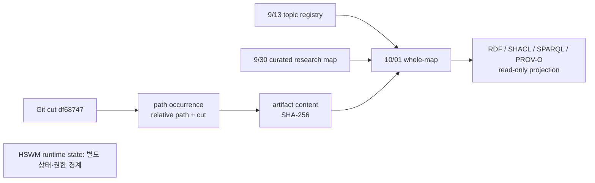

# HSWM 전체 연구 지도 — 2026-10-01

이 문서는 HSWM의 연구 자료를 읽기 위한 전체 지도다. 목표·가설·형식화·구현·관측·실패·다음 질문을 한 그래프의 서로 다른 역할로 연결한다. 지도 자체는 HSWM의 실행 그래프나 canonical runtime state가 아니며, 자료를 분류하거나 RDF로 투영하는 행위는 학습·인과 기여·효능을 뜻하지 않는다.

새 projection의 기준 source cut은 Git commit
`df687475622e0a251a6c0c9124a9f3c92c0b42f3`이다. 이는 **조사 대상 corpus**의 기준이다.
새 curation·생성기·query는 그 이후 작성되어 별도 SHA로 결속되므로, 전체 재현에는 이 지도 배포 커밋의
입력과 검사에 사용한 compiler도 필요하다. 이 cut에 있는 tracked source만
대상으로 하며, working tree의 미추적 파일·다른 writer의 진행 중 변경·private runtime
state·`.hswm-local`·자격 증명은 대상으로 삼지 않는다. 이미 커밋된 실험 SQLite fixture는
파일 목록의 경로·크기·해시만 기록하며 DB를 열거나 현재 runtime state로 해석하지 않는다. source-only 형식의
역사 자료도 원문으로 보존하되, 현재 native v2 구조 적합성을 자동으로 주장하지 않는다.

## 이 지도가 답하는 질문

1. HSWM의 고정된 목표와 교체 가능한 실현 방법은 무엇인가?
2. 각 연구 축에서 구현된 것, 형식적으로 제한해 보인 것, 관측된 것, 아직 열려 있는 것은 무엇인가?
3. 과거의 RED·음성 결과와 CR/FCL 의무가 후속 문서에서 어떻게 보존되는가?
4. 어느 자료가 현재 읽기 진입점이고, 어느 자료가 고정된 역사 snapshot인가?
5. source cut 안에서 어떤 자료군을 navigation coverage로 포함했고, 어떤 것은 파일 목록만 확인한 상태인가?

마지막 질문의 답은 **저장소 전체 탐색**과 **모든 문장·주장에 대한 의미 감사**를 구별한다. 전체 지도는 명시한 Git cut과 분류 규칙에 관한 coverage를 측정한다. 각 문장의 사실성, 모든 수식의 재검증, Lean replay, 모델 실행, 또는 전체 repository byte의 의미론적 완결성을 주장하지 않는다.

## 연구의 전체 흐름

HSWM의 목표는 **하이퍼그래프를 상태로 가지고, LLM이 국소 계산을 수행하는 하나의 AI**다.
그래프에는 세계·자기 모델, 관계와 역할, 실행 가능한 프로그램과 수정 이력이 함께 들어간다.
국소 LLM 연산이 현재 활성화된 관계를 읽고 행동을 내며, 외부 결과와 인과 기여가 확인되면
그래프의 관계·프로그램이 바뀌는 순환을 목표로 한다. TS/Effect는 그 상태를 읽고 실행하는
버전 관리된 실행기다. 학습과 실행기 소스 개발은 별개의 변화다.
[사용자 정의](../canon/USER_PRIMARY_HSWM_HYPERGRAPH_NEURAL_AI_2026-09-14.md)와
[그래프 프로그램 방향](HSWM_GRAPH_PROGRAM_DIRECTION_2026-09-28.md)이 이 구별의 출처다.

Semantic Weight 연구는 단순 숫자 가중치보다 넓은 **문맥에 따른 관계의 작동 성향**을 다룬다.
누가 어떤 역할로 참여하는지, 무엇을 함께 읽고 내보내는지, 어떤 예외와 조건에서 활성화되는지가
핵심이다. Map 연구는 이러한 국소 구조를 다른 규모의 표현으로 옮길 때 전이·예측·개입·학습에서
무엇을 보존해야 하는지 묻는다. 프랙탈 합성은 그 계약을 여러 규모에서 이어가는 목표다.
[9/30 연구 지도](HSWM_RESEARCH_MAP_2026-09-30.md)는 이 정의·실험·형식 결과 34개를 연결한다.
고정된 `H/W/A/F/Π` 구성요소 분해는 이 지도의 아키텍처로 사용하지 않는다.

현재 연구를 가르는 연결은 **관측된 outcome → 기여 식별 → 실제 graph revision → 새로운 행동의 변화**다.
표현·journal·국소 실행·표준 교환·유한 모형 증명은 이 연결의 일부를 다루지만,
실제 의미 학습에서 일반화되는 개선을 확인하는 일은 남아 있다. 예컨대 9/20의 기록에서
learned와 frozen은 모두 155/320, evidence-only는 156/320이었다. 9/21에는 새 evidence 뒤의
semantic revision 네 개가 모두 no-op이었다. 반면 opaque v5의 remove/restore 관측과
조건부 Lean 결과는 각자의 제한된 범위에서 보존한다. 이 숫자들은
[9/30 지도에 고정된 과거 결과](HSWM_RESEARCH_MAP_2026-09-30.md)이며 이번에 다시 실행한 측정이 아니다.

연구 방법은 바꿀 수 있다. 다만 실패한 결과를 지우거나 비교군·수용 기준을 약화해 목표 달성으로
바꾸지 않는 것이 [적응 연구 전략](../canon/HSWM_ADAPTIVE_RESEARCH_STRATEGY_2026-08-30.md)의 요지다.
OpenCog Hyperon도 필수 핵심 비교 대상이며, 9/30 지도에는 비교에 사용한 component/version/commit이
남아 있다. 새 지도 작성 시점의 최신 외부 버전을 조사했다는 뜻은 아니다.

## 상태를 읽는 공통 규칙

| 층 | 이 지도에서 연결하는 것 | 이것만으로 말할 수 없는 것 |
| --- | --- | --- |
| 사용자 목표·정전 | USER_PRIMARY 원문과 그 원문을 가리키는 projection | 현재 구현이 목표를 실현했다는 결론 |
| 연구 해석·계약 | SECONDARY_AI 요약, 가설, 계획, formal assumption | 사용자 발화 또는 ratified canonical state |
| 구현 | source path, typed runtime, schema, test/CLI contract | 실제 outcome 또는 일반 성능 우위 |
| 형식 결과 | 제한된 모형의 theorem, compiler/Lean 기록, 전제와 반례 | 실제 LLM·전체 HSWM의 효능 |
| 관측·평가 | 결과 로그, protocol, control, negative result | 다른 과제·다른 시점으로의 일반화 |

`D-4`는 outcome이 실제 canonical revision으로 이어지고 그 변화가 held-out behavior에서
식별되는지를 요구하는 핵심 미완료 연결이다. `G0`은 측정·권한·평가 조건을, `G1`은
국소 인과 기전의 비교를 다룬다. 과거 opaque 결과와 P1의 RED는 보존되는 범위 있는
증거이며, 그 존재가 G0/G1 통과나 D-4 완료를 뜻하지 않는다. `CR-0..7`과 `FCL-1..8`도
이 지도에서 historical obligation reference로 남는다. 후속의 부분 증명·구현·문서화가
의무를 자동으로 discharge하지 않는다.

## 13개 연구 축과 읽기 진입점

아래 topic ID, 기존 UID, entrypoint, open question은 2026-09-13 지식 지도의 registry를
기준으로 한다. 새 지도는 제목이 비슷하다는 이유로 기존 entity를 병합하지 않으며, 기존
UID는 source-bound anchor로만 참조한다.

| registry topic | 연구 내용과 현재 읽을 지점 | 상태와 남은 질문 |
| --- | --- | --- |
| `target_identity_and_authority` | [헌법](../canon/HSWM_CONSTITUTION_2026-08-20.md), [적응 연구 전략](../canon/HSWM_ADAPTIVE_RESEARCH_STRATEGY_2026-08-30.md), [사용자 정체성](../canon/USER_PRIMARY_HSWM_HYPERGRAPH_NEURAL_AI_2026-09-14.md) | 하나의 hypergraph neural AI라는 목표와 method-adaptivity의 경계. 특정 구현의 실현·효능은 UNJUDGED다. |
| `fractal_composition_and_philosophy` | [프랙탈 과학 연결](HSWM_FRACTAL_SCIENTIFIC_CONNECTIONS_2026-08-28.md), [FCL projection](../../ontology/identity/human_universal_body/HSWM_FRACTAL_SCIENTIFIC_CONNECTIONS_ONTOLOGY.v1.json) | 같은 계약이 여러 scale에서 보존되는지, macro intervention이 matched alternative를 넘는지가 열려 있다. |
| `conceptual_c1_c3_and_conditional_capabilities` | [C1–C3 workshop projection](../../ontology/identity/hswm_core/HSWM_WORKSHOP_C1_C3_ONTOLOGY.v1.json), [conditional capability contract](../../ontology/identity/hswm_core/HSWM_CONDITIONAL_CAPABILITY_CONTRACT_ONTOLOGY.v1.json) | 설계 vocabulary와 proposed capability contract다. canonical-write 또는 learning bypass 없이 필요한 기전이 되는지는 미검증이다. |
| `causal_composition_experiment_spine` | [causal-composition graph](../../ontology/identity/hswm_core/HSWM_CAUSAL_COMPOSITION_RESEARCH_ONTOLOGY.v1.json), [_research contract](../../_research/causal_composition/project.v1.json) | G0–G6와 confound control의 실험 spine. fresh task에서 outcome·credit·revision·behavior를 누출 없이 식별해야 한다. |
| `closure_plan_and_adversarial_audit` | [adversarial closure plan](HSWM_ADVERSARIAL_AUDIT_AND_CLOSURE_PLAN_2026-09-05.md), [closure v5](../../ontology/identity/hswm_core/HSWM_CLOSURE_PLAN_ONTOLOGY.v5.json), [F1/R8 log](../../F1_R8_RESULTS_LOG.md) | D-4와 외부 평가 역할이 핵심 blocker다. closure plan은 완료 선언이 아니다. |
| `opaque_identifiability_and_negative_results` | [opaque v5 결과](../../results/HSWM_G1_OPAQUE_IDENTIFIABILITY_V5_RESULTS_2026-09-06.md), [연구 insight](HSWM_RESEARCH_INSIGHTS_AND_NEXT_EVIDENCE_2026-09-06.md) | 측정 가능한 상태 매개 관측과 baseline saturation/음성 결과를 함께 보존한다. 새 과제 성능 우위로 확대하지 않는다. |
| `constructive_realizability_and_proof` | [CR program](../../ontology/evidence/HSWM_CONSTRUCTIVE_REALIZABILITY_PROGRAM_2026-09-10.v1.json), [constructive proof round](../../ontology/evidence/HSWM_CONSTRUCTIVE_PROOF_ROUND_1_2026-09-10.v1.json), [Semantic Weight constructive proof](HSWM_SEMANTIC_WEIGHT_CONSTRUCTIVE_PROOF_2026-09-14.md) | 제한된 learner와 전제 하의 구성·정리다. causal identification, multiscale credit, 실제 runtime witness는 남아 있다. |
| `relation_learning_ru1_and_llm_calibration` | [relation instrument 결과](../../results/HSWM_USL_RELATION_INSTRUMENT_RESULTS_2026-09-08.md), [LLM calibration protocol](HSWM_RELATION_LLM_CALIBRATION_PROTOCOL_2026-09-08.md), [RR-1](HSWM_RELATION_RESEARCH_ROUND_1_2026-09-10.md) | finite instrument와 prospective RU-1 조건을 구분한다. strong matched control, independent outcome custody, 실제 model call evidence가 필요하다. |
| `native_effect_runtime_and_ice` | [ICE graph implementation](../../ontology/evidence/HSWM_ICE_GRAPH_IMPLEMENTATION_WP0_3_2026-09-08.v1.json), [ICE remediation v2](../../ontology/evidence/HSWM_ICE_LEARNING_REMEDIATION_2026-09-08.v2.json), [native runtime](../operations/HSWM_NATIVE_EFFECT_ADAPTIVE_RUNTIME_2026-09-08.md) | TypeScript/Effect의 bounded runtime과 remediation design을 표시한다. 구현 존재는 outcome-bound learning efficacy가 아니다. |
| `graph_engineering_and_standard_interoperability` | [graph-and-loop v6](../../ontology/identity/hswm_core/HSWM_GRAPH_AND_LOOP_ENGINEERING_ONTOLOGY.v6.json), [engineering synthesis](HSWM_GRAPH_AND_LOOP_ENGINEERING_SYNTHESIS_2026-09-01.md) | RDF 1.1·SHACL 1.0·SPARQL 1.1·PROV-O projection의 경계와 mapping loss를 다룬다. projection은 runtime write path가 아니다. |
| `research_coordination_and_usl_interfaces` | [research coordination](../../ontology/infrastructure/HSWM_RESEARCH_COORDINATION_2026-09-09.v1.json), [USL adapter](../operations/HSWM_USL_ADAPTER_V2_2026-09-08.md), [USL review](HSWM_USL_LATEST_ADVERSARIAL_REVIEW_2026-09-08.md) | bounded coordination/USL interface와 source authentication의 역할. binding은 access·deployment·canonical authority를 주지 않는다. |
| `learning_literature_and_frontier_baselines` | [literature review](../../ontology/evidence/HSWM_AI_LEARNING_LITERATURE_REVIEW_2026-09-08.v1.json), [frontier theory](../../ontology/identity/hswm_core/HSWM_FRONTIER_LEARNING_THEORY_ONTOLOGY.v1.json) | literature bridge와 baseline discipline. native/text/program/retrieval/fixed-orchestration 대조군을 이겨야 하는 의무가 남는다. |
| `historical_evidence_red_paths_and_projects` | [F1/R8 log](../../F1_R8_RESULTS_LOG.md), [proof-status graph](HSWM_PROOF_STATUS_GRAPH_2026-09-02.md), [Ragnarok/PIDNA projection](../../ontology/identity/hswm_core/HSWM_RAGNAROK_PIDNA_RESEARCH_ONTOLOGY.v1.json) | RED path와 parallel project를 역사 evidence로 보존한다. 현행 target·runtime·성능 상태로 자동 승격하지 않는다. |

## 실행기와 운영 자료를 읽는 순서

| 구현 영역 | 저장소에 있는 내용 | 다음 확인이 필요한 연결 |
| --- | --- | --- |
| Adaptive runtime | router/command/LLM cell의 유한 프로그램, outcome 기반 local update, store/executor | 독립 outcome, 인과 귀속, 일반화와 정본 admission |
| Canonical Atom v2 | schema/commit decoder, durable service, journal 및 revision 표현 | 실제 허가 경로를 통한 D-4 전체 loop |
| RDF·JSON-LD·하이퍼그래프 | 결정적인 읽기 projection, 내용·구조 검증, 역할 있는 표현 | 교환 구조 검증을 실제 실행·학습 효과와 연결하는 별도 근거 |
| Durable RDF recovery | 한 로컬 journal prefix의 recovery 관측과 digest 검사 | global tail, rollback 방지, 분산 내구성은 별도 문제 |
| Transition evidence | effect/outcome/admission의 구별된 기록 형식 | 기록된 주장이 실제 효과·인과 기여·허가인지의 검증 |
| ICE workflow | WP0–3 구현과 bounded workflow 검사 기록 | 선택·goal·learner·실사용 효과의 식별 |
| Research fabric / S2S | process controller와 과거 prepare/upload/read/replay 구성요소 | 현재 서비스·production 실행 여부는 이 문서에서 미확인 |

이 표의 근거 source와 test 경로는 `q2-new-records` 및 각 record의 `REFERENCES` 관계에 연결했다.
테스트 파일이 있다는 사실과 그 테스트를 이번에 실행했다는 사실은 구별한다.

## 새 whole-map projection의 범위

생성 bundle은
[`ontology/knowledge_map/HSWM_WHOLE_MAP_2026-10-01.v1.json`](../../ontology/knowledge_map/HSWM_WHOLE_MAP_2026-10-01.v1.json)에 두고,
생성·검증 입력은
[`_research/whole_map_2026-10-01/build.mts`](../../_research/whole_map_2026-10-01/build.mts)와
[`verify.mts`](../../_research/whole_map_2026-10-01/verify.mts)에 둔다.

새 graph는 9/13 topic registry와 9/30 curated research map을 교체하지 않는다. 두 snapshot의
root UID, source cut, authority boundary, historical obligations를 anchor로 참조한다. 9/30의
34 selected assertion은 그 당시 source pin과 claim ceiling을 유지하며, 새 graph에서 다른
authority·completion state로 재기록하지 않는다. 새 source/runtime additions는 별도의
source-bound record 23개로 추가했다. 각 record는 정확한 원문 locator와 해시, 해석의 주장 한계를 가진다.

전체 tracked 파일은 별도 corpus 목록에 기록하고, 선별한 출처는 다음을 분리해 그래프에 연결한다.

- **content identity**: bytes SHA-256으로 식별한 `ArtifactContent`.
- **path occurrence**: source cut과 relative path를 함께 식별한 `RepositoryPathAtCut`.
- **navigation disposition**: 선별 출처 `CURATED_SOURCE` 또는 목록만 확인한 `INVENTORIED_ONLY`. 두 상태는 겹치지 않으며 전체 파일을 덮는다.
- **claim/projection provenance**: source locator, AI 요약의 권위와 원문의 권위 구별, recorded date, 알려진 경우의 source-reported event time.

그러므로 같은 bytes가 두 경로에 있을 때 content는 하나로 deduplicate할 수 있지만 두 path
occurrence를 하나로 합치지 않는다. 반대로 path 이름만 같고 source cut 또는 bytes가 다르면 같은
artifact content라고 가정하지 않는다. `recorded_on`은 정리 날짜이며 event time이 아니다. 별도 검증 receipt의 `checked_at`은 검사 시각이다.
원문에 사건 시점이 없으면 unknown으로 남긴다.

## lineage와 표준 projection



RDF/SHACL/SPARQL/PROV-O는 exchange, structure validation, competency query, provenance
표현에 사용한다. SHACL 통과는 source 구조와 declared relation을 검사할 뿐, HSWM cognition,
causal credit, theorem truth, model efficacy를 검증하지 않는다. 이 지도는 source/topic/reference 탐색 관계를 투영한다. 기존 9/30 주장의 n항 참여·역할·순서는
원본 graph의 participation node에 보존되어 있다. 여기의 요약 reference만으로 실행 의미나
전체 n항 관계를 복원할 수 없으며 원래 UID와 원본 bundle로 돌아가야 한다.

workspace entry는 `whole-map-1001`이다. historical 9/30 map은 `research-map-0930`으로
등록해 source-bound snapshot임을 드러낸다. 두 entry는 read-only navigation surface이며 runtime
state를 열거나 실행 workflow를 시작하지 않는다.

| query alias | 답하는 질문 |
| --- | --- |
| `q1-topics` | 13개 topic의 9/13 설계·구현·형식·효능 상태는 무엇인가? |
| `q2-new-records` | 새 source/runtime additions는 무엇이며 어느 source occurrence에서 왔는가? |
| `q3-historical-obligations` | CR-0..7/FCL-1..8의 과거 판정과 미완료 경계는 무엇인가? |
| `q4-boundaries` | 새 기록과 9/30 기록의 음성 결과·제한 사항 및 주장 한계는 무엇인가? |
| `q5-source-navigation` | 선별 출처의 경로·Git blob·SHA-256·내용 식별자는 무엇인가? |
| `q6-open-questions` | 9/13 registry의 역사적 미해결 질문 26개는 무엇인가? |
| `q7-corpus-coverage` | 영역별 전체 파일·선별 출처·목록만 확인한 파일 수는 얼마인가? |
| `q8-lineage` | 현재 지도에서 참조하는 9/13·9/30 predecessor UID는 무엇인가? |

## 재현과 검증의 경계

표준 projection은 native v2 compiler로 RDF dataset, descriptor, PROV JSON-LD를 새 output directory에
내보내고, v2 SHACL과 local whole-map shape를 모두 적용한다. 로컬 재현 명령은 다음과 같다.

```sh
node _research/whole_map_2026-10-01/build.mts --write
node _research/whole_map_2026-10-01/verify.mts

src/hswm/effect-runtime/bin/hswm-workspace show whole-map-1001
src/hswm/effect-runtime/bin/hswm-workspace query whole-map-1001 q7-corpus-coverage
src/hswm/effect-runtime/bin/hswm-workspace validate whole-map-1001
```

이번 로컬 검사에서는 다음을 확인했다.

- **파일 목록 4,983개**: 고정 커밋의 경로·Git blob·SHA-256·크기를 검사했다. 그중 선별 출처는 **90개**, 목록만 확인한 파일은 **4,893개**다.
- **그래프 322개 노드·139개 기존 anchor·811개 관계**: 13 topic, 34 역사적 연구 참조, 23 추가 설명, 26 역사적 질문, 16 CR/FCL 의무를 포함한다.
- **SHACL 2종과 SPARQL 8개 질문 통과**: 권위·출처·타입·관계·상태를 검사하고 예상 대상과 질의 결과를 비교했다.
- **오류 주입 9종 거절**: AI 요약의 권위 승격, 의무 완료 승격, 출처 누락, 중복 UID, 끊어진 관계, 잘못된 topic/locator, corpus 분류·해시 변경을 검출했다.
- 작업환경 CLI·catalog 기존 테스트 **10개**도 저장소의 Vitest 설정으로 통과했다. 새 두 entry와 query alias를 등록했으며 `whole-map-1001`의 native validate/query를 확인했다.
- RDF dataset·descriptor·PROV JSON-LD의 바이트와 해시를 기록하고 다시 읽어 비교했다. 검사 도구는 Node `24.20.0`이었으며 저장소 지정 버전 `24.13.0`과 같다는 주장은 하지 않는다.

[검증 기록](artifacts/hswm_whole_map_2026-10-01/validation.v1.json)과
[전체 corpus 목록](../../_research/whole_map_2026-10-01/corpus.v1.json)에 재현 근거를 둔다.
이 검사는 source cut equality, source byte/hash, content/path identity, topic anchor,
coverage disposition, relation endpoint, authority boundary, CR/FCL non-discharge를 대상으로 했다.
모델 실행·Lean 재실행·live KG publication·실배포 검증은 포함하지 않는다. source hash가 달라지면 과거 snapshot을 갱신하지 않고 새 cut의
후속 snapshot을 만든다.

관련 역사 자료는 [9/13 knowledge map](../operations/HSWM_KNOWLEDGE_MAP_2026-09-13.md)과
[9/30 research map](HSWM_RESEARCH_MAP_2026-09-30.md)에서 계속 읽을 수 있다.
