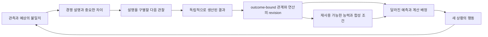

# HSWM: Wolfram형 관계 동역학에서 학습되는 능력으로

상태: `PHILOSOPHY_FIRST_RESEARCH_PLAN / MECHANISM_PROPOSALS_UNTESTED`.
계획 기준 checkout: `e9aac6e231a8c736d86592026f6476c779820ca4`.
권위: 계획 작성과 Wolfram 연결의 강조는
[USER_PRIMARY 원문](../canon/sources/USER_PRIMARY_HSWM_WOLFRAM_CAPABILITY_PLAN_2026-09-06.txt)에
결속한다. 아래 기전·단계·설계 선택은 `SECONDARY_AI_PROPOSED`다.

## 1. 목표와 개념적 변화

목표는 [헌법](../canon/HSWM_CONSTITUTION_2026-08-20.md)의 하나의 token-native
LLM-function macro-neural HSWM이다. evolving canonical hypergraph가 세계를 예측하고,
현재의 인지·행동을 조직하며, 경험을 통해 자기 관계와 동역학을 바꾸는 한 몸이어야 한다.
그 전체가 다시 상위 HSWM에 cognition-bearing cell로 참여하는 fractal 목표를 유지한다.

이번 계획의 중심 가설은 **경험이 결과에 중요한 차이를 발견하게 하고, 그 차이가 다음
문제의 표현과 계산을 함께 바꾸면 능력이 축적될 수 있다**는 것이다.
P1의 scalar 변화는 실제 retrieval 행동을 움직이지 못했고, opaque v5는 같은 cue에 대한
선택 매개를 보였다. 여기서 다음으로 생각할 대상은 행동을 바꿀 만큼 유효하며 다른 상황에도
적용되는 relation/operator다. 그 가능성은 아직 증거로 확정되지 않았다.

성능을 낳는다고 제안하는 경로는 다음과 같다.

이것은 새 정본 분해가 아니다. schema-approved canonical atom, exactly one
schema-relative responsibility owner, typed reference, provenance-bound transition과
outcome-bound causal-learning loop로 표현할 하나의 동역학에 관한 제안이다.

## 2. Wolfram 연결의 정확한 의미

Wolfram Physics Project는 우주의 구조와 내용을 evolving hypergraph로 표현하고
rewrite rule로 전개하는 모델을 제안한다. HSWM은 여기서 **관계적 상태·국소 변화·사건의
의존 계보**라는 형식적 토대를 가져올 수 있다.
[공식 Basic Concepts](https://www.wolframphysics.org/technical-introduction/potential-relation-to-physics/basic-concepts/)

공식 문서는 한 시점의 spatial hypergraph, update event의 causal graph, 가능한
상태 전개의 multiway graph를 구별한다. HSWM과의 다음 대응은 우리 설계상의 해석이다.
[공식 Graph Types](https://www.wolframphysics.org/technical-introduction/additional-material/appendix-graph-types/)

| Wolfram의 구분 | HSWM에서 설계할 대응 | 보존할 차이 |
|---|---|---|
| 관계 상태인 hypergraph | 외부 세계와 자기 capability에 대한 typed state, relation, 적용 조건 | 내부 표상이 외부 세계 그 자체인 것은 아니다 |
| update event와 그 의존관계 | 어떤 admitted revision과 readset이 다음 실행을 가능하게 했는지의 계보 | 기록상의 의존관계만으로 환경의 실제 인과성을 보증하지 않는다 |
| 가능한 상태 전개의 분기 | 경쟁하는 세계 설명과 행동 결과를 제한된 예산으로 전개하는 후보 공간 | HSWM의 제한된 가설 집합은 Wolfram의 전체 multiway system과 동일하지 않다 |

이 셋은 저장할 DB 세 개나 독립 subsystem 세 개가 아니다. 한 canonical state와
typed transition을 현재 상태, 사건 계보, 가정적 전개라는 서로 다른 관점에서 읽는 것이다.
가정적 미래는 관측 사실로 admission하지 않고, 가설이라는 지위와 원래 조건을 보존한다.

[헌법 §5](../canon/HSWM_CONSTITUTION_2026-08-20.md)는 HSWM을 역할적으로 Wolframian이라
정의한다. ruliad, emergent spacetime, quantum mechanics, causal invariance의 구현·참을
이 계획의 전제로 삼지 않는다. 특히 업데이트 순서에 대한 동치성은 별도 속성이므로,
hypergraph 사용만으로 order-independence를 도출하지 않는다.

**주어진 규칙을 전개하는 일과, 경험에서 유효한 규칙을 알아내는 일 사이가 우리의 연구 문제다.**
HSWM에는 관측과 표현의 결속, 경쟁 설명의 비교, 불확실성을 반영한 credit, 실제 계산을
바꾸는 revision이 필요하다. 우주의 모든 미시 상태를 복제할 필요는 없다. 선언한 과제와
관측 범위에서 중요한 차이를 보존하는 abstraction을 배울 수 있는지가 핵심이다.
이 해석은 Wolfram의 물리 이론에서 자동 도출되는 학습 알고리즘이 아니다.

## 3. 능력을 낳는다고 제안하는 변화

Semantic weight는 단일 유사도 점수에 한정하지 않는다. 이 계획에서는 어떤 관계·연산을
어느 문맥에서 활성화하고, 어떤 역할과 함께 적용하며, 언제 보류할지를 조건화하는
disposition을 기전 후보로 둔다. 사실에 대한 근거, 적용 적합성, 예상 효용·비용과 현재
permission은 구별한다. 높은 성공률이 사실성이나 권한을 자동 생산하지 않는다.

세 가지 변화 유형을 우선 검토한다. 이는 모든 학습이 반드시 세 유형을 모두 가져야 한다는
정의나 새 gate가 아니다.

- **적용 범위의 수정:** 실패가 반복되는 조건에서는 기존 관계를 억제하거나 예외를 둔다.
- **구분의 분화:** 하나로 취급하던 상황들이 다른 결과를 낼 때, 의미 있는 조건을 분리한다.
- **연산의 추상화:** 여러 경험의 공통 관계를 새로운 상황에 적용할 수 있는 연산으로 묶는다.

기존 schema 안의 instance·relation revision과, atom kind·해석 자체를 바꾸는 schema
migration은 구별한다. 후자는 보존해야 할 observation·intervention·lineage와 변환 손실을
명시해야 한다. 학습 중 reward가 좋다는 이유로 schema invariant나 Permit을 우회하지 않는다.

성능 가설의 경제적 조건도 함께 둔다. 재사용으로 절약하는 탐색과 실패 비용이 관계 선택,
통신, 검증, 유지 및 잘못된 일반화의 비용을 넘어야 한다. 가능한 분기를 전부 전개하면
좋아진다는 가정을 하지 않는다. 다음 관찰의 정보 가치와 계산 비용을 추정하는 자기모델도
수정 대상이 될 수 있다.

## 4. 생각을 구체화할 작업 순서

아래 C-1..6은 **개념 설계의 작업 묶음**이다. 기존 G0/G1·D-4에 새 통과 조항을 추가하지
않으며, 표의 산출물 작성이 과학적 진전을 뜻하지 않는다. 현재 단계는 계획 수립이고,
각 상세 명세·기전 선택·실행은 아직 완료되지 않았다.

| 순서 | 풀 질문과 작업 | 다음 논의를 위한 구체 산출물 | 아직 결정하지 않은 것 |
|---|---|---|---|
| C-1 세계와 관측의 의미론 | 무엇을 관측·가설·행동·예측으로 구별하고, 어느 관계가 결과를 바꾸는가 | 관계 문법 초안, 관측 가능한 차이 목록, 서로 충돌하는 설명의 사례 | 최종 task family와 atom granularity |
| C-2 학습과 credit | 예상이 틀렸을 때 어느 설명·관계·연산을 얼마나 수정할 수 있는가 | 하나의 경험을 끝까지 따라가는 수정 이야기, credit의 식별 가정과 미식별 상황 | estimator·update algorithm·uncertainty 표현 |
| C-3 관계 변화와 계산의 연결 | revision 이후 무엇을 덜 읽고, 먼저 관찰하고, 다르게 조합하는가 | 동일한 새 문제의 pre/post 추론 경로, canonical-to-compiled 의미론 | interpreter/compiler와 선택·억제 방식 |
| C-4 분화·압축과 장기 유지 | 언제 관계를 나누거나 묶고, 언제 보류·복귀하는가 | 적용 범위·반례·lineage를 보존하는 split/abstraction 사례와 실패 사례 | structure search, retention, migration 구현 |
| C-5 세계·자기 공동모델 | 외부 변화와 자신의 능력·오류·비용을 같은 구조에서 어떻게 예측하는가 | world prediction과 self prediction이 서로 다른 revision을 유발하는 사례 | 자기평가의 보정과 관측 선택 정책 |
| C-6 인지적 합성 | 학습하는 전체가 어떻게 상위의 참여자가 되며, 상위에는 무엇이 남아 배우는가 | cell의 입출력·학습·경계 계약, 구성원 간 상호작용의 revision 사례 | coalition 선택·다중규모 credit·재귀 합성 구현 |

진행은 C-1→C-2→C-3을 먼저 구체화하고, 그 과정에서 발견한 예외·반복 구조를 C-4에서
다룬다. C-5와 C-6의 요구는 처음부터 설계에 반영하되, 구현을 앞당기거나 작은 기전의
실패를 상위 scale로 구제하지 않는다. 막히면 정확히 어느 가정이 부족한지 수정한다.

다음 실제 작업은 **C-1~C-3을 하나의 사례로 연결하는 개념 명세**다. 결과에 중요한 차이,
경쟁 설명, 다음 관찰, 수정 가능한 atom/relation, 달라지는 실행을 한 흐름으로 써서,
능력이 생긴다는 주장에 연구자가 정답을 몰래 넣은 곳이 없는지 검토한다.

## 5. 논의를 시작할 구체적인 사례

우선 검토할 과제 생태계 후보는 **낯선 규칙을 가진 가상 공방**이다. 관찰, 재료 선택,
도구 사용과 작업 순서가 상호작용하고, 같은 관계를 새로운 조합에서 다시 쓸 수 있는 세계를
생각한다. 아래 내용은 논의용 허구이며 과학적 task selection이나 미래 holdout 답안이 아니다.
구체 backend나 환경을 채택한 상태도 아니다.

| 장면 | HSWM이 가질 수 있는 설명 | 배워야 할 차이와 계산상의 변화 |
|---|---|---|
| 도구 T로 두 재료의 접합이 실패 | 도구 부적합 / 특정 재료 조합 / 표면 상태 / 작업 순서 | 결과 하나로 도구 전체의 weight를 낮추지 않고, 설명들을 구별할 관측을 제안 |
| 다른 조건에서 같은 도구가 성공 | 관측에 부합하는 조건부 설명이 늘거나 기존 설명이 제한됨 | 어떤 조건이 실제 원인인지는 아직 미식별일 수 있음. 적용 범위와 추가 관측 필요를 수정 |
| 처음 보는 물건에서 유사한 접합 문제가 등장 | 과거 물건의 정답을 재사용할 수 없음 | 새 재료의 역할과 조건을 연결해 먼저 확인할 표면 상태와 작업 순서를 결정 |
| 접합 능력이 절단·조립과 결합 | 각 국소 작업이 성공해도 전체 목표는 실패할 수 있음 | 상위는 선행조건, 정보 교환, 순서와 충돌을 배움. 국소 credit과 상호작용 credit을 분리해 검토 |

C-1에서는 이 후보를 다른 지속 과제와 비교해 다음을 설명한다: 무엇이 반복되는지,
어떤 조건은 달라지는지, LLM의 사전 지식만으로 해결되는 부분은 무엇인지, 경험에서 새로
알아야 할 부분은 무엇인지. 모델이 아무 행동도 못 하는 floor나 이미 정답을 아는 ceiling에
의존해서 학습 가설을 논증하지 않는다.

C-2에서는 관측 결과와 causal credit을 구분한다. 성공/실패는 별도 outcome source가
생산할 수 있지만, 어느 관계가 원인이었는지는 반사실 비교·개입·가정에 의존하는 추론이다.
모호한 사례는 모호하게 남긴다. 같은 LLM이 매끄러운 설명을 만들었다는 이유로 그 설명에
강한 credit을 주지 않는다.

C-3에서는 domain rule의 제안·수정과 compiler의 역할을 구별한다. LLM은 초기 가설과
추상화를 제안할 수 있고, deterministic 연산은 선언한 typed semantics를 실행할 수 있다.
compiler가 평가자 답이나 문제별 정답표를 읽어 해결을 대신하지 않게 한다. 무엇을 사람이
제공했고 무엇이 경험으로 바뀌는지 명시해야 이 경로의 실제 학습 범위를 알 수 있다.

## 6. 한 몸과 fractal 목표의 연결

동일한 접합 관계가 행동 전에는 결과를 예측하고, 행동 중에는 관찰과 도구 사용을
조건화하며, 행동 뒤에는 경험으로 수정될 수 있다. 그 관계가 자기 내부의 비용·능력·실패
조건도 참조하면 world model과 living harness가 함께 바뀐다. 같은 hypergraph 안에
기록한다고 world claim과 self claim의 관측 근거가 같아지는 것은 아니다.

학습된 operator를 호출 가능한 형태로 묶는 것만으로 cognition-bearing cell이 성립하지는
않는다. 후보 cell은 새로운 관측에 반응하고 자기 상태를 수정하는 내부 동역학, typed port,
책임·permission·lineage·분리 가능한 경계를 가져야 한다. 상위 전체도 그 cell들의 협업
조건을 공동 outcome으로 수정하고 같은 `Step / Learn / Inv / Permit / lineage` 문법으로
다시 참여할 수 있어야 한다. 누가 문제를 분해하고 어떤 구성원을 선택하는지도 숨겨진 고정
정답으로 두지 않고 연구 대상으로 명시한다.

이는 [FCL-1..8](HSWM_FRACTAL_SCIENTIFIC_CONNECTIONS_2026-08-28.md)의 다음 질문들을
계획 안에서 계속 보존한다. 아래는 design coverage이며 PASS 판정이 아니다.

| 기존 축 | 이 계획에서 이어가는 질문 |
|---|---|
| FCL-1 국소 causal learning | C-2~3: outcome이 실제 revision과 새 행동으로 이어지는가 |
| FCL-2 합성 보존 | C-6: 구성원과 전체가 같은 typed dynamics·경계를 유지하는가 |
| FCL-3 상황별 창발 | C-3·6: 상황에 따라 역할의 결선과 coalition이 달라지는가 |
| FCL-4 다중규모 credit | C-2·6: 국소 기여와 상호작용 기여의 식별 한계는 무엇인가 |
| FCL-5 형태발생 | C-4: 경험으로 topology·역할을 고쳐도 의미와 복구 가능성이 유지되는가 |
| FCL-6 세계·자기모델 | C-5: 외부 세계와 내부 capability를 예측하고 함께 수정하는가 |
| FCL-7 장기 연속성 | C-4~6: 모델·process가 바뀌어도 학습 계보와 작동적 연속성이 남는가 |
| FCL-8 HSWM-of-HSWMs | C-6: 학습하는 전체가 다시 상위의 cognition-bearing cell이 되는가 |

## 7. 기존 연구와의 관계, 그리고 실행으로 넘어갈 때

[기존 통찰 묶음](HSWM_RESEARCH_INSIGHTS_AND_NEXT_EVIDENCE_2026-09-06.md)은 현재 증거와
다음 판별 실험을 연결한다. 이번 계획은 그 앞에 필요한 **능력 발생의 기전과 의미론**을
구체화한다. 이전 hash-bound 문서·ontology·receipt를 다시 쓰지 않는다.

P1의 정확한 scalar slow-weight 경로는 RED로 남고 eta 조정으로 구제하지 않는다.
opaque v3/v4의 frozen 실패, v5의 제한된 선택 매개와 B0/B2의 비교 한계도 유지한다.
현재 D4의 XOR 및 최초 admission 구현은 좁은 bridge 후보로 남는다. D4 의무를 삭제하지
않으며, 그 fixture를 전체 기전의 완성으로 삼지 않는다. 다른 successor를 택하려면
conceptual delta와 predecessor 계보를 명시하고 새 계약을 prospectively 고정한다.

개념 명세 뒤 실행으로 넘어갈 때는 기존 D-3 primary estimand와 secondary B0/B2 구분,
독립 outcome, 실제 canonical revision, untouched held-out, exact REMOVE/RESTORE와
SHAM 등 기존 계약을 따른다. 새 수치·표본수·성공 조항을 이 철학 문서에서 임의로 확정하지
않는다. 정보가 같은 prompt replay로 효과가 재현되는 것은 state의 매개와 양립하며,
구조의 추가 이점은 별도 질문으로 둔다.

G0는 `NOT_PASSED`, G1은 `NOT_EVALUATED`, D4는 미완료, S-5는 첫 결과 파일 deliverable
완료, S-6는 second-party 지명 미완료다. fractal 상태는
`SCIENTIFICALLY_CONNECTED / INTEGRATED_CLAIM_UNJUDGED`다. 철학·계획·문서의 완결이
이 상태를 바꾸지 않는다. [adaptive strategy](../canon/HSWM_ADAPTIVE_RESEARCH_STRATEGY_2026-08-30.md)에
따라 유효한 음성은 정확한 기전을 retire/reroute하고 목표 commitment와 분리한다.

이번 산출물은 계획과 출처 기록이다. 새 implementation, 연구 occurrence, F1_R8 결과 또는
scientific receipt는 생성하지 않는다. KG상의 기존 insight bundle도 이 계획의 작성만으로
학습 state나 새 관측으로 승격되지 않는다.
